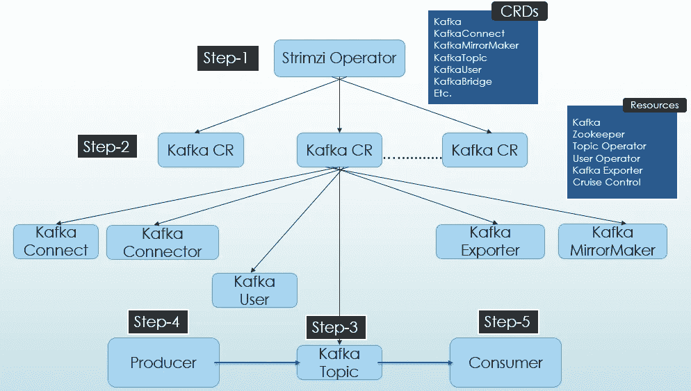
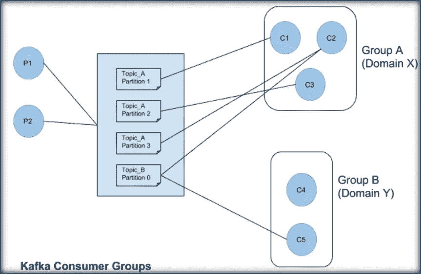

# Kubernetes 上的卡夫卡:使用 Strimzi —第 2 部分(设置和部署)

> 原文：<https://blog.devgenius.io/kafka-on-kubernetes-using-strimzi-part-2-71a8ba8e9605?source=collection_archive---------0----------------------->

这是系列的第二部分**卡夫卡论库伯内特:使用** [**Strimzi**](https://strimzi.io/) **。本系列的第 1 部分讨论了 Strimzi 为在 Kubernetes 上部署和维护 Kafka 提供了什么。在这一部分中，我们将看到如何使用 Strimzi 在 Kubernetes 上部署和设置 Kafka。**

**使用 Strimzi 的 Kafka 部署:**



Kafka 使用 Strimzi 在 Kubernetes 上快速入门

下面是在 Kubernetes 上部署 Strimzi 操作符和 Kafka 集群的步骤

1.  **部署 Strimzi 操作员-**strim zi 掌舵图包含所有必需的[CRD](https://kubernetes.io/docs/tasks/extend-kubernetes/custom-resources/custom-resource-definitions/)(如上图所示，如 Kafka、KafkaConnect 等。)来轻松部署和维护 Kafka 集群。

*   首先添加 Strimzi 图表存储库

```
helm repo **add** strimzi https://strimzi.io/charts/
```

*   然后，您可以安装一个版本的 Strimzi 集群操作符

```
helm **install** strimzi/strimzi-kafka-**operator** \ --name my-strimzi-release \ --namespace kafka \ --version 0.28.0
```

我们还可以使用 terraform 的 [helm_release](https://registry.terraform.io/providers/hashicorp/helm/latest/docs/resources/release) 来轻松部署 Strimzi 操作符。

```
resource "helm_release" "strimzi" {
  chart = "strimzi-kafka-operator"
  name = "strimzi"
  namespace = "kafka"
  repository = "[https://strimzi.io/charts/](https://strimzi.io/charts/)"
  version = "0.28.0"
  values = [yamlencode({
 resources = {
   requests = {
     memory = "512Mi"
     cpu = "250m"
   }
   limits = {
     memory = "1536Mi"
     cpu = "1000m"
   }
  }
 })]
}
```

Strimzi 集群操作符协调各种定制资源，如 Kafka、KafkaConnect 等。在特定或所有命名空间中。如果在名称空间中添加/更新/删除了任何定制资源，Strimzi 集群操作符将在集群中对其执行相同的操作。

**2。部署 Kafka 定制资源**——正如我们在[第一部分](https://medium.com/@singh.amarendra/kafka-on-kubernetes-using-strimzi-part-1-83d74564135e)中讨论的，Strimzi 集群操作员可以管理多个 Kafka 集群。作为第二步的一部分，我们将添加一个 Kafka [自定义资源(CR)](https://kubernetes.io/docs/concepts/extend-kubernetes/api-extension/custom-resources/) 。Kafka CR 可以部署以下组件-

*   卡夫卡
*   动物园管理员
*   主题运算符
*   用户操作员
*   卡夫卡出口商
*   巡航控制

对于这一部分，我们将只部署 Kafka、Zookeeper 和实体操作符(主题和用户操作符)。

```
apiVersion: kafka.strimzi.io/v1beta2
kind: Kafka
metadata:
  name: my-cluster
spec:
  kafka:
    replicas: 3
    listeners:
      - name: plain
        port: 9092
        type: internal
        tls: false
    storage:
      type: jbod
      volumes:
      - id: 0
        type: persistent-claim
        size: 100Gi
        deleteClaim: false
    config:
      offsets.topic.replication.factor: 1
      transaction.state.log.replication.factor: 1
      transaction.state.log.min.isr: 1
      default.replication.factor: 3
      min.insync.replicas: 2
  zookeeper:
    replicas: 3
    storage:
      type: persistent-claim
      size: 100Gi
      deleteClaim: false
  entityOperator:
    topicOperator: {}
    userOperator: {}
```

我们把这个存成 *kafka-resource.yaml* 。正如我们在上面的配置中看到的，我们可以指定以下内容-

对卡夫卡来说:

*   经纪人的数量
*   侦听器(内部的或外部的，在第 5 部分中会有更多的介绍)
*   存储( [JBOD](https://strimzi.io/blog/2019/03/07/strimzi-0.11.0-release/) (仅适用于卡夫卡)或持续索赔)
*   覆盖默认的 Kafka 配置，如复制因子等。
*   在本系列的以下部分中有更多配置

对于动物园管理员:

*   Zookeeper 服务器数量
*   储存；储备
*   在本系列的以下部分中有更多配置

对于 EntityOperator:

*   主题操作符——部署主题操作符
*   userOperator-部署用户操作员

现在只需部署这个文件-

```
> kubectl apply -f kafka-resource.yaml -n kafka
```

我们将在这些部分以及 KafkaExporter、CruiseControl 等其他部分看到更多配置。在以下部分。我们还可以部署其他定制资源，如 KafkaConnect、KafkaConnector、MirrorMaker 等。，如果需要。

**3。创建一个主题-** 现在集群(my-cluster)已经准备好了，我们可以使用它将数据从生产者传递到消费者。让我们首先创建一个包含 3 个分区和 1 个副本的简单主题-

```
cat << EOF | kubectl create -n my-kafka-project -f -
apiVersion: kafka.strimzi.io/v1beta2
kind: KafkaTopic
metadata:
  name: my-topic
  labels:
    strimzi.io/cluster: "my-cluster"
spec:
  partitions: 3
  replicas: 1
EOF
```

**4。启动控制台生成器-** 现在我们可以从 Kafka broker pod 内部启动[控制台生成器](http://cloudurable.com/blog/kafka-tutorial-kafka-from-command-line/index.html#:~:text=Run%20Kafka%20Producer%20Console&text=Kafka%20provides%20the%20utility%20kafka,console.sh%20and%20run%20it.)(因为控制台生成器随 Kafka 二进制文件一起提供)并将数据发送到上一步创建的主题。我们还可以在本地机器上安装 Kafka 并连接到这个集群(但是我们必须添加外部监听器，比如 loadBalancer 或 nodePort，我们将在第 5 部分讨论 Kafka 安全性时讨论这个问题)。

```
>kubectl exec -i -t my-cluster-kafka-0 -- /bin/bash
```

现在让我们启动控制台制作程序-

```
> bin/kafka-console-producer.sh --bootstrap-server *localhost:9092* --topic my-topic
Hello
My name is Amarendra
```

**5。启动消费者-** 我们现在可以启动消费者，并分配它来监听上面创建的主题。我们应该会收到生成的信息-

```
>bin/kafka-console-consumer.sh --bootstrap-server --group consumer-group-a *localhost:9092* --topic my-topic --from-beginning
Hello
My name is Amarendra
```

我们得到了消费者群体中产生的信息。同一消费群体中的任何其他消费者都将无法再次获得这些消息(这就像卡夫卡的共享消息队列行为)。现在，如果其他一些消费者也想要这些消息，它仍然可以通过使用不同的组来获得(就像发布-订阅机制)。消费者群体给了 Kafka 灵活性，可以同时拥有消息队列和发布-订阅模式的优点。

```
>bin/kafka-console-consumer.sh --bootstrap-server --group consumer-group-b *localhost:9092* --topic my-topic --from-beginning
Hello
My name is Amarendra
```



**结论-** 我们已经看到了如何部署 Strimzi 集群操作器，以及它如何轻松地部署和管理 Kafka 集群。我们还创建了一个主题，并使用 Kafka 控制台生产者将数据传送给它，使用 Kafka 控制台消费者来消费它。

在下一部分中，我们将看到在 Kubernetes 上部署高可用性 Kafka 集群的其他重要配置。