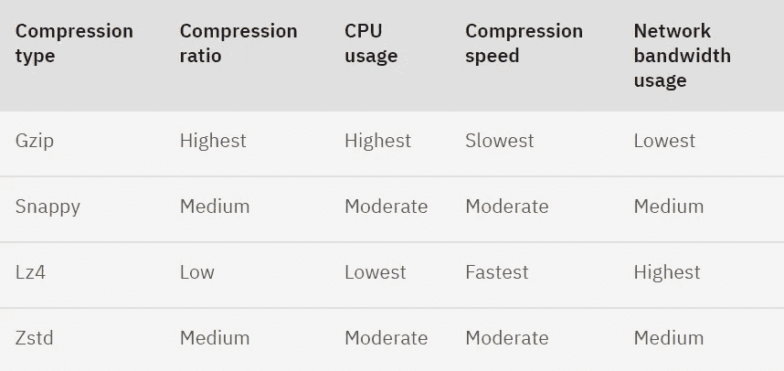

# Kubernetes 上的卡夫卡:使用 strim zi——第 3 部分(生产就绪配置)

> 原文：<https://blog.devgenius.io/kafka-on-kubernetes-using-strimzi-part-3-configuration-options-f8aa027e9ba0?source=collection_archive---------1----------------------->

这是卡夫卡论库本内特系列作品**的第三部分:运用**[**strim zi**](https://strimzi.io/)T6。在[上一部分](https://medium.com/@singh.amarendra/kafka-on-kubernetes-using-strimzi-part-2-71a8ba8e9605)中，我们已经在 Kubernetes 上设置并部署了 Strimzi 运算符和 Kafka 集群。在本文中，我们将讨论调整一些配置，为代理使用正确的实例类型，在工作节点上正确分配资源，使用最佳分区计数的可伸缩性，使用复制的可用性，安全配置等。

让我们在生产环境中运行卡夫卡集群时讨论以下重要的事情-

1.  **经纪人和动物园管理员数量:
    动物园管理员服务器**——在分布式系统中，动物园管理员的主要目的之一是在经纪人失败的情况下进行领导者选举，并且当投票发生时需要有绝对多数票。
    因此动物园管理员的法定人数可以是 1，3，5，7..(2N+1)台服务器，允许 0、1、2、3..n 台服务器停机，而不会使整个群集不可用。
    让我们用下图来看看在法定人数中使用 1 台和 3 台动物园管理员服务器的优缺点-

> 因此，对于生产环境中的小型卡夫卡集群，建议在定额中使用至少 3 台 Zookeeper 服务器，对于中型到超大型卡夫卡集群，建议使用 5 台或 7 台 Zookeeper 服务器。

**卡夫卡经纪人**——决定经纪人数量有很多需要考虑的事情-

*   *复制因子*:为了使系统具有高可用性，建议每个分区至少有 3 个副本，这样即使代理出现故障，我们也可以从其他两个副本中获取数据。
*   *min . insysnc . replicate*:如果我们的 Kafka 集群有 3 个代理，并且所有副本都同步，那么 min-ISR 等于 2。使用这种配置，我们接受在工作时丢失 1 个副本(领导者或跟随者)的风险。例如，如果我们失去了领导者，至少有一个追随者同步进行切换。如果我们失去了一个追随者，我们还有一个追随者来保持最小 ISR 为 2。
*   此外，在较新版本的卡夫卡(2.8.0 及以后)中，对动物园管理员的[依赖已经被移除](https://www.confluent.io/blog/kafka-without-zookeeper-a-sneak-peek/)，卡夫卡经纪人本身将参与领导人选举，因此我们应该有奇数个经纪人来选举新的领导人。

> 您可以设置一个只有 2 个代理的 Kafka HA 集群，但是推荐的用于生产的**复制因子**是 **3** ，因此您**需要 3 个代理**来实现这一点。如果集群中有更多的主题/分区可用，可以选择更多的代理。

**2。实例类型(在 AWS 中):**
[实例类型](https://aws.amazon.com/ec2/instance-types/)的选择通常由 Kafka 集群上的流应用程序所需的存储类型决定。如果您的应用程序需要临时存储，h1、i3 和 d2 实例是您的最佳选择。
如果你需要 EBS 存储，那么 AWS 有新一代 r4 实例。

*注意*:检查[实例类型](https://aws.amazon.com/ec2/instance-types/)的最新变化总是最佳实践。

我们应该为 Kafka 资源创建一个单独的 [worker 节点组](https://docs.aws.amazon.com/eks/latest/userguide/managed-node-groups.html)。这样，我们可以定义优化的实例类型，并使用[节点关联](https://kubernetes.io/docs/concepts/scheduling-eviction/assign-pod-node/)在这些节点上部署 Kafka 资源。
我们还可以定义[反亲和](https://kubernetes.io/docs/concepts/scheduling-eviction/assign-pod-node/)来确保 Kafka brokers 和 Zookeeper 节点运行在不同的节点上。

**3。Zookeeper 性能:**
延迟是 Zookeeper 性能的关键，以下任何一个变量都会影响它-

*   快速磁盘(最好是固态硬盘)
*   快照和日志的独立磁盘
*   高性能网络(低延迟)
*   合理数量的 Zookeeper 服务器
*   Zookeeper 实例与其他进程的隔离

**4。将请求资源与 JVM 内存一起设置:** 我们应该将[请求资源](https://kubernetes.io/docs/concepts/configuration/manage-resources-containers/#requests-and-limits)如 CPU 和内存添加到 Kafka 资源中，如 Broker、Zookeeper、KafkaConnect 等。请求预留[支持的资源](https://strimzi.io/docs/operators/latest/configuring.html#con-common-configuration-resources-reference)，当前为`cpu`和`memory`，并限制指定可以消耗的最大资源。

我们可以这样设定-

> 资源:
> 请求:
> 内存:32Gi
> CPU:“6”
> 限制:
> 内存:32Gi
> CPU:“8”

我的想法是只为 Kafka broker 和 Zookeeper 设置请求参数，而不设置限制，这将让它们使用机器上的可用资源。点击查看不使用 CPU 限制[的更好解释。](https://home.robusta.dev/blog/stop-using-cpu-limits/)

由于 Kafka 是一个 Java 应用程序，我们应该为最大和最小内存分配设置 JVM 选项。我们可以在卡夫卡资源中设置它-

> JVM options:
> -Xms:8192m
> -Xmx:8192m

**5。卷大小和保留期:** 我们可以为 Kafka 定义存储选项，并选择以下任何一种 Kafka 存储类型-

***a. JBOD(只是一堆设备)***——JBOD 存储允许在每个 Kafka broker 中使用多个磁盘来存储提交日志。我们可以像这样把它添加到卡夫卡资源中

> 存储:
> 类型:jbod
> 卷:
> - id: 0
> 类型:持久声明
> 大小:1000Gi
> 删除声明:false
> - id: 1
> 类型:持久声明
> 大小:1000Gi
> 删除声明:false

有些事情你应该谨记在心并小心处理:

*   `id`号必须是唯一的。
*   `id`数字不必按顺序排列。
*   更改`id`号等同于删除带有原`id`的卷，并添加带有新`id`的新卷。Strimzi 将停止对旧卷使用旧 PVC，并为新卷创建新 PVC。
*   默认情况下，PVC 不会被删除。因此，如果您重新使用您过去已经使用过的`id`，您应该首先检查旧的 PVC 是否仍然存在。如果存在，它将被重用，而不是用新卷创建新的 PVC。

***b . persistent-claim-***我们也可以将存储类型用作 persistent-claim，在这种情况下，必须在一个卷本身中添加总大小，我们将无法像在 JBOD 那样获得使用多个 persistent-claim 类型的好处。

> 存储:
> 类型:持久声明
> 大小:10000Gi

[保留期](https://www.baeldung.com/kafka-message-retention#:~:text=Basics&text=We%20can%20notice%20here%20that%20the%20default%20retention%20time%20is%20seven%20days.)也会影响存储大小的推导，因为在高保留时间的情况下，我们将需要更多存储，而在低保留时间的情况下，我们也可以接受较小的存储大小。

**6。** 高可用性:Kafka 提供了以下不同的方法来实现数据的高持久性和高可用性-

*   *使用复制* —使用复制，我们可以确保即使代理关闭，我们也可以确保主题的所有分区保持可用，而不会牺牲一致性。

> 配置:
> default . replication . factor:3

*   使用[机架感知](https://banzaicloud.com/blog/kafka-rack-awareness) —通过复制，我们可以确保代理级别的故障不会影响数据可用性。我们仍然需要担心整个数据中心/可用性区域中断的可能性。Kafka 使用一种称为机架感知的功能来轻松处理数据中心停机。机架可以代表可用性区域、数据中心或数据中心中的实际机架。

> broker.rack =机架 id

*   灾难恢复—灾难恢复计划经过精心制定，旨在最大限度地减少自然和人为灾难(如停电、灾难性软件故障和网络中断)对业务的影响。我们可以使用 [Kafka MirrorMaker](https://docs.confluent.io/4.0.0/multi-dc/mirrormaker.html) 将整个集群镜像/复制到地理上分散的数据中心。

我还写了一篇博客来讨论 Kafka 中的[高可用性和持久性。你可以查看一下，了解更多细节。](https://medium.com/@singh.amarendra/understanding-message-durability-in-kafka-8f6e7006aea8)

**7。使用最优分区计数的可伸缩性:** 我们知道，主题是分分区的。我们可以拥有并行级别并并行写入数据，这将自动提高吞吐量。但是，如果系统配置无法处理它，那么增加分区数量会降低我们的性能和吞吐量。基本上，如果一个系统没有足够的线程或者只有一个磁盘，那么创建大量的分区来提高吞吐量是没有意义的。因此，我们可以说，为一个主题创建更多的分区直接依赖于可用的线程和磁盘。
建议从每个物理存储磁盘一个分区开始，每个分区一个用户。

我们将在下一节更详细地讨论可伸缩性。

**8。安全配置:**
Strimzi 提供了许多选项来配置集群中的安全性。使用 Strimzi，通信总是在以下之间加密:

*   卡夫卡·brokers
*   动物园管理员 nodes
*   运营商和卡夫卡 brokers
*   操作员和 Zookeeper 节点
*   卡夫卡出口商

支持的身份验证机制:

*   相互 TLS 客户机验证(在启用了 TLS 加密的侦听器上)
*   SASL 急停-SHA-512
*   OAuth 2.0 基于令牌的身份验证
*   自定义身份验证

Kafka 集群使用授权来控制特定客户端或用户在 Kafka 代理上允许的操作。支持的授权机制:

*   简单授权
*   OAuth 2.0 授权(如果您使用基于 OAuth 2.0 令牌
*   认证)
*   开放策略代理(OPA)授权
*   自定义授权

我们将在本系列的第 5 部分详细讨论这些选项。

**9。其他配置:**

**答:打开文件处理程序:**
这是一个经常发生的场景:代理人因为看起来太多的负载而停机，但实际上是一个良性的(尽管有压力)“打开文件太多”错误。通过编辑/etc/sysctl.conf 并将 Ulimit 配置为允许打开 128，000 个或更多的文件，可以避免这种错误的发生。

增加百分位 ulimit 的示例:

1.  创建一个新文件`/etc/security/limits.d/nofile.conf`
2.  输入内容:

`* soft nofile 128000`

`* hard nofile 128000`

1.  重新启动系统或重新登录。
2.  通过发出以下命令进行验证。

`ulimit -a`

*请注意，增加 ulimit 有多种方法。您可以遵循任何适合您自己的 Linux 发行版的方法。

**b .最大消息大小:** Kafka 配置限制了允许发送的消息大小。默认情况下，此**限制为 1MB** 。然而，如果有发送大消息的需求，我们需要根据我们的需求调整这些配置。

数据在代理中从生产者流向主题，再流向消费者，因此必须在这些地方添加配置才能发送大型消息。

*   生产者属性—***max . request . size***
*   Topic 属性—***max . message . bytes .****我们还可以在代理级别将****message . max . bytes****属性设置为*允许*代理*上的所有主题接受大小大于 1MB 的消息
*   消费者属性—让我们看看 Kafka 消费者可用的配置设置。虽然这些更改对于使用大型消息不是强制性的，但是避免它们会对使用者应用程序的性能产生影响。

*max . partition . fetch . bytes*:这个属性限制了消费者可以从主题的分区中获取的字节数。

*fetch.max.bytes* :该属性限制了消费者可以从 Kafka 服务器本身获取的字节数。Kafka 用户也可以监听多个分区。

c .压缩。type:
Kafka 让你在信息通过网络传输时对其进行压缩。这个压缩过程让您实现了两件事:

*   减少网络带宽的使用。
*   节省磁盘空间的卡夫卡经纪人。

压缩的这两个好处的唯一权衡是稍微高一点的 CPU 利用率。

Kafka 支持四种主要的压缩类型:

*   Gzip
*   时髦的
*   Lz4
*   Zstd

让我们来看看这些压缩类型的特征:

[来源](https://developer.ibm.com/articles/benefits-compression-kafka-messaging/)

Kafka 通过属性`compression.type`支持压缩。默认值是`none`，这意味着发送的消息是未压缩的。否则，您需要指定支持的类型:`gzip`、`snappy`、`lz4`或`zstd`。

**结论:** Kafka 有许多配置选项，不能有效地利用它们会影响 Kafka 集群的效率和性能。在本文中，我们看到了在生产 Kafka 集群中正确设置的各种选项。找到 [Kafka 配置](https://kafka.apache.org/documentation/#configuration)列表，并根据您的要求进行调整。
在下一节中，我们将讨论 Kafka 如何实现可伸缩性，并将使用 [KEDA](https://keda.sh/) (Kubernetes 事件驱动自动缩放器)配置消费者汽车可伸缩性。