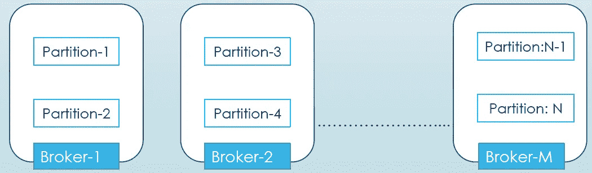
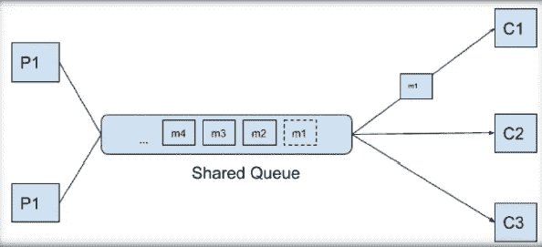
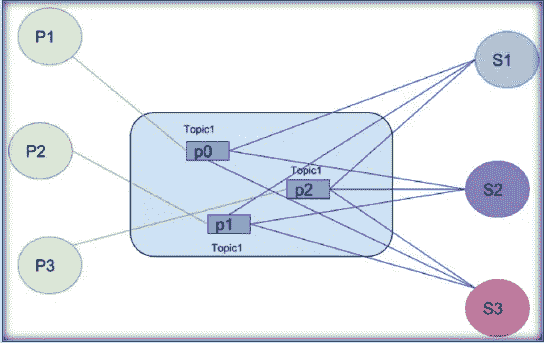
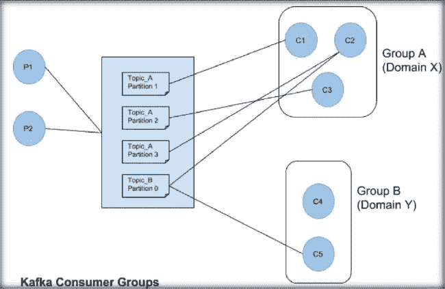
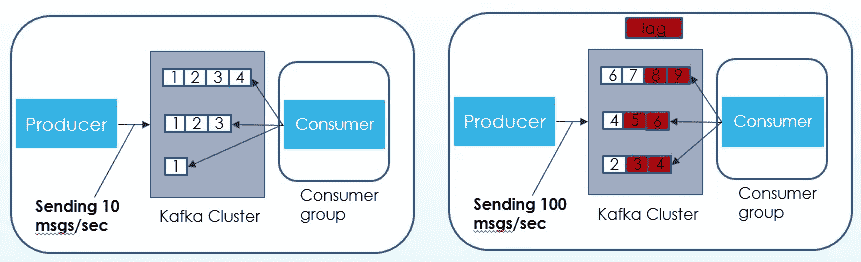
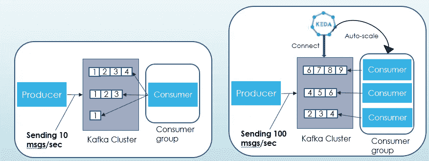

# Kubernetes 上的卡夫卡:使用 Strimzi —第 4 部分(可伸缩性)

> 原文：<https://blog.devgenius.io/kafka-on-kubernetes-using-strimzi-part-4-scalability-59da50575fec?source=collection_archive---------4----------------------->

这是博客系列的第四部分，**库伯内特上的卡夫卡:使用** [**Strimzi**](https://strimzi.io/) **。**在[第 2 部分](https://medium.com/@singh.amarendra/kafka-on-kubernetes-using-strimzi-part-2-71a8ba8e9605)中，我们讨论了如何使用 Strimzi 设置 Kafka，在[第 3 部分](https://medium.com/@singh.amarendra/kafka-on-kubernetes-using-strimzi-part-3-configuration-options-f8aa027e9ba0)中，我们看到了生产就绪的 Kafka 配置及其对集群性能的影响。在这一部分中，我们将看到如何自动调整使用者以获得更好的吞吐量和资源可用性。

首先，让我们试着理解什么是可伸缩性—
**可伸缩性** —假设我们的应用程序有一个服务 1000 个请求/秒的硬性限制，但是在繁忙的一天，请求/秒的数量增加了 1000 多个。如果我们的应用程序仍然能够以同样的效率满足这些请求，我们就可以说我们的应用程序是可伸缩的。
Kafka 提供了一个高度可扩展的系统，具有横向扩展，无限扩展的优势。

分区是 Kafka 提供冗余和可伸缩性的一种方式。每个分区可以托管在不同的服务器上，这意味着单个主题可以跨多个服务器进行水平扩展，以提供远远超出单个服务器能力的性能。



主题使用分区的可伸缩性

好了，我们已经创建了分区等于 100 的主题，现在我们放松了，我们可以获得比 1 个分区好 100 倍的吞吐量。


[来源](https://www.google.com/imgres?imgurl=https%3A%2F%2Fi.chzbgr.com%2Ffull%2F8489388288%2Fh9A761FAD%2Fahhhhh-what-a-relief&imgrefurl=https%3A%2F%2Fcheezburger.com%2F8489388288%2Fahhhhh-what-a-relief&tbnid=_G9c0Nrtzee2tM&vet=12ahUKEwjZ2pLR3NL3AhW7gGMGHVhmCK8QMygAegUIARDAAQ..i&docid=ZUlh3K6hdGjfXM&w=500&h=374&q=what%20a%20relief%20funny%20image&safe=active&ved=2ahUKEwjZ2pLR3NL3AhW7gGMGHVhmCK8QMygAegUIARDAAQ)

事实并非如此，即使我们有多个可以并行使用的分区，我们仍然需要一样东西，那就是[消费者](https://docs.confluent.io/platform/current/clients/consumer.html)。在继续讨论如何扩展消费者之前，让我们先了解一下共享消息队列和[发布-订阅系统](https://en.wikipedia.org/wiki/Publish%E2%80%93subscribe_pattern)。

**共享消息队列**——共享消息队列系统允许消息流从生产者到达单个消费者。一旦一个消费者提取了一条消息，它就会从队列中删除。



考虑上面的场景，如果消息 m1 被消费者 C1 消费，那么它将不可用于其他消费者。

**发布-订阅系统**——发布-订阅模型允许多个发布者发布消息到由多个订阅者订阅的代理托管的主题。消息因此被广播给主题的所有订户。这里的消息可供所有消费者使用。



**Kafka 利用消息队列系统的优势构建了发布-订阅模型**。这是通过-

*   消费群体的使用
*   [消息由经纪人保留](https://docs.confluent.io/platform/current/installation/configuration/topic-configs.html#topicconfigs_retention.ms)



消费者群体给了 Kafka 灵活性，可以同时拥有消息队列和发布-订阅模式的优点。

*   一个组中的消费者通过确定每个分区仅由该组中的单个消费者消费来在他们之间尽可能公平地划分主题分区。如果所有的消费者都来自同一个组，Kafka 模型就像传统的消息队列一样工作。
*   当存在多个消费者群体时，数据消费模型的流程与传统的发布-订阅模型一致。这些消息被广播给所有的消费者群体。

现在，我们了解了消费者和消费者群体，让我们看看如何使用 [KEDA](https://keda.sh/) (Kubernetes 事件驱动的自动伸缩)根据负载轻松扩展消费者。KEDA 提供各种缩放器，可以轻松地纵向扩展以提供更好的吞吐量，或者纵向扩展以有效利用可用资源。它提供 [Kafka 缩放器](https://keda.sh/docs/1.4/scalers/apache-kafka/)来自动缩放 Kafka 消费者。

考虑没有自动伸缩可用的场景，当生产者发送更少的消息时一切都很好。但是，如果它开始发送更多的信息，消费者将会不知所措，它将有很大的滞后。我们可以在下图中看到，当生产者开始每秒发送 100 条消息时，与每秒 10 条消息相比，消费者不能足够快地处理消息，并且它落后于生产者服务。



我们可以使用 KEDA 的 Kafka 自动缩放器轻松处理它。我们需要根据生产者服务产生的流量调整消费者实例的数量。偏移滞后值不能超过所需的阈值。如果我们增加生产者端的流量，KEDA 应该增加消费者实例的数量。因此，如果我们降低生产者流量率，那么消费者实例的数量也会相应减少



**在 KEDA 设置和配置 Kafka 自动缩放器的步骤:**

我们已经在 [Part-2](https://medium.com/@singh.amarendra/kafka-on-kubernetes-using-strimzi-part-2-71a8ba8e9605) 中设置了 Kafka 集群，现在让我们配置 KEDA 操作符和一个简单的消费者来验证自动缩放。

1-创建 keda 名称空间:

`kubectl create namespace keda`

2-部署 keda 操作员:

```
a. helm repo add kedacore https://kedacore.github.io/charts
b. helm repo update
c. helm install keda kedacore/keda --namespace keda
```

3-部署消费者应用程序:

```
a. kubectl apply -f consumer-service.yml -n keda
b. kubectl apply -f consumer-deployment.yml -n keda
```

4-部署科达缩放对象:
`kubectl apply -f keda.yaml -n keda`

下面是带有 Kafka scaler 的 keda.yaml 示例。它的延迟阈值为 10，所以当消息延迟达到 10 时，Keda 将产生一个新的消费者。

```
apiVersion: keda.sh/v1alpha1                 
kind: ScaledObject
metadata:                                   
  name: consumer-scaler
  namespace: keda
spec:
  scaleTargetRef:
    name: consumer                  
  pollingInterval: 1            
  cooldownPeriod:  10         
  minReplicaCount: 0             
  maxReplicaCount: 10
  triggers:
    - type: kafka
      metadata:
        topic: my-topic
        bootstrapServers: kafka-kafka-bootstrap.kafka:9092
        consumerGroup: keda-consumer
        **lagThreshold: '10'**
        offsetResetPolicy: earliest
```

5- Run 卡夫卡制作人:
`kubectl -n kafka run kafka-producer -ti --image=quay.io/strimzi/kafka:0.28.0-kafka-3.1.0 --rm=true --restart=Never -- bin/kafka-console-producer.sh --bootstrap-server kafka-kafka-bootstrap:9092 --topic my-topic`

6-制作一些信息，看看消费者群体是否正在扩大

你可以在 GitHub 的这里找到这些步骤[所需的资源。您可以使用这个存储库来设置和验证这个 **KafkaOnKubernetes** 博客系列的概念。](https://github.com/AmarendraSingh88/kafka-on-kubernetes)

**结论** —这一部分涵盖了我们如何轻松扩展消费群体以获得期望的吞吐量。显然，为了提高吞吐量，我们需要相同或更多数量的分区，因为我们只能将一个消费者(在同一个消费者组中)连接到一个分区。因此，如果我们的消费者数量超过了分区的数量，那么这些消费者就会闲置。

在下一节中，我们将看到如何使用 Strimzi 保护 Kafka 集群。