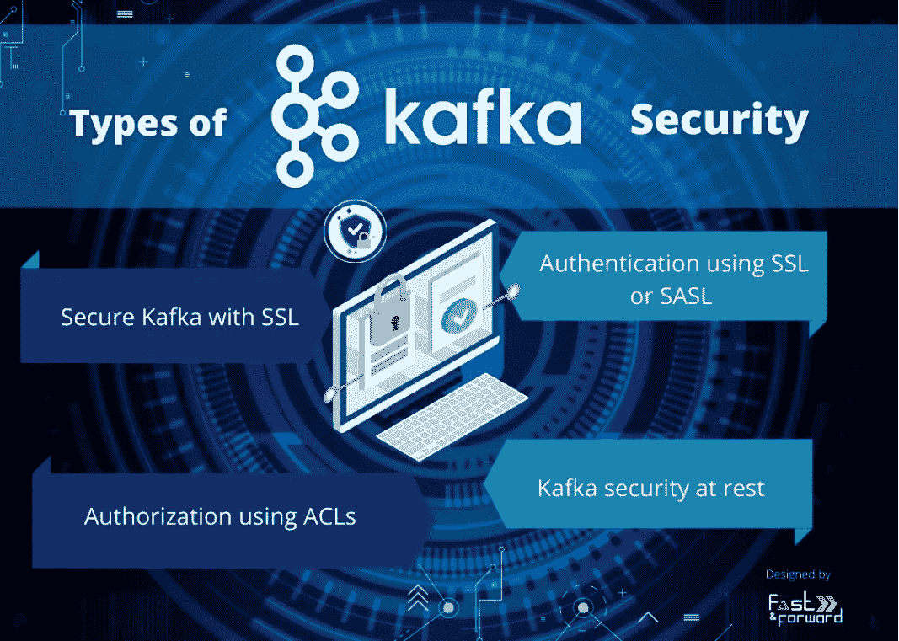
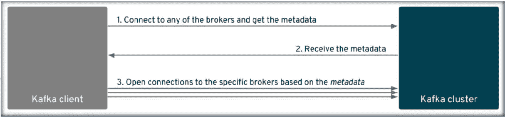
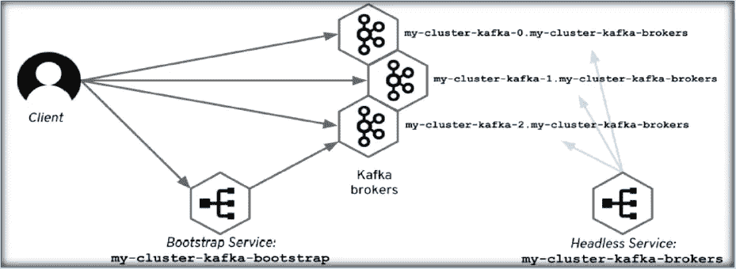
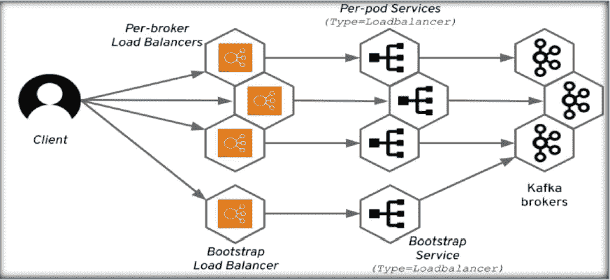

# 库伯内特斯上的卡夫卡:使用斯特里姆齐——第五部分(安全)

> 原文：<https://blog.devgenius.io/kafka-on-kubernetes-using-strimzi-part-5-security-fc878178cd04?source=collection_archive---------4----------------------->


来源—[http://joyreactor.com/post/4708653](http://joyreactor.com/post/4708653)

欢迎来到这个系列的第五部分，**库伯内特斯上的卡夫卡:使用** [**Strimzi**](https://strimzi.io/) **。**到目前为止，我们已经在[第 1 部分](https://medium.com/@singh.amarendra/kafka-on-kubernetes-using-strimzi-part-1-83d74564135e)中看到了 Strimzi 基础知识，在[第 2 部分](https://medium.com/@singh.amarendra/kafka-on-kubernetes-using-strimzi-part-2-71a8ba8e9605)中使用 Strimzi 在 Kubernetes 上创建了 Kafka 集群设置，在[第 3 部分](https://medium.com/@singh.amarendra/kafka-on-kubernetes-using-strimzi-part-3-configuration-options-f8aa027e9ba0)中讨论了在集群生产就绪时的重要配置和建议。在[上一节](https://medium.com/@singh.amarendra/kafka-on-kubernetes-using-strimzi-part-4-scalability-59da50575fec)中，我们已经了解了如何使用 KEDA 轻松扩展消费者。

在本节中，我们将讨论一个非常重要的方面- [安全性](https://en.wikipedia.org/wiki/Security)。由于 Kafka 是一个流媒体平台，我们处理大量数据，这些数据本质上也可能是敏感的，因此这变得非常重要。



来源— [fastnforward.blog](https://fastnforward.blog/introduction-to-kafka-security/)

概括地说，任何应用程序/平台/系统的安全性都可以通过以下三个方面来验证

*   [**加密**](https://www.investopedia.com/terms/e/encryption.asp#:~:text=Encryption%20is%20a%20means%20of,makes%20the%20original%20information%20unreadable.) —数据是在交换过程中加密还是在静止状态下加密
*   [**认证**](https://en.wikipedia.org/wiki/Authentication) —是否只允许通过认证的用户进入系统
*   [**授权**](https://en.wikipedia.org/wiki/Authorization)——只有授权用户才能访问应用程序/系统的不同部分

如果以上所有方面都符合安全标准，我们可以说我们的平台是安全的。但事情并没有就此结束，安全性是任何系统的关键要求，我们应该定期重新审视安全标准/策略。

现在让我们看看 Strimzi 提供了哪些选项来保护 Kubernetes 上的 Kafka 集群

E**ncryption:**strim zi 支持[传输层安全(TLS)](https://en.wikipedia.org/wiki/Transport_Layer_Security) ，一种加密通信的协议。

对于以下之间的通信，通信总是加密的:

*   卡夫卡经纪人
*   动物园管理员节点
*   运营商和卡夫卡经纪人
*   操作员和 ZooKeeper 节点
*   卡夫卡出口商

为了配置客户端和代理之间的安全通信，我们可以设置 [CA(认证中心)](https://en.wikipedia.org/wiki/Transport_Layer_Security)。TLS 证书颁发机构(CA)颁发证书来验证组件的身份。Strimzi 根据 CA 证书验证组件的证书。

*   Strimzi 组件根据*集群 CA* 认证中心(CA)进行验证
*   Kafka 客户端根据*客户端 CA* 认证机构(CA)进行验证

A **认证:** Kafka 监听器使用认证来确保到 Kafka 集群的安全客户端连接。

支持的身份验证机制:

*   [相互 TLS](https://en.wikipedia.org/wiki/Mutual_authentication) 客户机验证(在启用了 TLS 加密的监听器上)
*   [SASL 紧急停堆——SHA-512](https://strimzi.io/docs/0.12.1/#con-scram-sha-authentication-using-uo)
*   [OAuth 2.0 基于令牌的认证](https://strimzi.io/blog/2019/10/25/kafka-authentication-using-oauth-2.0/)
*   自定义身份验证

User Operator 管理 TLS 和 SCRAM 身份验证的用户凭据，但不管理 OAuth 2.0。例如，通过 User 操作符，您可以创建一个代表需要访问 Kafka 集群的客户端的用户，并将 TLS 指定为身份验证类型。

使用 OAuth 2.0 基于令牌的身份验证，应用程序客户端可以访问 Kafka 代理，而无需暴露帐户凭证。授权服务器处理访问授权和访问查询。

自定义身份验证允许任何类型的 kafka 支持的身份验证。它可以提供更多的灵活性，但也增加了复杂性。

在大多数情况下，相互 TLS 就足够了。在 mutual TLS 中，客户端和服务器的真实性得到验证。下面是我们如何在 Kafka 资源中轻松配置相互 TLS -

```
...
spec:
  kafka:
    version: 2.8.0
    replicas: 3
    listeners:
      ...
     ** tls:
        authentication:
          type: tls
...**
```

当我们部署 Strimzi Kafka 集群并启用身份验证时，它会创建一个*Kafka-cluster-ca-certificate*作为 Kubernetes secret。这是可用于验证服务器的群集 CA 证书。

A **授权** : Kafka 集群使用授权来控制特定客户或用户在 Kafka brokers 上被允许的操作。

支持的授权机制:

*   简单授权
*   OAuth 2.0 授权(如果您使用 OAuth 2.0 基于令牌的身份验证)
*   [开放保单代理(OPA)授权](https://strimzi.io/blog/2020/08/05/using-open-policy-agent-with-strimzi-and-apache-kafka/)
*   自定义授权

简单授权使用默认的 Kafka 授权插件 **AclAuthorizer** 。AclAuthorizer 使用访问控制列表(ACL)来定义哪些用户可以访问哪些资源。

下面是我们如何创建一个简单的 Kafka 用户并向其添加所需的权限-

```
apiVersion: kafka.strimzi.io/v1beta2
kind: KafkaUser
metadata:
  name: my-user
  labels:
    strimzi.io/cluster: my-cluster
spec:
  authentication:
    type: tls
  **authorization:
    type: simple (1)**
    acls:
      - resource:
          type: topic **(2)**
          name: my-topic
          patternType: literal
        operation: Read
      - resource:
          type: topic
          name: my-topic **(3)**
          patternType: literal
        operation: Describe **(4)**
      - resource:
          type: group
          name: my-group
          patternType: prefix **(5)**
        operation: Read
```

1.  为 Kafka 集群启用授权
2.  为**类型=主题**添加 ACL，其他类型有**组**、**簇**等。
3.  资源的名称，即主题名称、组名称等。
4.  对资源的允许操作，如读取、写入、描述、创建、更改等。
5.  资源名称上支持的模式类型。它可能是**文字**或**前缀**之一

OAuth 2.0 和 OPA 从授权服务器提供基于策略的控制。用于授予 Kafka 代理上的资源访问权限的安全策略和权限在授权服务器中定义。

URL 用于连接到授权服务器，并验证允许或拒绝客户端或用户请求的操作。用户和客户端与授权服务器中创建的策略相匹配，这些策略允许用户在 Kafka 代理上执行特定的操作。

# **访问卡夫卡:**

现在，让我们了解如何限制 Kafka 仅从 Kubernetes 集群访问，以及如果我们希望从集群外部访问它，有哪些选项可用，但在此之前，让我们了解 Kafka 发现协议-



[来源](https://strimzi.io/blog/2019/04/17/accessing-kafka-part-1/)

这是发现协议的工作原理-

1-经过认证的 Kafka 客户端在第一次连接期间连接到任何代理
2-代理返回所有主题/分区等的元数据。获得所需分区的详细信息后，客户端打开一个到特定代理的新连接。即使客户端需要连接到第一个代理，它也会终止现有的连接(#1)并启动与该代理的新连接。

Kubernetes 服务只能用于初始连接——它将把客户端带到集群中的一个代理，在那里它可以获取元数据。但是随后的连接不能通过该服务完成，因为它会将连接随机路由到集群中的一个代理，而不是将它引导到一个特定的代理。Strimzi 是如何处理这个问题的？

> 在代理配置中使用 **advertised.listeners** 选项，允许客户端直接连接到代理

## **从同一个 Kubernetes 集群内部连接:**

斯特瑞姆兹用**的 statefullset**来管理卡夫卡经纪人。我们可以使用 Kubernetes headless 服务给每个 pod 一个稳定的 DNS 名称。Strimzi 使用这些 DNS 名称作为 Kafka 经纪人的广告地址。对于 Strimzi 来说:

*   初始连接是使用常规的 Kubernetes 服务来获取元数据的。
*   随后的连接使用由另一个无头 Kubernetes 服务提供给 pod 的 DNS 名称打开。下图显示了一个名为 my-cluster 的 Kafka 集群示例。



[来源](https://strimzi.io/blog/2019/04/17/accessing-kafka-part-1/)

监听器配置客户端如何连接到 Kafka 集群。通过为每个侦听器指定唯一的名称和端口，可以配置多个侦听器。内部侦听器(用于从 Kubernetes 内部访问集群)是使用内部类型指定的。

```
# ...
listeners:
# ...
  - name: tls
    port: 9093
   ** type: internal**
    tls: true
# ...
```

## 从 Kubernetes 集群外部连接:

外部监听器(用于从 Kubernetes 外部访问集群)。还可以为侦听器启用 TLS 加密。

对于外部类型，type 的值可以是下列值之一:

**路由-** 使用 OpenShift 路由和默认 HAProxy 路由器
**负载平衡器-** 使用负载平衡器服务
**节点端口-** 使用 Kubernetes 节点上的端口(外部访问)
**入口-** 使用 Kubernetes 入口和用于 Kubernetes 的 NGINX 入口控制器。

这是我们如何在卡夫卡中配置它-

```
# ...
listeners:
# ...
  - name: external
    port: 9094
    type: **route/nodeport/loadbalancer/ingress (any one of them)**
    tls: true
# ...
```

下图描述了所需的服务，以及**类型=负载平衡器**的通信流程



[来源](https://strimzi.io/blog/2019/05/13/accessing-kafka-part-4/)

**结论:**在本节中，我们探讨了 Strimzi 提供的保护 Kafka 集群和通信的各种选项。我们已经了解了如何将访问限制在集群内部(如果只有内部服务在访问 Kafka，这将是一个典型的用例),或者我们如何安全地将其扩展到外部访问。Strimzi 提供了一些保护这些东西的标准方法，还提供了添加定制安全设置的方法。

在本系列的下一节，也是最后一节，我们将讨论一个重要的话题——监控。