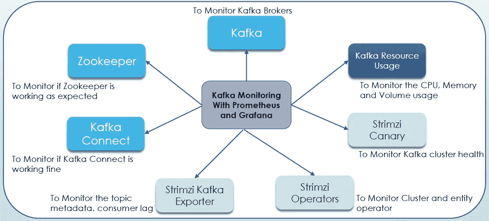
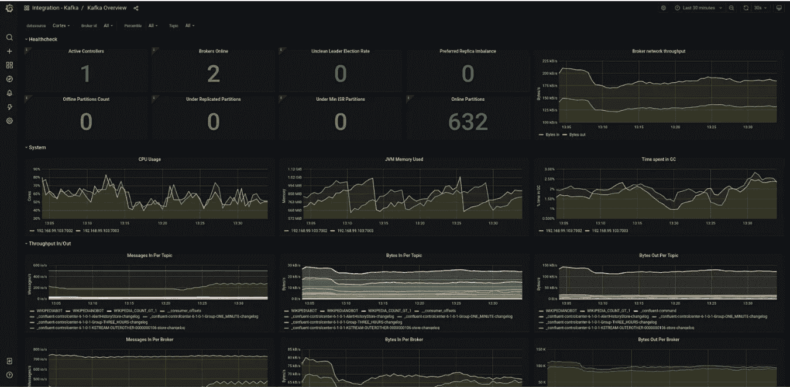

# 库伯内特斯上的卡夫卡:使用斯特里姆齐——第六部分(监控)

> 原文：<https://blog.devgenius.io/kafka-on-kubernetes-using-strimzi-part-6-monitoring-709a43198bf5?source=collection_archive---------2----------------------->

这是博客系列的最后一部分，**库伯内特上的卡夫卡:使用** [**Strimzi**](https://strimzi.io/) **。**在[上一部分](https://medium.com/@singh.amarendra/kafka-on-kubernetes-using-strimzi-part-5-security-fc878178cd04)中，我们已经讨论了 Strimzi 中的各种安全方面，以保护 Kubernetes 上的 Kafka 集群。在这一部分，我们将讨论群集可靠性的非常重要的部分，即监控。很多时候，人们只是忽略了为他们的 Kafka 集群设置监控，如果集群中出现任何问题，这将成为一场噩梦。

嗯，我想没有人希望在你不知道的情况下，你的 Kafka 集群在生产环境中不能正常工作。但是好处是你不需要在夜里醒来:P


Kafka 是一个 Java 应用程序，它使用 [JMX](https://www.oracle.com/technical-resources/articles/javase/jmx.html) (Java 管理扩展)公开其指标，因此几乎所有 Kafka 监控工具都与 JMX 指标集成，并获得所有 Kafka 相关指标。这是 Kubernetes 上的一些卡夫卡监测工具

1.  普罗米修斯+格拉法纳
2.  [新遗迹](https://docs.newrelic.com/docs/infrastructure/host-integrations/host-integrations-list/kafka/kafka-integration/)
3.  [数据狗](https://www.datadoghq.com/blog/monitor-kafka-with-datadog/)等。

有三个主要部分来监控您的集群-

*   收集和存储指标
*   查询并在有意义的仪表板上显示它们
*   在任何违反条件的情况下发出警报

由于 Prometheus 已成为监控 Kubernetes 本机应用程序的标准，Strimzi 支持它开箱即用，并提供许多 Grafana 仪表板，便于为您的 Kafka 集群设置 Prometheus+Grafan+Alert Manager。

**用于抓取和存储** — [Prometheus](https://prometheus.io/) 是一款开源监控解决方案，已经成为云原生世界中事实上的指标和警报标准。Prometheus 最棒的一点是，它从 Kafka 集群中抓取指标，并将其存储在时序数据库中，这与应用程序需要推送这些指标的其他监控工具不同。

**用于查询和仪表板** —一旦指标在 Prometheus DB 中可用，您就可以使用 PromQL 对其进行查询。许多工具支持 PromQL，如 Grafana、New Relic 等。

**为了发出警报** — Prometheus 将根据它正在搜集的指标评估规则，当任何规则匹配时，它将把它发送给[警报管理器](https://prometheus.io/docs/alerting/alertmanager/)。然后，AlertManager 将负责管理这些警报。您可以设置通知渠道，以防任何警报，如电子邮件，懈怠，传呼机责任等。

Strimzi 使用两个开源项目从 Kafka 集群中获取所有指标，并将其发送给 Prometheus。

*   [普罗米修斯 JMX 出口器](https://github.com/prometheus/jmx_exporter)——阿帕奇卡夫卡默认不支持普罗米修斯度量。如上所述，它公开了 JMX 度量。普罗米修斯 JMX 出口项目采用 JMX 指标，并将其作为普罗米修斯端点。
*   Kafka Exporter——Kafka 代理提供了许多与代理状态、使用和性能相关的有用指标。但是缺少一些重要的指标。例如，它不提供任何关于消费者滞后的指标或关于主题的信息。Kafka Exporter 作为客户端连接到 Kafka，收集关于主题、分区和消费群体的不同信息。然后，它将此信息公开为普罗米修斯度量端点。

所以我们要用普罗米修斯来监控以下事情-



我们可以看到，除了监控 Kafka 指标、Strimzi 特定组件之外，我们还有 Strimzi Canary。

**Strimzi Canary** - Strimzi 团队创建了一个项目 [Strimzi-Canary](https://github.com/strimzi/strimzi-canary) 来确定 Kafka 集群是否正常工作。这是通过创建一个 canary 主题来实现的，该主题的分区数量等于集群中代理的数量，并创建一个生产者和消费者来生产和消费来自 Canary 主题的数据。

我们可以通过在我们的 Kafka 资源中添加以下块并在[Kafka-metrics-config . YAML](https://github.com/AmarendraSingh88/kafka-on-kubernetes/blob/main/kafka-demo/demo3-monitoring/kafka-metrics-config.yaml)中添加规则来轻松启用 JMX 普罗米修斯导出器

```
spec:
  kafka:
    metricsConfig:
      type: jmxPrometheusExporter
      valueFrom:
        configMapKeyRef:
          name: kafka-metrics
          key: kafka-metrics-config.yaml
```

要启用 Kafka Exporter，我们只需在 Kafka 定义中添加以下代码行-

```
spec:
  kafkaExporter:
    topicRegex: ".*"
    groupRegex: ".*"
```

现在让我们讨论如何在我们的设置中轻松地配置 Prometheus。这些步骤中使用的资源可以在[这里](https://github.com/AmarendraSingh88/kafka-on-kubernetes/tree/main/kafka-demo/demo3-monitoring)找到。

1-创建监控命名空间:

```
kubectl create namespace monitoring
```

2-部署普罗米修斯操作员:

```
kubectl apply -f prometheus-operator-deployment.yaml -n monitoring --force-conflicts=true --server-side
```

3-为 jmx 度量创建配置映射:

```
kubectl apply -f kafka-metrics-config.yaml -n monitoring
kubectl apply -f zookeeper-metrics.yaml -n monitoring
```

4-用 jmxPrometheusExporter 更新 Kafka 资源，以抓取 jmx 指标和 kafkaExporter，用于导出主题和消费者滞后指标

```
kubectl apply -f kafka.yaml -n kafka
```

部署普罗米修斯-

```
kubectl apply -f prometheus.yaml -n monitoring
```

6-部署吊舱监视器-

```
kubectl apply -f strimzi-pod-monitor.yaml -n monitoring
```

7-部署 Grafana -

```
kubectl apply -f grafana.yaml -n monitoring
```

普罗米修斯和格拉夫纳的 8 号左舷前锋-

```
kubectl port-forward svc/grafana 3000:3000 -n monitoring
kubectl port-forward svc/prometheus-operated 9090:9090 -n monitoring
```

9-在 Grafana 中添加 Prometheus 数据源，并从 [Strimzi 为 Kafka、Zookeeper、Kafka Connect、MirrorMaker 等提供的仪表板](https://github.com/strimzi/strimzi-kafka-operator/tree/0.28.0/examples/metrics/grafana-dashboards)中上传 Grafana 仪表板。

这是 Kafka overview 的 Grafana 仪表板示例-



[来源](https://grafana.com/blog/2021/07/26/get-comprehensive-monitoring-for-your-apache-kafka-ecosystem-instances-quickly-with-grafana-cloud/)

*   [Prometheus Alertmanager](https://prometheus.io/docs/alerting/alertmanager/) 是一个插件，用于处理警报并将它们路由到通知服务。Alertmanager 支持监视的一个重要方面，即根据警报规则通知指示潜在问题的条件。

Strimzi 为 Prometheus Alertmanager 提供了[示例配置文件。](https://strimzi.io/docs/operators/0.21.1/full/deploying.html#ref-metrics-config-files-str)

参见 [Strimzi 文档](https://strimzi.io/docs/operators/0.21.1/full/deploying.html#assembly-metrics-prometheus-alertmanager-str)设置警报管理器。

**结论**——这是系列**Kafka on Kubernetes:Using strim zi**的第 6 部分也是最后一篇博客，在这里我们讨论了如何轻松地监控 Kafka 集群。在这个系列中，我们讨论了

1.  [strim zi 在 Kubernetes 上设置和维护 Kafka 集群的基础知识](https://medium.com/@singh.amarendra/kafka-on-kubernetes-using-strimzi-part-1-83d74564135e)
2.  [如何使用 Strimzi 设置 Kafka 集群](https://medium.com/@singh.amarendra/kafka-on-kubernetes-using-strimzi-part-2-71a8ba8e9605)
3.  [讨论生产就绪配置](https://medium.com/@singh.amarendra/kafka-on-kubernetes-using-strimzi-part-3-configuration-options-f8aa027e9ba0)
4.  [见过如何使用 Keda](https://medium.com/@singh.amarendra/kafka-on-kubernetes-using-strimzi-part-4-scalability-59da50575fec) 轻松扩展 Kafka 客户端
5.  [如何保护 Kafka 集群](https://medium.com/@singh.amarendra/kafka-on-kubernetes-using-strimzi-part-5-security-fc878178cd04)
6.  讨论了如何使用 Prometheus+Grafana+Alert Manager 轻松监控 Kafka 集群(这一部分)

因此，我们在 Kubernetes 上设置了**生产就绪的 Kafka 集群，它是可扩展的、安全的，并且具有监控和警报设置。**