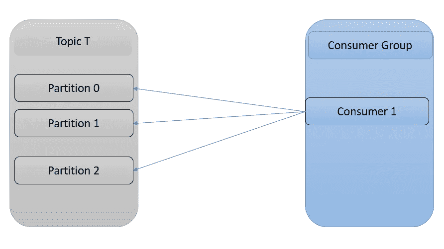

# 卡夫卡:生产者-消费者&分区

> 原文：<https://blog.devgenius.io/kafka-producers-consumers-partitions-89229e675f5f?source=collection_archive---------17----------------------->

*   了解分区，消费者帮助你更快的学习卡夫卡。在这里，我们讨论卡夫卡的分区的行为。
*   为了更好地理解，需要讨论一些用例。

**用例 1:**

*   我们来看一个有 3 个分区的题目。这里，我们在 G 组中有一个新的消费者。因此，这个消费者将从所有 3 个分区获得所有消息。

**用例 2:**

*   那么如果我们在消费群体中再增加一个消费者会怎么样呢？

*   将消费者 2 添加到该组后，它将如上所述。

**用例 3:分区数量=消费者数量**

*   因此，这里每个消费者将从单个分区读取消息。

**用例 4:分区数量<消费者数量**

> 如果我们向组(单个主题)中再添加一个消费者，消费者 4 将是空闲的，根本收不到任何消息。
> 
> 因此，如果我们添加消费者 5、6、7 等，他们都将是闲置的，因为卡夫卡有一个规则，即消费者组内的消费者数量应该等于或小于同一主题中的分区数量。

**用例 5:添加新的消费者群体**

*   如果我们添加一个只有一个消费者的新消费者组“组 2 ”,组 2 将获得主题 T 中的所有消息。因此，这个组 2 独立于组 1 正在做的事情。

# 分区重新平衡

*   将分区所有权从一个用户更改到另一个用户称为重新平衡。这将非常有用，因为它允许我们轻松安全地添加和删除消费者。
*   但是当分区从一个消费者移动到另一个消费者时，消费者丢失了其当前的消息细节/消息状态。

> **心跳** s:管理 kafka 组时，消费者服务商的心跳之间的预期时间。心跳用于确保使用者的会话保持活动状态，并在新的使用者加入、离开或空闲时提供重新平衡。

*   消费者组 ID:消费者组 ID 是集合中消费者组的标识符。
*   组 ID 对于平衡分区非常重要。例如，如果我们有一个包含 4 个分区的主题。还将有两个具有相同 group-Id 的消费者，每个人将从 2 个分区中读取数据。
*   如果我们有两个具有不同组 id 的消费者，这两个消费者都将从 4 个分区中读取数据。在这种情况下，group-Id 就是如何定义从给定主题/分区读取的使用者组。

**提供密钥**:因此，如果我们在消息中指定一个密钥，kafka 获取该密钥并将其应用于算法，然后根据模块结果决定它应该进入哪个主题，因此，如果您需要在流量实现中保证顺序，这将保证该分区内的顺序。

*   如果你不提供钥匙，卡夫卡会进行循环赛。所以是这样的“一二三一二三一二三……”。
    但是这里的问题是，如果同一个客户的第一条消息发送到一个分区，第二条消息可能发送到第二个分区，第三条消息可能发送到第三个分区，即使在同一个客户内部，消息之间的顺序也无法保证，这是一个缺点。