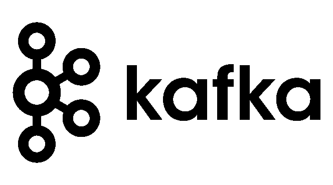

# Kafka 模式注册表

> 原文：<https://blog.devgenius.io/kafka-schema-registry-abea44b88714?source=collection_archive---------4----------------------->



你刚开始工作/学习卡夫卡吗？偶然发现模式注册表，但不知道它到底是什么？你找对了地方。今天我们将探索 Kafka schema registry 是什么，在 registry 中创建和存储我们的第一个 Avro schema，并生成和使用一些数据。唷！这么多事要做。我们先来了解一下什么是模式注册中心。

顾名思义，模式注册与我们数据的模式有关。如果你猜对了，你已经了解了 90%的模式注册表。它确实存储了我们的数据的模式，Kafka 生产者和消费者都使用它来理解他们在生产或阅读数据时数据是什么样子的。但是最大的问题是为什么我们需要一个模式注册中心？当我们使用 Avro 等模式时，生产者和消费者都需要知道数据的模式，因此需要有一个他们都可以访问的地方。它可以是文件系统，也可以是 RESTful 层，比如模式注册表。添加 RESTful 层而不是使用文件系统的好处是，正如您已经猜到的，是可伸缩性。

那么，如果数据不是作为文件系统的一部分存储的，那么它是如何存储的呢？又一个好问题。Schema registry 使用 Kafka 作为其后端存储。所有的数据，如模式、版本、元数据等都作为日志存储在 Kafka 主题' _schemas '中。说到教程部分，老实说，我觉得更有趣。:p

出于本教程的目的，我们将使用一个融合的本地平台，该平台为我们提供了启动所有 Kafka 服务(包括模式注册)的功能。从这里下载软件[https://www.confluent.io/get-started-v2/?product=software](https://www.confluent.io/get-started-v2/?product=software)，你只需要提供你的电子邮件地址就可以了。

解压缩下载的文件

```
tar -xvf *FILENAME*
```

设置一些环境变量，最好在。巴沙尔或或。长期运行的配置文件。

```
export CONFLUENT_HOME**=<**path**-**to**-**confluent**>** export PATH=$PATH:$CONFLUENT_HOME/bin
```

所有这些都完成后，你只需要运行下面的命令，所有的服务都会启动。瞧啊。

```
bash-3.2$ confluent local services start
The local commands are intended for a single-node development environment only,
NOT for production usage. [https://docs.confluent.io/current/cli/index.html](https://docs.confluent.io/current/cli/index.html)
Using CONFLUENT_CURRENT: /var/folders/4h/5lg7fz191g18pzl1rwvdkqlh0000gp/T/confluent.780135
Starting ZooKeeper
ZooKeeper is [UP]
Starting Kafka
Kafka is [UP]
Starting Schema Registry
Schema Registry is [UP]
Starting Kafka REST
Kafka REST is [UP]
Starting Connect
```

现在我们的服务已经启动，让我们开始快速模式注册教程。我们将存储一家冰淇淋店的交易数据。我们的模式将由字段组成:customer_name、order、cost、new _ customer[如果客户是新客户]，所选择的字段是不言自明的。我们将为我们的数据创建一个 avro 模式，并在其上生成一些数据，这些数据将被我们正在运行的消费者读取。

```
bash-3.2$ cat schema1.avsc{
“type” : “record”,
“name” : “transaction_record”,
“fields” : [
{
“name”:”customer_name”,
“type”:”string”
},
{
“name”:”order”,
“type”:”string”
},
{
“name”:”cost”,
“type”:”float”
},
{ “name”:”new_customer”,
“type”:”boolean”
}
]}
```

这就是我们的模式目前的样子，正如您可以看到的，我们正在定义的每个字段都定义了类型，如 string、float 等。我们的生产者对作为生产者的数据一无所知，消费者也一样，除了值之外，字段的定义存储在带有模式注册中心的模式中。在模式注册中心注册我们的模式之前，我们需要做两件事。那些是什么？
好吧，我们知道我们的模式注册中心在启动合流本地平台的时候已经启动了，但是它在哪里运行呢？好吧，它从 localhost:8081 开始，这是我们之前谈到的 RESTful 层。如果您访问[http://localhost:8081/subjects](http://localhost:8081/subjects)并且还没有注册一个模式，就像我们还没有注册一样，您可能会在访问 url 时看到一个空数组。如果您看不到任何东西，那么可以检查模式注册是否已经启动。一种方法是使用下面的命令:

```
bash-3.2$ confluent local services status
The local commands are intended for a single-node development environment only,
NOT for production usage. [https://docs.confluent.io/current/cli/index.html](https://docs.confluent.io/current/cli/index.html)
Using CONFLUENT_CURRENT: /var/folders/4h/5lg7fz191g18pzl1rwvdkqlh0000gp/T/confluent.780135
Connect is [UP]
Control Center is [UP]
Kafka is [UP]
Kafka REST is [UP]
ksqlDB Server is [UP]
Schema Registry is [UP]
ZooKeeper is [UP]
```

我们忘记的第二个要点是，我们需要一个主题来存储我们的数据，模式定义我们的数据看起来像什么，模式注册表有助于存储模式，但 kafka 中的数据最终存储在一个主题上。让我们为自己创建一个“交易”主题。我们走吧。

```
bash-3.2$ kafka-topics.sh — create — bootstrap-server localhost:9092 — replication-factor 1 — partitions 1 — topic transactions
Created topic transactions.
```

我们已经完成了主题的创建。在产生关于数据的数据之前，让我们开始我们的消费吧。

```
bash-3.2$ kafka-avro-console-consumer — bootstrap-server localhost:9092 — topic transactions
..
```

终端没有卡顿，使用 Kafka 提供的 avro 控制台，我们已经开始监听主题为‘transactions’的传入数据。每当有关于这个主题的数据产生时，我们都会在我们的消费者控制台上看到它。让我们创建这些数据。

```
bash-3.2$ kafka-avro-console-producer — topic transactions — bootstrap-server localhost:9092 — property value.schema=”$(< /Users/Archi/Downloads/kafka_2.13–3.0.0/schema1.avsc)”{“customer_name”:”Archita”,”order”:”kesarpista”,”cost”:60.7,”new_customer”:false}
{“customer_name”:”Ritika”,”order”:”strawberry”,”cost”:30,”new_customer”:true}
..
```

我们从生产者那里生产了两张唱片，现在让我们看看消费者

```
bash-3.2$ kafka-avro-console-consumer — bootstrap-server localhost:9092 — topic transactions
{“customer_name”:”Archita”,”order”:”kesarpista”,”cost”:60.7,”new_customer”:false}{“customer_name”:”Ritika”,”order”:”strawberry”,”cost”:30.0,”new_customer”:true}
```

看来我们从制作人那里拿到了所有的唱片。除非您在终端中按下 ctrl+c，否则使用者和生产者可能仍处于运行状态。
现在让我们来看看我们的模式注册中心，在[http://localhost:8081/subjects](http://localhost:8081/subjects)，您必须看到已经注册了一个新的 subject，格式为 topicname-value，在我们的例子中低于 1。

```
["transactions-value"]
```

如果您尝试访问这个 URL:[http://localhost:8081/subjects/transactions-value/versions/1](http://localhost:8081/subjects/transactions-value/versions/1)，您将看到我们在上面创建的模式，这个模式被生产者和消费者用于序列化和反序列化。

```
{“subject”:”transactions-value”,”version”:1,”id”:1,”schema”:”{\”type\”:\”record\”,\”name\”:\”transaction_record\”,\”fields\”:[{\”name\”:\”customer_name\”,\”type\”:\”string\”},{\”name\”:\”order\”,\”type\”:\”string\”},{\”name\”:\”cost\”,\”type\”:\”float\”},{\”name\”:\”new_customer\”,\”type\”:\”boolean\”}]}”}
```

Schema registry 为我们提供了模式版本化的好处，新的模式更改可以成为新版本的一部分，而不会中断使用旧版本模式的人的模式。在下一篇文章中，我们将深入探讨与模式进化相关的各种兼容性。如果你发现了这个有用的:D，别忘了鼓掌