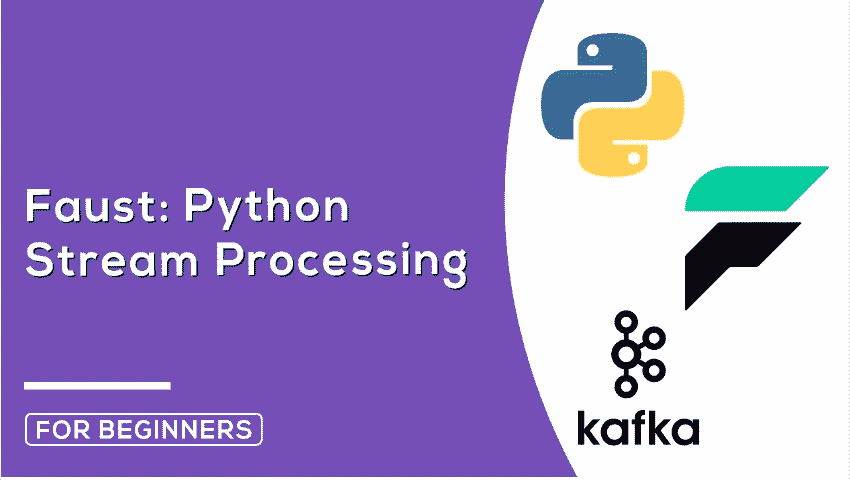
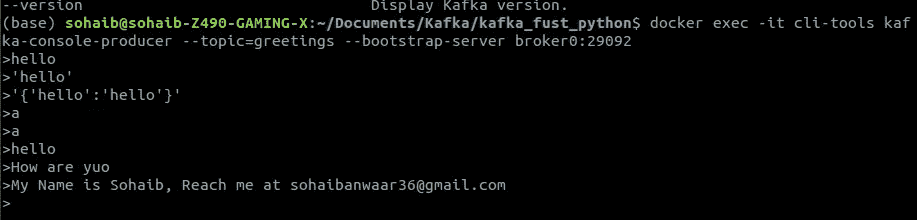
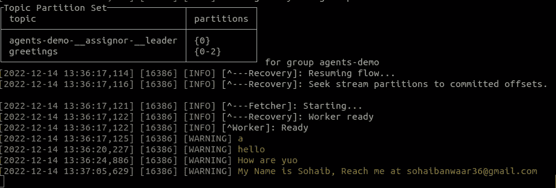

# 卡夫卡与浮士德蟒蛇流

> 原文：<https://blog.devgenius.io/kafka-streaming-with-faust-python-a1783c32339b?source=collection_archive---------2----------------------->



# 卡夫卡与浮士德

# 介绍

这是一个简单的例子，展示了如何使用 Faust 从 Kafka 获取数据流。数据是一个简单的 JSON 对象，带有时间戳和随机数。数据由 Python 脚本生成，并发送给 Kafka。浮士德习惯于阅读卡夫卡的资料。

# 先决条件

*   Python 3.6 以上版本
*   码头工人
*   Docker 撰写

# 设置

1.  克隆存储库
2.  运行`docker-compose up -d`启动 Kafka 集群
3.  运行`pip install -r requirements.txt`来安装 Python 依赖项
4.  运行`python main.py`启动制作程序
5.  运行`faust -A faust_stream worker -l info`启动浮士德工人

# 使用

制作人会每秒生成一个随机数，并发送给卡夫卡。浮士德工人将从卡夫卡那里读取数据，并将其打印到控制台上。

# 巨蟒中的浮士德·卡夫卡消费者

在浮士德模块的帮助下成为卡夫卡式的消费者。

```
import faust
```

```
app= faust.App('agents-demo')greetings_topic = app.topic('greetings', value_type=str, value_serializer='raw')@app.agent(greetings_topic)
async def greet(stream):
    async for greeting in stream:
        print(greeting)if __name__ == '__main__':
    app.main()
```

# 启动浮士德工人

现在完成代码后，我们将启动浮士德工人。

```
faust -A faust_stream worker -l info
```

# 测试消费者

现在，我们将通过 docker CLI 向主题发送一些数据来测试消费者

```
docker exec -it cli-tools kafka-console-producer --topic=greetings --bootstrap-server broker0:29092
```

# 输出

制片人截图



消费者截图



# 巨蟒中的浮士德·卡夫卡制片人

现在让我们借助浮士德模块制作一个制作人。

```
# Producer
@app.timer(interval=1.0)
async def send_greeting():
    await greetings_topic.send(value='Hello, World!')
```

借助以下命令再次启动该文件

```
faust -A faust_stream worker -l info
```

现在，您将每秒在消费者中看到 hello world 消息。

# 查看 GitHub 上的代码:

【https://github.com/SohaibAnwaar/Kafka-Faust-Python 

# 作者

*   索海卜·安瓦尔:[https://www.sohaibanwaar.com](https://www.sohaibanwaar.com/)
*   Gmail:[sohaibanwaar36@gmail.com](mailto:sohaibanwaar36@gmail.com)
*   LinkedIn : [这里有一些专业的谈话](https://www.linkedin.com/in/sohaib-anwaar-4b7ba1187/)
*   堆栈溢出:[在这里获得我的帮助](https://stackoverflow.com/users/7959545/sohaib-anwaar)
*   在这里查看我的杰作
*   GitHub : [在这里查看我的代码](https://github.com/SohaibAnwaar)