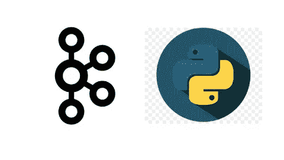
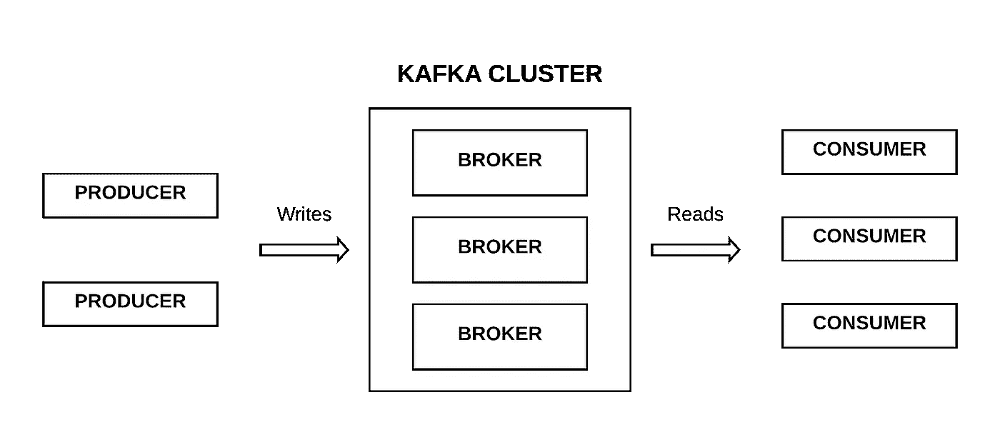
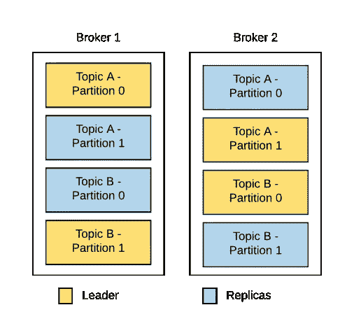
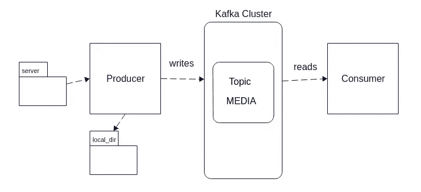
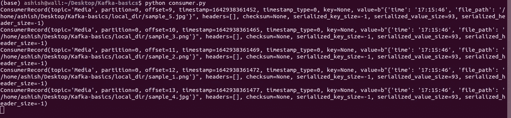

# 卡夫卡与蟒蛇

> 原文：<https://blog.devgenius.io/kafka-with-python-4eb017b41e83?source=collection_archive---------3----------------------->



本文旨在概述 Apache Kafka 的核心概念，并使用 python 编写简单的生产者和消费者程序。

# 卡夫卡是什么？

Kafka 是一个连接每个人和每个事件的单一平台。简单来说，一个事件流平台。事件可以是鼠标点击、向购物车添加商品或下载文件。

# 卡夫卡建筑



卡夫卡建筑

*   本文旨在概述 Apache Kafka 的核心概念，并使用 python 编写简单的生产者和消费者程序。**代理-** Kafka 集群由多个代理组成，每个代理都有自己的本地存储和保留时间。一个代理可以有多个主题
*   **主题**——相关消息或事件的集合
*   **分区**——题目被分成分区。它是保存主题所拥有的消息子集的最小存储单元。每个分区都是一个日志文件，消息以附加方式写入其中



分布在 2 个代理上的 2 个主题的分区

*   **生产者**——向一个或多个主题撰写或推送消息
*   **消费者**-阅读或提取一个或多个主题的信息
*   **动物园管理员**-它管理和协调卡夫卡经纪人

# 入门指南



我们将创建一个简单的项目，它由一个生产者和一个消费者组成。制作者的功能是将出现在*服务器*文件夹中的图像移动到 *local_dir* 文件夹中，然后将消息推入/写入主题*媒体中。*消费者阅读来自*媒体*主题的信息。

# 1 .装置

*   [下载](https://kafka.apache.org/downloads)阿帕奇卡夫卡
*   安装库 [kafka-python](https://pypi.org/project/kafka-python/)

# 2.密码

创建两个名为 *server* 和 *local_dir* 的文件夹。下载一些示例图像并放在服务器文件夹中。

*   生产者代码

*   消费者代码

# 3.奔跑

*   启动动物园管理员和卡夫卡。在单独的终端中运行这些命令

```
bin/zookeeper-server-start.sh config/zookeeper.properties
bin/kafka-server-start.sh config/server.properties
```

*   首先运行生产者程序，然后运行消费者程序
*   验证使用者打印了由生产者编写的消息



# 结论

在这个故事中，我们看到了 Apache Kafka 的核心概念，并通过三个简单的步骤创建了一个由一个生产者和一个消费者组成的简单项目。希望你已经理解了卡夫卡的概念。

感谢阅读！

[Github](https://github.com/ashish-mj/kafka_basic) [网站](https://ashishmj.vercel.app/) [领英](https://www.linkedin.com/in/ashish-mj/)