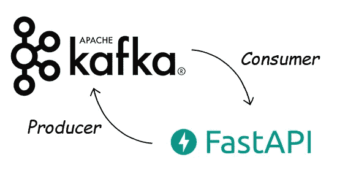
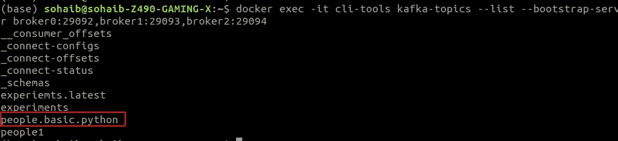
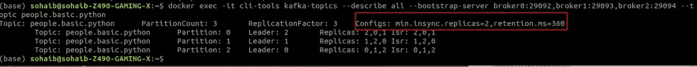

# 使用 Python Fast-API 的 Kafka

> 原文：<https://blog.devgenius.io/kafka-with-python-fast-api-b1622eb7f9d0?source=collection_archive---------0----------------------->



# 使用 Python 的 Kafka(快速 API)

在上一个主题中，我们在 cli 的帮助下创建了 Kafka 主题，在这个博客中，我们将在 python 的帮助下创建 Kafka 主题

Github 链接:[https://github . com/SohaibAnwaar/Kafka-Python-FastAPI-Topic-Creation-](https://github.com/SohaibAnwaar/Kafka-Python-FastAPI-Topic-Creation-)

# 用 docker 安装 Kafka

> *往期博客链接:*[*https://medium . com/dev-genius/Kafka-installations-and-Kafka-topics-f0b7c 81754 D8*](https://medium.com/dev-genius/kafka-installtions-and-kafka-topics-f0b7c81754d8)

# 装置

1.  安装 python >= 3.6
2.  制作虚拟环境
3.  运行命令`pip install -r requirements.txt`

# 代码部分

安装完所有的东西后，现在让我们深入到代码部分，我们的 Kafka 实例运行在端口`9092, 9093, 9094`上，所以让我们把它写在 env 文件中。

环境文件

```
BOOTSTRAP-SERVERS="localhost:9092,localhost:9093,localhost:9094"
TOPIC_PEOPLE_BASIC_NAME="people.basic.python"
TOPIC_PEOPLE_BASIC_PARTITIONS=3
TOPIC_PEOPLE_BASIC_REPLICATION_FACTOR=3
```

# Python 代码

进口

```
import os
# env and Fast api import
from dotenv import load_dotenv
from fastapi import FastApi
# Kafka Imports
from kafka import KafkaAdminClient
from kafka.admin import NewTopic
from kafka.errors import TopicAlreadyExistsError
```

设置快速 API

```
# Load env file
load_dotenv(verbose=True)
# Fast API instance
app = FastApi()
```

启动事件要添加一个应该在应用程序启动前运行的函数，用事件声明它，让我们创建一个启动事件，在这个事件中，我们用 env 文件中提到的所有代理服务器初始化我们的管理客户端

```
@app.on_event("startup")
async def startup_event():
    # Kafka Admin Client
    client = KafkaAdminClient(
        bootstrap_servers=os.environ.get("BOOTSTRAP-SERVERS"))
    # Creating topic
    topic = NewTopic(name=os.environ.get("TOPIC_PEOPLE_BASIC_NAME"),
                     num_partitions=int(os.environ.get("TOPIC_PEOPLE_BASIC_PARTITIONS")),
                     replication_factor=int(os.environ.get("TOPIC_PEOPLE_BASIC_REPLICATION_FACTOR")))
    # If topic already exists, it will throw an error
    try:
        # Creating topic
        client.create_topics(new_topics=[topic], validate_only=False)
    except TopicAlreadyExistsError:
        pass
    finally:
        # Close the client
        client.close()@app.get("/")
async def root():
    return {"message": "Hello World"}
```

在终端上运行命令

```
uvicorn app:app --reload
```

输出

```
INFO:     Will watch for changes in these directories: ['/home/sohaib/Documents/Kafka/kafka_python']
INFO:     Uvicorn running on [http://127.0.0.1:8000](http://127.0.0.1:8000) (Press CTRL+C to quit)
INFO:     Started reloader process [25125] using watchgod
INFO:     Started server process [25127]
INFO:     Waiting for application startup.
Creating topic people.basic.python
INFO:     Application startup complete.
```

现在我们来验证一下我们的话题是不是建立在卡夫卡身上的

运行命令

```
docker exec -it cli-tools kafka-topics --list --bootstrap-server broker0:29092,broker1:29093,broker2:29094
```

输出



因此，我们成功地用 python 制作了一个卡夫卡主题

# 创建主题时的高级配置

通过 python 创建时，要在主题中添加高级配置，你只需要在主题中添加一个参数`topic-config`

比如下面的代码

```
topic = NewTopic(name=os.environ.get("TOPIC_PEOPLE_BASIC_NAME"),
                     num_partitions=int(os.environ.get("TOPIC_PEOPLE_BASIC_PARTITIONS")),
                     replication_factor=int(os.environ.get("TOPIC_PEOPLE_BASIC_REPLICATION_FACTOR")),
                     topic_configs={"cleanup.policy": "compact"})
```

# 更新主题时的高级配置

要更新主题的高级配置，可以使用以下代码。

```
# Updating Kafka Config
cfg_resources_update = ConfigResource(
    ConfigResourceType.TOPIC,
    os.environ.get("TOPIC_PEOPLE_BASIC_NAME"),
    configs={"retention.ms": "360"})
client.alter_configs([cfg_resources_update])
```

# 验证高级配置

要验证高级配置，您可以使用以下命令

```
docker exec -it cli-tools kafka-topics --describe all --bootstrap-server broker0:29092,broker1:29093,broker2:29094 --topic people.basic.python
```

输出



# 作者

*   索海卜·安瓦尔:[https://www.sohaibanwaar.com](https://www.sohaibanwaar.com/)
*   Gmail:[sohaibanwaar36@gmail.com](mailto:sohaibanwaar36@gmail.com)
*   LinkedIn : [在这里做一些专业的谈话](https://www.linkedin.com/in/sohaib-anwaar-4b7ba1187/)
*   堆栈溢出:[在这里获得我的帮助](https://stackoverflow.com/users/7959545/sohaib-anwaar)
*   在这里查看我的杰作
*   GitHub : [在这里查看我的代码](https://github.com/SohaibAnwaar)