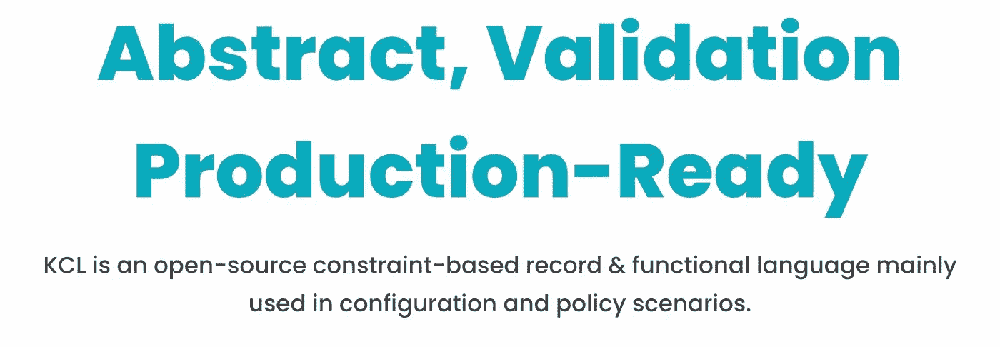

# KCL v0.4.4 发布博客—定制清单输出、Python SDK、大小和错误优化

> 原文：<https://blog.devgenius.io/kcl-v0-4-4-release-blog-customize-manifest-output-python-sdk-size-and-error-optimization-d5f2f827bdee?source=collection_archive---------9----------------------->



KCL 团队很高兴地宣布 v0.4.4 现已推出！此版本主要添加了为 KCL 定制 YAML 清单输出的功能。用户可以通过编写代码和调用系统函数来自定义 YAML 输出的风格，而无需理解复杂的模式设置语义。此外，本次发布提供了最新的 [KCL Python SDK](https://github.com/KusionStack/kclvm-py) ，可以供 Python 用户直接集成 KCL。与此同时，我们已经大大缩小了 KCL 安装包的大小。平均安装包大小已经减少到前一版本的五分之一。它还包括许多编译器错误消息优化和错误修复。可以访问 [KCL 发布页面](https://github.com/KusionStack/KCLVM/releases/tag/v0.4.4-alpha.2)获取更详细的发布信息和 KCL 二进制下载链接。

# 背景[](https://kcl-lang.github.io/blog#background)

KCL 是一种开源的基于约束的记录和函数式语言。KCL 通过成熟的编程语言技术和实践，改进大量复杂配置的编写，致力于围绕配置构建更好的模块化、可扩展性和稳定性，逻辑编写更简单，自动化速度快，生态扩展性好。

本博客将向读者介绍 KCL 社区的最新发展。

# 特征[](https://kcl-lang.github.io/blog#features)

# 自定义 YAML 清单输出[](https://kcl-lang.github.io/blog#customize-yaml-manifest-output)

在以前的 KCL 版本中，YAML 输出的样式是硬编码在 KCL 编译器中的，用户可以通过设置不同值的`__settings__` meta 属性来决定 YAML 输出的样式，这带来了很高的复杂度。因此，在 0.4.4 版本中，我们提供了一个系统模块功能，供开发者轻松定制 YAML 输出风格。该函数的签名如下:

```
manifests.yaml_stream(values: [any], opts: {str:} = {
    sort_keys = False
    ignore_private = True
    ignore_none = False
    sep = "---"
})
```

该函数用于使用`---`分隔符将 KCL 对象列表序列化为 YAML 输出。它有两个参数:

*   `values`-KCL 对象列表
*   `opts`-YAML 序列化选项
*   `sort_keys`:是否按照属性名的字典顺序对序列化结果进行排序(默认为`False`)。
*   `ignore_private`:是否忽略名称以字符`_`开头的属性输出(默认值为`True`)。
*   `ignore_none`:是否忽略值为‘无’的属性(默认值为`False`)。
*   `sep`:设置多个 YAML 文件之间的分隔符(默认值为`"---"`)。

这里有一个例子:

```
import manifests

schema Deployment:
    apiVersion: str = "v1"
    kind: str = "Deployment"
    metadata: {str:} = {
        name = "deploy"
    }
    spec: {str:} = {
        replica = 2
    }
schema Service:
    apiVersion: str = "v1"
    kind: str = "Service"
    metadata: {str:} = {
         name = "svc"
    }
    spec: {str:} = {}    

deployments = [Deployment {}, Deployment {}]
services = [Service {}, Service {}]

manifests.yaml_stream(deployments + services)
```

首先，我们使用`import`关键字来导入`manifests`模块，并定义两个部署资源和两个服务资源。当我们想以 YAML 流格式输出这四个资源，并以`---`作为分隔符时，我们可以将它们放入一个 KCL 列表中，并使用`manifests.yaml_stream`函数将其传递给`values`参数(如果没有特殊要求，`opts`参数一般可以使用默认值)。最后，YAML 的输出是:

```
apiVersion: v1
kind: Deployment
metadata:
  name: deploy
spec:
  replica: 2
---
apiVersion: v1
kind: Deployment
metadata:
  name: deploy
spec:
  replica: 2
---
apiVersion: v1
kind: Service
metadata:
  name: svc
---
apiVersion: v1
kind: Service
metadata:
  name: svc
```

更多信息，请参见[https://github.com/KusionStack/KCLVM/issues/94](https://github.com/KusionStack/KCLVM/issues/94)。

# Python SDK[](https://kcl-lang.github.io/blog#python-sdk)

除了现有的 [KCL Go SDK](https://github.com/KusionStack/kclvm-go) 之外，这个版本还增加了 KCL Python SDK。使用 Python SDK 要求您拥有高于 3.7.3 的本地 Python 版本和本地 pip 包管理工具。您可以使用以下命令安装并获取有用的信息。

```
$ python3 -m pip install kclvm && python3 -m kclvm --help
```

## 命令行工具[](https://kcl-lang.github.io/blog#command-line-tool)

准备一个名为`main.k`的 KCL 文件

```
name = "kcl"
age = 1

schema Person:
    name: str = "kcl"
    age: int = 1

x0 = Person {}
x1 = Person {
    age = 101
}
```

执行以下命令并获得输出:

```
$ python3 -m kclvm hello.k
name: kcl
age: 1
x0:
  name: kcl
  age: 1
x1:
  name: kcl
  age: 101
```

## API[](https://kcl-lang.github.io/blog#api)

另外，我们还可以通过 Python 代码执行 KCL 文件。

准备一个名为`main.py`的 KCL 文件

```
import kclvm.program.exec as kclvm_exec
import kclvm.vm.planner as planner

print(planner.plan(kclvm_exec.Run(["hello.k"]).filter_by_path_selector()))
```

执行以下命令并获得输出:

```
$ python3 main.py
name: kcl
age: 1
x0:
  name: kcl
  age: 1
x1:
  name: kcl
  age: 101
```

您可以看到，通过命令行工具和 API 可以获得相同的输出。

目前 KCL Python SDK 还在早期预览版。KCL 团队将在未来继续更新并提供更多功能。更多信息，请参见[https://github.com/KusionStack/kclvm-py](https://github.com/KusionStack/kclvm-py)

# 安装尺寸优化[](https://kcl-lang.github.io/blog#installation-size-optimization)

在新的 KCL 版本中，我们拆分了 KCL 内置的 Python 3，将 KCL 二进制压缩包的平均大小从 200M 降低到 35M。用户可以更快地下载和使用 KCL，Python 插件成为一个选项。如果你想启用 KCL Python 插件，额外的要求是你要有高于 3.7.3 的 Python 和 pip 包管理工具。更多详情请见 https://github.com/KusionStack/kcl-plugin 的

# 修正了[T5 的错误](https://kcl-lang.github.io/blog#bugfix)

# 函数调用错误信息优化[](https://kcl-lang.github.io/blog#function-call-error-information-optimization)

在 0.4.4 版中，KCL 优化了函数参数个数不匹配时的错误消息输出，并支持显示函数名和参数不匹配个数

```
schema Foo[x: int]:
    bar?: int = x

f = lambda x {
    x + 1
}

foo = Foo(1,2,3)  # Error: "Foo" takes 1 positional argument but 3 were given
f(1,2)  # Error: "f" takes 1 positional argument but 2 were given
```

更多信息，请参见[https://github.com/KusionStack/KCLVM/issues/299](https://github.com/KusionStack/KCLVM/issues/299)

# 插入的三个引号字符串[格式错误](https://kcl-lang.github.io/blog#formatting-error-of-interpolated-three-quote-string)

在以前的 KCL 版本中，格式化以下代码会错误地将带有字符串插值的三个引号转换为单引号，并导致编译错误。在版本 0.4.4 中，我们修复了该问题。

```
# Before KCL v0.4.4, variable "bar" will be formatted as:
#
# foo = 1
# bar = "
# ${foo}
# "
foo = 1
bar = """
${foo}
"""
```

更多信息，请参见[https://github.com/KusionStack/KCLVM/issues/294](https://github.com/KusionStack/KCLVM/issues/294)

# 其他问题[](https://kcl-lang.github.io/blog#other-issues)

更多问题，请参见[https://github.com/KusionStack/KCLVM/milestone/2?closed=1](https://github.com/KusionStack/KCLVM/milestone/2?closed=1)

# 文件[](https://kcl-lang.github.io/blog#documents)

[KCL 网站](https://kcl-lang.github.io/)Kubernetes 场景[相关文档](https://kcl-lang.github.io/docs/user_docs/guides/working-with-k8s/)的初步建立和完善。

更多信息，请参见[https://kcl-lang.github.io/](https://kcl-lang.github.io/)

# [社区](https://kcl-lang.github.io/blog#community)

三位外部投稿人@ my-vegetable-has-explosed、@possible-fqz、@orangebees 参与了 KCL 社区，感谢他们的热情和积极参与投稿。

# 接下来[](https://kcl-lang.github.io/blog#next)

预计到 2023 年 1 月底，我们将发布 KCL v0.4.5，主要演进预计包括

*   持续优化 KCL 用户界面，提升体验，解决用户痛点。
*   更多的场景和生态整合，比如 Kubernetes 和 CI/CD 管道场景。
*   KCL Windows 版本支持。
*   KCL 包管理工具`kpm`发布。
*   KCL 游乐场的新版本。

更多信息请参见 [KCL v0.4.5 里程碑](https://github.com/KusionStack/KCLVM/milestone/3)。

# 常见问题[](https://kcl-lang.github.io/blog#faq)

更多信息，请参见[https://kcl-lang.github.io/docs/user_docs/support/](https://kcl-lang.github.io/docs/user_docs/support/)。

# 附加资源[](https://kcl-lang.github.io/blog#additional-resources)

*   [KCL 网站](https://kcl-lang.github.io/)
*   [Kusion 网站](https://kusionstack.io/)
*   [KCL 回购](https://github.com/KusionStack/KCLVM)
*   [库辛回购](https://github.com/KusionStack/kusion)
*   [Konfig 回购](https://github.com/KusionStack/konfig)

查看[社区](https://github.com/KusionStack/community)了解加入我们的方式。👏👏👏