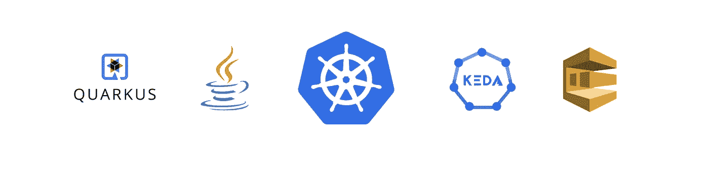
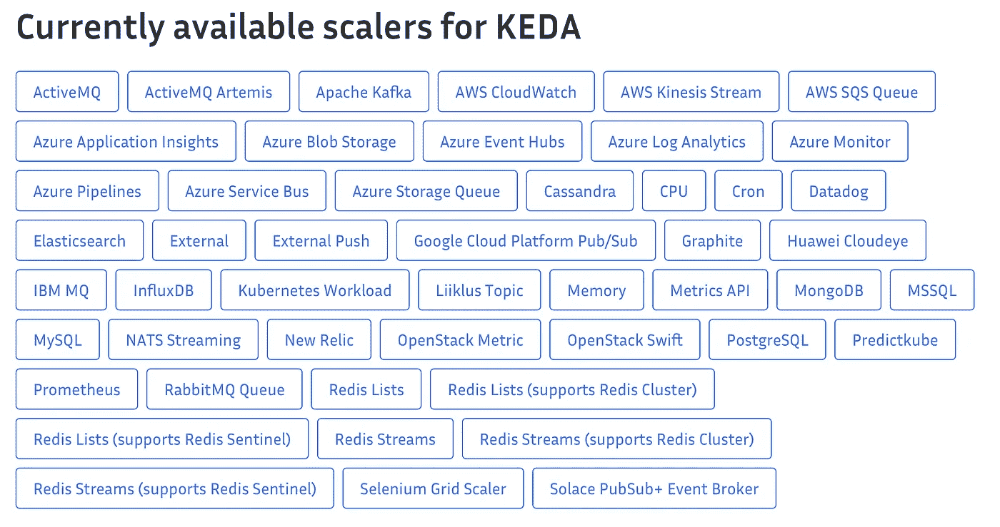
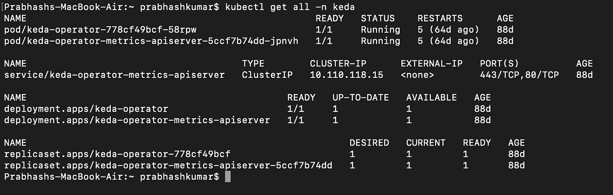
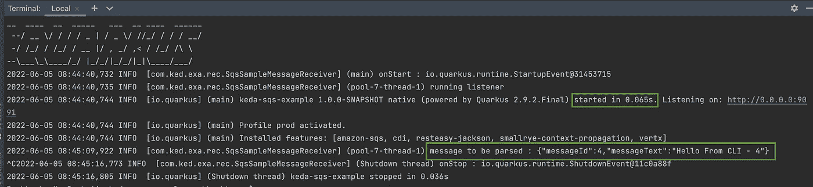
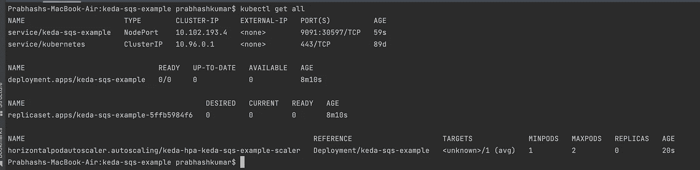
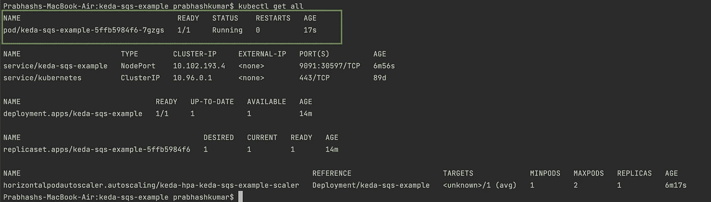
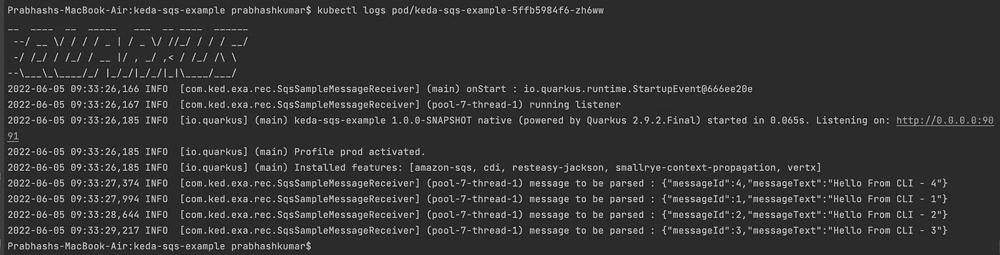

# [KEDA] —使用 KEDA 在 Kubernetes 上实现无服务器|在 K8S 上部署 Java Quarkus 应用程序，并使用事件扩展到 0 到 N

> 原文：<https://blog.devgenius.io/keda-implement-serverless-on-kubernetes-using-keda-deploy-java-quarkus-application-on-k8s-dcbabad71684?source=collection_archive---------6----------------------->



kubernetes KEDA Java quar kus AWS SQS 活动标志

# 什么是无服务器？

无服务器基本上是一种执行模型，通过动态分配资源，您可以执行任何代码，而无需考虑服务器。比如 AWS 有 Lambda，Azure 有 Azure 功能，GCP 有云功能。在这些云提供商中，如果我们使用他们的无服务器功能，我们就不需要照顾服务器。我们只上传我们的构建并基于任何事件执行它。

简而言之，我们可以说，无服务器意味着服务器端逻辑仍由应用程序开发人员编写的应用程序，但与传统架构不同，它运行在无状态计算容器中，这些容器是事件触发的、短暂的(可能只持续一次调用)，并且完全由第三方管理。

Kubernetes ，也称为 K8s，是一个用于自动化部署、扩展和管理容器化应用程序的开源系统。

## HPA—Kubernetes 中的缩放

我们知道 Kuberneter 在豆荚里运行容器。我们通常使用水平机架自动扩展(HPA)来横向扩展和扩展机架数量。然而，HPA 有一个小限制，当我们将“minReplicas”值保持为 0 时，它会抛出错误，指出它必须大于或等于 1。

# KEDA — Kubernetes 事件驱动的自动缩放

KEDA 是一个基于 Kubernetes 的事件驱动自动缩放器。使用 KEDA，您可以根据需要处理的事件数量来扩展 Kubernetes 中的任何容器。

KEDA 是一个单一用途的轻量级组件，可以添加到任何 Kubernetes 集群中。KEDA 使用水平 Pod 自动缩放器来扩展功能，无需覆盖或复制。[点击这里进入官方文档页面。](https://keda.sh/docs/2.6/concepts/)

# 使用 KEDA 的 Kubernetes 上的无服务器

嗯，不完全是无服务器的。它更像是在不使用时将 pod 缩放到 0，并基于事件向外扩展。我们可以根据事件数量扩展到“n”个单元。



KEDA 定标器

# 这个故事的用例

我们将创建一个简单的 quarkus 应用程序，它将无限循环地读取来自 SQS 的消息。我们将处理该消息(只需将其记录在控制台中)。
当队列中没有消息时，我们的 pod 应该伸缩到 0，当队列中有消息时，应该伸缩到 0。
我们在这里使用夸库，因为它的开始时间真的很快，正如我们在这里的上一个故事中看到的[。](https://towardsdev.com/quarkus-develop-and-deploy-cloud-native-java-applications-at-supersonic-speed-be6c28dd4243)

## 先决条件

1.  Java 11+版本
2.  格雷尔还是梅文
3.  码头工人
4.  库伯内特斯
5.  头盔(可选)
6.  消息队列(在本文中，我们将使用 AWS SQS)

## 安装 KEDA

我们将使用 Helm 在我们的 Kuberneter 集群上安装 KEDA。如果你愿意，你也可以使用其他方法，更多细节请点击这里的[官方文档](https://keda.sh/docs/2.6/deploy/)。

1.  添加舵 Repo

> 赫尔姆回购加科达科尔【https://kedacore.github.io/charts 号

2.更新 Helm 报告

> helm repo 更新

3.使用舵图安装 KEDA

> kubectl 创建名称空间 keda
> helm 安装 keda kedacore/keda —名称空间 keda

现在让我们运行以下命令来查看 keda 部署:

> kubectl get all -n keda

我们应该得到这样的结果:



KEDA 在库伯内特斯的部署

## 配置 AWS CLI 和创建 SQS 队列

我们也可以在这个过程中使用 AWS 控制台，只需登录 AWS 帐户，转到 SQS 并创建一个新的标准队列。

首先，我们将按照这里的官方文档[在我们的机器上安装 AWS CLI](https://docs.aws.amazon.com/cli/latest/userguide/getting-started-install.html)。

安装后使用' *aws configure* '命令配置您的凭证。

现在让我们使用下面的命令创建一个队列:

```
QUEUE_URL=`aws2 sqs create-queue --queue-name=ColliderQueue`
echo $QUEUE_URL
```

这将在您的控制台上打印队列 url。

## 用于读取来自 SQS 的消息的 Quarkus 应用程序代码

让我们创建一个简单的 Quarkus 应用程序，并编写从 SQS 读取的基本代码。关于如何开始使用 Quarkus 的更多细节，请阅读这篇文章。

我们将创建一个简单的项目[,依赖于 jackson 和 sqs](https://code.quarkus.io/?g=com.keda.example&a=keda-sqs-example&b=GRADLE&nc=true&e=io.quarkiverse.amazonservices%3Aquarkus-amazon-sqs&e=resteasy-jackson) 。还要加上'*实现' software . Amazon . AWS SDK:URL-connection-client '*'依赖。依赖关系列表应该如下所示:

```
dependencies **{** implementation enforcedPlatform("$**{**quarkusPlatformGroupId**}**:$**{**quarkusPlatformArtifactId**}**:$**{**quarkusPlatformVersion**}**")
    implementation enforcedPlatform("$**{**quarkusPlatformGroupId**}**:quarkus-amazon-services-bom:$**{**quarkusPlatformVersion**}**")
    implementation 'io.quarkus:quarkus-resteasy-jackson'
    implementation 'io.quarkiverse.amazonservices:quarkus-amazon-sqs'
    implementation 'software.amazon.awssdk:url-connection-client'
    implementation 'io.quarkus:quarkus-arc'
    testImplementation 'io.quarkus:quarkus-junit5'
**}**
```

我们将创建一个示例消息模型类:

```
public class MessageModel {

    private int messageId;
    private String messageText;

    public int getMessageId() {
        return messageId;
    }

    public void setMessageId(int messageId) {
        this.messageId = messageId;
    }

    public String getMessageText() {
        return messageText;
    }

    public void setMessageText(String messageText) {
        this.messageText = messageText;
    }
}
```

以及一个简单的代码，用于连续轮询队列中的消息:

```
@ApplicationScoped
public class SqsSampleMessageReceiver implements Runnable {

    Logger log = Logger.*getLogger*(SqsSampleMessageReceiver.class);

    static ObjectReader *MESSAGE_READER* = new ObjectMapper().readerFor(MessageModel.class);

    private final ExecutorService scheduler = Executors.*newSingleThreadExecutor*();

    @Inject
    private SqsClient sqsClient;

    @ConfigProperty(name = "queue.url")
    private String queueUrl;

    void onStart(@Observes StartupEvent ev) {
        log.info("onStart : "+ev);
        scheduler.submit(this);
    }

    void onStop(@Observes ShutdownEvent ev) {
        log.info("onStop : "+ev);
        scheduler.shutdown();
    }

    @Override
    public void run() {
        log.info("running listener");
        while(true) {
            List<Message> messages = sqsClient.receiveMessage(m -> m.maxNumberOfMessages(1).queueUrl(queueUrl)).messages();
            messages.stream().map(s -> {
                try {
                    String messageBody = s.body();
                    MessageModel m = toModel(messageBody);
                    sqsClient.deleteMessage(d -> d.queueUrl(queueUrl).receiptHandle(s.receiptHandle()));
                    return m;
                } catch (JsonProcessingException e) {
                    e.printStackTrace();
                    return null;
                }
            }).collect(Collectors.*toList*());
        }
    }

    private MessageModel toModel(String s) throws JsonProcessingException {
        log.info("message to be parsed : "+s);
        MessageModel  m = *MESSAGE_READER*.readValue(s);
        return m;
    }
}
```

*理想情况下，我们不应该使用无限循环，但为了简单起见，我们将在这里使用它。*

我们应该在我们的 *application.properties* 文件中添加以下配置:

```
quarkus.sqs.aws.region=us-east-1
quarkus.sqs.aws.credentials.type=static
quarkus.sqs.aws.credentials.static-provider.access-key-id=${ACCESSKEYID}
quarkus.sqs.aws.credentials.static-provider.secret-access-key=${ACCESSKEY}

queue.url=${QUEUE}
```

现在，让我们创建一个本地映像。

使用以下命令创建本机版本

```
./gradlew build -Dquarkus.package.type=native -Dquarkus.native.container-build=true
```

使用以下命令创建 docker 映像(用您的映像名称替换 Docker 映像名称)

```
docker build -f src/main/docker/Dockerfile.native -t <<docker_image_name>> .
```

我们可以在 docker 容器上部署此映像，并使用以下命令验证一次(根据您的帐户详细信息更新值):

```
docker run -i --rm -p 8080:8080 -e ACCESSKEYID=<<AWS_ACCESS_KEY_ID>> -e ACCESSKEY=<<AWS_ACCESS_KEY>> -e QUEUE=<<QUEUE_URL>> <<docker_image_name>>
```

现在使用下面的命令将消息发送到您的队列，然后它将由您的应用程序自动处理:

```
aws2 sqs send-message --queue-url <<QUEUE_URL>> --message-body '{"messageId":4,"messageText":"Hello From CLI - 4"}'
```

您的应用程序应该生成如下所示的日志:



Docker 容器应用程序日志

我们可以看到，应用程序启动只花了 65 毫秒，它还记录了我们使用 aws cli 命令发送到队列的消息。

我们应该使用以下命令将该图像推送到我们的 docker 存储库:

```
docker login
docker push <<docker_image_name>>
```

## Kubernetes 上的部署

现在让我们在 Kubernetes 集群上添加部署我们的应用程序。为了在 Kubernetes 上部署我们的应用程序，我们现在将创建以下文件:

1.)deployment.yaml:这个文件将帮助我们创建应用程序的部署。

```
apiVersion: apps/v1
kind: Deployment
metadata:
  creationTimestamp: null
  labels:
    app: keda-sqs-example
  name: keda-sqs-example
spec:
  replicas: 1
  selector:
    matchLabels:
      app: keda-sqs-example
  strategy: {}
  template:
    metadata:
      creationTimestamp: null
      labels:
        app: keda-sqs-example
    spec:
      containers:
      - image: nik0112/keda-sqs-example
        name: keda-sqs-example-jvm
        resources: {}
        env:
        - name: QUEUE
          value: <<QUEUE_NAME>>
        - name: QUEUEHOST
          value: https://queue.amazonaws.com
        - name: ACCESSKEYID
          value: <<AWS_ACCESS_KEY_ID>>
        - name: ACCESSKEY
          value: <<AWS_ACCESS_KEY>>
status: {}
```

2.)service.yaml:这个文件将用于在 K8s 中创建服务层，在这个例子中我们将使用 NodePort。

```
apiVersion: v1
kind: Service
metadata:
  creationTimestamp: null
  labels:
    app: keda-sqs-example
  name: keda-sqs-example
spec:
  ports:
  - name: 8080-8080
    port: 8080
    protocol: TCP
    targetPort: 8080
  selector:
    app: keda-sqs-example
  type: NodePort
status:
  loadBalancer: {}
```

3.)secrets.yaml:我们将使用这个文件来存储我们的应用程序机密(在本例中是 aws 凭证)

```
apiVersion: v1
kind: Secret
metadata:
  name: aws-localstack-secrets
  namespace: default
data:
  AWS_ACCESS_KEY_ID: <<BASE64_ENCODED_AWS_ACCESS_KEY_ID>>
  AWS_SECRET_ACCESS_KEY: <<BASE64_ENCODED_AWS_ACCESS_KEY>>
```

4.)auth.yaml:这是 KEDA 特有的 CRD。我们将使用这个文件在 aws 上使用我们的秘密进行身份验证。

```
apiVersion: keda.sh/v1alpha1
kind: TriggerAuthentication
metadata:
  name: localstack-auth
  namespace: default
spec:
  secretTargetRef:
    - parameter: awsAccessKeyIDname: aws-localstack-secretskey: AWS_ACCESS_KEY_ID- parameter: awsSecretAccessKeyname: aws-localstack-secretskey: AWS_SECRET_ACCESS_KEY
```

5.)scaler.yaml:这也是 KEDA 特有的 CRD。这将用于扩展我们的应用程序。

```
apiVersion: keda.sh/v1alpha1
kind: ScaledObject
metadata:
  name: keda-sqs-example-scaler
  namespace: default
spec:
  scaleTargetRef:
    name: keda-sqs-example
    envSourceContainerName: keda-sqs-example-jvm
  pollingInterval: 30
  cooldownPeriod:  30  *# Default: 300 seconds* minReplicaCount: 0
  maxReplicaCount: 2
  triggers:
    - type: aws-sqs-queue
      metadata:
        queueURL: <<QUEUE_URL>>
        queueLength: "1"  *# Default: "5"* awsRegion: "us-east-1"
        identityOwner: pod
      authenticationRef:
        name: localstack-auth
        kind: TriggerAuthentication
```

我们现在应该使用以下命令在 Kubernetes 集群上部署我们的应用程序(我使用我的本地机器集群，您也可以使用相同的命令):

```
kubectl apply -f deploy/deployment.yamlkubectl apply -f deploy/service.yamlkubectl apply -f deploy/secrets.yamlkubectl apply -f deploy/auth.yamlkubectl apply -f deploy/scaler.yaml
```

请以同样的顺序执行上述命令。现在，让我们使用以下命令来验证我们的部署:

```
kubectl get all
```

您应该得到类似的输出，如下所示:



kubectl 获取全部输出

我们可以看到，我们没有为我们的应用程序运行任何 pods，这是因为我们的队列中没有任何消息，所以它被缩放为 0。
现在，让我们使用之前使用的相同 aws cli 命令发送几条消息:

```
aws2 sqs send-message --queue-url <<QUEUE_URL>> --message-body '{"messageId":1,"messageText":"Hello From CLI - 1"}'aws2 sqs send-message --queue-url <<QUEUE_URL>> --message-body '{"messageId":2,"messageText":"Hello From CLI - 2"}'aws2 sqs send-message --queue-url <<QUEUE_URL>> --message-body '{"messageId":3,"messageText":"Hello From CLI - 3"}'aws2 sqs send-message --queue-url <<QUEUE_URL>> --message-body '{"messageId":4,"messageText":"Hello From CLI - 4"}'
```

现在，当我们运行相同的命令来获取群集的所有详细信息时，我们可以看到应用程序的 1 个 pod 正在运行。一旦消息被处理，它将自动缩放到 0。



kubectl get all —用一个应用程序单元

我们可以使用下面的命令来查看 pod 日志，我们应该验证消息是否被处理。

```
kubectl logs <<pod_name>>
```

它应该看起来像这样:



应用程序日志— kubectl 日志输出

我们可以看到，所有四条消息都已处理，之后窗格自动调整为 0。

我们应该使用以下命令从 Kubernetes 集群中清除部署:

```
kubectl delete -f deploy/scaler.yamlkubectl delete -f deploy/auth.yamlkubectl delete -f deploy/secrets.yamlkubectl delete -f deploy/service.yamlkubectl delete -f deploy/deployment.yaml
```

它将删除我们在本例中创建的所有资源。我们还可以删除 docker 图像和 SQS 队列，我会把这个留给你。

# 结论

我们刚刚在 Kubernetes 上完成了一个 Quarkus 本地应用程序的端到端开发和部署，并使用 KEDA 来根据事件扩展我们的应用程序。此外，当我们不使用应用程序时，我们将其缩放至 0。在我们的软件工程和架构中，这是一个非常有用的特性。我们可以利用这一点，只使用我们实际使用的资源，并根据事件进行扩展/缩小。在某种程度上，我们可以说，我们不需要管理我们的应用程序的基础设施，它是由 KEDA 和 Kubernetes 管理。
我们还可以看到，应用启动时间以毫秒计，因此它对于低延迟系统也很有用。
你可以在这里的[这个 github 仓库里找到这个例子的代码。](https://github.com/kumarprabhashanand/keda-sqs-example)