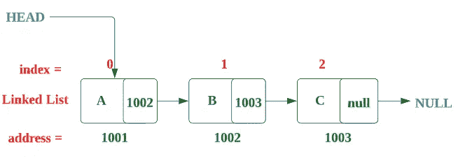
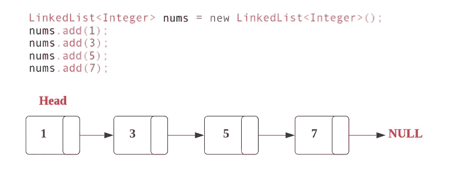
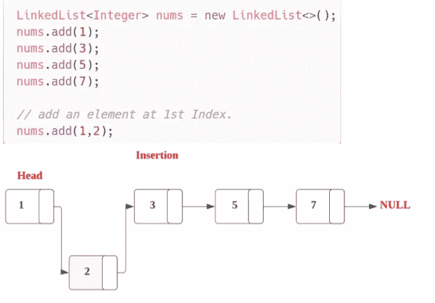
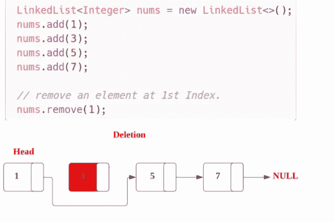
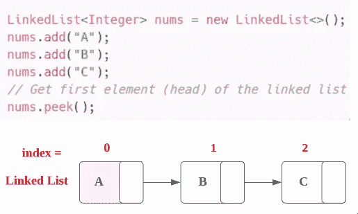
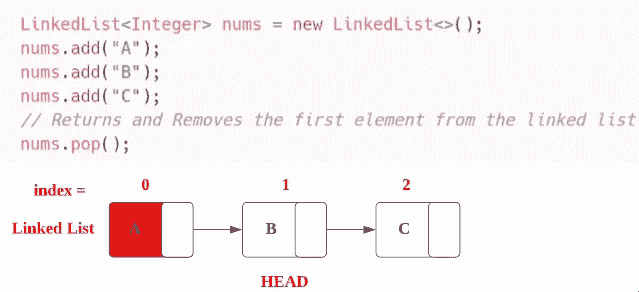
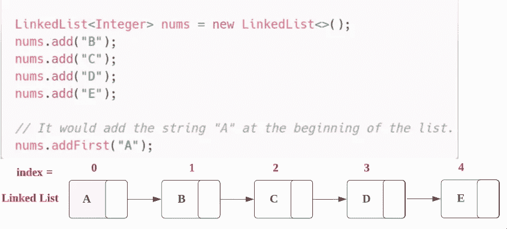
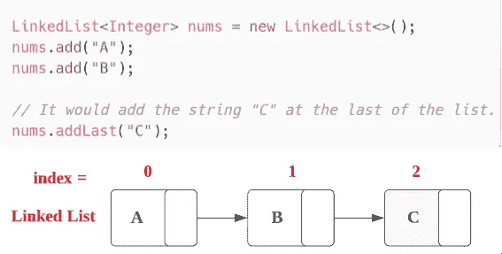

# 在开始 DSA 之前，在链表上做一个基本的记录。

> 原文：<https://blog.devgenius.io/keep-basic-notes-on-linked-list-before-starting-dsa-8ef1d637567b?source=collection_archive---------9----------------------->

照片由[亚伦·伯顿](https://unsplash.com/@aaronburden?utm_source=medium&utm_medium=referral)在 [Unsplash](https://unsplash.com?utm_source=medium&utm_medium=referral) 上拍摄

这个基本的注意事项，在开始 LeetCodes 或任何 DSA 面试之前，你应该保留一个**链表**，

# 链表:→

链表是一种常见的数据结构，由**节点链**组成。每个节点包含一个值和一个指向链中下一个节点的指针。

这里**头指针**指向**第一个节点**，列表的**最后一个元素**指向 **null** 。

> ***向链表中声明并添加一个元素:→***

注意 **add()** 和 **offer()** ，做同样的任务(添加一个元素)。
当元素不能添加到集合中时，`add`方法抛出异常，而`offer`不会。

> ***访问链表:→***

> ***插入链表:→***

链表可以**动态增加/减少**的大小。

从链表中插入和删除**很容易，因为不像数组，我们只需要改变前一个元素的*指针和下一个元素的*来插入或删除一个元素。**

> ***链表删除:→***

它从列表中移除出现在指定索引处的项。

> ***获取链表的第一个元素:→***

→ **peek()** →返回链表的第一个元素(head)

> ***获取第一个元素并从链表中移除该元素:→***

→ **pop()** →返回 ***第一个元素*******从链表中删除*** *该元素**

**

> ****链表中的其他方法:→****

***→void add first(Object item)**:在列表的第一个位置添加项目(或元素)。*

**

*→ **void addLast(对象项)**:在列表末尾插入指定项。*

**

***→ contains():** 检查 LinkedList 是否包含元素*

***→ indexOf():** 返回元素第一次出现的索引*

***→ lastIndexOf():** 返回元素最后一次出现的索引*

***→ clear():** 删除 LinkedList 的所有元素*

***→ iterator():** 返回迭代 LinkedList 的迭代器*

> ****弊端:→****

1.  *要访问链表中的任何元素，我们必须从第一个节点(头节点)开始按顺序访问元素。*
2.  *列表的每个元素都需要额外的内存空间来存放指针。*

> ****时间复杂度:→****

*假设一个链表的大小是 **N** 。*

*   ***访问时间:** **O(1)***
*   ***插入时间:O(1)***
*   ***删除时间:O(1)***

> ****空间复杂度:→****

*它直接依赖于元素的数量，所以它是 O(n)。*

*我将发布同样的关于一个 [**数组**](https://medium.com/dev-genius/basic-notes-you-should-keep-about-an-array-before-starting-dsa-3267b37dac9b) ，**集合**，**散列表** …所以请关注我以获得关于这些的通知。*

*感谢你阅读这篇文章，❤*

*如果我做错了什么？让我在评论中。我很想进步。*

*拍手声👏如果这篇文章对你有帮助。*