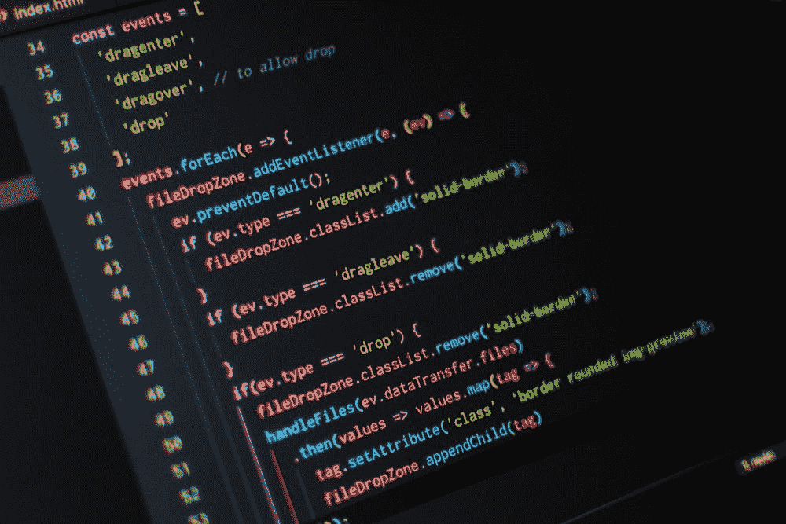

# 用干净的代码保持它的干净

> 原文：<https://blog.devgenius.io/keep-it-clean-with-clean-code-39146ed16f05?source=collection_archive---------17----------------------->

如何让其他程序员喜欢你和你的代码

潘卡杰·帕特尔在 [Unsplash](https://unsplash.com/) 上的照片

所以…这整个干净代码的想法。我在大学学习期间从未遇到过它。当我开始实习时，我才真正接触到“干净的代码”这个术语……(查看我的“获得软件工程实习机会——实际的做法”文章:[https://medium . com/dev-genius/Securing-a-Software-Engineering-interstitution-the-actual-way-to-do-it-e 81 AEF 9c 33 c 5](https://medium.com/dev-genius/securing-a-software-engineering-internship-the-actual-way-to-do-it-e81aef9c33c5))。

# 对于一个独立开发者来说

照片由 [Max Duzij](https://unsplash.com/@max_duz) 在 [Unsplash](https://unsplash.com/) 上拍摄

当你独自工作时，创建一个很酷的游戏或开发一个你认为每个人都会喜欢或觉得有用的产品时，最初干净的代码可能不是你首先想到的。如果你像我一样，如果我正在创建一些新的游戏或应用程序，我想尽快把它们组合在一起，我倾向于一起破解代码。我发现这很有趣，因为我可以专注于应用程序的内容和功能，而不是编写更干净、更容易被其他开发人员阅读的代码。我提到了这一点，但是我总是试图用可理解的命名约定和重构代码来命名我的变量、函数等……有时如果我觉得有点太乱了……这是一个判断，因为我知道我是项目中唯一的开发人员。

# 对于团队中的开发人员来说

[黑客资本](https://unsplash.com/@hackcapital)在 [Unsplash](https://unsplash.com/) 上的照片

也就是说，很明显，如果你和其他人在一个软件项目上合作，你必须有一种方式让其他开发者阅读和理解你的代码，而不会对你生气。这就是干净代码发挥作用的地方。这对于大型团队和公司来说尤其重要，他们在那里创建防故障软件，并且很可能有几十个程序员在工作…特别是对于长期项目。

想象一下，如果每个开发人员只是一起“黑”出一个解决方案…当一个新的开发人员第一次来阅读代码时，这很可能是灾难性的。这将是非常昂贵的，因为其他开发人员将花费更多的时间试图理解代码(将不得不询问编写代码的开发人员……他们可能已经不在团队中了),并且在不稳定的代码基础上构建的软件最终会有很多错误。软件也可能很难测试，因此，在某些场景中可能失败的代码之上构建是非常危险的。根据项目的规模、预算、资源和时间表，部分软件可能需要重构…甚至整个代码库！

好了…论文写够了。

# 干净代码—定义

嗯……干净代码的定义似乎有很多种。本文的主要观点是干净的代码是这样的代码:

*   **是可读的**(其他程序员可以读取和修改)
*   **是可变的**(即高度内聚和松散耦合…不依赖于其他地方的代码，并且在改变时不会破坏其他代码)
*   **是自文档化的**(不需要注释来描述它在做什么)
*   **通过测试且易于测试(由于单一责任原则)**
*   **包括准确描述代码功能的变量、函数等名称**
*   **减少代码复制的需要**

# 干净的代码—优点

到目前为止，您可能已经很清楚为什么要编写干净的代码了。编写干净代码的一些原因可能包括:

*   **企业的长期成本节约** …当添加额外功能或修复代码库的错误时
*   **其他开发者**(没有写代码的)可以**更快更有效率**因为代码更容易理解
*   测试更简单，因此**更高的测试覆盖率**更容易实现，并且显示这可以**给业务中的其他人(BA 的、PM 的等)**信心，即软件产品/服务是**故障安全的并且更稳定**
*   **开发团队内部的协调**因为大多数开发人员都知道某些设计模式和编写干净代码的方法，所以可以编写和理解实现某些软件模式的一致代码

# 干净的代码——缺点

编写干净代码的成本可能很高的一些可能原因包括:

*   将一个概念证明/最小可行产品“拼凑”在一起(特别是**有严格的时间限制**并且团队中可能有更多初级开发人员)**可能需要更长的时间**并且**可能不会展示潜在的功能或卖点**(非开发人员不一定关心代码结构)
*   初级开发人员的初始培训理解干净的代码原则(尽管替代方案可能是意大利面条式的编码解决方案，因此从长远来看成本会更高)
*   **潜在难以向“企业”销售**解释资源被分配用于编写可扩展、安全和一致的软件系统**而不是功能实现和错误修复**

# 摘要

在我看来，干净的代码原则是值得学习的，尤其是如果你打算为一家你不是唯一的开发者的公司工作。即使你是，也很有可能会雇佣更多的开发人员。

另一方面，如果你正在做一个副业项目，并且想要快速地创建/“破解”一个很酷的应用程序等等，也许应该把注意力放在应用程序上，而不是花太多时间在干净的代码上。

> 主要要记住的是，这是我的看法/经验……毕竟，显然传说中的埃隆·马斯克的 Zip2 代码被他雇佣的计算机科学家和软件工程师视为“毛球”和“单片”代码。

***想想你的开发者同事，保持你的代码干净！***

# 我希望你觉得这是有用的或有点有趣的阅读…

***如果你喜欢这个内容，请随时加入我的邮件列表:***https://www.subscribepage.com/x9b5l0

# 祝您愉快！

照片由[豪伊·R](https://unsplash.com/@howier)在 [Unsplash](https://unsplash.com/) 上拍摄