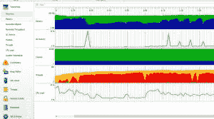
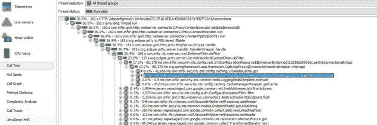
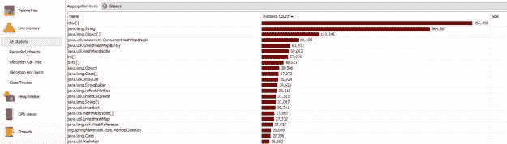

# 关于使用 JProfiler 的关键概念

> 原文：<https://blog.devgenius.io/key-concepts-about-using-jprofiler-d1e70dc16ac7?source=collection_archive---------21----------------------->

克里斯蒂娜@ wocintechchat.com 在 [Unsplash](https://unsplash.com?utm_source=medium&utm_medium=referral) 上的照片

JProfiler 是**一个分析 JVM 内部情况的工具**。E-J 技术公司开发了这个工具。最常见的用法是 CPU 分析或内存分析。在这篇文章中，我想详细介绍一些关于使用 JProfiler 的关键概念。

每个软件开发人员在提高企业应用程序的性能时，都必须使用 JProfiler 或类似的工具 VisualVM 或 JDK 捆绑工具。之前，我已经展示了[如何使用 JProfiler 进行性能测试](https://betterjavacode.com/2018/12/29/jprofiler-for-performance-testing/)。

JProfiler 专注于三个不同的主题，可以帮助开发人员分析他们的应用程序。

*   **方法调用** —这显示了您的应用程序正在用方法调用做什么，以及哪里可以提高性能。
*   **线程和锁** —要发现任何多线程问题，您应该检查 JProfiler 提供的线程和锁分析。
*   **分配** —您可以分析堆上的对象、引用链和垃圾收集。因此，它有助于修复内存泄漏问题。

JProfiler 还提供了数据库分析，可以帮助理解数据库查询是否存在任何性能问题。我不会在这篇文章中讨论这个问题。

# JProfiler 设置

使用 JProfiler 时，有两种方法可以收集数据。

*   **采样** —这不一定能提供所收集数据的准确性。这个特性不提供方法级的统计。使用这个特性的好处是，在运行 JProfiler 时，系统性能不会受到影响。
*   **检测** —这种模式收集全部数据，但也会严重影响应用程序的性能。优点是数据的准确性。如果您正在进行性能分析，这应该是您的默认选择，尽管有缺点，它提供了大量有助于分析性能的数据。

# 如何在正在运行的应用程序上运行 JProfiler

JProfiler 提供了两种模式来启动对应用程序的分析。如果在本地模式下运行，那么在启动 JProfiler 时必须选择数据收集模式。在这种模式下，应用程序和 JProfiler 运行在同一台机器上。通常不推荐。

在远程模式下，您将在一台远程机器上启动 JProfiler 代理，这台机器可能就是运行应用程序的机器。从您的本地 JProfiler 安装，您将连接到 JProfiler 代理。为此，您需要远程机器的 IP 地址以及 JProfiler 代理运行的端口。简而言之，您正在将 JProfiler GUI 连接到一个远程 JProfiler 代理，该代理正在分析您的应用程序。

# 如何使用 JProfiler 分析应用程序性能

如果您正在应用程序上运行性能测试，那么当性能测试停止时，您将停止分析。一旦概要分析完成，JProfiler GUI 应该提供概要分析数据的快照。

在这个快照中，我们将有用于性能分析的数据生成的对象数、方法调用、垃圾收集、内存泄漏。现在，我们将从 JProfiler 快照数据中了解这些关键概念。

如下所示的 Telemetries 概览页面将让您了解垃圾收集活动、内存、线程、类和 CPU 负载等指标。

# CPU 视图

CPU 视图显示应用程序中每个方法的执行次数和调用关系。在 CPU 视图中，您可以找到您怀疑可能导致性能问题的任何特定方法。这是分析您的应用程序中的罪魁祸首的绝佳视角。

# 调用树

调用树显示了应用程序执行期间所有方法调用的分层视图。JProfiler 有助于根据方法的总执行时间对它们进行排序。

如上所示，我们可以看到从 Redis 缓存中读取数据的方法花费了最多的时间。

# 热点

在 CPU 视图的同一个视图中，有一个热点选项。这个视图可以根据各种因素对方法进行排序，比如单个执行时间、总执行时间、平均执行时间和调用次数。

# 实时记忆

实时内存视图显示内存分配。这是我们可以发现是否有任何内存泄漏的地方。

# 所有对象

所有对象视图将显示在应用程序执行期间创建的所有对象以及这些对象的大小。

# 结论

在这篇文章中，我展示了如何使用 JProfiler 进行性能分析的一些关键概念。如果使用有效，JProfiler 是一个强大的工具。JProfiler 中有很多特性，在使用这个工具时会让人不知所措。希望这篇帖子对你使用 JProfiler 分析应用有所帮助。

# 参考

1.  JProfiler 简介— [JProfiler 简介](https://www.ej-technologies.com/resources/jprofiler/help/doc/main/introduction.html?spm=a2c65.11461447.0.0.4e294d65AgyslJ#jprofiler.introduction)

*原载于 2020 年 6 月 2 日*[*【https://betterjavacode.com】*](https://betterjavacode.com/jprofiler/key-concepts-about-using-jprofiler)*。*