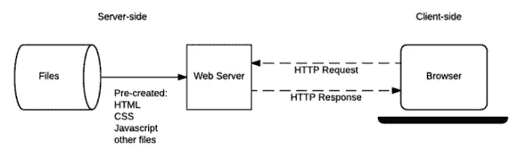
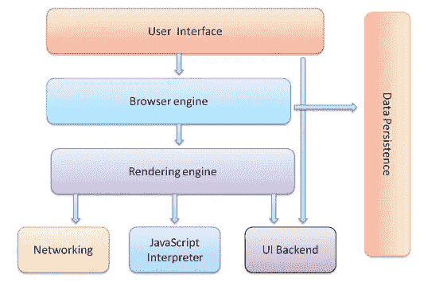
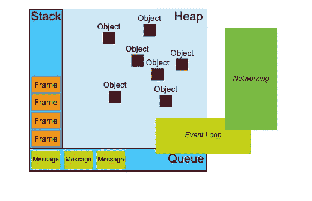
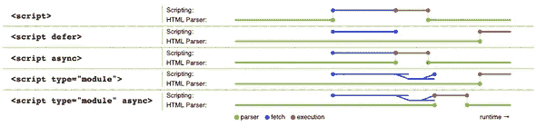
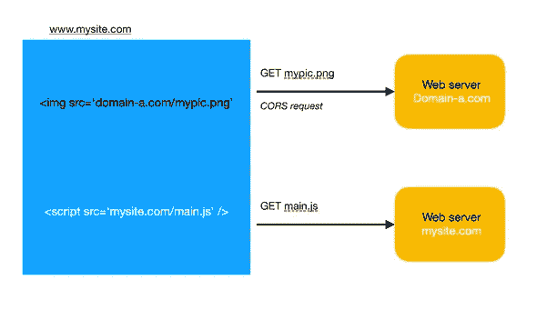

# 影响网站性能的关键因素

> 原文：<https://blog.devgenius.io/key-factors-to-impact-performance-of-your-site-16d0b9f302dc?source=collection_archive---------10----------------------->

性能是 web 开发的重要方面，尤其是对于电子商务网站。为了拥有一个高性能的网站，我们需要在服务器端和客户端优化应用程序的许多部分。在这篇文章中，我将主要从客户端分析影响性能的因素，即浏览器是如何工作的，以及我们可以做些什么来提高网站的性能。

# 1.一般流程



*图 1:网络概况*

正如我们在图片中看到的，当浏览器需要显示一个网站时，首先它要下载资源(通常是 html 文件，但也可以是 pdf，图片，..然后在客户端显示内容。简单 HTTP 请求和响应的示例

```
//request
Request URL: https://thangledev.com/
Request Method: GET
Status Code: 200
Referrer Policy: no-referrer-when-downgrade//response
age: 2
cache-control: public, max-age=0, must-revalidate
content-encoding: br
content-type: text/html; charset=UTF-8
date: Sat, 30 May 2020 05:51:58 GMT
etag: "916afbcb0b6e36fc7356e932e6696d58-ssl-df"
...
```

浏览器可以通过`content-type`头识别 HTTP 响应的类型。让我们来看看当浏览器从服务器得到一个 HTML 页面响应时，浏览器内部发生了什么。

# 2.浏览器组件

一般来说，当浏览器从网络响应中获取内容时，它们会将其渲染并显示在计算机屏幕上。要详细了解渲染过程，我们需要知道浏览器是由什么组成的，如下图所示:



*图 2:浏览器组件*

**用户界面:**它的主要目的是显示一个站点的内容，同时也包含了帮助用户与浏览器交互的所有功能，例如导航栏、输入 URL、管理历史等。

**浏览器引擎、UI 后端和渲染引擎:**负责解析 html、样式表并渲染到用户界面层。

**Javascript 解释器:**解析并执行 Javascript (JS)代码。

**联网:**发送 HTTP 请求，获取网络响应。

**数据持久性:**是浏览器存储 cookies、本地存储、会话存储等的地方

在这些组件中，浏览器引擎和 Javascript 解释器共享相同的线程并遵循同步执行模型，这意味着当浏览器解析 HTML 时，它不能执行脚本，反之亦然。然而，网络组件通常有 2-6 个线程(取决于浏览器)，这就是为什么它可以并行发送 2-6 个 HTTP 请求。简而言之，**除了发送 HTTP 请求**的时候，浏览器只运行同步动作。我们将详细探索 Javascript 解释器，以理解 JS 运行时如何处理异步动作。

# 3.Javascript 解释器



*图 3: Javascript 解释器*

Javascript 解释器，或者可以称为 Javascript 运行时，有三个主要组件:堆栈、堆和队列。事件循环在浏览器的主线程中运行。它不断检查队列中的消息，并在堆栈为空时将它们放入堆栈。堆就像是 Javascript 运行时的内存，里面存储了所有的运行时上下文，比如变量、函数、全局`this`对象……等等。堆栈是 Javascript 代码被解析和执行的地方，如果脚本中的一个函数执行，然后运行另一个函数，一个新的帧将被创建并插入到堆栈中，以便 JS 运行时可以跟踪执行的顺序。

在浏览器环境中，Javascript 运行时连接到网络组件。在获得 HTTP 响应后，网络组件插入回调来处理队列中的响应。因为网络组件运行在不同的线程上，所以它不会在发送网络请求时阻止 JS 运行时执行脚本。事件循环和队列是 Javascript 能够执行异步动作的主要原因。

# 4.渲染流程


*图 4:渲染流程*

正如我们在上面的图片中看到的，在将 html 内容绘制到用户屏幕之前，浏览器在这个过程中构建了一个`DOM`树和一个`render`树。它们是 HTML 标签的数据表示。呈现是一个递增的过程，在这个过程中，浏览器试图尽快显示内容。HTML 文档通常被分解成 8Kb 的多个块，然后传递给渲染引擎。

第一步，解析 HTML 和 css 样式表以构建 DOM 树。注意，在这个步骤中，如果解析器遇到样式表、图像或 JS 文件的外部链接，它们将停止并等待下载、解析和运行(对于 JS 文件)，然后继续解析 HTML。如果需要下载和解析资源，浏览器会被阻止的原因是渲染引擎与 JS 解释器共享同一个线程。

在第一步解析 HTML 和样式表之后，结果是一个 DOM 树和样式上下文树。在第二步中，基于 DOM 树和样式上下文构建另一棵树`render tree`。为了让程序员更容易看到渲染树，我们可以在`render tree`中看到以下元素(`RenderObject`)的代码:

```
class RenderObject{
  virtual void layout();
  virtual void paint(PaintInfo);
  virtual void rect repaintRect();
  Node* node;  //the DOM node
  RenderStyle* style;  // the computed style
  RenderLayer* containingLayer; //the containing z-index layer
}
```

`DOM`节点和`RenderObject`不是一一对应的关系，一个`DOM`节点可以被多个`RenderObject`引用。渲染树构建完成后，文档状态将完成，浏览器将发出`DomContentLoaded`事件。此时，html 中任何带有`defer`属性的脚本标签都将开始下载并执行。

在第三步中，引擎将为渲染树的每个节点计算精确的坐标。之后，在最后一步，UI 后端组件绘制渲染树。请注意，这个绘制过程是增量的，通常浏览器会保留一个需要绘制的 UI 更改列表，然后在某一点上，它会一次性刷新所有更改以提高性能。树中的每个节点都有一个`dirty`布尔标志。该标志的目的是跟踪哪些节点更新了它的样式，因此浏览器可以只重新计算相关的节点，而不是整个树。

# 5.性能考虑

浏览器的性能主要取决于它们下载和解析资源(html、javascript、样式表、图像等)的速度。第一条经验法则是保持资源的大小尽可能小，并考虑使用服务器缓存或 CDN(内容交付网络)来存储静态资源。此外，服务器通常会压缩 javascript(如 gzip 文件)或图像，以减少需要通过网络传输的文件大小。

在解析过程中，如果浏览器遇到脚本标签、图像或样式表，它将停止解析并开始下载外部资源，然后执行它们(如果是 Javascript)。因为渲染引擎和 Javascript 运行时共享同一个线程，所以如果 Javascript 代码正在运行，浏览器就不能做任何其他事情。下面我们来看看一些提高网站性能的常用技巧:

*   **Javascript** :将 JS 文件放在 html 页面的末尾，防止阻塞浏览器解析页面，也避免脚本中的长操作方法。尝试将长操作方法分解成更小的执行块。这样可以避免阻止最终用户的用户界面。如果应用程序需要在 JS 中运行繁重的计算任务，您可以将它们导出到运行在不同线程上的 web workers。

当脚本像`offsetHeight`一样访问样式信息时，可以触发浏览器重绘 DOM 和回流文档，因为浏览器需要为脚本提供准确的样式信息，所以需要刷新所有对 DOM 的挂起更改。因此，如果没有必要，尽量避免访问样式信息。

在单页应用程序(SPA)中，JS 脚本控制了渲染文档的大部分工作，但是为了提高第一页加载的感知速度，您可以考虑对页面的关键部分(折叠上方)使用服务器端渲染。因为在第一次页面加载时，页面不需要加载所有的资源，它只需要加载足够的资源来呈现页面的关键部分，这样用户就可以开始与页面进行交互。例如，如果你降落到 agoda.com，你可以看到搜索框出现得非常快。


*图 5: Agoda Home*

在第一次页面加载时，页面只加载足够的资源来呈现搜索框，当用户开始搜索时，它将加载其余的资源。

*   **样式表**:将样式表放在 HTML 文档的头部，允许浏览器优先下载。对于样式表，将它们放在 HTML 的末尾实际上会损害网站的感知速度，因为浏览器需要样式信息来绘制 DOM 树。解析完所有内容后，如果样式改变，将导致整个页面重新绘制。

这条规则也适用于与样式信息交互的脚本。当我们计算元素的新样式时，避免多次访问和更新 DOM，而是批量应用更改，这样可以帮助浏览器减少重新绘制文档所需的次数。例如:

```
var mydiv = document.getElementById('mydiv');
myelement.width = '100px'; // browser repaint
myelement.height = '100px'; // browser repaint
myelement.style.margin = '10px'; // browser repaint
```

上面的代码将导致浏览器重画 div 元素 3 次，相反，我们可以如下应用批量更改

```
var mydiv = document.getElementById('mydiv');
const newStyle = {...mydiv.style};
newStyle.width = '100px'; 
newStyle.height = '100px'; 
newStyle.margin = '10px'; mydiv.style = newStyle; // browser repaint
```

代码创建了`newStyle`对象，它是从 DOM 文档中分离出来的。我们可以单独更新`newStyle`对象，然后只应用一次更改。类似地，对于操作 DOM，如果我们需要动态地创建 DOM 元素，比如插入`<table>`，创建新的`<div>`…等等，最好在一个新的对象中计算所有的变化，然后最后将它附加到浏览器文档中。

*   **Async 和 defer** :使用`async`和`defer`属性指定每个 Javascript 文件的优先级。当浏览器看到带有`async`属性的脚本时，它会将脚本发送到另一个线程下载，下载完成后在主线程中解析。使用`defer`属性，脚本将在 DOM 树解析完成后下载。您可以在下图中看到订单的更多细节:



*图 6:脚本解析顺序*

如您所见，`async`和`defer`脚本是在不同的线程中下载的。`async`和`defer`的区别在于`async`脚本下载完成后立即执行，而`defer`脚本是在浏览器空闲状态下执行。

脚本标签也支持使用`type = module`加载模块。具有该属性的所有脚本都作为`defer`脚本加载，如果我们希望它们立即执行，这些脚本需要具有类似`<script type="module" async>`的`async`属性

*   **延迟加载图像**:如果操作正确，图像加载是一种简单的性能提升。众所周知，当解析包含图片的 HTML 时，浏览器会被阻塞，等待图片下载。缓解这个问题常用技术是采用某种惰性加载机制。为加载图像进行优化是如此重要，以至于现在浏览器开始通过使用`lazy`属性来支持本地延迟加载:

```

```

对于不支持它的旧浏览器，我们可以使用 Javascript 库来延迟加载图像。延迟加载图像的主要思想是当图像不在用户可以看到的当前视口中时，它们不需要被下载和渲染。让我们看看如何在 React 组件中实现`LazyImage`的简单示例

```
import React from "react";
import Observer from "react-intersection-observer";// simple version of LazyImage
const LazyImage = ({ url }) => { const [isInView, setIsInView] = React.useState(false);
    return (<div style={{width: "100px", height: "100px" }}> 
        <Observer
            rootMargin="50px 0px"
            threshold={0.01}
            onChange={inView => setIsInView(inView)}
            >
            {isInView ?  : null}
        </Observer>
    </div>); // TODO: if the image is already loaded, the component doesn't need to return null
}
```

在简单版本的`LazyImage`组件中，我们有一个用于呈现图像的占位符，当图像不在视图中时，该组件将不呈现任何内容。在组件内部，当`inView`状态改变时，它使用`Observer`来触发回调。请注意，`LazyImage`组件没有完整的实现，作为一个练习，请尝试思考如何完成它。如果您不使用 React，您可以使用浏览器中的本机`Intersection Observer API`并为您的站点实现一个`Lazy`加载器。

*   **链接预取，预加载** : Browses 支持`prefetch`和`preload`资源，如 JS 和 css 文件。这些属性有助于浏览器正确区分资源加载的优先级。`preload`用于当前页面绝对需要某些资源的时候。当使用这个属性时，浏览器将立即在不同的线程中下载资源。另一方面，`prefetch`用于指示在将来的导航中可能需要一些资源，因此浏览器可以在空闲时间加载它们。这些属性的用法示例如下:

```
<head>
  <meta charset="utf-8">
  <title>JS and CSS preload example</title> <link rel="preload" href="style.css" as="style">
  <link rel="preload" href="main.js" as="script"> <link rel="stylesheet" href="style.css">
</head><body>
  <h1>my article</h1>
  <canvas></canvas> <script src="main.js" defer></script>
</body>
```

在这个例子中，样式和 JS 文件被放在`preload`链接下，让浏览器以高优先级下载它们，而不会阻塞对文档的解析。然后，当解析器实际遇到样式表和脚本标记时，它已经有了继续工作的内容，因此消除了浏览器加载资源的等待时间。

*   **JS 捆绑拆分和动态导入:**在现代 SPA 或渐进式 web apps 中，它们非常依赖 JS 代码，这使得这些 app 的 JS 文件往往非常大。一般来说，您应该将 JS 文件分割成更小的块，以减少第一次加载时的资源大小，并允许浏览器有效地缓存不同的块。然而，手动应用像`async`、`defer`、`preload`、`prefetch`这样的属性会让开发人员非常头疼。Webpack 是一个很好的工具，可以将 JS 包分割成多个文件。根据用户的导航，浏览器可以只加载必要的 JS 代码。
*   **缓存控制**:这是 HTTP 请求里面的一个头，可以帮助浏览器决定是否缓存 HTTP 响应。在文章的开始，我们看到了在响应头中使用`Cache-Control`的例子

```
cache-control: public, max-age=0, must-revalidate
content-encoding: br
content-type: text/html; charset=UTF-8
date: Sat, 30 May 2020 05:51:58 GMT
etag: "916afbcb0b6e36fc7356e932e6696d58-ssl-df"
```

`Cache-Control`通常与`etag`一起使用来验证陈旧资源。

*   **Reduce cookie**:HTTP 请求的本质是无状态的。因此，为了维护应用程序状态，网站通常使用 cookie 存储信息，浏览器可以通过 HTTP 请求将 cookie 发送回服务器。服务器为浏览器设置 cookies 的示例:

```
HTTP/2.0 200 OK
Content-Type: text/html
Set-Cookie: userId=1dfe3
Set-Cookie: visitCount=10
```

通常，JS 可以访问和操作 cookies，如下所示:

```
document.cookie = "userId=1dfe3"; 
document.cookie = "visitCount=10; 
console.log(document.cookie); // output: "userId=1dfe3; visitCount=10"
```

HTTP 头中包含大量 cookies 会消耗更多的网络带宽，并增加 HTTP 请求和响应的延迟。这不仅损害了性能，而且增加了安全风险，因为 cookies 非常容易受到 XSS 攻击。因此，你应该在你的网站上尽量少使用 cookies。

*   **使用简单的 CORS 请求**:

在大型应用程序中，资源通常托管在与网站域不同的另一个域中。要在这些情况下下载文件，浏览器必须发送 CORS 请求(跨域请求)。CORS 请求的示例场景如下:



*图 7: CORS 的请求*

一个网络服务器位于域名`www.mysite.com`，`mypic.png`位于`domain-a.com`。在这种情况下，浏览器需要向`domain-a.com`发出 CORS 请求来获取`mypic.png`。对于在 CORS 场景下对静态资源的请求，确保通过不使用`XMLHttpRequest`中的头`withCredentials`来排除 cookies，以减小请求的大小

此外，对于 CORS，考虑只使用`simple`请求，而不使用`preflighted`请求。`preflighted`请求花费 2 次往返请求来获得服务器的响应，因为首先它需要发送`OPTIONS`请求来了解服务器可以支持什么。使用`simple`请求可以节省一些网络流量。

# 6.摘要

在本文中，我们主要分析 web 应用程序客户端的性能。网站的性能取决于许多因素，但在大多数情况下，调整加载资源的过程在调整 web 应用程序中起着关键作用。一个好的做法是持续监控您的站点的性能，并确定哪些区域会导致最大的问题。例如，如果您没有研究过 Javascript 或图像加载优化，不建议从 CORS 请求开始性能分析。

## 图像参考

*   [图 1:网络概况](https://developer.mozilla.org/en-US/docs/Learn/Server-side/First_steps/Client-Server_overview)
*   [图 2，4:浏览器组件，渲染流程](https://www.html5rocks.com/en/tutorials/internals/howbrowserswork/)
*   [图 6:脚本解析顺序](https://v8.dev/features/modules)

**进一步阅读**

*   [浏览器中的 HTTP](https://developer.mozilla.org/en-US/docs/Web/HTTP)
*   浏览器如何工作
*   [V8 模块](https://v8.dev/features/modules)
*   [预压内容](https://developer.mozilla.org/en-US/docs/Web/HTML/Preloading_content)
*   [Javascript 事件循环](https://developer.mozilla.org/en-US/docs/Web/JavaScript/EventLoop)
*   [懒装指南](https://developers.google.com/web/fundamentals/performance/lazy-loading-guidance/images-and-video)
*   [交叉点观察器 API](https://developer.mozilla.org/en-US/docs/Web/API/Intersection_Observer_API)
*   [预加载预取优先级](https://medium.com/reloading/preload-prefetch-and-priorities-in-chrome-776165961bbf)
*   [缓存控制](https://developer.mozilla.org/en-US/docs/Web/HTTP/Headers/Cache-Control)
*   [网络包](https://webpack.js.org/)
*   [CORS](https://developer.mozilla.org/en-US/docs/Web/HTTP/CORS)