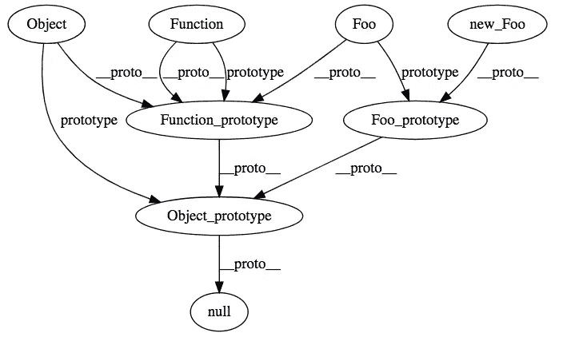

# 方法、程序和功能的关键复杂性

> 原文：<https://blog.devgenius.io/key-intricacies-every-good-developer-knows-about-methods-procedures-and-functions-e4311136d039?source=collection_archive---------9----------------------->

## 每个开发人员都使用但不太了解的东西


照片由[李·坎贝尔](https://www.pexels.com/@lee-campbell-18167?utm_content=attributionCopyText&utm_medium=referral&utm_source=pexels)从 [Pexels](https://www.pexels.com/photo/imac-turend-on-89724/?utm_content=attributionCopyText&utm_medium=referral&utm_source=pexels) 拍摄

你使用方法。功能。程序。很多。

但是，你不知道区别。你想知道更多。

开发人员用 Java 调用方法。低级语言中的过程。脚本语言中的函数。

编程语言不做区分。函数、过程和方法之间没有明确的界限。

我的想法会激发你的探索。追寻的追求。追求功能的差异和细微差别。

# 功能

函数是子程序。返回结果的子例程。

优秀的开发人员编写纯函数，因为它们没有副作用。相同的输入永远得到相同的结果。这就是纯函数的定义。

在 Java 中，有类方法和对象方法。用类方法我们模仿函数。他们没有收到`this`，实例不存在，因此`this`不可用。

与实例分离，并对类进行操作。用`static`关键字来声明类方法。我们不需要类实例。

## Javascript 函数

Javascript 函数则不同。很特别。那个`new Function()`是怎么回事？

我们在 Javascript 中有一个基于原型的继承。不要与其他形式的继承相混淆。这就是为什么调用`new Function()`时会调用`prototype`构造函数的原因。

原型继承如何工作的详细图表。忽略`_proto_`它已被弃用。当我们调用`new Foo`时，我们调用`Foo.prototype`的构造函数。请访问图片下方的链接，了解有关此行为的更多详细信息。



[JS 函数之谜](https://softwareengineering.stackexchange.com/questions/369631/unable-to-solve-mystery-of-functions-in-javascript)

我在答案中举了一个具体的例子。

```
function Car(){ }
var honda = new Car();
print(honda instanceof Car);
print(honda.constructor == Car);
```

每张照片会印出什么？`honda`是 Car 的一个实例，因为它的原型链上有`Car.prototype`。本田的构造器是`Car`，是`Car.prototype`对象的构造器。

我知道这是纠缠不清的，因此 JS 函数有单独的部分。他们很特别。不同的品种，没有人喜欢不同的。然而，正如我们所知，它们为整个 UI 空间提供了动力。

# 程序

过程是子程序，但有副作用。过程不返回任何值。

参见 printf 的[手册。](https://linux.die.net/man/1/printf)

什么是副作用？打印到屏幕上被认为是一种副作用。我们了解函数中的屏幕吗？不，这是副作用。

看着帕斯卡，有点。感谢上帝，没有商业用途。过程没有返回值，而函数有。

在网上搜了一下，发现了这个评论。*在 Fortran 中，函数返回值，子程序返回多个值。*因此，这可能不是程序的正确定义。

即便如此，你也可以在编程行话中找到过程。了解一点他们也无妨。

# 方法

`foo.myFooMethod`

对一个对象调用的函数(`foo`)是一个方法(`myFooMethod`)。`this`被传递给函数，因为它是被调用的对象(`foo`)。

不要被误解为闭包。闭包考虑了词法环境。您可以引用不作为参数传递的变量。方法确实有`this`作为参数。

重写方法是函数做不到的。您可以重写方法，并提供新的行为。

这是一把双刃剑，也可能适得其反。这就是为什么我们有 OO 设计原则。

方法还能做什么？扩展类行为。看看 C#中的扩展方法。它们扩展了现有的类。

所以，你想要`String`的新行为。你创建`StringExtensions`和[添加新的方法](https://docs.microsoft.com/en-us/dotnet/csharp/programming-guide/classes-and-structs/extension-methods)。

# 结论

你知道的已经足够开始了。开始研究方法。研究程序或功能。我在文章中提到了闭包，也去查一下。

同一件事有不同的细微差别。为计算机传递我们的想法。然而，我们对思想传递过程知之甚少。

# 资源

[](https://docs.microsoft.com/en-us/dotnet/csharp/programming-guide/classes-and-structs/extension-methods) [## 扩展方法- C#编程指南

### 扩展方法使您能够向现有类型“添加”方法，而无需创建新的派生类型、重新编译或…

docs.microsoft.com](https://docs.microsoft.com/en-us/dotnet/csharp/programming-guide/classes-and-structs/extension-methods) [](https://softwareengineering.stackexchange.com/questions/222345/whats-the-difference-between-a-function-and-a-method) [## 函数和方法有什么区别？

### Java 本身没有函数。你有的只是方法。为了模仿函数，Java 一般使用静态…

softwareengineering.stackexchange.com](https://softwareengineering.stackexchange.com/questions/222345/whats-the-difference-between-a-function-and-a-method) [](https://softwareengineering.stackexchange.com/questions/20909/method-vs-function-vs-procedure) [## 方法 vs 函数 vs 过程

### 软件工程栈交换是一个为专业人士，学者和学生工作的问答网站

softwareengineering.stackexchange.com](https://softwareengineering.stackexchange.com/questions/20909/method-vs-function-vs-procedure) [](https://softwareengineering.stackexchange.com/questions/369631/unable-to-solve-mystery-of-functions-in-javascript) [## 无法解决 Javascript 中的函数之谜

### 我试图理解 Javascript 的幕后场景，但却陷入了对创造的理解…

softwareengineering.stackexchange.com](https://softwareengineering.stackexchange.com/questions/369631/unable-to-solve-mystery-of-functions-in-javascript)