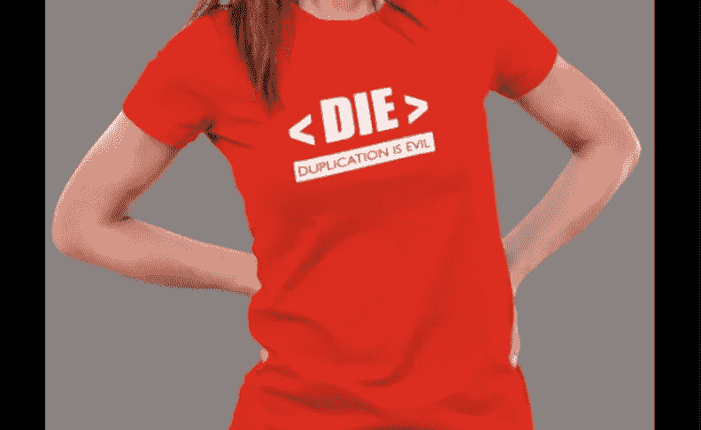

# 软件中的关键原则——干、吻、YAGNI、固体和其他缩写

> 原文：<https://blog.devgenius.io/key-principles-in-software-dry-kiss-yagni-solid-and-other-acronyms-98e5575a6942?source=collection_archive---------3----------------------->

软件程序员使用他们自己的首字母缩写词，其中一些是为软件程序提供深度和意义的核心原则。这种语言连接了各大洲的编码员和程序员。很难在一个地方找到所有的缩写，因为它们在广泛的上下文中使用。我们将会看到一些重要的缩写词，值得学习。这篇文章将帮助你学习缩略语的基本概念、应用和优点。

# 干燥原理

**Don ' t Repeat Yourself(DRY)**是程序员使用的一个非常常见的首字母缩略词，表示创建软件程序是为了自动化某些人类不希望浪费时间和精力的重复性任务。如果您在一个编码数组中重复相同的命令行，有一些方法可以减少或完全消除重复。下面给出一个例子。编程初学者如果希望在不同行中显示 7 的乘法表，将编写以下程序:

`println(7 * 1);
println(7 * 2);
println(7 * 3);
println(7 * 4);
println(7 * 5);
println(7 * 6);
println(7 * 7);
println(7 * 8);
println(7 * 9);
println(7 * 10);`

假设，有人希望将乘法表显示到 100 的 7 倍，那么这将在程序中增加 90 行！

这就是干原则发挥作用的地方。当你可以使用 *Loop* 命令重复 n 次编写三行相同的程序时，为什么要重复程序中的行项目。因此，上面的例子可以写成如下:

`for (var i = 1; i < 11; i++) {`T8`println(7 * i);`

因此，您可以抑制编码中的重复。这适用于所有平台上的所有语言。你需要做的就是参考基本概念。

DRY 原则还有其他应用，可以帮助你创建更干净的编程。

*   **避免代码注释的重复:**开发人员通常会使用//、*或#符号来解释代码的功能，然后开始编码。因此，在偏离干原理的功能中存在已知的重复。当由于要求的改变或任何其他原因，代码必须改变，那么注释也必须改变。这可以通过使用程序本身的代码布局来避免。因此，不存在重复，从而减少了出错或遗漏的可能性。
*   避免基于数据/逻辑的重复:你可以选择开发更好的基于数据或逻辑的代码来避免重复。例如，如果你想创建一个游戏程序，你的光标应该在 4 个方向上移动以找到一个点来获得分数。你可以为每个方向(北、东、南、&西)写四行代码，也可以使用 move(direction)命令用一行代码完成程序。这就是干原理所陈述的。
*   避免算法重复:通过分析你的完整程序及其目标，这可以很容易地避免。比如你可能有一个程序是去 A 酒店——然后吃饭睡觉跳舞，然后去 B 酒店——然后吃饭睡觉跳舞，然后去 C 酒店…..诸如此类。你应该能够以下列方式参加去酒店的活动:

`public void GoToHotel*(Action activity)`
`{`
`Eat();`
`Sleep();``Dance();`
`}`

这有助于将 DRY 原理应用到算法中。

这些步骤有助于避免复制粘贴编程。

干的反义词是湿(每件事都写两遍或者浪费每个人的时间或者我们喜欢打字)。反义词本身表明了 DRY 原则在编码中的有用性。

# 接吻原则

保持简单，愚蠢(KISS)一词是由已故的洛克希德公司(现称洛克希德·马丁公司)航空工程师凯利·约翰逊创造的。凯利用这个术语向工程师解释保持飞机设计简单是多么重要。飞机必须在战斗状态下快速修理，该领域的人员应该能够在基本训练和简单设计的帮助下修理飞机。

这个概念在软件中非常重要。程序员总是被要求避免复杂的编程或者在理解代码时制造困难。关键是只根据需要编程，不多也不少。

正如法国著名作家兼飞行员**安托万·德·圣·埃克苏佩里所说:**

***完美的达成，不是没有更多可以添加的时候，而是没有什么可以拿走的时候。***

程序员可以减少复杂性的几种方法:

*   程序中的变量名应该很好地服务于它们的目的。他们应该能够正确地定义变量
*   方法名称也应符合该方法的使用目的
*   正如前面 DRY 原则中的例子所提到的，只有当你的程序不能完全定义方法时，才应该使用方法中的注释
*   类应该以拥有单一责任的方式来设计
*   删除在干燥过程中解释的冗余过程和算法

以下是在编码中应用 KISS 原则的优点:

*   当你在修改现有的代码库时，应用 KISS 原则是至关重要的。它有助于清理代码，使其更具可读性和可编辑性
*   这个原则的应用有助于在程序员改变时保持代码开发的连续性。
*   KISS 原则提高了代码自动化测试的效率。
*   编码过程中出错的机会更少。

下面这个在 **iOS 编程语言 SWIFT** 中的例子，让我们先睹为快的应用 KISS 原理:

我们有一个程序来显示蓝色，如果一个逻辑给定是成功的，否则显示红色。

`if isSuccess {`
`label.textColor = .blue`
`} else {`
`label.textColor = .red`

同样的逻辑也可以用三元运算符来编写，因此 KISS 原理也适用于此:

`label.textColor = isSuccess ? .blue : .red`

尽管三元运算符的使用在某些情况下可能会使代码变得复杂，但在上面的例子中，它们使代码变得更简单、更容易理解，并压缩为一行而不是四行。

SWIFT 还建议了一些方法，通过这些方法，您可以在代码中消除复杂性并应用 KISS 原则，如下所示:

*   使用 Computed 属性代替 complex 方法作为适当的替代方法。计算属性可以被定义为不存储任何值的特殊类型的属性。相反，它们用于计算基于其他属性的值。
*   语法糖的用法，如 firstIndex(where:)、结尾闭包、if-let 等。，以避免编写冗长的代码。
*   使用高阶函数，将一个或两个其他函数作为参数，并返回一个更简单的函数作为结果。FlatMap、Reduce 和 Sorted 都是高阶函数的例子，它们根据 KISS 原则简化了代码

# YAGNI(你不会需要它)

简单地说，YAGNI 原则意味着去除不必要的功能或逻辑。极限编程实践(XP)的创始人 Ron Jefferies 用下面的方式来描述它:

*“总是在你真正需要的时候实现事情，而不是在你仅仅预见到* *你需要的时候。”*

程序员常常倾向于过度预见未来，用不必要的逻辑、算法、方法和永远不会用到的代码来使程序超载。有些人把它作为业务需求来做，有些人这样做是因为害怕在以后出现某种情况时无法将它整合进来。程序员应该考虑遵循 YAGNI 的一些情况是:

*   如果你被要求通过一个程序来验证电子邮件和密码字段，没有必要添加代码来验证姓名字段。你可能永远都不需要它。
*   如果程序员被要求将一个医院的癌症患者的不同数据库与一个健康应用程序连接起来，开发者不应该考虑已经关闭的医院。它们可能永远也不会打开，而且患者数据库肯定已经转移到了活跃的医院。
*   一些程序员可能会创建抽象，即使他们只有一个定义良好的案例，但预期会有更多的案例。因此，他们编写不必要的代码，并对未来的情况做出假设。应该避免这种情况。
*   使用 If-else 逻辑，即使在遇到的所有测试场景中“else”部分总是为负。

程序员选择违反 YAGNI 有几个原因:

*   对职能或业务缺乏了解。有时程序员并不知道完整的业务场景。例如，一个 salesforce 软件程序员为一个组织中的八个不同的业务单元开发适应性逻辑，如他们的任务文档所述。但是他/她可能不知道其中 3 个已经关闭。因此，为封闭单元考虑的例外和规则被废弃。
*   对未来的憧憬太多。这可能是由于业务团队在传达他们可能永远不需要的场景时的过度远见。计划好要有或必须有场景总是明智的，但是编程是愚蠢的，我可能有一天需要它类型的场景。
*   在某些情况下，如果将来改变编码的成本太高，或者打乱已经很麻烦的逻辑是不可取的，开发者可能会选择违反 YAGNI 原则。

发现 YAGNI 代码并在开发阶段将其扼杀的关键是一项仅来自经验的技能。

# 固体原理

固体原则是五种不同软件设计原则的融合，如下所述:

1)单一责任原则(SRP)
2)开/闭原则(OCP)
3)利斯科夫替代原则(LSP)
4)界面分离原则(ISP)
5)依存倒置原则(DIP)

这个概念是由罗伯特·马丁也就是“鲍勃叔叔”提出的。它已经被使用了很多年。

以下是在软件程序中应用 SOLID 原则的目标:

*   让它更容易理解
*   即使由其他程序员完成，也易于维护
*   易于复制和重复使用
*   容易测试。与自动化测试兼容
*   灵活适应场景的变化

立体概念的使用将专业人士与业余爱好者区分开来。学习这些概念并在正确的地方应用它们是至关重要的。

你可以在这篇博文中了解更多关于[坚实的设计原则。](https://www.geeksprogramming.com/solid-oriented-design-design-principles/)

# 关注点分离

关注点分离原则很简单。它指出程序员不应该把程序写成一个单独的块，而是应该把代码分成几个块，这样每个组件就能完成一个简单的不同的工作。

用荷兰计算机科学家先驱 Edsger W. Dijkstra 的话说，

“分离关注点，即使不是完全可能的，也是我所知道的唯一有效整理一个人思想的技术。”

这适用于软件和设计的许多方面，如下所述:

*   **用于编程函数的 SoC**:在编程时，如果你意识到正在使用的函数变得过于华丽而无法处理，并且同时处理太多的参数，那么应该立即将它分成更小的组件。
*   **模块的 SoC**:类似于功能，当在更高的级别时，功能应该以这样的方式分组，即它们通过它们之间的逻辑关系来完成期望的任务。将提供相似功能的特性组合在一起是我们的口头禅。
*   **内聚性:**当功能相似的代码组合在一起时，这就是所谓的增加内聚性。像 drawRectangle 和 drawSquare 这样的示例函数
*   **解耦:**有时候，目的和执行完全不同的听起来相似的函数在一段代码中耦合在一起。明智的做法是将它们分离出来，以实现更干净的程序。

成功分离关注点的关键是首先定位需要分离的纠缠函数，以简化和避免干燥。

在架构级别，当程序员构建分层应用时，SoC 原则可用于分离业务逻辑、数据访问和用户界面。

# MVP-最小可行产品

对于开发者和他们的客户来说，这是一个非常有趣的概念。假设客户给出了一个特性列表，作为开发人员需要开发的需求。开发人员知道，一旦客户拥有了他们所概述的需求的工作模型，他们自己将能够给出一个更全面的需求。因此，开发人员继续开发最终产品的前光标模块，可能自动化程度较低，在后端使用手动功能。这有助于客户初步了解最终产品的功能。在此基础上，客户要么给出更成熟的指导方针，要么要求开发人员按照最初的设想保留这些特性。

用推广这个概念的开发人员 Steve Blank 的话来说:**“你是在向有远见的人，而不是每个人，推销愿景和交付最少的功能集”**

有些人混淆了最小可行产品和原型。然而，MVP 和开发人员所说的原型之间有一些显著的区别

*   原型是测试产品背后的基本思想和假设的快速修复方法，而 MVP 是具有核心功能的产品的可用版本，用最少的资金和努力构建，作为产生反馈和有用数据的测试用例
*   原型测试概念；MVP 测试特性，作为原型的下一步
*   原型更多的是最终产品的表象或视觉外观，MVP 是功能性的，可以以有限的方式使用

2001 年，弗兰克·罗宾逊首次使用了 MVP 这个术语。后来它被史蒂夫·布兰克和埃里克·里斯推广开来。

# 概念证明(PoC)

想象一下，在高速公路上行驶数百英里，然后发现一家比萨饼店。你走近披萨店，想要吃披萨。在投资购买比萨饼之前，你向店主询问它的特点，以及它如何满足你的胃口和口味偏好。作为回应，店主递给你一本小册子，如下所示:

这本小册子类似于概念证明。它让你先睹为快，看看如果你点了披萨并吃掉它，你会期待什么。

概念证明，有时也被称为原则证明，即采取行动来确定一个想法是否足够有价值、可行或有可能变成现实。它还测试软件产品解决业务需求的可行性。与原型或最低可行产品(MVP)相比，概念验证是初始阶段的文档、演示或演示，旨在概述产品的特性和优势(FAB)及其功能。一个原型和最终的 MVP 是在一个被客户或最终用户正式接受的成功的概念证明之后。
在创建概念证明时，需要记住以下因素:

*   **确定支持者**(关键人员)——支持者可能是客户组织的决策者、流程专家、技术负责人，也可能是财务主管。PoC 应根据受众进行设计。
*   **成功因素**:确定新需求的目标、与现有设置相比的期望、可用时间、涉及的资金等。
*   **在每一步进行协作:**在每一级和每一步进行协作有助于开发人员更好地理解和交付需求。
*   **了解开始时的后续步骤:**清晰地了解后续步骤总是有助于创建可接受的 PoC。
*   **通过反馈持续改进:**开发人员在开发 PoC 时，除了客户反馈之外，还应该从他们自己的组织获得反馈。

概念验证是关于规划的。你计划得越多，相关的风险就越低，你就能达到预期的结果

# 死亡(复制是邪恶的)

这类似于干(不要重复自己)原则，他们鼓励避免湿(写两遍)。具体来说，DIE principal 概述了代码复制的规则。以下是解释与代码复制相关的危险的原因:

*   修正了代码中重复出现的错误
*   需要维护越来越多的代码
*   由于重复而出现逻辑矛盾
*   信息或算法的丢失
*   这说明程序员粗心，不负责任。

编码时通常会观察到以下类型的重复:

*   强制复制——开发人员被迫复制代码，因为根据他/她的知识水平，他/她别无选择。
*   无意中的复制——开发人员没有意识到他/她在复制代码。当存在代表相同概念的相似字段时，有时会发生这种情况。
*   **急躁复制:**开发人员为了节省时间或出于无聊而进行的一种快捷的复制粘贴编码活动
*   **开发人员之间的重复:**多个开发人员通过共享的工作空间或一个接一个地开发同一个应用程序，可能会导致重复工作。

在固定的时间间隔或里程碑之后进行适当的代码审查有助于避免重复的弊端。有时，命名、风格和约定等技术也有助于识别编码中的重复。

# BDUF(预先大设计)

想象一下，计划一次去你附近山区的公路旅行。在你最终确定行程之前，你要标出路线、天气、所需车辆的离地距离、食物供应、住宿安排和最佳游览时间。因此，在参观这个地方之前，你已经为旅行做好了充分的准备。这类似于软件中的 BDUF 概念。在这种方法中，网站、应用程序或程序设计在实施开始之前就已经完成。

以下是使用 BDUF 之前的假设:

*   我们知道设计的要求，它们不会有太大的变化
*   该设计方案是有效的
*   当产品仍处于开发阶段时，可以解决开发挑战

以下是 BDUF 的优势:

*   易于预算，因为在设计阶段就已经考虑了所有成本
*   易于开发，因为产品设计已经完成
*   设计引领发展。用户要求在设计阶段就已经存在

以下是使用 BDUF 的缺陷:

*   当客户改变目标时很难适应。
*   设计验证变得几乎不可能，因为所有部件都是在开发后才起作用的。

你想知道[有没有可能雇佣其他人来帮我做编程作业](https://www.geeksprogramming.com/do-my-programming-homework/)那么你就不用再找了，使用我们最可靠的服务来满足你所有的编程需求。

# 垃圾进，垃圾出

名字本身是不言自明的。计算机总是根据输入的信息来处理数据。如果提供的数据不准确，计算机得出的结果也不准确。

IBM 程序员兼讲师 George Feuchsel 将 GIGO 概念的普及归功于此。

用苏格兰印象派画家罗里·布伦内尔的话说:

“如果你把垃圾放进电脑，除了垃圾什么都不会出来。但是这个垃圾，通过一个非常昂贵的机器，不知何故变得高贵，没有人敢批评它。”——罗里·布伦内尔

*原载于 2022 年 3 月 27 日*[*【https://www.geeksprogramming.com】*](https://www.geeksprogramming.com/key-principles-in-software-and-acronyms/)*。*