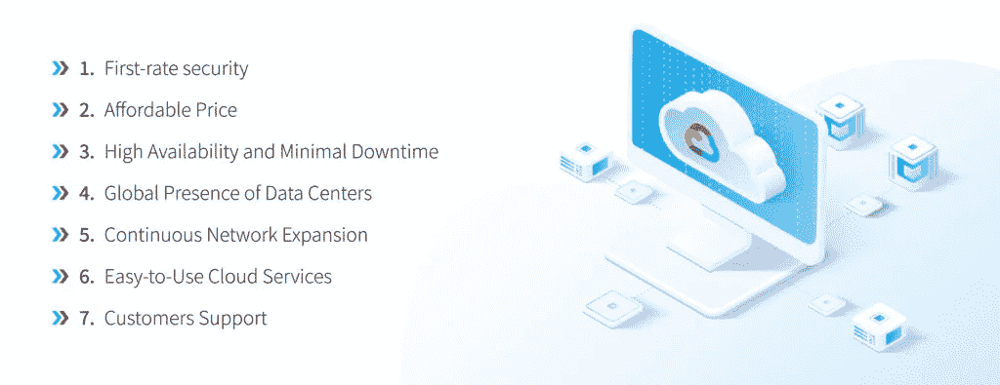
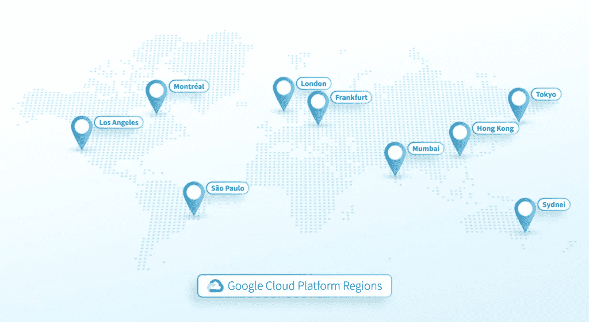
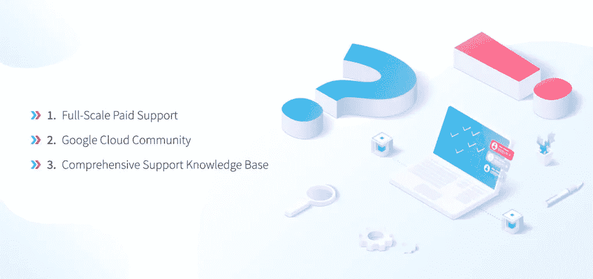
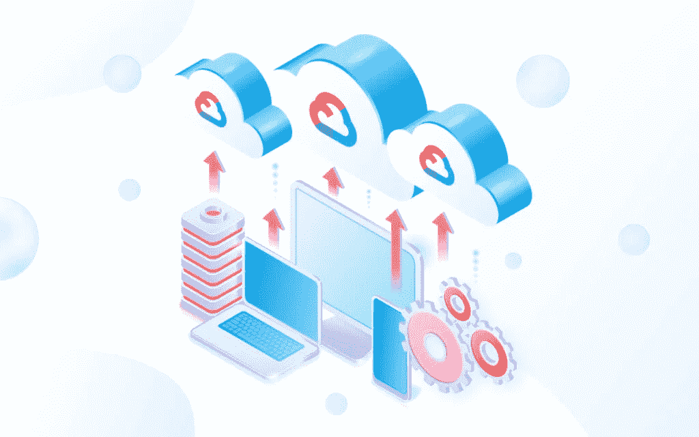

# 相比竞争对手 NIX United，更喜欢 Google 云平台的主要原因

> 原文：<https://blog.devgenius.io/key-reasons-to-prefer-google-cloud-platform-over-its-competitors-nix-united-e5cfc3d43b79?source=collection_archive---------16----------------------->

[Firmbee.com](https://unsplash.com/@firmbee?utm_source=medium&utm_medium=referral)在 [Unsplash](https://unsplash.com?utm_source=medium&utm_medium=referral) 上拍照

无论出于什么原因，无论你是打算从头开始创业，[提高现有公司的效率](https://nix-united.com/services/enterprise-it-integration-and-customization-services/)，还是转向云平台，谷歌肯定会在你的选择名单上，在亚马逊网络服务或微软 Azure 等科技巨头中脱颖而出。这很有意义，也完全可以解释为什么谷歌云正在迅速加速，尽管提到的竞争对手已经在市场上占据领先地位多年，但提供商在领奖台上占据了自己的位置，并得到了用户的好评。然而，并不是每个人都清楚为什么谷歌云在自己周围制造了如此多的宣传。谷歌云的好处是不是有点夸张？答案是显而易见的，考虑到小企业和大规模公司要取得成功并不断发展以渗透新市场同样需要各种各样的关键功能和工具。因此，如果您正在考虑将谷歌云平台作为一个选项，让我们详细了解一下提供商，并了解一下为什么谷歌云值得您关注。让我们从定义开始，然后继续讨论谷歌云的各种好处。

供应商提供的解决方案属于以下类别之一:

*   人工智能(AI)是专为在云端创建和部署机器学习模型而设计的。
*   [计算引擎](https://console.cloud.google.com/compute)允许您运行虚拟机，这些虚拟机可用于创建开发、测试环境、执行工作负载迁移等。
*   管理工具允许您有效地管理云资源，并简化管理任务。
*   存储和数据库提供了许多解决方案，这些解决方案主要负责管理、迁移和更新数据和基础架构。
*   托管允许用户创建和定制网站，并快速开发高质量的应用程序。

我们简要介绍了这项服务，尽管谈论这件事可能会没完没了。因此，现在是时候转向谷歌云的好处了，知道你会清楚为什么谷歌云是高需求的。

# 值得关注的谷歌云的主要优势

# 一流的安全级别

随着黑客和黑暗网络活动的增加，以及网络罪犯使用越来越复杂的方法来达到他们的目标，越来越多的在线用户开始更加重视网上冲浪时的保护的原因变得很明显。研究过这件事之后，他们很有可能会发现，谷歌尽一切努力确保客户的数据得到尽可能的保护。一个很大的优势是，该公司不断发布更新，增加改进，并教育员工——顺便提一下，仅安全部门就有 500 多名员工——自豪地称自己是科技巨头中的第一名。因此，在选择谷歌云平台时，您可以放心，您的个人数据会通过定期检查被牢牢锁定。在数据泄露的情况下，你会立即得到通知，许多受管理的访问允许你跟踪所有的修改，检测谁做了修改，检查谷歌员工的活动日志。对于那些担心自己的在线保护的人来说，最大限度地减少攻击者所遭受的损害，并防止未来出现类似情况，将是谷歌云的切实好处。

# 与替代解决方案相比，价格合理

不支付过高费用的机会吸引了谷歌云优势的眼球。与亚马逊网络服务(Amazon Web Services)、数字海洋(Digital Ocean)或微软 Azure 等竞争对手相比，GCP 的优势在于有机会不用为未使用的服务支付任何额外费用，而是只为使用的服务付费。谷歌采用按秒计费的方式，这对于过去按小时付费的消费者来说是一大优势，即使他们只使用了几分钟的服务。

# 实现高可用性并最大限度地减少网站停机时间

决定网站有效性和成功的一个基本指标是它的可用性。如果用户无法访问它，那么即使是最令人惊叹的内容也没有意义。作为一个网站失败的结果，一些访问者会开始检查你的竞争对手，你的搜索引擎排名会下降。不像你，你的虚拟主机提供商，但是，可以极大地影响你的网站正常运行时间。因此，为什么 GCP 应该是首选的问题的答案如下:用户可以访问最广泛的全球网络，当一些服务器发生故障时，通过切换到冗余系统，该网络可以稳定地防止停机。鉴于该公司承诺根据其计算引擎服务水平协议的规定，为每个客户提供 99.99%的正常运行时间，谷歌云平台的这一优势吸引了越来越多用户的关注。

# 数据中心、网络和云服务的全球存在

谷歌云相对于主要竞争对手的另一个显著优势是其全球网络，这是全球最大的网络之一。这不仅仅是一个试图提升其自身价值的重大声明，这是一个真正的优势，它极大地影响了用户的体验，并且在选择供应商时往往是决定性的。这个大的互联网主机提供商提供了一个巨大的网络，这个网络分散在世界各地，甚至在最偏远的地区。这正是在访问网站时提高速度和性能的原因。鉴于托管位置相对于用户的接近性，他们可以依靠一个快速加载的网站，这可以大大降低跳出率，增加转化率。这就是为什么谷歌云平台特别强调这一点，并为用户提供高达 10 Tbps 的速度，这比竞争对手提供的速度快得多。

# 网络的持续扩张

虽然谷歌现有基础设施的规模已经令人印象深刻，而且对一些人来说，这是选择这家供应商的决定性原因，但该公司正在努力改善其全球网络。这家科技巨头表示，它的目标是扩大新位置的覆盖范围，以运行更多的网络边缘点。这种扩展提供了一个机会，通过减少连接的延迟并提高全球更多地区的性能，提供令人愉快的客户体验。这些改进不仅仅涉及拓展新的位置，还涉及通过海路扩展连接及其全球云基础设施。该公司正在投入大量资金铺设海底电缆，谷歌云平台的这一无可争议的优势旨在最大限度地提高网络带宽，加快数据流动，并通过在断电期间重定向流量来使其云网络更加强健。

# 简单易用的云提供商

从头开始创建一个网站或应用程序是不可能的，因为每一步都会遇到许多困难，这些困难也是产生分歧的原因之一。首先，有必要搜索域名注册商并从中选择一个域名，然后决定哪个内容管理系统平台最适合您，确定所需的服务器类型，计算出网站需要多少空间，并定义哪个数据库链接到网页。这就是 GCP 将提供帮助的地方，因为它提供了部署 web 服务堆栈的最简单的方法，使您不必为所有这些问题寻找答案。该服务为用户提供预定义设置的解决方案，包括启动所需的一切，即存储磁盘、数据库、虚拟机等。谷歌云还有其他好处，如获得谷歌管理的 SSL 证书，该证书将自动更新您的域名，以及使用云盔甲的顶级 DDoS 防御。与类似的供应商相比，我们得出的结论是 GCP 更容易配置。例如，Amazon Web Service 提供了 Lightsail，它包含了启动一个项目所需的所有内容；然而，它需要大量的时间和精力来设置。

# 各种级别的客户支持

无需指出准时支持服务对于为客户创造积极体验的重要性。不管怎样，尽管看起来很容易使用，但用户在配置网站托管时很可能会遇到各种各样的障碍。在这个关键时刻，迫切需要为他们提供一个详尽的答案，让他们继续前进，而不是日夜等待帮助。一贯出色的客户服务是谷歌云平台带给客户的好处之一。它有三种选择:

## 1.全面付费支持

当选择一个名为标准、增强或高级的付费计划时，用户可以获得对整个谷歌云计算服务套件的扩展支持。它们之间的区别在于响应时间、沟通渠道的数量、支持语言、解决紧急问题的升级选项等等。例如，高级计划向客户承诺一年 365 天，一周 7 天，一天 24 小时 15 分钟的响应。这种支持还包括一名技术经理，他将被分配到您的帐户，作为您所有技术支持查询的主要联系人。您还可以选择根据您对每种产品的需求来调整支持。

## 2.支持谷歌云社区

所有上述的听起来都很吸引人，然而并不是每个人都有能力支付他们问题的答案。那么，他们还有另一个选择，即向活跃的行业同行和精明的用户提供免费访问，他们可以像谷歌云客户支持成员一样提供服务。该社区的大约 20，000 名技术爱好者随时准备帮助用户解决他们的问题并获得他们问题的答案。还有一些谷歌群组，用户可以发送任何他们想要的问题并参与讨论。

## 3.综合支持知识库

当谈到文件，GCP 没有平等的，因为它的收集可以帮助减轻客户的负担。如果您对技术很熟悉，并且可以称自己是一个喜欢亲自处理这类事情的精通技术的人，那么这些文档将足以让您更快地解决问题，更容易地做出决策，并为客户支持团队大幅削减公司成本。云供应商提供了教程、一系列代码样本、发行说明和许多其他解决 Google Cloud 设置相关问题所需的东西。最棒的是，这是完全免费的。

# 适应在家环境下的远程工作

在新冠肺炎，远程工作的概念成为一种新的常态，现在它是许多求职者接受工作的必要条件。这就是为什么适应这些现实并提供允许员工在家自由工作的解决方案的公司在世界各地备受推崇。借助 GCP 虚拟基础架构，您不再需要向现场员工支付工资、购买前期硬件或租赁办公空间来开展业务，只需远程访问必要的资源。

虚拟化还意味着简化数据中心管理。例如，在季节性高峰期间或相反，当购买力由于不可预测的经济衰退而下降时，必须立即做出决定。借助 GCP，可以根据需要启动或关闭虚拟机，并根据需要重新部署资源。借助通过管理控制台提供的仪表板，用户可以分析不同的数据指标，并找出导致可能影响服务器性能的问题的原因。

当然，有一些用户在转换到 GCP 时会面临一些困难，但所有这些都得到了解决，这要归功于在线资源，这些资源将减少云迁移，并有助于获得在该平台上工作的经验。

# 总结一下

GCP 军械库大约有 200 种解决方案，可以满足不同类型和规模的公司的不同需求。人工智能和机器学习工具，强大的数据分析服务，大规模的数据中心和存储，以及创建软件的代码——所有这些只是供应商为企业提供的资源的一小部分。如果您正在寻找专用于特定行业的现成解决方案或工具，例如医疗保健、零售或游戏，您的提供商将会满足您的需求。如你所知，可能性是无穷无尽的，所以是时候开始寻找你的提供商了，我们作为谷歌的合作伙伴将很乐意帮助你。试一试这篇文章中提到的谷歌云的第一手优势。

*原载于 2022 年 7 月 6 日*[*【https://nix-united.com】*](https://nix-united.com/blog/key-benefits-of-google-cloud-platform/)*。*