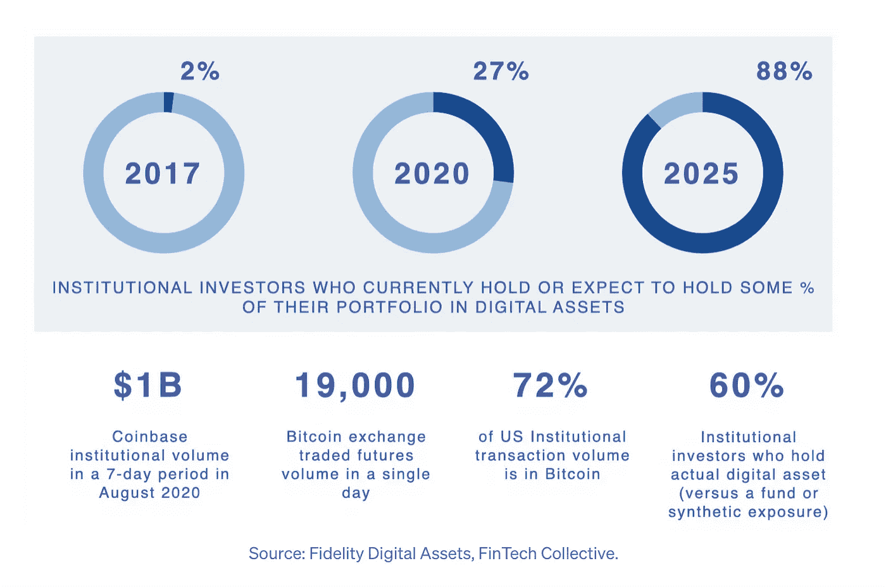

# 金融科技应用开发的主要趋势和技术(2021 年初)

> 原文：<https://blog.devgenius.io/key-trends-and-technologies-of-fintech-app-development-early-2021-8799382c2062?source=collection_archive---------5----------------------->

此处有可用的来源

截至 2020 年底，金融机构在支持金融科技应用开发领域的增长和竞争力方面发挥了积极作用。据[沃尔玛](https://www.fintechfutures.com/2021/01/walmart-prepares-launch-of-its-own-fintech-start-up/)称，金融科技应用应该是现代、创新和负担得起的金融解决方案。随着金融科技应用数量的增加，预测哪一个将脱颖而出变得更加困难。因此，我想写一写 2021 年初金融科技应用程序的发展趋势和技术。

## 从交易到互动的转变

通过移动解决方案，可以更容易地访问虚拟世界的银行服务。银行的位置不再重要。尤其是移动支付和数字钱包功能是银行的关键机会。

> 随着数字渠道的发展，移动化趋势继续为消费者提供更快捷、更方便的方式与其金融服务提供商进行互动。更多细节请点击查看[。](https://www.cognizant.com/InsightsWhitepapers/Segment-Based-Strategies-for-Mobile-Banking.pdf)

为了创造适当的互动*“了解你的客户”*具有最大的作用。例如，年轻用户不想与银行互动，他们需要/想要通过移动设备完成每一笔交易。这就是为什么交易应该被互动所取代。互动创造了与客户的信任和互动。顺便说一下，这将是银行更新 2021 年数字银行趋势的最大机会。下图显示了不同年龄人群对手机银行的偏好使用情况。

来源可用[此处](https://www.cognizant.com/InsightsWhitepapers/Segment-Based-Strategies-for-Mobile-Banking.pdf)

## 监控和欺诈控制

每个开发流程都必须采取安全措施，因为金融科技应用是网络攻击和欺诈的目标。**人工智能**在安全和技术方面很重要。人工智能系统可以很容易地估计行为模式。如果用户试图做一些意想不到的交易，人工智能系统能够中断欺诈操作，使用户受到系统的自动保护。

> 人工智能与机器学习相结合，能够帮助金融科技安全算法获得防止欺诈和入侵所需的有价值的数据输入和见解。更多详情请点击查看[。](https://www.hostreview.com/blog/190408-6-impressive-ways-ai-will-reshape-fintech-mobile-apps)

AI 系统可以和**机器学习**统一。AI 主导了这么大的区域，非常适合开发。例如，机器学习能够定义异常检测。

> 异常检测影响跨部门的业务决策。保险、金融、电信、制造、银行等行业是异常检测非常重要的主要行业。异常高额购买的检测和预防-存款、欺诈性支出、收入欺诈、滥用、服务中断是异常检测的主要真实案例场景。更多细节请点击查看[。](https://b2metric.com/blog/anomaly-detection/)

此外，为了改善客户体验，还需要生物识别和多种技术认证支持。Fintech security 能够增加移动适应性和信任客户的数量。

## 基于客户的应用程序

用户对 fintech 应用的必要性取决于他们个人的金融属性、偏好、生活方式、文化和广泛的其他因素。为了创造对每个人都有吸引力的金融科技产品，金融科技机构应该更加以客户为中心，让每个客户都觉得它是个性化的。

我想强调的是，基于人工智能的系统可以提供更多以客户为中心的产品和建议。基于人工智能的系统可以提供客户的最后交易、交易和互动、客户偏好和选择:**数据驱动的产品**(超级应用概念更重要。)当 AI 实施到客户服务时，fintech 应用程序可以充当财务主管。

来源可用[此处](https://www.cognizant.com/InsightsWhitepapers/Segment-Based-Strategies-for-Mobile-Banking.pdf)

> 由于人工智能，你的金融科技应用程序总是可以创建各种各样的金融产品，以满足每一个不同的客户需求。更多详情请点击查看[。](https://www.hostreview.com/blog/190408-6-impressive-ways-ai-will-reshape-fintech-mobile-apps)

## 游戏化

我认为游戏化可以在金融科技中被定义为技术的一部分，因为人们能够在非游戏过程和交易中采用游戏方法，从而比以往任何时候都更加参与互动。用户可能会厌倦静态的工作流程，例如进行投资交易，游戏化能够使其变得有吸引力和有趣！

此处有可用的来源

作为金融科技中的一个角色，游戏化具有增加兴趣和扩展内容的潜力。通过游戏概念让用户变得有价值，获得高水平的奖励，成为应用程序的一部分将会产生巨大的影响。用户的参与、体验和结果应该被观察和良好的设计。

* *更多关于游戏化的细节请点击阅读[。](https://www.finextra.com/blogposting/19685/how-service-gamification-is-part-of-fintech)

## 超级应用概念

超级应用是一个术语，简单地说就是移动应用中的“一体化”概念。详细来说，超级 app 是一个移动 app，它在一个 app 中包含了客户最需要的和相关的功能。

**金融超级 app** 是一个成功整合了金融功能的超级 app 概念。有一个移动应用程序已经不够了。由于移动技术的进步，银行被迫探索新的方式为客户提供新的体验。这就是竞争如何为银行业创造了金融超级应用这一术语。关于超级应用的更多细节，你可以在这里阅读我的文章:)

## 区块链——虚拟(数字)资产

区块链的采用和认可，尤其是包括加密货币在内的数字资产，对金融科技的发展产生了重大影响。此外，金融机构将通过使用人工智能来建立加密指数、排名和价格预测，从而进入跨平台领域。根据 Ian Balina(Token Metrics 的创始人兼首席执行官)的说法，这可能是 2021 年金融科技发展的最大趋势。

> 在加密货币生态系统中，p2p 系统的兴起在很大程度上是指分散金融(DeFi)系统在提供资产交易、贷款和赚取利息等服务方面的日益突出。更多详情请点击查看[。](https://www.financemagnates.com/cryptocurrency/news/the-fintechization-of-everything-the-7-hottest-fintech-trends-in-2021/)

虽然法规似乎是一个障碍，但监管许可证可能会吸引用户的信心。这就是为什么专注于 DLT(数字账本技术)的初创公司将在金融科技生态系统中领先一步。如果账本技术与区块链和数字资产相结合，新的挑战和技术进步将会诞生。这一举措将会增加基于 P2P 的金融服务的使用。例如，Whatsapp 通过预先关注这个问题开始推进:在其消息应用程序中引入支付，让用户通过短信相互转账。就像 WhatsApp 一样，星巴克启用了比特币支付。此外，脸书将推出自己的数字货币:Libra。

但是这项技术比密码技术有更大的容量。例如，在资产管理中，它可以用作一种工具来实现数据安全和提高数据传输速度，这也意味着提高运营效率。更多详情请见[这里](https://www.bdo.sr/getattachment/Insights/5-Fintech-Trends-to-watch-in-Asset-Management/FS_AM_FinTech-Trends_Insight_10-20_WEB.pdf.aspx?lang=en-GB)。

看起来数字资产可能会成为公司的财务工具。在金融服务行业，未来很可能会开发和呈现更侧重于数字资产和技术的产品！