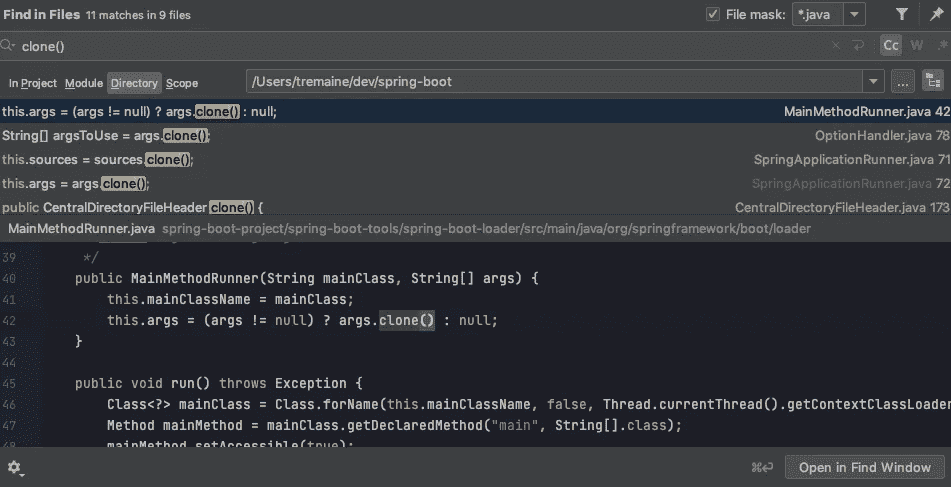
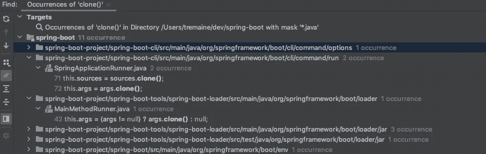

# 键盘快捷键:如何在 IntelliJ IDEA 中搜索所有文件并查找匹配项

> 原文：<https://blog.devgenius.io/keyboard-shortcut-how-to-search-through-all-files-and-find-matches-in-intellij-idea-e28e98fffe76?source=collection_archive---------3----------------------->


照片由[马腾纽霍尔](https://unsplash.com/@laughayette)在 [Unsplash](https://unsplash.com/photos/uAFjFsMS3YY) 拍摄

当使用 IntelliJ IDEA 时，这是我能想到的最有用的键盘快捷键之一:*在文件中查找。*

这基本上意味着，如果您在所有项目文件中查找特定的单词或关键字或字符串或子字符串或数字，您可以简单地使用集成开发环境(IDE)中内置的*在文件中查找*功能，然后获得与您的输入匹配的所有文件的列表，以及它在代码中的确切位置。

说得更简洁一点(通俗一点)就是 ***牛逼*** 。

# 键盘快捷键

别再拐弯抹角了。你看这篇文章的原因可能只有一个:找到最甜蜜的捷径。好吧，那么，在这里，无论是 Mac 和 Windows:

## 苹果个人计算机

使用苹果电脑？然后只需按下键盘上的这些键:

```
command + shift + f
```

## Windows 操作系统

在 Windows 上？然后你会想按这些键:

```
ctrl + shift + f
```

基本上，Mac 和 Windows 方式的唯一区别是交换了`command`和`ctrl`。

# 菜单操作

如果你忘记了快捷键，不想回到这篇文章，那么你可以简单地导航到 IntelliJ IDEA 的**编辑>查找>在文件中查找……**

在那里，你可以点击进入实际的功能，你也可以看到一个键盘快捷键是什么的提示。

# 在文件中查找在用户界面中看起来像什么

如果你想知道当你试图搜索某个东西时，这个功能是什么样子的，这里有一个例子:

在这里，我在 IntelliJ IDEA 中加载了 [spring-boot 项目](https://github.com/spring-projects/spring-boot)。我很好奇项目中所有`clone()`的实例在哪里，我得到了这个:



在顶部，您可以看到 9 个不同的文件中有 11 个匹配项。

文件的名称在每一行的右边。匹配发生的确切行在左手边。

你可以点击每一行(或者点击键盘上的向下箭头，或者你浏览的其他方式),然后看到底部的视图给你更多的关于文件中发生的上下文。

如果您点击底部的`Open in Find Window`，您将有不同的方式在不同的综合视图中查看事件:



根据 [IntelliJ IDEA 的文档](https://www.jetbrains.com/help/idea/finding-and-replacing-text-in-project.html):

> 使用 **Find** 工具窗口中的图标和上下文菜单，您可以对条目进行排序、排除目录、导航到源代码等等。
> 查看以下热门选项:
> 
> -如果您想从结果中排除一个目录，选择一个目录，并从上下文菜单中选择**排除**。
> -要在编辑器中定位搜索结果，使用上下文菜单中的**跳转到源**选项。
> -要返回到**在文件中查找**对话框，点击左侧工具栏上的(齿轮图标)。
> -要对搜索条目进行排序，在**显示选项菜单(齿轮图标)中选择**查看选项|按字母顺序排列成员**。**
> 
> 关于**查找**工具窗口的选项和图标参考的更多信息，参见[查找工具窗口](https://www.jetbrains.com/help/idea/find-tool-window.html)参考章节。

# 搜索特定的文件类型

在*在文件窗口*的顶部是一个名为*文件掩码*的功能。

根据 IntelliJ IDEA 的文档:

> 使用**文件掩码**选项将搜索范围缩小至特定文件类型。您可以从列表中选择现有的文件类型，添加新的文件类型，或添加附加的文件掩码语法来搜索具有特定模式的文件类型。

您将能够选择(或者只是简单地键入您自己的)一个通配符操作符，该操作符返回某种类型的所有文件类型。

例如，每当我想只搜索`.java`文件，而不想进入`.ts`文件或`.md`文件或类似的文件时，这就特别有用。

这个简单的键盘快捷键可以——我不认为我在这里夸大了——在您处理更大的项目时可以节省您大量的时间。我曾经无数次试图在代码中找到字符串的所有实例，或者不得不在这个特性被大量使用的地方重构代码。

我也喜欢*在文件中查找*窗口让你就地编辑。它非常适合快速编辑，而不是打开一堆标签页，在项目中迷失方向。

总而言之，把它添加到你的 mental IntelliJ IDEA development toolbox，你几乎每次使用它都会感谢自己。

[](https://tremaineeto.medium.com/membership) [## 通过我的推荐链接加入媒体

### 作为一个媒体会员，你的会员费的一部分会给你阅读的作家，你可以完全接触到每一个故事…

tremaineeto.medium.com](https://tremaineeto.medium.com/membership)