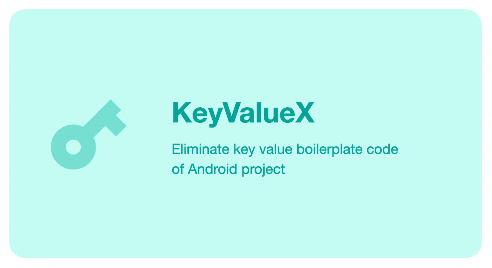
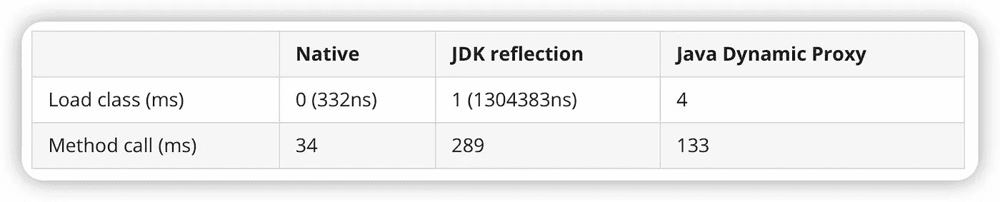

# KeyValueX:消除样板代码，让 Android 项目不再 KV 爆炸

> 原文：<https://blog.devgenius.io/keyvaluex-eliminate-boilerplate-code-and-make-android-projects-no-longer-kv-explosion-3f6fbca31692?source=collection_archive---------7----------------------->



# 背景

摘自一段深夜独白:

定义几十或几百个键值是很常见的。有更简单的方法吗？

这是项目中为数不多的不受控制的地方，呈指数级膨胀，很容易埋下一致性的隐患。

每次添加一个新值，都需要考虑 key，get，put，init，5 个位置…

```
public class Configs {

  ...

  private static int TEST_ID;

  public final static String KEY_TEST_ID = "KEY_TEST_ID";

  public static void setTestId(int id) {
    TEST_ID = id;
    SPUtils.getInstance().put(KEY_TEST_ID, id);
  }

  public static int getTestId() {
    return TEST_ID;
  }

  public static void initConfigs() {
    TEST_ID = SPUtils.getInstance().getInt(KEY_TEST_ID, 0);
  }
}
```

事后陆续收到改进建议。有朋友提到“科特林房产代理”。

同时，受“属性代理”的启发，我想出了一个设计，减少了 Java 下的 key、value、get、put、init。

# 1.0 版用法

第一步。如果读写 POJOs，您可能需要实现可序列化的接口

```
public class User implements Serializable {
  public String title;
  public String content;
}
```

第二步。像往常一样，创建一个项目配置管理类，如 Configs

```
//Configs no longer define a bunch of KEY, VALUE constants and get, put, init static methods, Just a piece of KeyValue static variable:
​
public class Configs {
  public final static KeyValueString accountId = new KeyValueString("accountId");
  public final static KeyValueSerializable<User> user = new KeyValueSerializable<>("user");
}
```

第三步。通过页面上的 get( ) set()方法读写 KeyValue 等。

```
public class MainActivity extends AppCompatActivity {
  ...

  //Test persistent write
  Configs.user.set(u);
​
  //Test read
  Log.d("---title", Configs.user.get().title);
  Log.d("---content", Configs.user.get().content);
}
```

# 1.0 版本回顾

KeyValueX v1.0 一出，迅速在群里引起热议。有人提到了多个模块的问题或者重复 KeyNames 的存在，有人提出通过“注释”来消除重复等问题。

同时我还发现，虽然 KeyValueX 已经消除了 key，value，get，put，init 样板代码，但是仍然存在两个一致性问题:

最终修饰符和关键字名称的一致性，

— — final 必须用 Java 编写，以免开发人员错误地直接给 KeyValue 赋值:

```
public class MainActivity extends AppCompatActivity {
  ...

  //Normal use
  Configs.user.set(u);

  //misuse
  Configs.user = u;
}
```

那么有的开发者可能会说，我每增加一个 KeyValue，通过 Ctrl/Command + D 复制一行就够了

```
public class Configs {
  public final static KeyValueString accountId = new KeyValueString("accountId");
  public final static KeyValueBoolean isAdult = new KeyValueBoolean("accountId");
}
```

诚然这样可以解决最终的一致性问题，但同时也滋生了 KeyName 一致性问题，即记得改 KeyValue 变量名，忘了改 KeyName，而这种疏忽编译器是发现不了的，只有在线发生意外的时候。

因此，考虑到各种因素，v2.0 采用了标注设计:

# V2.0 使用

第一步。创建 KeyValueGroup 接口

```
@KeyValueGroup
public interface KeyValues {
  [@KeyValue](http://twitter.com/KeyValue) KeyValueInteger days();
  [@KeyValue](http://twitter.com/KeyValue) KeyValueString accountId();
  @KeyValue KeyValueSerializable<User> user();
}
```

第二步。像往常一样，创建一个项目配置管理类，如 Configs

```
//Configs do not need to define a bunch of KEY, VALUE constants and get, put, init static methods, Just one KeyValues static variable:
​
public class Configs {
  public final static KeyValues keyValues = KeyValueCreator.create(KeyValues.class);
}
```

第三步。通过页面上的 get( ) set()方法读写 KeyValue 等。

```
public class MainActivity extends AppCompatActivity {
  ...

  //Test persistent write
  Configs.keyValues.user().set(u);
​
  //Test read
  Log.d("---title", Configs.keyValues.user().get().title);
  Log.d("---content", Configs.keyValues.user().get().content);
}
```

# V2.0 回顾

V2.0 通过接口+注释的设计，一举消除了 final 和 KeyName 的一致性问题，

并且 KeyValues 的实例化是通过无参数反射实现的，这样就不需要在编写代码的过程中专门构建 Impl 类，对于需要几分钟构建一次的庞大项目更加友好。



从上图可以看出，无参数反射加载类仅次于 new，所以我对 V2.0 的设计还是比较满意的。已经在 Java 项目中充分使用，欢迎测试反馈。

> [*Github:key valuex*](https://github.com/KunMinX/KeyValueX)

# 键值-调度程序

期间有朋友提出可以用动态代理实现代替，即模仿改装，根据接口定义运行时动态生成方法。

这消除了对声明性注释的需要，使接口定义更加简洁，如下所示:

```
public interface KeyValues {
  KeyValueInteger days();
  KeyValueString accountId();
  KeyValueSerializable<User> user();
}
```

同时可以根据适配器模式实现一个转换器，比如转换成 UnPeek-LiveData，这样就可以顺便完成高频操作——更新配置后通知一些页面刷新 UI。

```
public interface KeyValues {
  Result<Integer> days();
  Result<String> accountId();
  Result<User> user();
}
​
Configs.keyValues.days().observer(this, result -> {
  ...
});
```

但是动态代理有一个缺陷，就是类名和方法名不能混淆，否则运行时很难调整对应的方法。

所以最后没有考虑动态代理的方法，但是我真的很喜欢转换器的设计。此外，受 Java 后端属性的启发，Dispatcher 设计诞生了

基于 MVI 调度器实现键值调度器。具体思路是通过 HashMap 来 cohere KeyValue，所以不考虑 Value，getter，setter，init 就声明 Key:

# KV-D 用法

1.定义密钥列表

```
public class Key {
  public final static String TEST_STRING = "test_string";
  public final static String TEST_BOOLEAN = "test_boolean";
}
```

2.阅读和写作

```
//Reading
boolean b = GlobalConfigs.getBoolean(Key.TEST_BOOLEAN);
//Writing
GlobalConfigs.put(Key.TEST_STRING, value);
```

3.可以通知 UI 刷新

```
GlobalConfigs.output(this, keyValueEvent -> {
  switch (keyValueEvent.currentKey) {
    case Key.TEST_STRING: ... break;
    case Key.TEST_BOOLEAN: ... break;
  }
});
```

依靠 MVI 调度程序消息聚合设计，由配置更改引起的任何 UI 刷新都将从这个唯一的出口做出响应。

目前已更新为[MVI-调度员](https://github.com/KunMinX/MVI-Dispatcher)项目。

# KV-D 回顾

KV-D 旨在消除学习成本，允许开发人员像使用 SPUtils 一样使用它，同时自动实现快速内存读取，消除样板代码，并避免意外错误。

但是，KV-D 只适用于 Java 项目。要在 Kotlin 中实现属性代理，它需要基于像 KeyValueX 这样的设计。

所以 KeyValueX 再次升级:

1.  简化注释:只需在接口处将其声明为 KeyValueX 接口，
2.  自动分组:路径 MD5 以 KeyValueX 接口为单位生成，KeyName 根据 MD5 自动分组。
3.  全局内存快速读取:如 ViewModelProvider，并提供全局内存快速读取。

# 3.0 版用法

1.创建 keyvaluegroup 接口，例如

```
@KeyValueX
public interface Configs {
  KeyValueInteger days();
  KeyValueString accountId();
  KeyValueSerializable<User> user();
}
```

2.通过页面上的 get() set()方法读写 keyValue

```
public class MainActivity extends AppCompatActivity {
  private final Configs configs = KeyValueProvider.get(Configs.class);

  ...
​
  //Writing
  configs.user().set(user);
​
  //Reading
  configs.user().get().title;
  configs.user().get().content;
}
```

代码已经更新到 KeyValueX 项目，请自便。

> [*Github:KeyValueX*](https://github.com/KunMinX/KeyValueX)