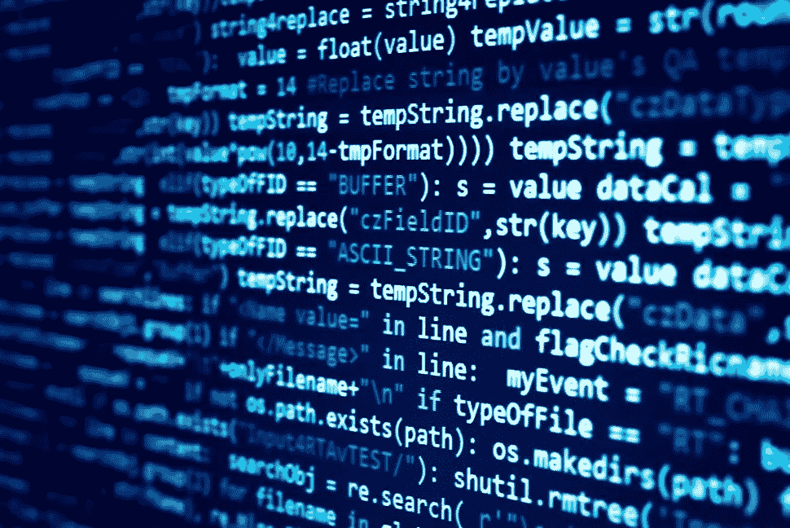
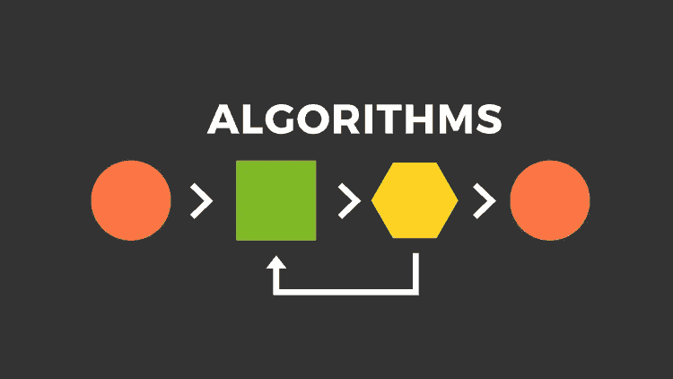

# 开启你的职业生涯

> 原文：<https://blog.devgenius.io/kick-start-your-career-f073dbbffc31?source=collection_archive---------30----------------------->

大家好，我希望所有人都安全！

现在我要分享一些关于计算机科学学生的生活。

我可以看到一些人在他们的大学生活中做更多的事情，在日常生活中完成更多的事情。这些人工作更加努力，他们从不浪费时间。他们将完美地计划他们的航空母舰，并在 4 到 3 年内完成。所以这些使他们成功地开始了他们的职业生涯。

但是其他人呢？这些人不知道他们必须做什么，也不知道从哪里开始他们的科技生活之旅。越来越多的人在寻找导师，一些学生没有兴趣做任何事情，他们只是通过玩游戏或看电视剧来利用时间，这些对他们来说不是专业的工作，对个人来说可能是工作，但不是专业的。

我为人民做了这篇文章，我们可以走了吗？

作为 CSE 或 IT 专业的学生，你们必须意识到这个技术之旅，也就是说，你必须知道世界上正在发生的事情，因为现在每个人都有资源，所以利用它，每天努力学习和探索新的东西。

这里有一些重要的要点，我想分享给那些在这个技术旅程中开始职业生涯的人，

*   专注于任何一种编程语言
*   数据结构和算法知识
*   发展知识
*   开源贡献
*   保持更新的简历
*   校园大使角色

## 1.专注于任何一种编程语言

每个人都对任何编程语言感兴趣，有些人对语言不感兴趣，但我建议每个有 CS 背景的人都应该有编程知识，这将使你进入一个好的公司。我建议你不要学习所有的语言，要精通任何一种语言，如 python、C、C++、Java 等。

## 2.数据结构和算法知识

每个人都应该掌握数据结构和算法的知识，这一点很重要

俗称 DSA。重要的是，如果你想成为一名软件开发人员，你应该学习任何语言和 DSA。

3.发展知识

你应该有任何一个领域的知识，即开发知识，

*   Web 开发
*   Android 开发
*   IOS 开发
*   云开发等。

## 4.开源贡献

为更多公司如谷歌、微软等开展的许多项目做更多的开源贡献。

用 Github 或者任何平台做开源贡献。

## 5.保持更新的简历

尽量使用 linkedin、Internshala 等简历平台更新简历。每天更新你的简历

## 6.校园大使角色

为你的学院或其他学院发生的任何事件做更多的大使和志愿者工作。一定要参加这些活动，发展你的领导力和沟通技巧，这将有助于你在你梦想的公司中占据更好的位置。

因此，这些是所有计算机科学学生要记住的重要事情，并开始你的技术之旅。

为什么要思考！启动！！！

谢谢大家！！！