# 使用 Laravel Sail (WSL2)启动您的 Laravel Web 应用程序

> 原文：<https://blog.devgenius.io/kickstart-your-laravel-web-app-using-laravel-sail-30276265e588?source=collection_archive---------0----------------------->

您可能熟悉 Laravel 开发环境中的 VirtualBox with Homestead。然而，在访问您的实际硬件资源之前，这种传统的托管虚拟机会带来额外的开销。

这几年，你可能会在互联网上到处听说集装箱化(或码头工人)。它不是虚拟化整个虚拟机，而是将代码及其所有依赖项打包成一个“容器”。[你可以在这里了解更多关于集装箱的知识](https://www.docker.com/resources/what-container) …你可能还在用 [*Laradock*](https://laradock.io/) …最终，在 2020 年 12 月，泰勒·奥特威尔发布了 **Laravel Sail** ！

**Laravel 10 的更新文章是** [**此处**](https://medium.com/@dogcomp/kickstart-your-laravel-10-using-laravel-sail-wsl2-1bd4e24c27cc) **！**

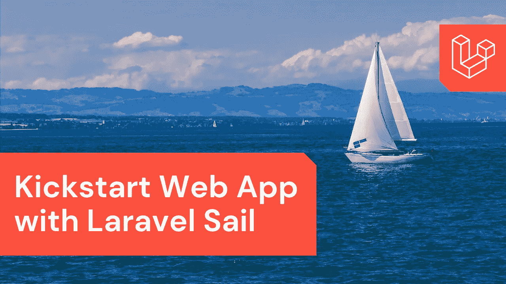

> Laravel Sail 是一个轻量级命令行界面，用于与 Laravel 的默认 Docker 开发环境进行交互。
> Sail 为使用 PHP、MySQL 和 Redis 构建 Laravel 应用程序提供了一个很好的起点，不需要任何 Docker 经验。
> 
> *来源:* [*拉勒韦尔文档*](https://laravel.com/docs/8.x/sail)

在本教程中，我将带您使用 WSL 2 在 Windows 上启动全新的 Laravel 项目。WSL 代表*Linux 的 Windows 子系统*，它允许开发者直接在 Windows 上运行 Linux 环境，而不需要任何“真正的”托管虚拟机。WSL 2 是一个重大改进，它提供了 WSL 1 的优点，并具有更好的文件 IO 性能(快 20 倍)。它不像传统虚拟机那样启动缓慢、资源开销大且完全隔离。

让我们在你的 Windows 机器上打开你的 WSL 2！

# 🐧安装 WSL 2

🛠️ **简化安装(windows 11/windows 10 2004 版或更高版本)** 以管理员权限打开命令窗口，运行
`wsl --install`，重启后就可以使用 WSL 了。


在 Windows 11 上用一个命令安装 WSL2

如果该命令不适用于您的 Windows 10 版本，请尝试下面的手动安装。或者，您可以寻找 [KB5004296](https://support.microsoft.com/en-us/topic/july-29-2021-kb5004296-os-builds-19041-1151-19042-1151-and-19043-1151-preview-6aba536a-6ed2-41cb-bc3d-3980e8693cc4) 了解更多详情。

🛠️ **手动安装
(Windows 10 Build 18362** **或更高版本，** **包括家庭版)**

**1。启用 WSL**

以管理员权限打开命令窗口，然后运行

```
dism.exe /online /enable-feature /featurename:Microsoft-Windows-Subsystem-Linux /all /norestart
```

**2。启用虚拟机功能**

WSL 2 仍然需要虚拟化功能。以管理员权限打开命令窗口，然后运行

```
dism.exe /online /enable-feature /featurename:VirtualMachinePlatform /all /norestart
```

**3。下载 Linux 内核更新包**

下载[x64 机器的 WSL2 Linux 内核更新包](https://wslstorestorage.blob.core.windows.net/wslblob/wsl_update_x64.msi)并安装。

然后，重新启动计算机。

**4。将 WSL 2 设置为默认版本**

```
wsl --set-default-version 2
```

**5。安装 Ubuntu(或您选择的 Linux 发行版)**

I)打开[微软商店](https://aka.ms/wslstore)然后搜索&选择 **Ubuntu** 。
II)在分发页面中，选择“获取”，然后选择“安装”
III)准备就绪后，单击“启动”
IV)为您的 Ubuntu 创建用户名和密码

6。使用 `wsl --list --verbose` **来验证您的安装**

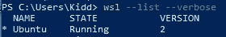

如果您遇到任何问题，您可以在此处参考一些故障排除提示[。](https://docs.microsoft.com/en-my/windows/wsl/install-win10#troubleshooting-installation)

# 🐳安装 Docker

**1。下载**
下载 [Docker 桌面稳定版 2.3.0.2](https://hub.docker.com/editions/community/docker-ce-desktop-windows/)或更高版本。

**2。安装**
按照安装向导安装 Docker 桌面。如果您的 WSL 2 配置正确，它应该在安装过程中提示您启用 WSL 2。

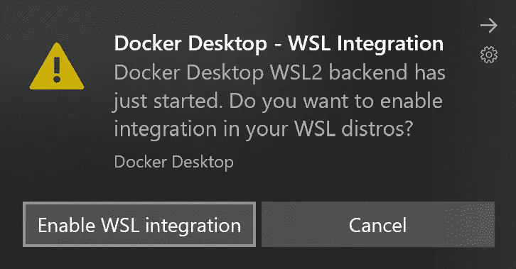

图片来源: [Visual Studio 代码—在 WSL 2 中使用 Docker](https://code.visualstudio.com/blogs/2020/03/02/docker-in-wsl2)

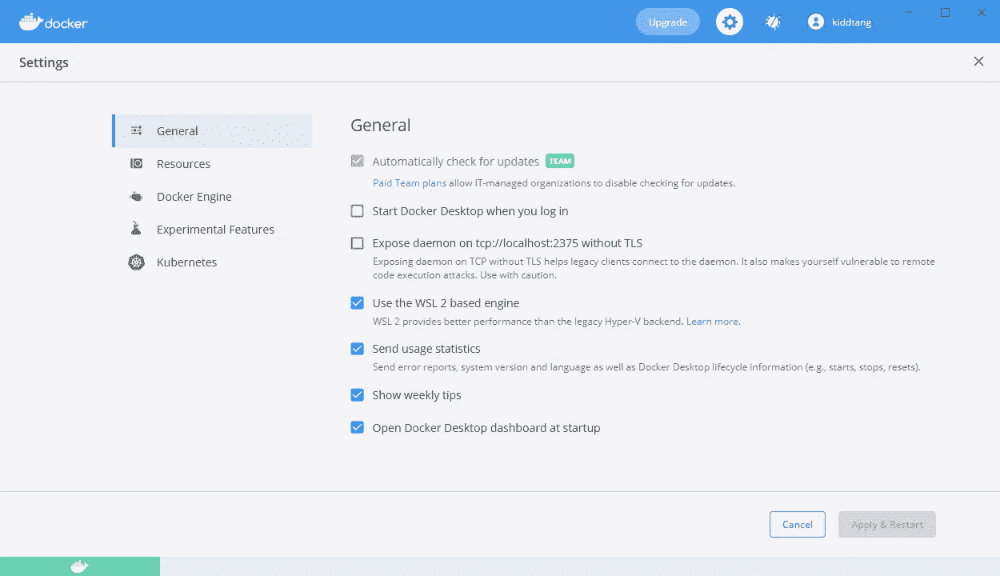

在 Docker 菜单中，选择**设置** > **常规**:确保 WSL 2 已启用。

**3。配置 WSL 集成** 确保打开正确的 Linux 发行版。

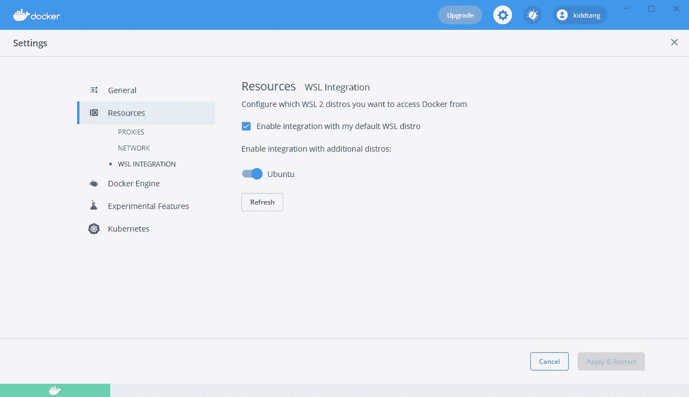

在 Docker 菜单中，选择**设置** > **资源** > **WSL 集成**

# ⛵，我们开船吧

启动[窗口终端](https://www.microsoft.com/en-us/p/windows-terminal/9n0dx20hk701)并键入`wsl`

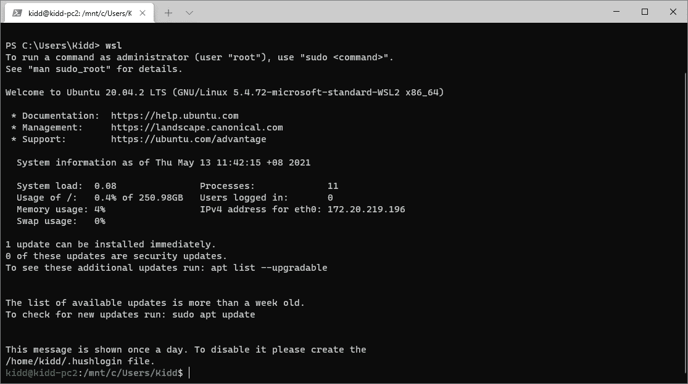

启动 WLS 新协议终端会话

这里有一个问题…你可能会注意到路径是你挂载的 Windows 用户目录。
在微软 WSL 官方文档上，陈述了对比。WSL 2 架构在几个方面优于 WSL 1，除了跨 OS 文件系统的性能。

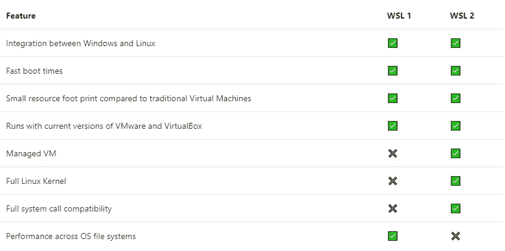

映像信用:跨操作系统文件系统的性能例外。([比较 WSL 1 和 WSL 2](https://docs.microsoft.com/en-us/windows/wsl/compare-versions)

⚠️[文件](https://docs.microsoft.com/en-us/windows/wsl/compare-versions)称…

> 我们建议不要跨操作系统处理您的文件，除非您有特殊的原因。
> 例如，存储 WSL 项目文件时:
> 
> ✔️使用的 Linux 文件系统根目录:
> `\\wsl$\Ubuntu-18.04\home\<user name>\Project`
> 
> ❌不是 Windows 文件系统根目录:
> `C:\Users\<user name>\Project`

我们可以通过使用`cd ~`进入你的 Linux 主目录

让我们使用这个命令创建一个名为`test-project`的新 Laravel 项目:

```
curl -s https://laravel.build/test-project | bash
```

然后等待安装

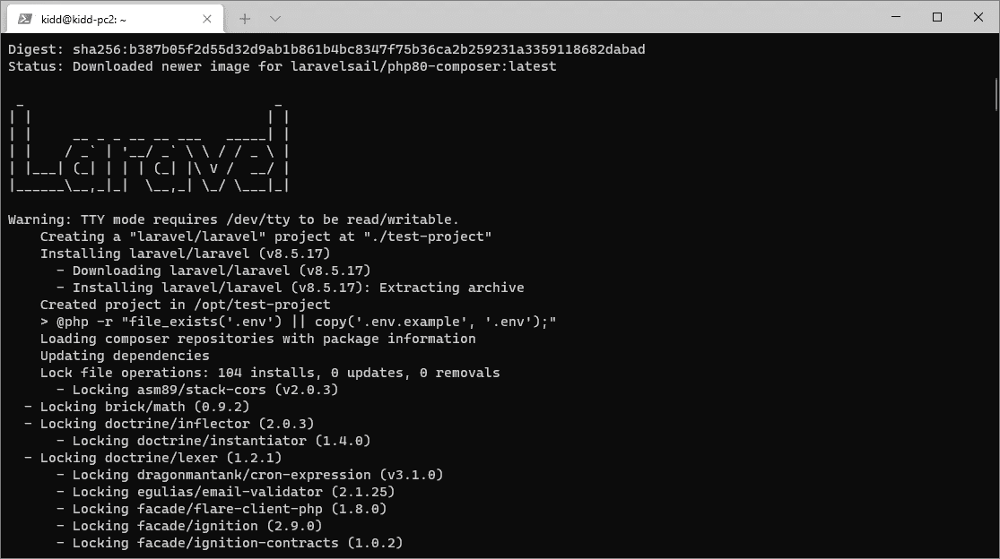

等待安装

您可能想知道如何访问您的 Laravel 项目文件。你可以通过网络共享`\\wsl$`来访问它

```
\\wsl$\Ubuntu\home\*<user name>*\test-project
```

> WSL 存储器(vhdx 格式)的实际位置位于
> T5

现在我们可以进入目录`cd test-project`开始航行了！

```
./vendor/bin/sail up
```

第一次运行`sail up`需要一些时间来下载 docker 镜像和构建你的容器，但是下一次运行会很快。

> 如果你遇到任何问题，你的反病毒软件可能是罪魁祸首。请排除路径“`C:\ProgramData\DockerDesktop\vm-data\`”。

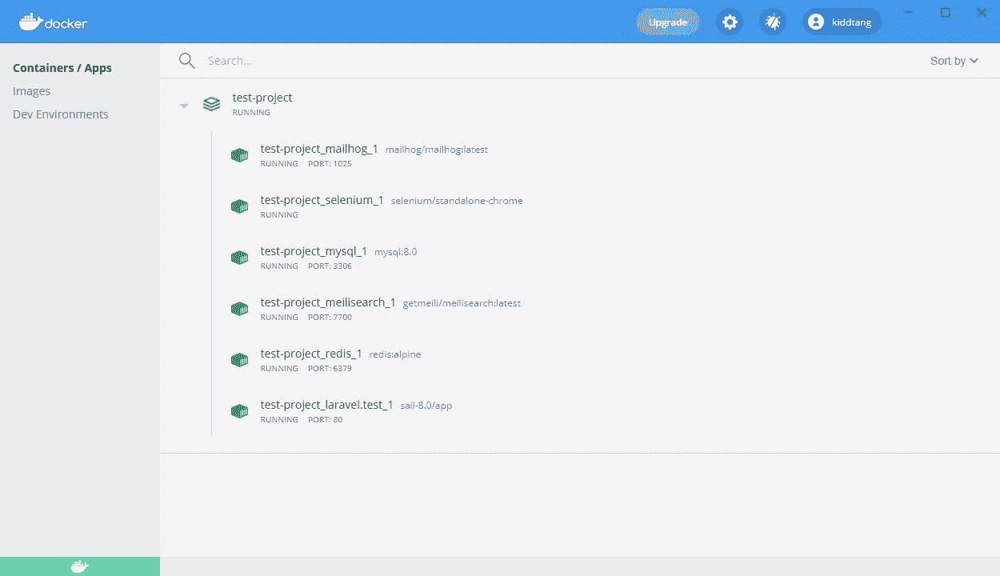

您可以看到您的容器启动并运行…

一旦启动了容器，您就可以进入 [http://localhost](http://localhost/) 来访问您全新的 Laravel 项目。

📦**挑选你的帆栈**

默认堆栈包括`mysql`、`redis`、`meilisearch`、`mailhog`和`selenium`。可用服务包括`mysql`、`pgsql`、`mariadb`、`redis`、`memcached`、`meilisearch`、`selenium`、`mailhog`。

您可以使用`with`查询选择您最喜欢的堆栈:

```
curl -s "https://laravel.build/example-app?with=mysql,redis" | bash
```

它将相应地配置您的`docker-compose.yml`文件。

🕗**每日航行常规**

**以分离模式开始航行**

```
./vendor/bin/**sail up -d**
```

**停止航行**

`Control + C`如果您没有使用“分离”模式，否则

```
./vendor/bin/**sail down**
```

**别名**

不要输入长路径名，而是配置一个 Bash 别名，允许您直接调用`sail`

```
alias sail='bash vendor/bin/sail'
```

> 您可以创建一个永久的别名将别名添加到您的`.bashrc`文件
> 中使用`nano *~/.bashrc*` *然后在底部添加* `alias sail='bash vendor/bin/sail'`然后运行`. ~/*.bashrc*`

# 💾开始你的编码

✍️ **Visual Studio 代码**

确保你安装了插件 [Remote — WSL extension](https://marketplace.visualstudio.com/items?itemName=ms-vscode-remote.remote-wsl) ，对于其他有用的 Laravel 开发扩展 VS 代码你可以参考 [this —这里是我的 Laravel](https://dogcomp.medium.com/here-is-my-vs-code-for-laravel-2021-6e816d997607) 的 VS 代码。

确保您位于项目文件夹中

```
cd ~/test-project/
```

那就跑

```
code .
```

您应该能够看到 VS 代码启动并显示您的项目文件夹

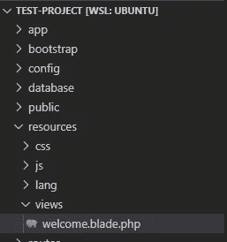

现在你可以在 [http://localhost](http://localhost/) 开始编码并预览你的修改

✍️ **PhpStorm**

您可以使用`\\wsl$\Ubuntu\home\<user>\test-project`打开项目

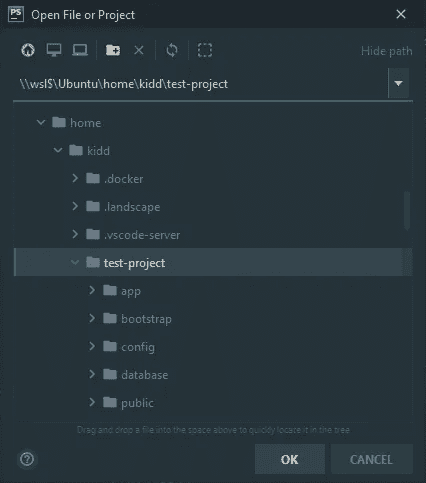

您也可以[在 PhpStorm 中配置解释器](https://www.jetbrains.com/help/phpstorm/configuring-remote-interpreters.html)

> 💡提示:您可以使用`sail artisan <command>`调用`artisan`命令

编码快乐！💪💪💪

> 💡提示:使用默认用户名为`sail`和密码为`password`的`localhost`连接您的 SQL 管理软件。

# 视频演示

> 💡故障排除:如果遇到“`port has already been allocated`”问题，
> 可以使用管理员权限运行以下命令:
> `net stop winnat
> netsh int ipv4 set dynamic tcp start=49152 num=16384
> netsh int ipv6 set dynamic tcp start=49152 num=16384
> net start winnat` 来源:[https://github . com/docker/for-win/issues/3171 # issue comment-788808021](https://github.com/docker/for-win/issues/3171#issuecomment-788808021)

更多关于 Laravel Sail 性能、[调试](https://medium.com/@dogcomp/b7b73e3dedf7)、[热重装](https://dogcomp.medium.com/quick-tip-laravel-mix-hot-reloading-in-sail-with-browsersync-555b6c97bca3)、 [Swoole HTTPS](https://medium.com/p/ddab7f5303ec) 、[带自定义域的多站点](https://medium.com/p/e13c07d9dd0c)等更多即将到来…关注我获取最新更新！感谢阅读😉

# 你准备好把你的网站放在网上，每月只需 10 美元就可以无限制地托管应用程序了吗？

**Cloudways** 提供了大量的特性，让你可以轻松托管你的 Laravel、WordPress 或任何 PHP 网站，而不用担心网络安全的噩梦。

现在，您可以在 BFCM 2022 活动期间享受额外折扣！


链接:[www.cloudways.com/en/?id=66136](http://www.cloudways.com/en/?id=66136)

让我们开始尝试一下**云道**！