# 糖尿病数据的 KNN 和随机森林

> 原文：<https://blog.devgenius.io/knn-and-random-forests-on-diabetes-data-447cacb727f2?source=collection_archive---------7----------------------->

第二部分

**5。机器学习技术:**

**5.1 数据集准备:**

在应用任何机器学习技术之前，数据准备是执行的必要部分。这是一个进行校正、根据需要合并数据以及重新格式化数据集的过程。

**步骤 1** :糖尿病数据集是一个分类数据集，其中只有年龄变量是非数字的，而数据集的其余部分是分类的。因此，需要执行数据转换，这有助于将非数字数据变量转换为数字形式，如 1 和 2。随着 as 的使用。数值函数将所有变量转换成数值数据。所有变量将定义在相同的规模来执行模型。对于应用 KNN 和随机森林，使所有数据值处于相同的比例非常重要。

**步骤 2** :对话后检查数据集的结构:-

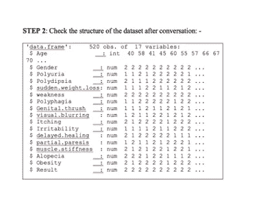

数据集摘要

**第三步:确定模型中的缺失值，并绘制一个可视化图形，以检查自变量之间的相关性。**

模型中没有值。只选择了几个独立变量来执行 corrplot。这有助于我们找出糖尿病的主要症状及其与其他症状的关系。

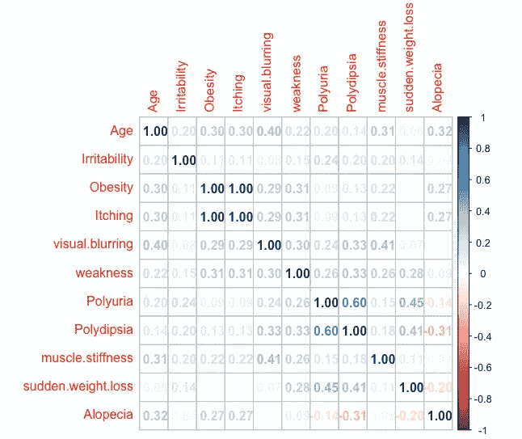

解释:

上面的 corrplot 说明了所有独立变量对之间的相关性。瘙痒和肥胖之间的高度正相关引起了眼睛的注意。具有瘙痒变量的肥胖显示出与 1.0 值的最大正相关。一般来说，超重可能会导致瘙痒问题，如体重增加对激素的影响，从而导致皮肤问题。而体重突然减轻的人可能与多尿症有关。这两个变量之间存在正相关，两者都可能被认为是糖尿病的典型症状。具有视觉模糊的年龄因素和具有肌肉僵硬的视觉模糊表示弱的正相关。然而，脱发与烦渴之间可以注重到负的微弱关系。

**5.2 拆分数据**

**步骤 1:将数据集分成两种形式:训练和测试**

-在应用模型之前，将数据分成两种形式训练和测试，其中 80%的数据集用于训练，20%用于测试模型。

-将模型数据框分为模型训练和模型测试数据框

**模型训练< -模型[1:416，]**

**模型测试< -模型[416:520，]**

有 520 个具有 17 个变量观察值，其中 80%的模型是为训练创建的，20%是为测试创建的。上面一行中的空格表示必须包含所有的列和行。这里，在创建训练和测试模型时，不添加因变量结果。

**模型训练 _ 标签< -模型[1:416，17]**

**模型测试 _ 标签< -模型[416:520，17]**

#在上述语句中，包含了因变量，它是放在模型数据集中第 17 列的结果

**5.3 KNN (K 近邻)模型**

KNN 简介:-

KNN 是一种最近邻技术，被称为监督学习，被认为是机器学习中最简单的一种。Knn 技术的主要焦点是使用标记的输入数据集对输出进行预测。它通常根据数据点与其同伴的相同程度来对数据点进行分类。

**步骤 1:训练模型并执行 KNN (K 近邻)**

要应用 K-NN 模型，需要执行 knn()函数。使用欧几里德距离，knn()函数确定 k 个最近邻，其中 k 是用户定义的数字。但是，在模型中执行 knn()函数需要 Class 包。

**库(类)**

**模型 1 优先< -knn(train =模型训练，test =模型测试，cl =模型训练 _ 标签，k=20)**

一般来说，K 值是根据观察次数的平方根选取的。因此，我们取 k 值为 20，这是起点 416 的平方。上面的 knn 函数返回模型标签的数值。Model1pred 是主模型。

**第二步:查看模型预测汇总**

输出:这里值 1 定义了否定结果，2 显示了肯定结果。阳性结果比阴性结果最多。

1 = 44

2= 61

**第三步:评估模型性能**

KNN 测试的模型已创建。现在，我们需要确定一个模型预测值的准确性。为了检查 model1pred 预测值是否准确以及是否与 Modeltest_labels 中的绝对值匹配，Crosstable()函数有助于确保这一点。

然而，要执行 Crosstable()函数需要安装 gmodel 包。

预测值和实际值的交叉表:-

**评论:-**

从上面的交叉表性能来看，一个表中的总观察值是 105。1 和 2 分别定义了阴性和阳性结果。其中 37 例为真阴性，如(1)在自然界中引发 35%。而真正的阳性病例为 50 例，占 47%。因此，150 个预测中有 50 个是真正的肯定。

然而，假阴性病例中有 7 例在性质上是阳性但被预测为阴性，假阳性病例中有 11 例在性质上被认为是阴性但被假定为阳性。

一个模型的准确性是通过真实的阳性和阴性病例的数量除以总的观察值来计算的。因此，((87/150) *100)模型达到了 82%的准确率。通过改变 k 值，有许多可能性来改进模型的执行。

**第四步:提高模型性能**

在模型上应用不同的 k 值(偶数值)来检查性能并确定最适合的模型。为了获得良好的性能或提高模型的准确性，FN 的(假阴性)值应低于。

**K= 16**

**观察上表**

**TP= 50**

**TN=42**

**准确度= 87%(最佳模式)**

**当 K=18 时，**

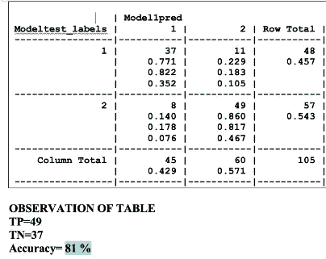

当 K 值为 20 时，

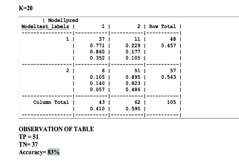

**评论:-**

已经用不同的 k 值进行了三次建模，其中每个模型显示不同的结果。k 值为 16 的模型具有最高的精确度，即，与其他模型相比，87%意味着最适合模型。该模型中的真阳性为 50，真阴性为 42，FP 值为 7，认为是低的。假负值有助于模型有效运行。降低 FP 可以提高精度。因此，这种模式被视为一种好模式。

**步骤 5:最佳模型数据的统计结构**

**通过混淆矩阵**检查准确性和性能细节

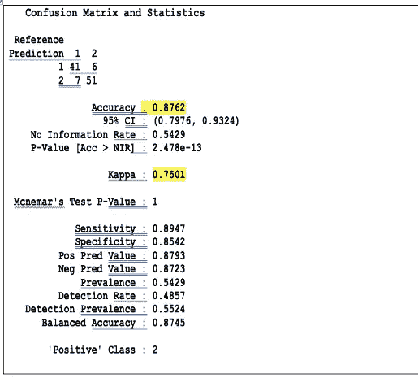

在应用混淆矩阵函数确定结果并将其与交叉表结果进行比较后。两者显示了相同的准确度结果，87%的值。此外，Cohen 的 kappa 值为 0.75，表明基本一致。kappa 被认为类似于相关系数，有助于解释模型中测试的可靠性。

**5.4 随机森林**

随机森林简介:-

它由多个决策树组成。其中每棵树分别预测新值或数据，随机森林有助于分散平均预测。随机森林的主要目的是分析来自不同树的不同于新观察的预测。

早期糖尿病数据集是分类数据，为 knn 模型转换为数值数据。但是要进行随机森林的处理，需要将数据集转换成因子。所以，可以做更好的预测。

**第一步:模型和分析的实施**

**Rf < - randomForest(结果~。，数据=模型)**

**调用随机森林模型:-**

**通话:**

**randomForest(公式=结果~。，data = Modeltrain)**

**随机森林类型:分类**

**树木数量:500**

**每次分割尝试的变量数量:4**

**OOB 对错误率的估计:3.85%**

**混淆矩阵:**

**1 2 class.error**

**1 141 11 0.07236842**

**2 5 259 0.01893939**

从上面的陈述中，可以观察到树的数量是 500，并且出袋误差是 3.85%，因此，我们可以说训练的模型的准确度是大约 96%。然而，mtry 值是 4，它定义了随机采样的变量。为了说明更多，将执行混淆矩阵和一些图表。

实现平均降低精度

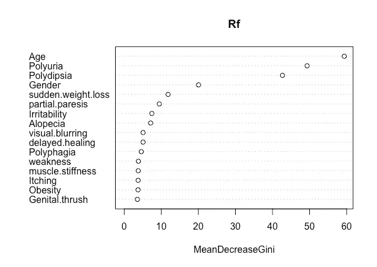

上面的随机森林图说明了基尼系数的平均下降。下降基尼值越高，模型中变量的重要性越大。

**第二步:训练和测试数据预测**

**列车数据的预测和混淆矩阵**

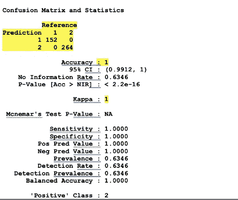

**测试数据的预测和混淆矩阵**

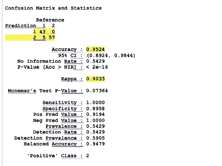

注释:-

根据上述训练和测试数据的预测和混淆矩阵。训练模型用 1 个 kappa 值表示 100%的准确度。此外，敏感度为 1 的值意味着模型足够好，可以进行预测。获得 100%的准确度也可以指示过度拟合数据。在这种情况下，可能会出现过拟合问题，原因可能是输入数据中的噪声或未知错误。然而，在训练数据集上获得 100%的准确性可以完美地拟合，但是在新数据上可能表现不佳。

另一方面，测试模型显示出 95%的准确性，kappa 值为 0.90，这表明对于糖尿病数据的早期风险预测来说是几乎完美的模型。

随机森林的错误频率

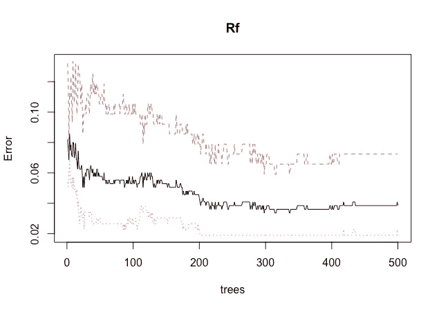

随机森林模型预测精度高。因此，不需要进一步的处理，例如调谐。但是，训练数据显示 100%的准确性，这表明过度拟合，因此，我们可以尝试用不同数量的树和 mtry(随机采样变量)来调整模型。

**第三步:调整模型**

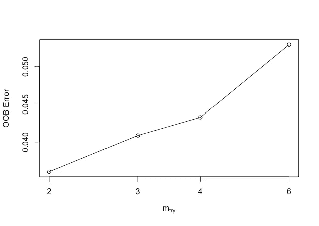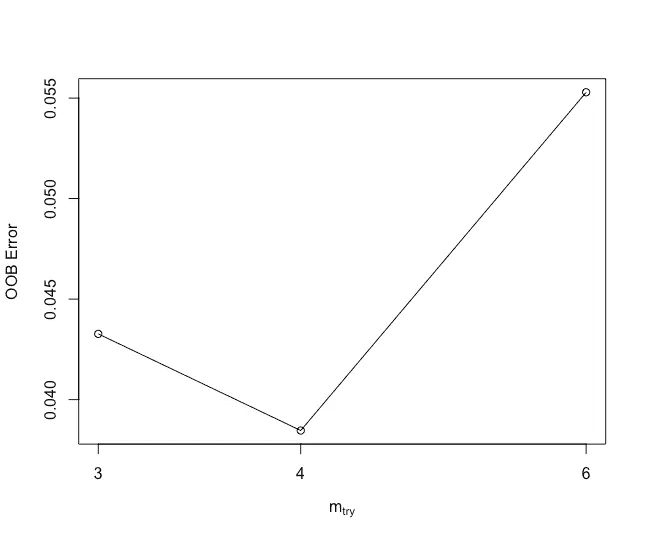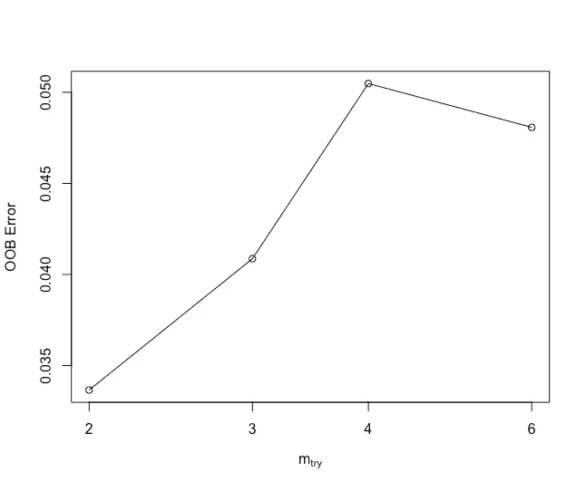

**调整模型输出:-**

**mtry = 4 OOB 误差= 4.81%**

**向左搜索…**

**mtry = 3 OOB 误差= 4.09%**

**0.15 0.01**

**mtry = 2 OOB 误差= 3.37%**

**0.1764706 0.01**

**向右搜索…**

**mtry = 6 OOB 误差= 5.05%**

**-0.5-0.01**

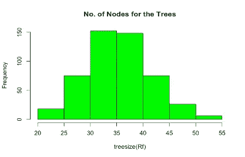

为了提高随机森林模型的性能，需要进行超参数调整。它可以调整以提高准确性等个别指标。其中 mtry 值选择了 4。通过运行不同的时间，它显示离散的结果。举例来说，当 mtry = 4 时，OBB 误差为 4.33 %。在执行四次时，mtry 值减小等等错误。

**第四步:绘制前 10 个重要变量**

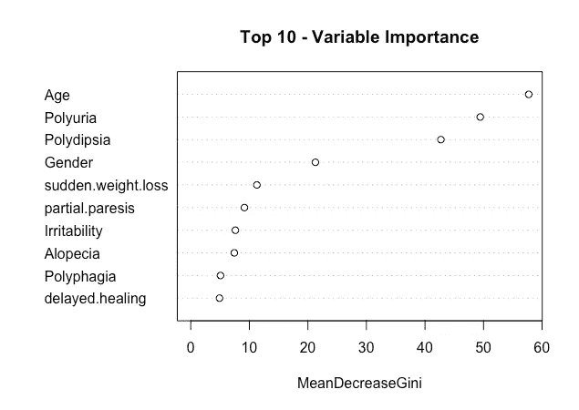

从上述平均降低准确度或基尼系数可以看出，最重要的变量是年龄、多尿、多饮、性别和体重突然减轻。

**5.5** **车型间对比**

为了更好地比较 KNN 和随机森林，已经执行了汇总、散点图和密度图**。**

**第一步:创建两个模型的结果**

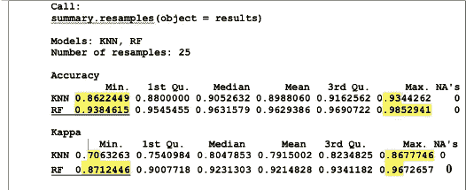

Knn 和随机森林概述

有 25 个重采样。明明可以看到，在闵。准确率为 86%，kappa 为 0.70，而随机森林拥有最大值。在随机森林模型中，最小精度值和 kappa 值分别为 93%和 0.87。

**第二步:区分型号**

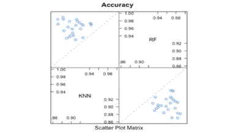

准确度散点图

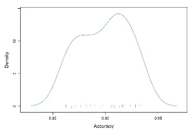

KNN 的密度图(K-最近邻)

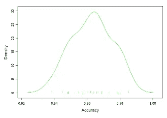

随机森林密度图

上图说明了 Knn 和随机森林之间的区别。显然，在同一数据集上应用这两种技术后。据观察，随机森林比 KNN 表现更好。在 KNN，准确率为 87 %, kappa 值为 75 %,而随机森林模型具有最高值，准确率为 95 %, kappa 值为 90%,这确保了最佳模型。为了更好地理解，还绘制了密度图。

一般来说，Knn 适用于数值数据，比如离散和连续的数据。基本上，确定具有封闭 k 邻居的匹配数据点是有益的。相反，随机森林比 knn 更好地预测了这里的结果。在分割数据集时，随机森林有助于找出数据集最重要的特征。

因此，从所有的观察和准确性结果来看，随机森林认为是预测数据集结果(糖尿病早期风险)的最佳模型，而与随机森林相比，Knn 在该数据集上表现不佳。

**6。结论:**

总体研究评估了机器学习在糖尿病疾病可治愈阶段的诊断中的不同预测模型。我们尚未达到的最重要的里程碑之一是将技术融入医疗领域。机器学习模型可以有利于在早期阶段预测人体中严重威胁生命的疾病，如糖尿病。在本研究中，两种方法对同一具体问题进行了实验。

在糖尿病数据上实施选择性监督的机器学习模型当然有助于提供更好的健康服务和扩大决策。

已经训练了多个机器学习模型，以便实现最佳结果和结果，从训练两个模型到显示随机森林是最有效的技术。随机森林实现了 96%的准确率，这表明是一个完美的拟合模型，而 Knn 实现了 87%的准确率。因此，Knn 算法在跟踪所有训练数据时速度较慢，并且随机森林更加准确和鲁棒。

此外，这项研究还揭示了早期糖尿病的主要症状。这些是年龄，多尿，烦渴，性别和突然体重下降。衰老是发展糖尿病的最重要因素之一，糖尿病不仅会导致体重问题，还会导致其他问题。

这花了我很多时间，我希望它能帮助你了解机器学习的概念。同样为了全面的理解，我在每个图形和模型表现后都给出了解读。

在此检查可视化部分[。](https://medium.com/@mehraanshita03/early-stage-diabetes-risk-prediction-dataset-69c0221efe5e)

然而，这是我的第一个 ML 项目。

谢谢；)