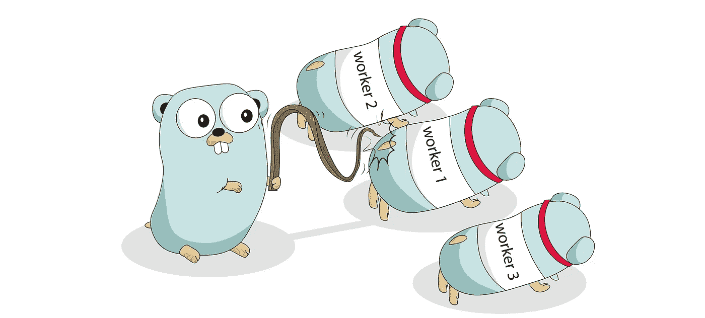
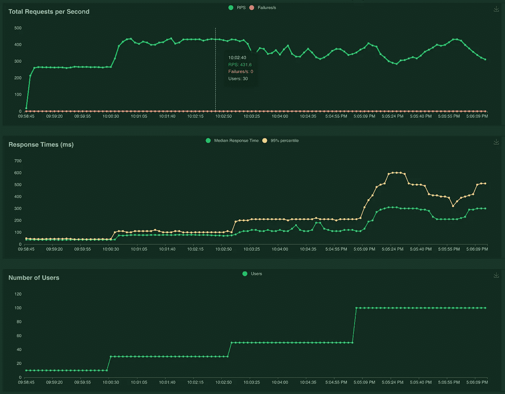
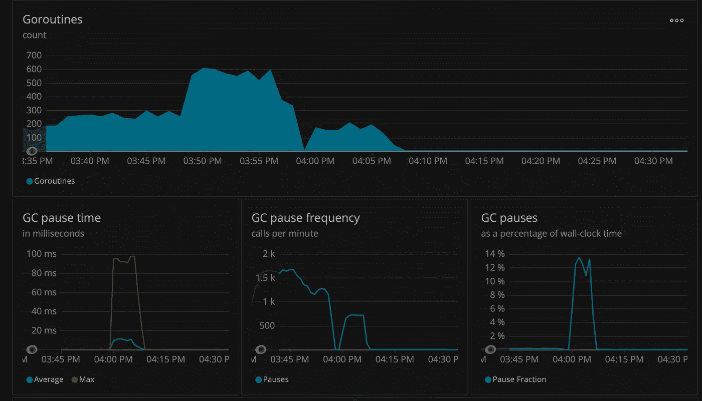
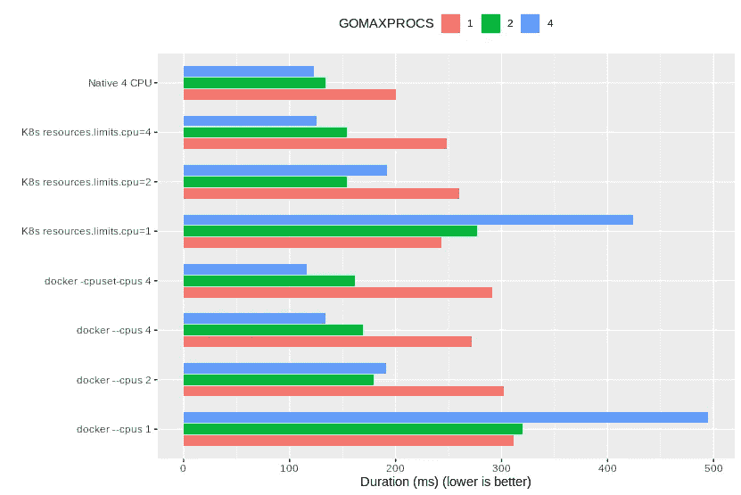
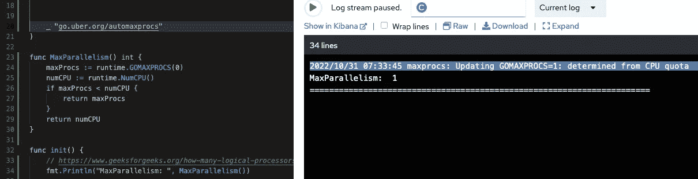
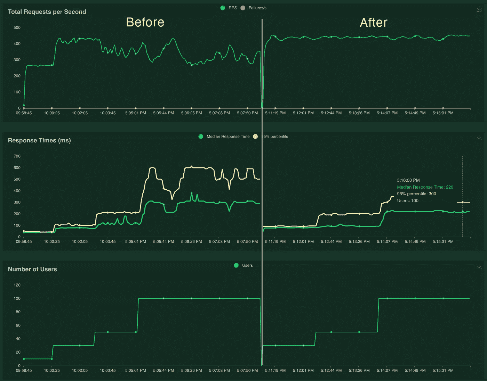
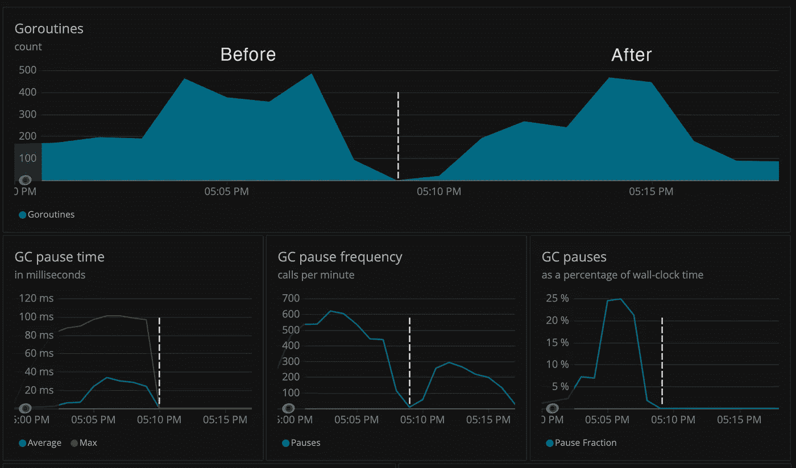
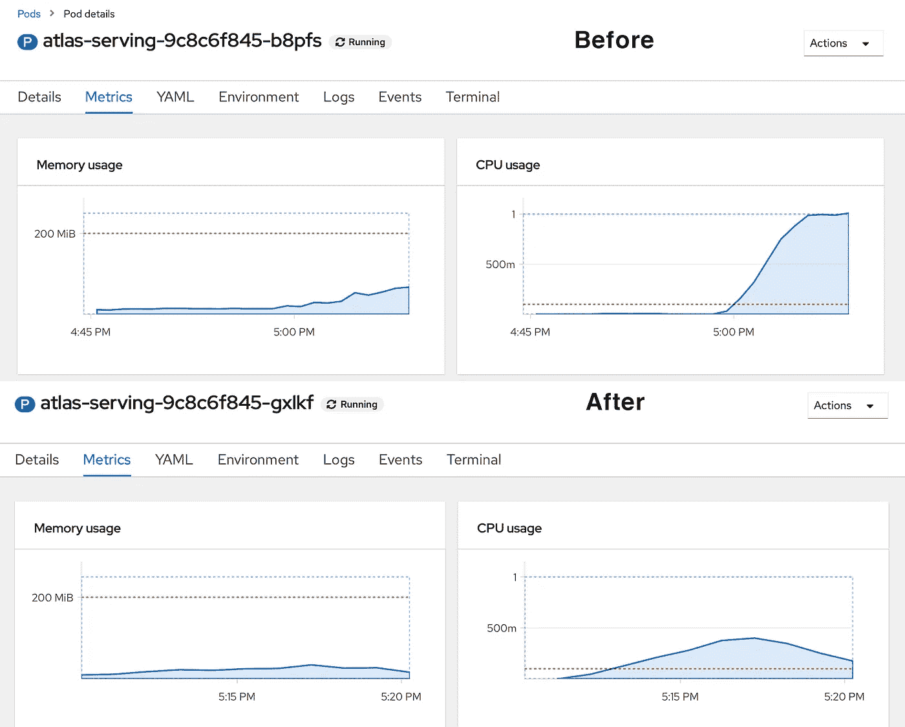
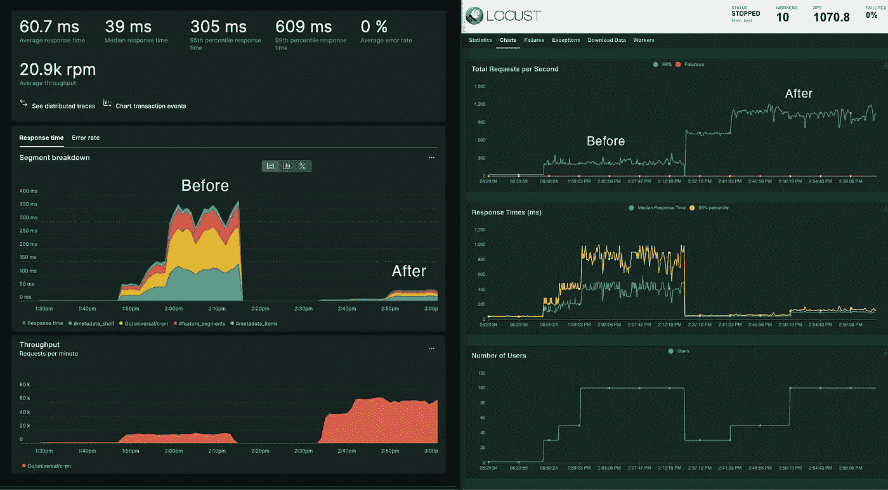

# 在将您的 GO 应用程序部署到 Kubernetes 之前了解 GOMAXPROCS

> 原文：<https://blog.devgenius.io/know-gomaxprocs-before-deploying-your-go-app-to-kubernetes-7a458fb63af1?source=collection_archive---------1----------------------->

如果您正在编写 Go 并发应用程序并在 Kubnernetes 上运行它，这是您需要了解的配置。



# 问题是

在我们的测试中，我们注意到当服务在高负载下不堪重负时，性能会急剧下降。当我们将用户数量从 30 增加到 50 和 100 时，您可以看到中值和 p95 延迟呈指数级增长。



当我们对大量用户进行负载测试时，存在响应时间缓慢的问题。

在查看多个跟踪后，我们在 [newrelic 的](https://docs.newrelic.com/docs/apm/agents/go-agent/features/go-runtime-page-troubleshoot-performance-problems/) go-runtime monitor 中发现了一个不寻常的 GC 暂停时间(即[stop-the-world](https://medium.com/a-journey-with-go/go-how-does-go-stop-the-world-1ffab8bc8846)garbage collection ),这可能是响应时间缓慢的根源。



# 根

但是**为什么**GC 暂停时间这么高？—Pods/Go 运行时或 Goroutine 配置有什么办法吗？

在寻找解决方案时，我们发现了一篇文章， [*在 Kubernetes*](https://medium.com/inlocotech/running-go-application-on-kubernetes-6fb55f908258) 上运行 Go 应用程序，其中提到了关于 Go 运行时变量 GOMAXPROCS 的内容。

> 这控制了它可以产生的系统线程的数量。这意味着实际上可以并行运行的 goroutines 的数量。在 Kubernetes 中，**节点上所有可用的 CPU 核心对其 pod**可见(而不是清单中配置的限制)”

**>这意味着，**如果您将一个 pod CPU 限制设置为`1 core`，但您的节点有`64 cores`的 CPU，您的 Go 应用程序将获取实际的节点资源并设置`GOMAXPROC to 64.` 因此，您过度分配了比 Pod CPU 更多的线程。这会影响表演。


我得验证一下这是不是真的。于是我更新了代码，在带 cpu 的 K8s 上运行。`limit=1`。它显示`GOMAXPROCS`为 64(与节点 CPU 相同)。

这也得到了[github.com/uber-go/automaxprocs/issues/12](https://github.com/uber-go/automaxprocs/issues/12)的证实，

> *“当 GOMAXPROCS 高于分配的 CPU 配额时，我们也看到了显著的节流”*。

下图显示了基准测试结果，当`GOMAXPROCS`设置为等于给定的 cpu 时，它提供了最佳性能。



[https://github . com/Uber-go/auto maxprocs/issues/12 # issue comment-569019892](https://github.com/uber-go/automaxprocs/issues/12#issuecomment-569019892)

# 解决方案

正如在基准测试结果中所讨论的，应该将`GOMAXPROCS`设置为 pod 中可用的核心数。对于一个简单的配置，优步的[auto expross](https://github.com/uber-go/automaxprocs)通过在代码中添加一个导入行来帮助你完成。

```
import _ "go.uber.org/automaxprocs
```



# 结果

现在我们得到了正确的配置，让我们来证明结果。下图是`automaxprocs`设置前后的情况。它表明，在高负载下，响应时间更短且更稳定。



蝗虫负载测试

至于 [newrelic 的](https://docs.newrelic.com/docs/apm/agents/go-agent/features/go-runtime-page-troubleshoot-performance-problems/)监视器，注意 GC 暂停时间减少到 1ms 左右，GC 暂停频率*(stop-the-world 垃圾收集每分钟调用次数)*也减少了。



新遗迹开始运行时监控

最后，cpu 的利用率更高，消耗的资源更少。



Openshif 资源指标

在一个更高强度的应用程序中，你会看到更多这样的性能差异。在我们的例子中，如果不设置它，速度会慢 50%以上



*Plus:*[*k8s 端 cpu 配额小于 1 核会怎样？*](https://github.com/uber-go/automaxprocs/issues/54) ，*我也测试过这个假设。事实证明，1 个核心的 1 个 pod 比 5 个 200m 核心的 pod 效率更高。此外，当 cpu 限制设置为 200m 内核时，* `*automaxprocs*` *不会低于 1。*

**最后的想法**

如果你在 Kubernetes 中运行你的 GO 应用程序，GOMAXPROCS 是至关重要的，应该进行配置，否则你可以使用 [automaxprocs](https://github.com/uber-go/automaxprocs) 来完成这项工作。最好使用全内核 CPU，因为 GOMAXPROCS 消耗整数数量的内核。这确保有足够的资源来利用线程。