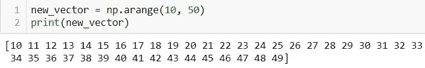
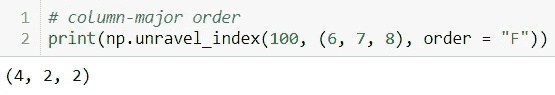

# 通过真正困难的问题了解 numpy

> 原文：<https://blog.devgenius.io/knowing-numpy-through-the-really-tough-questions-609fa83ba5df?source=collection_archive---------2----------------------->


艾米丽·莫特在 [Unsplash](https://unsplash.com?utm_source=medium&utm_medium=referral) 上的照片

numpy 可以说是最通用的 Python 库，高效、快速且可互操作。在本帖中，我们将通过用例展示 numpy 的强大功能。

> **1。导入名为 np** 的 numpy 包


**as** 关键字将 numpy 重命名为 np

> **2。打印 numpy 版本和配置**


不是每个人都使用相同版本的 numpy

> **3。创建一个大小为 10 的空向量**


来自 numpy 的 **zeros( )** 创建空向量(仅包含 0)

> **4。查找数组的内存大小**


**arange( )** 以 1 为间隔(由第三个参数指定)生成从 1 到 6(不包括)的元素

> **5。获取 numpy 添加函数**的文档


向 numpy 的 **info( )** 方法传递函数名(本例中为**加**

> **6。创建一个大小为 10 的空向量，第五个值为 1**


将级联列表传递给 numpy 的 **array( )** 方法，其中*用于重复元素

> 7。创建一个取值范围为 10 到 49 的向量



numpy 的 arange( ) 创建一个从 10 到 50(不包括)的数组，步长为 1

> **8。反转一个矢量**


使用切片和负索引

> **9。创建一个 3 x 3 的矩阵，矩阵值的范围从 0 到 8**


**reshape( )** 将来自 **arange( )** 的向量重新排列成 3×3 矩阵

> **10。从[1，2，0，0，4，0]中寻找非零元素的索引**


**非零()**numpy 方法返回 numpy 数组中非零元素的索引列表

> **11。创建一个 3×3 的单位矩阵**


**eye(m)** 方法创建一个 **m x m** 单位矩阵

> **12。用随机值创建一个 3 x 3 x 3 的数组**


**random_array** 是一个 3×3×3 的矩阵，包含 27 个从 1 到 100(不含)的随机整数

> **13。用随机值创建一个 10 x 10 的数组，并找到最小和最大值**

**min( )** 和 **max( )** from numpy 分别从 numpy 数组中找出最小值和最大值:


从范围从-100 到 100(不含)的随机整数矩阵中寻找最小值和最大值

> **14。创建一个大小为 30 的随机向量，并找出平均值**

**mean( )** from numpy 查找 numpy 数组中所有值的平均值:


**rand_vec_mean** 是一个 numpy 向量，包含 30 个从-30 到 30(不含)的随机整数

> 15。创建一个边界为 1，内部为 0 的二维数组

从一个只有 1 的矩阵开始，我们填充从索引 1 开始的所有行和列，直到但包括最后一个索引:


**_ array**是一个具有所需值的 5×5 矩阵

> **16。如何在现有数组周围添加边框(用 0 填充)？**

在一个随机整数的矩阵周围，我们使用 numpy 的 **pad( )** 方法添加一个 0 的填充。将生成的矩阵重新分配给原始数组:


我们想要一个常量 **(mode，constant_values)** 两行两列 0 的宽度 **(pad_width)**

> **17。找出下列表达式的结果**

```
0 * np.nan
```


对 **nan** 值的任何数学计算都会返回 **nan** 本身

```
np.nan == np.nan
```


**nan** 值未定义，比较结果为假

```
np.inf > np.nan
```


由于 **nan** 未定义，所以不清楚它是否小于无穷大( **np.inf** )

```
np.nan - np.nan
```


从 **nan** 中减去 **nan** 得到 **nan** ！

```
0.3 == 3 * 0.1
```


Float 不是按原样存储，而是以更高的精度存储。因此，3 * 0.1 不会产生精确的 0.3

> 18。在对角线下方创建一个值为 1、2、3、4 的 5 x 5 矩阵

numpy 中的 **diag( )** 函数根据对角线的大小创建一个矩阵。对角线正下方有 4 个值，对角线本身正好由 5 个元素组成。参数 **k** (默认值为 0)设置为-1，表示对角线正下方的元素，这些元素是使用 **arange( )** 方法生成的:


**diag( )** 方法创建一个 5 x 5 的矩阵，其元素位于从 **arange( )** 生成的对角线下方

> **19。创建 8×8 的矩阵并用棋盘图案填充它**

棋盘图案是指在行和列上交替出现 0 和 1。我们创建一个 0 的矩阵，并开始在所需的位置填充 1:


我们只需要整数值，因此 **dtype** 参数被设置为 **int**

让我们用交替的 1 填充每一个交替的行:


具有交替 1 的交替行

让我们用备选项 1 填充备选项列(与上述步骤相反):


棋盘矩阵！

> 20。考虑一个(6，7，8)形状的数组，找到第 100 个元素的索引(x，y，z)

numpy 的**unallow _ index()**函数查找以行优先顺序或列优先顺序表示的矩阵的任意元素的位置值:


order = "C "考虑以行优先顺序存储的给定形状的矩阵(由元组表示)



order = "F "考虑以列优先顺序存储的给定形状的矩阵(由元组表示)

> **21。使用平铺功能**创建一个 8×8 的棋盘矩阵

我们从交替的 0 和 1 的 2 x 2 矩阵开始:


需要使用 tile()来扩展它

numpy 的 **tile( )** 方法获取上面的矩阵，并跨行和列一次复制四个矩阵(由 tuple 参数表示):


0 和 1 的棋盘矩阵

> **22。标准化一个 5 x 5 的随机矩阵**

一个数的归一化是两项的比值。分子是通过从我们正在归一化的数字中减去整个集合的**最小值得到的。从整组**的**最大值中减去整组**的**最小值得到分母**


**random_matrix** 是介于-20 到 20(不含)之间的随机整数的 5×5 矩阵

分别使用 **np.min( )** 和 **np.max( )** 计算**最小值**和**最大值**值:


寻找 **random_matrix** 的最小值和最大值

标准化后，所有值都在 0 和 1 之间:


**random_matrix** 已经归一化

> **23。将一个 5×3 矩阵乘以一个 3×2 矩阵(实矩阵乘积)**


矩阵乘法是可能的，因为**第一个矩阵的列数=第二个矩阵的行数**

> **24。给定一个 1D 数组，取 3 到 8 之间的元素的反，就位**

我们首先构建一个条件语句，它将过滤掉 3 到 8 之间的元素。随后根据条件索引随机向量。满足给定范围的元素乘以 **-1** 得到负数:


生成介于 1 和 10(不含 1 和 10)之间的随机数，并对介于 3 和 8 之间的随机数求反

> 25。如何找到两个 numpy 数组之间的公共值？

**intersect1d( )** 函数返回两个 numpy 数组的交集:


**arr1** 和 **arr2** 是两个随机整数数组；它们的公共元素存储在**交集**中

> **26。创建一个大小为 10 的向量，取值范围从 0 到 1，两者都不包括**

**numpy** 中的 **linspace( )** 函数返回指定区间内间隔相等的数字，从范围下限开始，到范围上限结束。因为我们需要 10 个值，不包括起点和终点，所以我们传递 12 作为元素计数(由参数 **num** 表示)并使用切片排除限制:


排除 0 和 1，使用**【1:-1】**，我们将剩余的 10 个元素存储在 **x** 中

> **27。创建一个大小为 10 的随机向量并排序**

将 **numpy** 的内置 **sort( )** 方法应用到从范围 **-10 到 20** (任何其他间隔也可以)内的 **10** 个随机整数创建的数组上:


**sort( )** 方法返回排序后的随机整数序列

> 28。考虑两个随机数组 A 和 b。检查它们是否相等

当且仅当所有对应的元素都匹配时，称两个数组相等。 **all( )** 函数和等式条件一起产生期望的结果:


**all( )** 仅当 **A** 和 **B** 中的所有对应元素相等时，返回 **True**

> **29。创建一个大小为 10 的随机向量，并将最大值替换为-1**

我们首先使用 numpy 的 **random( )** 函数创建一个介于 0 和 1(不含)之间的浮点向量。 **argmax( )** 函数返回最大浮点的位置值。我们通过插入-1:


插入-1 前后显示 **rand_vec**

我希望这篇文章对你有所帮助。请随时留下您的评论、反馈、批评、想法和其他一切。回头见！