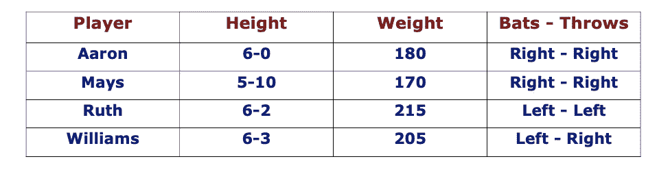
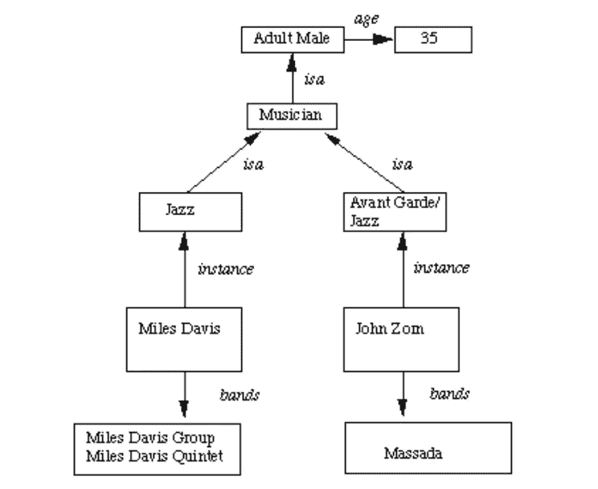

# 知识表示方案

> 原文：<https://blog.devgenius.io/knowledge-representation-schemes-fe5fc4dc2cc5?source=collection_archive---------3----------------------->

在 [Unsplash](https://unsplash.com?utm_source=medium&utm_medium=referral) 上由 [Jaredd Craig](https://unsplash.com/@jaredd_craig?utm_source=medium&utm_medium=referral) 拍照

## 相关知识:

表示声明性事实的最简单方式是作为一组与数据库系统中使用的相同类型的关系。

提供基于等效属性比较两个对象的框架。

比较两个不同对象的任何实例都是一种关系型知识。

下表显示了一种存储事实的简单方法。

*   关于一组对象的事实被系统地放在列中。
*   这种表示很少提供推理的机会。

*   鉴于这些事实，不可能回答这样简单的问题:“谁是最重的运动员？”
*   但是如果提供了一个寻找最重玩家的程序，那么这些事实将使该程序能够计算出一个答案。
*   我们可以问这样的问题，谁“向左击球”和“向右投球”。

## 可继承的知识:

在这里，知识元素从它们的父元素继承属性。

这些知识体现在功能、物理和过程领域的设计层次中。

在层次结构中，元素从它们的父元素继承属性，但是在许多情况下，并不是父元素的所有属性都规定给子元素。

继承是一种强有力的推理形式，但还不够。

基本的知识表示需要增加推理机制。

属性继承:特定类的对象或元素从更一般的类继承属性和值。

这些类被组织在一个通用的层次结构中。

*   带框节点—对象和对象的属性值。
*   箭头—从对象指向其值。
*   这种结构被称为插槽和填充结构、语义网络或框架集合。

检索实例对象的属性值的步骤如下:

1.  在知识库中查找对象
2.  如果该属性有值，请报告它
3.  否则，如果没有失败，则寻找实例值
4.  否则，转到该节点，为该属性找到一个值，然后报告它
5.  否则，使用 isa 进行搜索，直到找到该属性的值。

## 推理知识:

这种知识从给定的信息中产生新的信息。

这种新信息不需要从来源收集进一步的数据，但是需要对给定的信息进行分析以产生新的知识。

例如:给定一组关系和值，可以推断出其他值或关系。谓词逻辑(数学推导)用于从一组属性中进行推断。通过谓词逻辑的推理使用一组逻辑操作来关联各个数据。

将知识表示为形式逻辑:

> **所有的狗都有尾巴**∀x***:dog(x)→hastail(x)***

优势:

*   一套严格的规则。
*   可以用来推导更多的事实。
*   新陈述的真实性可以被验证。
*   保证正确。

许多推理程序可用于实现人工智能系统中流行的标准逻辑规则。例如自动定理证明。

## 程序知识:

一种表示法，其中使用知识的控制信息嵌入在知识本身中。例如，计算机程序、方向和食谱；这些表示特定的使用或实现；

知识被编码在一些程序中，小程序知道如何做特定的事情，如何进行。

优势:

*   可以表示启发式或领域特定的知识。
*   扩展逻辑推理，如默认推理促进。
*   动作的副作用可以被建模。有些规则可能假以时日。在大型系统中跟踪这一点可能很棘手。

缺点:

*   完整性——并非所有情况都能得到体现。
*   一致性——并非所有的推断都是正确的。如果我们知道弗雷德是一只鸟，我们就可以推断弗雷德会飞。后来我们可能会发现弗雷德是一只鸸鹋。
*   牺牲了模块化。知识库的变化可能会产生深远的影响。
*   繁琐的控制信息。