# KNX 智能家居[完全指南和评论]

> 原文：<https://blog.devgenius.io/knx-smart-home-a-complete-guide-and-review-4996ce8f997d?source=collection_archive---------5----------------------->

今天，智能家庭自动化系统在家庭建筑中广泛应用于智能应用。因此，许多自动化协议，如 BACnet、C-Bus、1-wire 和 KNX 得到了快速发展。KNX 协议就是其中著名的一个。此外，还有一些规格，如简单快速的安装过程，用户友好的软件，并适应当前的系统。随着智能家居的兴起，KNX 系统在家庭中得到广泛应用。它叫做 KNX 智能家居。

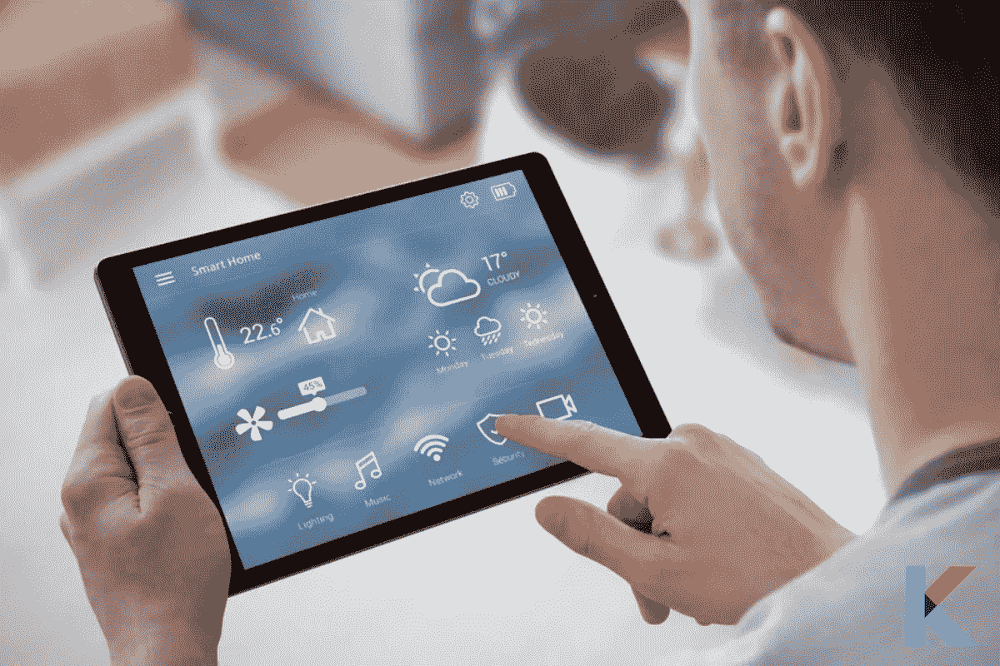

***在本文中，我们将介绍:***

*   KNX 智能家居是什么？
*   KNX 智能家居 app 是什么？
*   KNX 智能家居有哪些特点？
*   KNX 智能家居的重要性
*   KNX 智能家居的 10 款最佳产品
*   如何从 KNX 入手？
*   KNX 智能家居是如何工作的？
*   KNX 智能家居控制如何？
*   软件包与 KNX 的比较
*   KNX 智能家居产品的价格和颜色对比？
*   KNX 和无线我该选哪个？

# **什么是 KNX 智能家居？**

KNX 是家用和商用楼宇自动化和有线自动化的开放标准。该标准由 KNX 协会管理。此外，KNX 设备可以管理百叶窗和百叶窗、照明、安全系统、HVAC、能源管理、白色家电、音频、视频和远程控制。

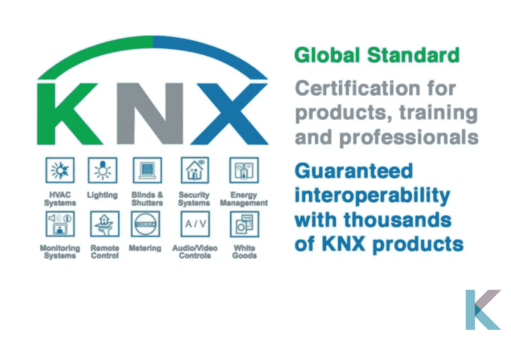

主要是，它可以通过确认任何建筑的所有设备、组件、功能和特征通过一种通用语言进行远程通信来工作。它还为未来与所有自动化设备的兼容性提供了最佳保证。

KNX 智能家居是将任何一组设备、电器连接成自动控制并使用 KNX 系统进行监控。您可以使用一个系统来控制整个架构的各种功能。不需要额外的控制中心。它使事情变得更加舒适和方便。它还提高了我们城市居住环境的能源效率。此外，根据加密标准 AES 128，它是最安全的智能家居技术。

随着智能家居的兴起，KNX 系统似乎已经过时了。他们很难扩展自动化。此外，它们没有花哨的智能手机应用。它不能轻松地与谷歌助手、Alexa 和其他新的[智能家居设备](https://kodmy.com/wink-smart-home-solution/)如 Sonos、[飞利浦 Hue](https://kodmy.com/about-philips-hue/) 或 Fibaro 整合。

然而，对于 KNX 系统所有者来说，有一个好消息。他们还可以使用 Homey 应用程序组合他们的无线智能家居设备。你也可以用亚马逊 Alexa 或谷歌助手轻松控制你的 KNX 安装。

这可以链接起来创建定制的 If This Then That)技术功能。电线直接穿过每面墙。因此，它可以被认为是你房子的中枢神经系统。此外，KNX 布线(总线系统)集成到现有的家庭。它通常安装在较新的家庭中。

因此，该协议被应用在标准化技术中。有许多来自不同制造商的 KNX 产品，它们彼此都很友好。这就是为什么 KNX 系统通常在家里使用的著名原因。

使用 KNX 智能家居应用程序，您可以直接从平板电脑或智能手机轻松调整或控制一系列 KNX 功能和应用程序。

# KNX 智能家居 app 是什么？

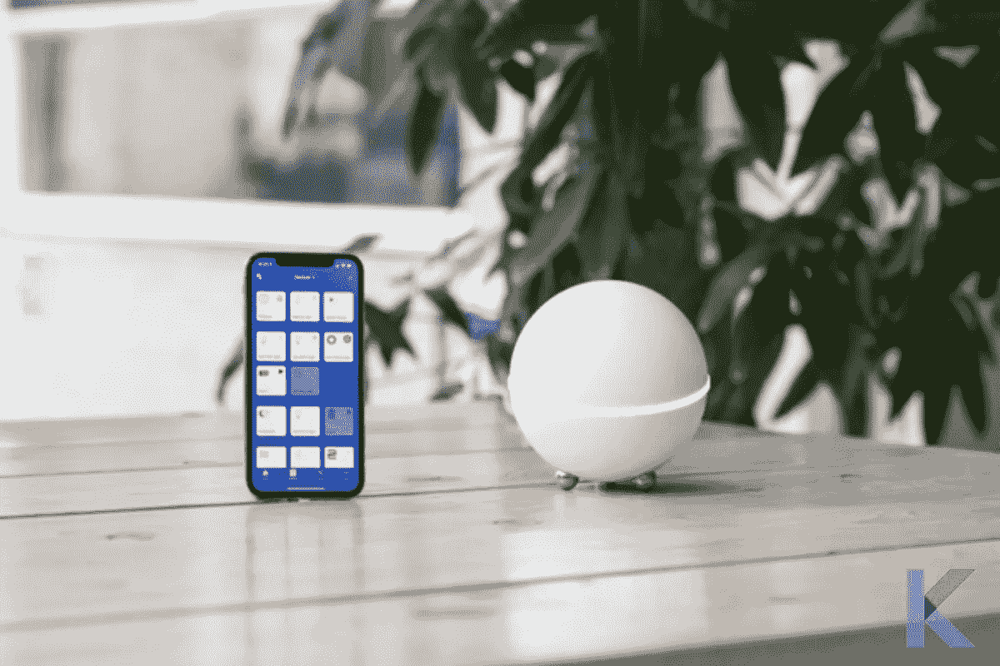

很少有 KNX 智能家居应用程序可用，如 iBEMI 控制应用程序或 Homey 应用程序。它们可用于调节开关、灯光场景、调光、温度、空调、快门控制、RGB、百叶窗、时间和日期、带刻度和偏移的能量指示，以及值变送器。

iBEMI KNX 控制 app 兼容 Android 平板电脑和 Android 5.0 及更高版本的手机。也兼容 iOS 5.0 或更高版本的 iPhone、iPad 和 iPod touch。

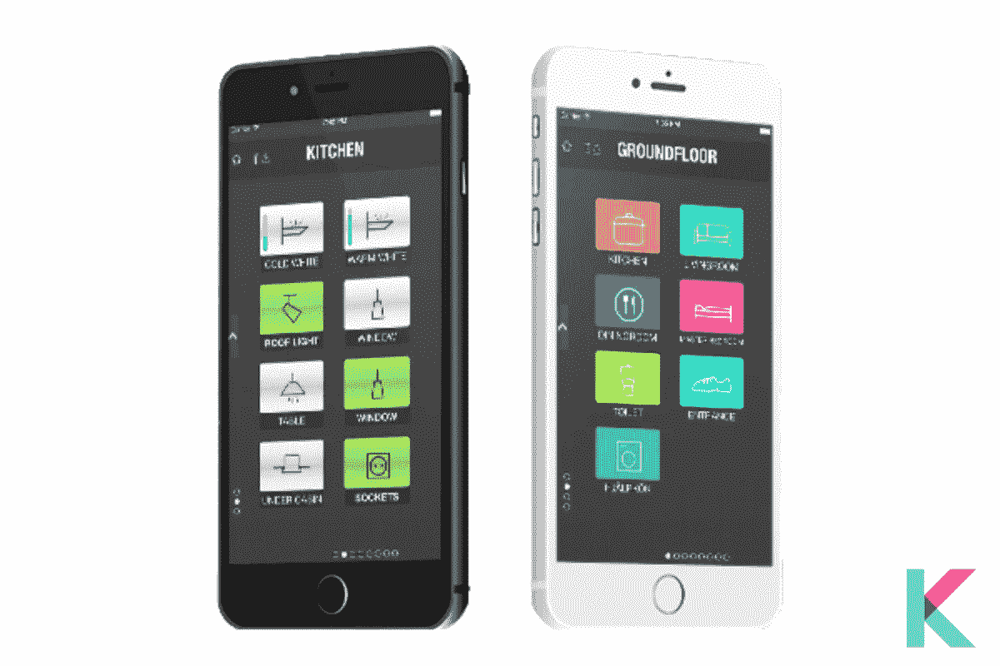

它让你只需点击几下鼠标，就能立即监控你的家。房间和按钮可以用安全 PIN 特征来保护。用户友好的设计易于通过各种控制功能在整个房子中导航。

# KNX 智能家居有哪些特点？

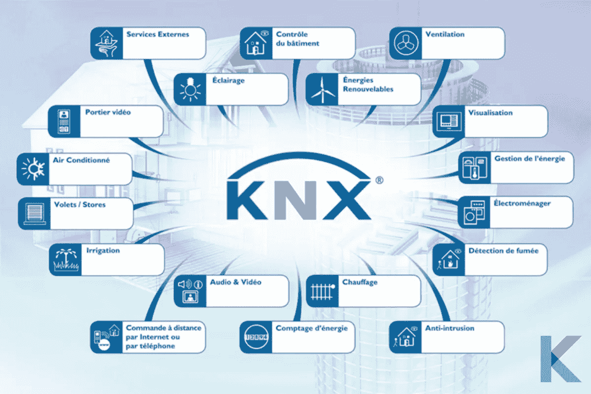

# **KNX 智能家居的特点**

*   配电(带 KNX 服务轴的家用接线柜、低压开关设备等。)
*   HVAC(恒温器、加热、通风)
*   照明控制(光传感器、光变换器、存在探测器)
*   照明(LED、能源服务)
*   总线配置和监控
*   视频监控(将 IP 摄像机连接到家庭监控)
*   通信(KNX 和以太网)
*   用于家庭自动化控制的触摸屏(平板电脑)
*   能源和流体计量及消耗监控
*   建筑自动化中各种任务的分布式和网络应用模型。
*   网络资源的管理和配置方案。
*   允许在各种节点中屏蔽部分分布式应用程序。
*   能够托管分发应用程序
*   当开发要连接和安装在一个装置中的真实设备时，理解这些元素的模型

# KNX 智能家居的主要特点

当你使用 Homey 应用程序将 KNX 系统变成智能家居时，有几个关键功能。

## 来自世界各地的智能手机控制

你可以将你的 KNX 系统整合到 Homey 应用中。因此，你可以在任何地方通过智能手机或平板电脑控制你所有的 KNX 设备。您最喜爱的设备现在随时都在您的指纹下。此外，您可以使用 iOS 应用程序从 Apple Watch 控制您的设备。

## 与智能家居设备的 KNX 系统集成

有许多智能家居设备与 Homey 兼容，如智能恒温器、Spotify 连接[扬声器](https://kodmy.com/google-nest-mini-vs-google-home-mini/)等等。您可以使用智能家居设备轻松扩展 KNX 系统，并在一个地方控制它们。

## KNX 的语音控制

你可以用你最喜欢的语音助手，用 homey app 来控制你的 KNX 系统。它也可以在[谷歌助手](https://kodmy.com/google-nest-mini-vs-google-home-mini/)、亚马逊 Alexa 和 Siri 快捷方式中找到。

## 洞察力和能源管理

当制作 KNX 智能家居时，Homey 是一个非常棒的智能家居中心。有这么多的功能。这包括从 Z-wave、Zigbee、Wi-Fi 和红外线上的 Homey pro 的硬件天线到能源管理、Homey energy 的 Homey 应用程序商店。

# KNX 智能家居的重要性

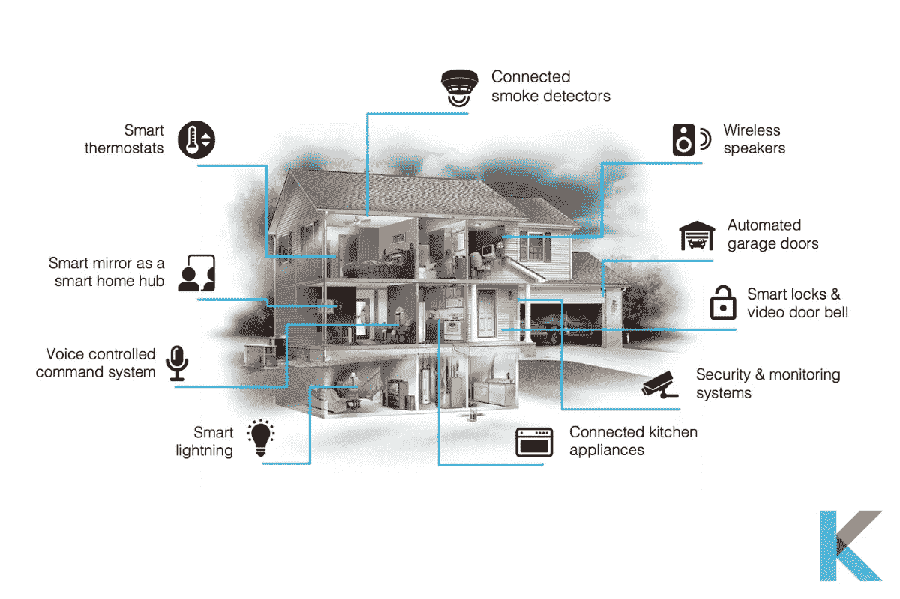

*   **百叶窗**

只需在平板电脑或智能手机上点击一下，即可合上或打开窗帘。你可以根据天气调节你的设置。此外，你可以远程关闭你的屏幕，以保护你的家免受暴雨和大风。

*   **照明**

离开或上床睡觉时，您可以轻松控制灯光。使用运动传感器进入房间时，打开灯。此外，只需轻轻一按，您就可以使用灯光场景为每个场合着色，并根据心情调整场景。

*   **供暖、通风和空调**

根据一天中的时间，你可以管理你房间的温度。早上洗澡前可以预热一下浴室。当你不在家的时候，你可以通过自动关闭暖气来节省能源。在高温期间，远程控制你的通风或空调。这创造了一个舒适节能的家。

*   **安全**

当你锁门时，这可以让你自动启动你的闹钟。当发现你家门口有可疑活动时，通知你或当地警察。当你不在家时，它可以远程管理你的警报，并设置一个例程来给人留下印象。

*   **门通信**

在开门之前，你可以通过一个门禁系统在你家门口看到访客。此外，你可以在门铃响的时候在门禁系统上查看你的访客。开门时，游客受到了热烈的欢迎。

*   **可视化**

借助可视化工具，随时随地更新您的智能家居和能源使用情况。您可以深入了解您的能源使用情况，并根据您的需求定制您的界面。

# KNX 智能家居的 10 款最佳产品

KNX 提供各种设计选择和独特的产品系列。这让你可以打造自己独特的智能家居，完美满足你的需求。KNX 设备通常通过双绞线总线连接。

ZENNIO Z70

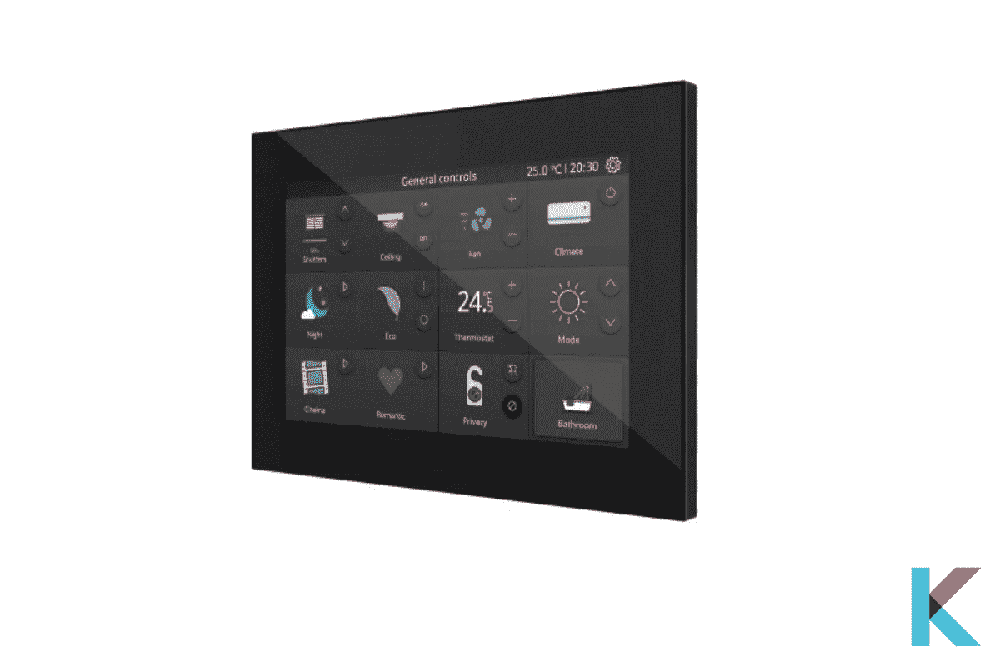

ZENNIO Z70 是一款 7 英寸显示屏的彩色电容式触摸屏。这是一个内置的光度和接近传感器。此外，它有一个内部温度探头，4 个模拟数字输入，和一个恒温器。使用标准的双安装盒很容易安装，并且具有用于程序更新的以太网和 USB 端口。

**ZENNIO Z41 触摸面板**

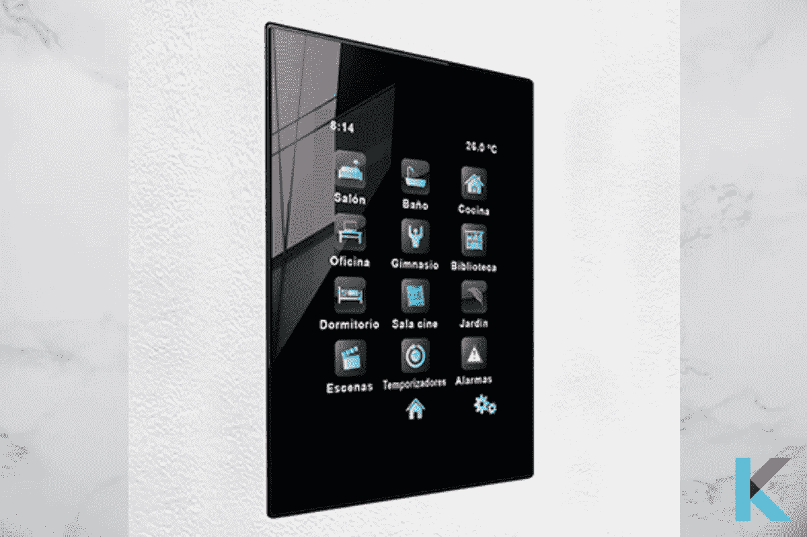

ZENNIO Z41 触摸面板是一个 KNX 触摸屏，有 6 页 8 个功能。它还有银色、白色和黑色三种颜色可供选择。它只能安装在圆形欧式背盒中。它可以显示计时器、图表，还提供了一个带有推送通知的智能手机应用程序。此外，它还集成了温度控制器。

**泽尼奥 Z35**

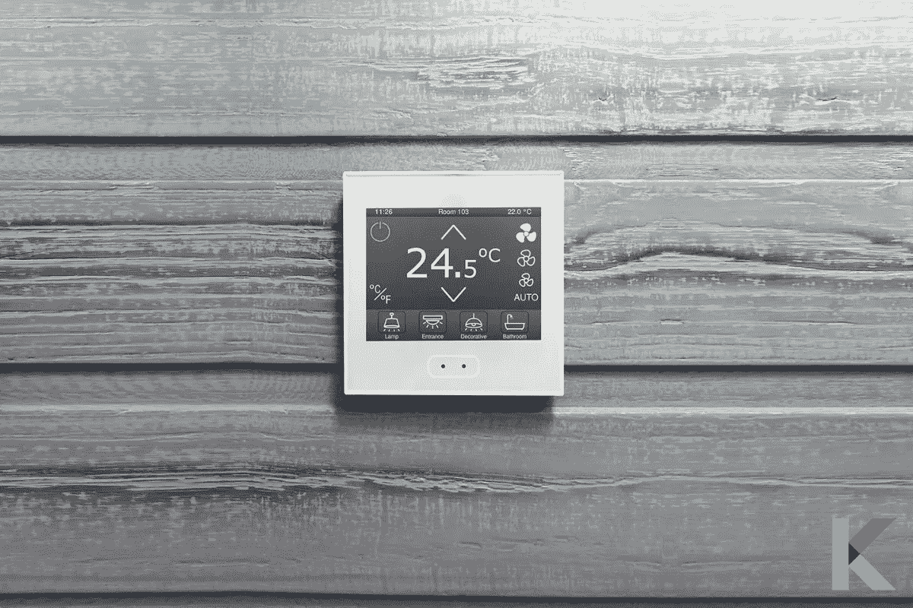

ZENNIO Z35 是一款 KNX 触摸屏，有 7 页 6 个功能。此外，它有银色，白色，无烟煤和光泽白色。但只能安装在圆形欧式背盒中。它集成了温度控制器、光度传感器和近程传感器。

**ZENNIO TOUCH 我的设计室控制器**

这是一个 KNX 电容式触摸房间控制器，有一个显示器和 8 个按钮。它有黑色、白色或定制印刷表面可供选择。此外，它可以安装在圆形欧洲背盒，只有 4 页 32 个功能。它还集成了温度控制器和 LED 背光。

**LITHOS KNX 键盘**

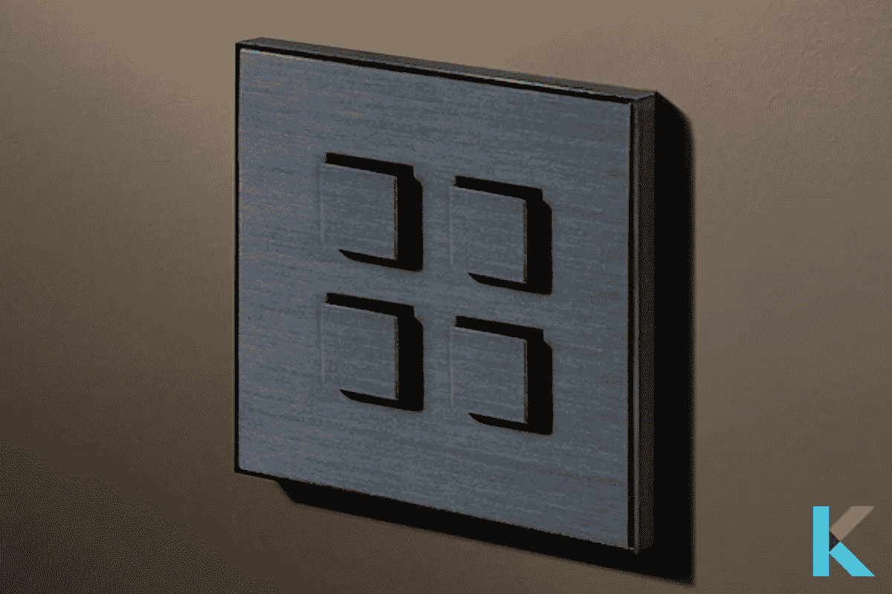

LITHOS KNX 小键盘是一个 KNX 小键盘，有几个按钮，有各种各样的饰面。它只能安装在圆形欧式背盒中。它还集成了 LED 背光和温度传感器。

**荣格智能控制器 5**

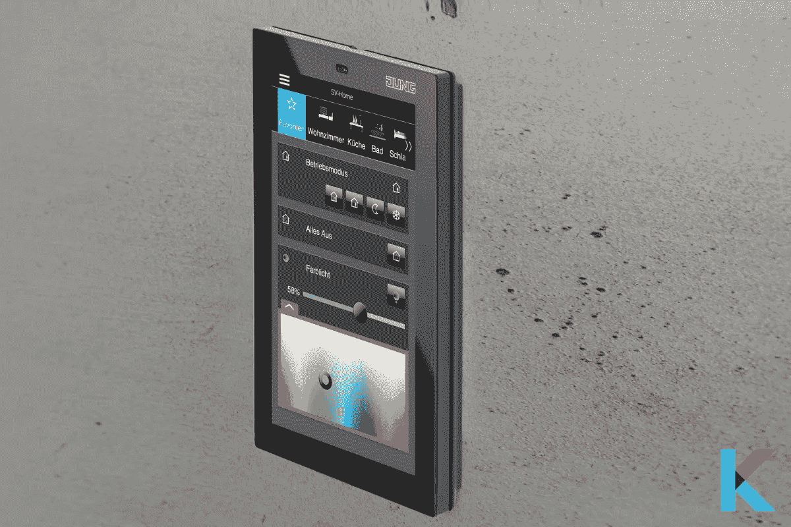

JUNG SMART CONTROLLER 5 是 smart control 系列的最新扩展，具有纤薄、紧凑的设计。它适合一个标准的嵌入式墙盒。它也有一个高分辨率的触摸显示屏。此外，它是一个集成的亮度传感器和接近传感器，用于唤醒和调整显示器。可根据要求提供任何尺寸。

**JUNG F40 和 F50 房间控制器**

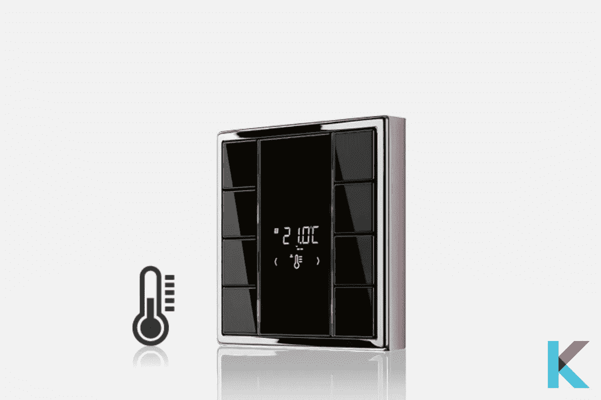

这是一个 KNX 室温控制器，有一个 2/4 按钮。它也有多种饰面可供选择。此外，彩色或激光雕刻可通过在线工具获得。它集成了温度调节功能。

**ABB TACTEO KNX 键盘**

ABB TACTEO KNX 键盘是一种 KNX 电容式触摸键盘和室温控制器。它用黑色玻璃或白色玻璃制成。它只能安装在欧盟或英国的后箱上。它有不同的垂直和水平模式。用于完成和标记所选内容的在线配置器。

**玄武岩埃莉**

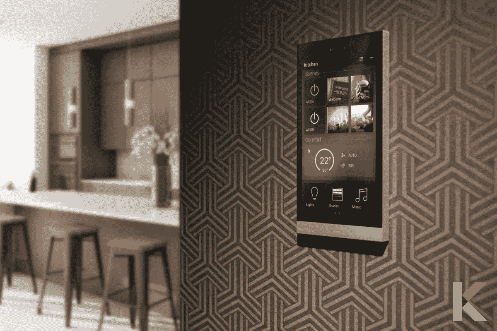

这是一款优雅的触摸感应面板，采用超薄设计和优质表面处理。它可以用来控制气候、灯光、音乐和房子周围的许多东西。埃莉能与任何室内装饰完美融合。它配有各种高质量的饰面。它还需要玄武岩核心迷你或玄武岩。

**带温度控制的 GIRA KNX 键盘**

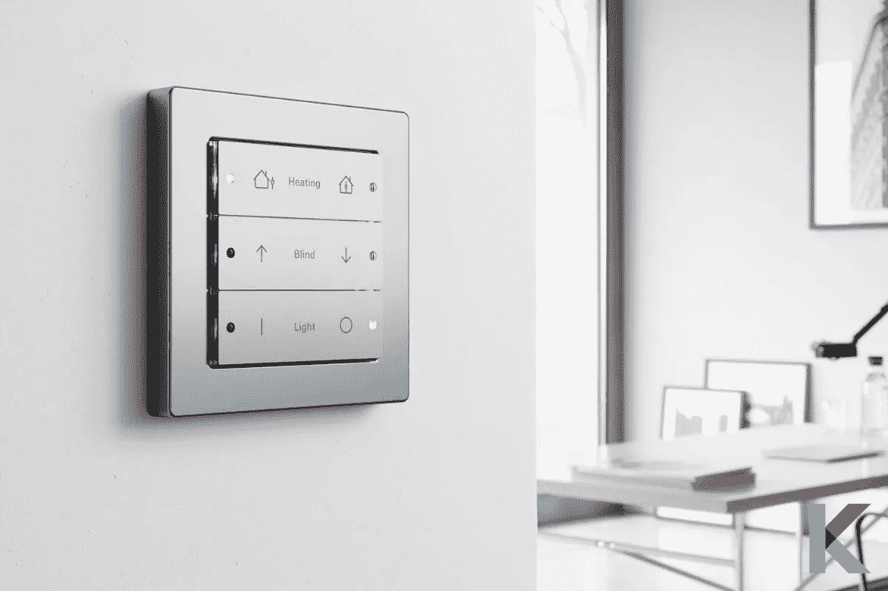

这是一个 KNX 键盘，有 4 个按钮，有各种各样的饰面。它可以安装在圆形欧式或方形英式背盒中。它集成了现场控制器和温度调节器。它有红色、蓝色或绿色发光二极管，具有不同的反馈和状态亮度。

# 如何从 KNX 入手？

从 KNX 技术开始有几种选择。

*   找一个认证的专业人士

你想找一个经过认证的专业人士来安装你的 KNX 智能家居。他们将帮助你规划你的智能家居，并在每个房间创造常规。全世界有很多专业人士。他们将帮助您安装和布线硬件和软件。

*   自己学习 KNX 技术的基础

还不如自己学。您可以连接到他们的在线课程并成功完成您的测试。然后你可以获得额外的机会获得你的第一个 KNX 软件许可。

*   你可以购买他们的 ETS 家庭版

如果你已经是 KNX 专家，ETS 家庭版是房主的最佳解决方案。它允许您配置多达 64 个智能家居小工具。它还会给你的设置和数据完全的所有权。

*   您可以连接无限选项与独特的产品选择

使用 KNX 可以简化和自动化您的日常生活。它可以组合不同种类的家居产品。

# **KNX 智能家居如何工作？**

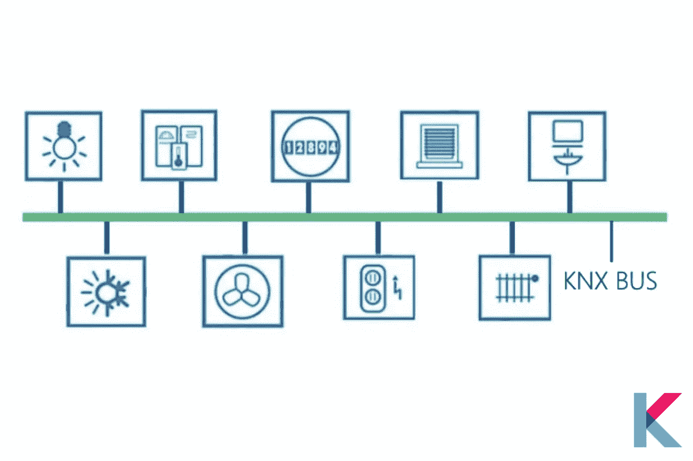

它有一个用于所有自动化的主要中枢神经系统。叫做 KNX 公交线。除了传统的芯线电源外，还安装了一根绿色电缆。它可以在新的改造项目和新的建筑中安装。

根据建筑自动化的 KNX 标准，所有不同的技术组件都通过主 KNX 总线连接。电缆系统可以由传感器、参数、检测器等来管理。终端客户也可以使用智能手机、笔记本电脑或平板电脑轻松控制它。该总线相当于连接网络上所有设备和系统的电源。

# KNX 智能家居控制如何？

房主有不同的选择。一个墙单元，一个智能手机，如吉拉 G1，或者你可以使用类似吉拉按钮传感器 4。是的。智能家庭集线器可以在总线系统和控制设备之间将它们连接在一起。Ii 有一个重要的组件将它们连接在一起，比如 Gira Home Server。

# 软件包与 KNX 的比较

这是 ETS lite、ETS inside 和 ETS professional 的对比。它帮助你选择最适合你的软件包。

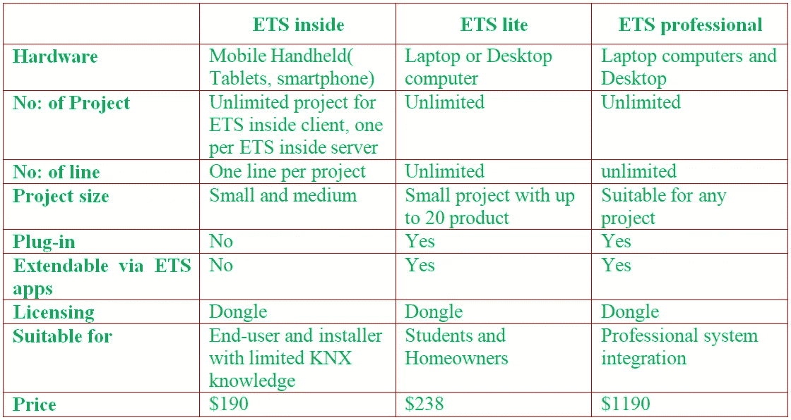

# KNX 智能家居产品的价格和颜色对比？

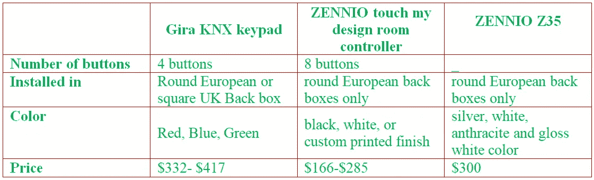

KNX 智能家居系统是最好的选择。因为它为尖端住宅提供了面向未来的解决方案。这是全球公认的有线建筑技术标准。它在未来的灵活性和兼容性方面提供了最好的保证。他们的网络非常强大，提供卓越的性能。它还可以安装在几乎任何单户住宅或公寓，甚至是拥有多种才能的大型综合建筑。它可用于将您的功能带到户外。例如，你可以用它来自动化你的花园。

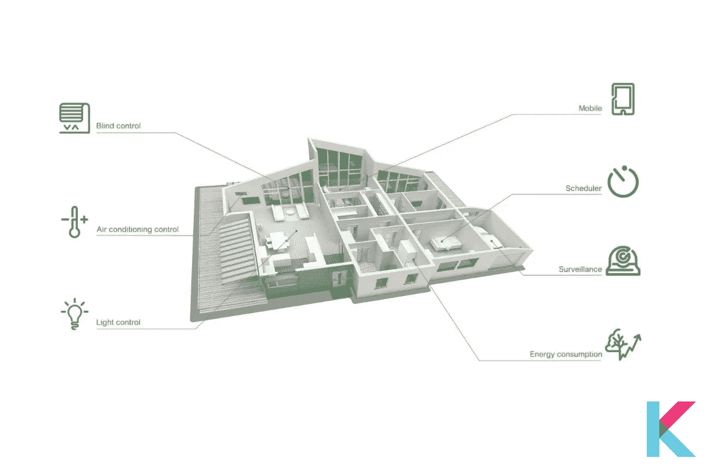

然而，建立一个 KNX 系统对于已经建成的房屋来说是很昂贵的。因此，墙壁中的每个照明点、墙壁开关、传感器或插座都需要更换新的导管和电缆。也是不灵活的。您需要为重新定位的设备或新设备进行新布线。

# KNX 和无线我该选哪个？

这取决于你需要什么，也取决于你的生活状况。这两种系统各有优点。如果你想建造或改造一个长期使用的家，KNX 智能家居是最好的选择。它可以根据您的需求进行定制。它采用国际标准建造。同时，你的房子可能会更大；适当的 Gira 家庭服务器可以确保你在任何时候都能完全控制你的家庭。