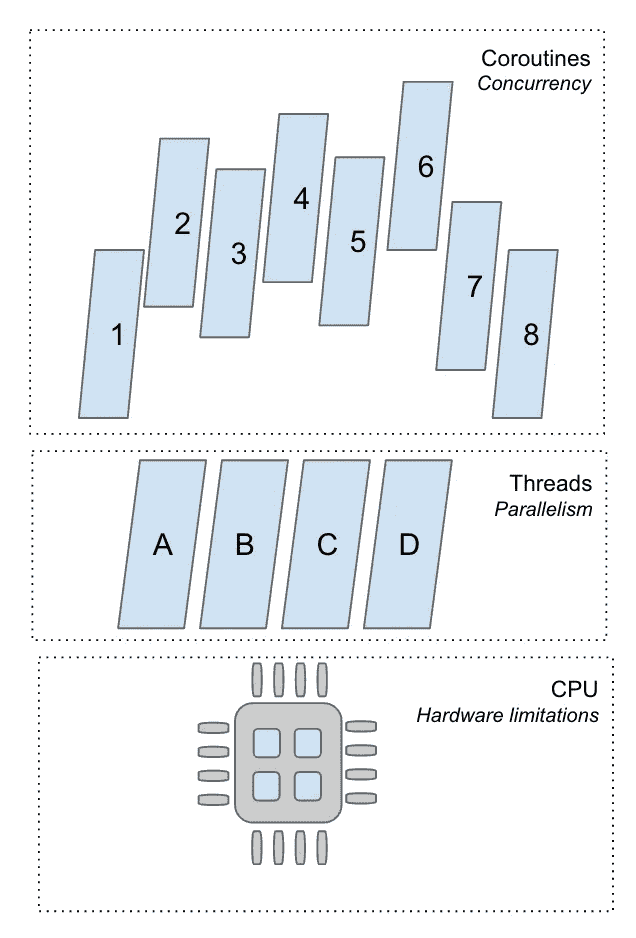
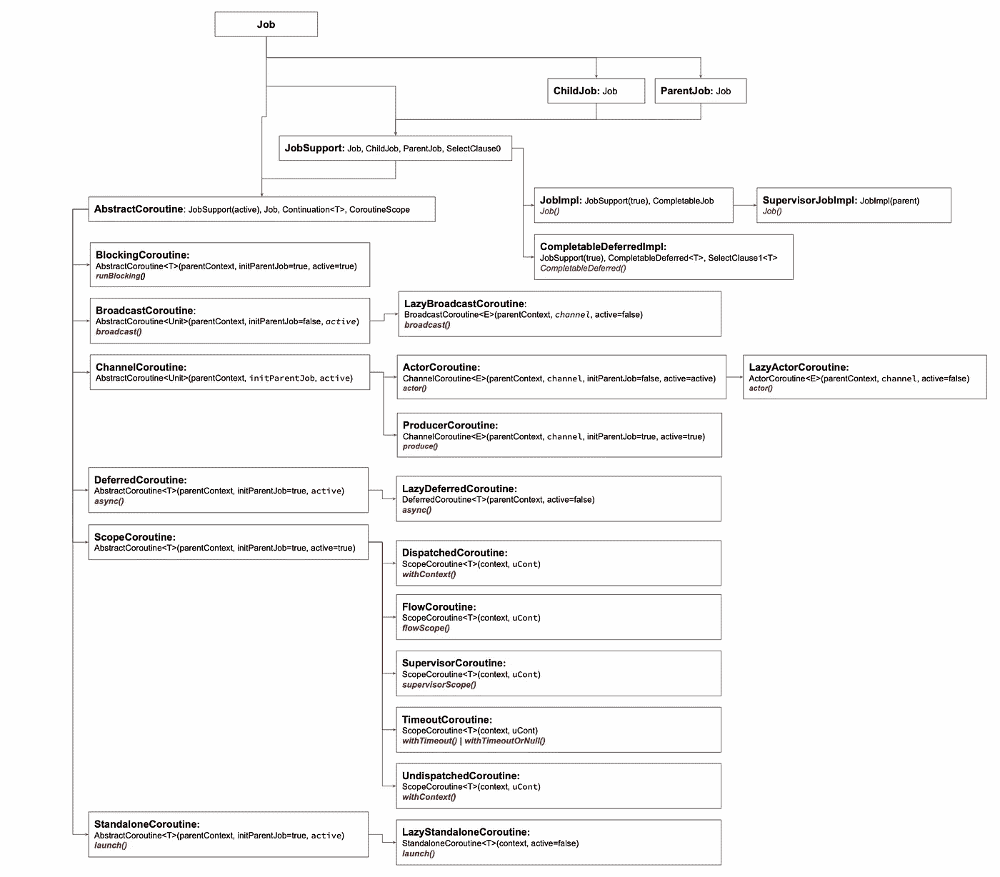

# 科特林 Coroutines，把碎片放在一起

> 原文：<https://blog.devgenius.io/kotlin-coroutines-putting-together-the-pieces-84c2e9e7015e?source=collection_archive---------4----------------------->

用一种能让这些概念持续的方式写作和想象


Clark Van Der Beken 在 [Unsplash](https://unsplash.com?utm_source=medium&utm_medium=referral) 上拍摄的照片

当我开始学习 Kotlin 中的协程时，我到处阅读了一些文章和教程，玩了一些例子，并认为我已经合理地掌握了它们是什么以及如何使用它们。

然而，像任何语言一样，Kotlin 在这方面发展得非常快，我错过了一些变化，所以当我最近遇到这些变化时，我意识到也许我应该回去彻底重温一下几个概念。

有很多资料描述了协程和线程之间的区别，为什么你应该使用协程等等。我所缺少的，以及我将要尝试用这个小故事去做的，是把所有这些拼图放在一起，以一种适合我的思维过程的方式，写下来，画下来，也许对其他人也有用。

# 并发性与并行性

是的，我需要想象或表达的一件事是并发性和并行性之间的区别。



CPU 的每个核心在给定时间只能执行 1 条指令/线程(说到物理核心，现代 CPU 也有逻辑核心或某种抽象，告诉操作系统实际上有比物理可用更多的核心)。然而，正如你们所知，笔记本电脑完全能够以一种似乎与我们这些可怜的人类并行的方式运行许多许多线程，因为切换发生得非常快。

一般来说，并行执行意味着事情在完全相同的时间**运行，但是使用线程是我们在一个简单的应用程序中最接近它的方式。这并不完美，因为我们无法控制日程安排，但这已经足够好了😆**

另一方面，协程可以在同一个线程中执行，它们甚至不绑定到同一个线程。一个协程可以在线程 A 中启动，被挂起，然后在线程 C 中恢复，然后再次挂起，在线程 B 中恢复…你明白了。因为我们在一个线程中可能有 N 个协同程序，并且一次只能执行 1 个，所以我们讨论并发性，即执行时间重叠。

这就是为什么在协程中我们可以延迟(100)而线程不会被阻塞。延迟是暂停计算的一个例子，其中线程只是让当前的协同程序冷却，继续执行可能另一个协同程序的指令，然后从同一位置继续。

# 协程层次和构建器

第一次深入研究协程的层次结构时，很容易迷失方向，但是一旦你仔细观察，就不会那么可怕了。



AbstractCoroutine 下的所有东西都是我们用构建器创建的，右边 JobSupport 下的所有东西都可以简单地通过构造函数来创建。

**BlockingCoroutine** 是一种不言自明的协程，它阻塞当前线程直到完成，所以它不应该在另一个协程中被调用，它应该在主函数和测试中使用。

**broadcast 协程**是一个协程，它通过将值发送到广播通道来产生一个值流，然后由构建器返回。当协程完成时，或者在未捕获到异常的情况下，通道被关闭，这将随后导致订户尝试读取时出现异常。默认情况下，在第一个订户通过 broadcast channel . open subscription 出现之前，协同例程不会启动，因为 start 参数的值为 CoroutineStart。默认懒。这确保了第一订户不会错过任何发送的元素。但是，后来的订阅者可能会错过元素。这个 API 从 1.5.0 开始**就过时了**。它将被 Flow.shareIn 运算符替换。(更多关于传入的信息)

**通道协同例程**已被**弃用**，但它的子类还没有……弃用。 **actor** 实现即将被**淘汰**引入了复杂的 actor，但目前，它是一个协程，从其邮箱通道接收消息，并作为发送通道返回对其邮箱通道的引用，构建器的结果对象可用于将*消息发送到该协程。 **producer** one 是一个协程，通过将值发送到通道来产生一个值流，构建器的结果对象可用于`*接收由该协程产生的`*元素。*

**Deferred 协程**是一个协程，它返回它未来的结果作为 Deferred 的实现。要注意的关键点是，它在失败时取消父作业，但是可以通过使用监督父作业(SupervisorJob 或 supervisorScope)来改变行为。

**独立例程**是一个协程，返回一个任务。这也将在失败时取消父作业，它与 DeferredCoroutine 非常相似，不同之处在于，当您执行 async()即 Dferred 时，您可以获得一个结果，而当您执行 launch()即 Standalone 时，它是一劳永逸的…就响应而言，您仍然可以取消和控制生命周期。

**scope routine**的子类提供了在您提供的协程上下文中执行代码块的方法。

**ChildJob** 是父作业从其子作业接收的信息，以便它可以报告取消。

**ParentJob** 是当父作业被父作业取消时，子作业从父作业接收的内容。

# 分层取消

```
val scopedJob = *CoroutineScope*(Dispatchers.Unconfined).*launch* **{** val aJob = this.*launch* **{** val bJob = this.*launch* **{** while (true) {
                delay(3_000)
                b++
            }
        **}** bJob.invokeOnCompletion **{** *println*("B has completed at $b")
        **}** while (true) {
            delay(10_000)
            a++
        }
    **}** aJob.invokeOnCompletion **{** *println*("A has completed at $a")
    **}** while (true) {
        delay(1_000)
        scoped++
    }
**}** scopedJob.invokeOnCompletion **{** *println*("Scoped has completed at $scoped")
**}** while (outer < 9_000) {
    delay(10)
    outer++
}
scopedJob.cancel()
*println*("End")*Completed at 10
Scoped has completed at 108
End*
```

一旦外部父代被取消，内部的整个层次结构也被取消，从层次结构树中最远的开始向上。

```
*B has completed at 36
A has completed at 10
Scoped has completed at 108
End* 
```

您可以将协程名称和作业作为参数传递给子协程创建，但这不会生效，也就是说，它不是实际运行的作业实例。

# 用于取消的实例

```
val scopedJob = *SupervisorJob*()
*println*("Scoped job passed in $scopedJob")

val scope = *CoroutineScope*(Dispatchers.Unconfined + scopedJob + CoroutineName("SCOPED"))
*println*("Scope ${scope.coroutineContext}")

scope.*launch*(CoroutineName("A")) **{** val aJob = *SupervisorJob*()
    *println*("A job passed in $aJob")
    *println*("A scope: ${this.coroutineContext}")

    this.*launch*(CoroutineName("B") + aJob) **{** *println*("B scope: ${this.coroutineContext}")
    **}
}**
```

它实际上是启动时返回的内容，但是，两者都可以用来取消协程-`jobBReturned.cancel()`和` jobB.cancel()`将起作用。

```
Scoped job passed in SupervisorJobImpl{Active}[@2ef1e4fa](http://twitter.com/2ef1e4fa)
Scope [SupervisorJobImpl{Active}[@2ef1e4fa](http://twitter.com/2ef1e4fa), CoroutineName(SCOPED), Dispatchers.Unconfined]Job A passed in JobImpl{Active}[@27ddd392](http://twitter.com/27ddd392)
A scope: [CoroutineName(A), StandaloneCoroutine{Active}[@2be94b0f](http://twitter.com/2be94b0f), Dispatchers.Unconfined]Job B passed in JobImpl{Active}[@d70c109](http://twitter.com/d70c109)
B returned StandaloneCoroutine{Active}[@47d384ee](http://twitter.com/47d384ee)
B scope: [CoroutineName(B), StandaloneCoroutine{Active}[@47d384ee](http://twitter.com/47d384ee), Dispatchers.Unconfined]
```

# **广播**

这种精确的实现方式将很快被取代，但概念可能是相同的——使用一个“信道”来广播数据，许多用户从中读取数据。

```
val bChannel: BroadcastChannel<Int> = *CoroutineScope*(Dispatchers.Unconfined).*broadcast* **{** var a = 0
    while (true) {
        delay(10)
        a++
        this.channel.send(a)
    }
**}** delay(1000)

*CoroutineScope*(Dispatchers.Unconfined).*launch***{** bChannel.consumeEach **{** *println*("in A $**it**") **} }** *CoroutineScope*(Dispatchers.Unconfined).*launch***{** bChannel.consumeEach **{** *println*("in B $**it**") **} }** delay(1000)
*CoroutineScope*(Dispatchers.Unconfined).*launch***{** bChannel.consumeEach **{** *println*("in C $**it**") **} }** delay(1_000)

bChannel.cancel()
```

第一个订户“激活”该频道，然后所有随后的订户只是从订阅点开始阅读。(通知 C 在 79 左右加入)

```
*in A 1
in B 1
in A 2
in B 2
in A 3
in B 3
...
in A 79
in B 79* ***in C 79*** *in A 80
in B 80
in C 80*
```

## 生产和阅读

```
val rChannel: ReceiveChannel<Int> = *CoroutineScope*(Dispatchers.Unconfined).*produce* **{** var a = 0
    while (true) {
        delay(10)
        a++
        this.channel.send(a)
    }
**}** val sChannel: SendChannel<Int> = *CoroutineScope*(Dispatchers.Unconfined).*actor* **{** while (true) {
        val res = this.channel.receive()
        *println*(res)
    }
**}** delay(1000)

var b = 0
var result = rChannel.receive()
while (b < 10) {
    sChannel.send(result)
    delay(20)
    b++
    result = rChannel.receive()
}
rChannel.cancel()
```

我第一次读到 actor 时，我并没有把它们联系起来，但是像一个真正的 actor 一样，这种类型的协程打开了一个通向父级的通道，它可以在那里读取指令并对命令做出反应。

# 流

这是一种替代广播协程和通道的 API。它提供了一种从一个异步运行的代码中返回多个值的方法，而不必在返回它们之前聚集整个项目集合(否则我们只是创建一个列表)。它更像是一个异步流，在你开始使用它之前，它什么也不做。也有立即活跃的热流，但在这两种情况下，这是一种在协程之间“发送”无界数据流的机制

他们在 Kotlin 网站上给出的简单例子是使用一个基本的构建器

*   [flow {…}](https://kotlin.github.io/kotlinx.coroutines/kotlinx-coroutines-core/kotlinx.coroutines.flow/flow.html)——从对 [emit](https://kotlin.github.io/kotlinx.coroutines/kotlinx-coroutines-core/kotlinx.coroutines.flow/-flow-collector/emit.html) ()的连续调用中构造流

```
fun simple() = *flow* **{** *println*("Flow started")
    for (i in 1..3) {
        delay(100)
        emit(i)
    }
**}** suspend fun test() {
    val flow = *simple*()
    *println*("Calling collect...")
    flow.collect **{** value **->** *println*(value) **}** *println*("Calling collect again...")
    flow.collect **{** value **->** *println*(value) **}** *println*("Calling collect...")
    flow.collect **{** value **->** *println*(value) **}** *println*("Calling collect again...")
    flow.collect **{** value **->** *println*(value) **}** }
```

更有趣的是，实例返回可以多次读取，并且从头开始:

```
Calling collect...
Flow started
1
2
3
Calling collect again...
Flow started
1
2
3
Calling collect...
Flow started
1
2
3
```

除了这个简单的构建器，几乎没有其他的:

*   [flowOf](https://kotlin.github.io/kotlinx.coroutines/kotlinx-coroutines-core/kotlinx.coroutines.flow/flow-of.html) ()从一组固定的值中创建一个流。
*   [asFlow()](https://kotlin.github.io/kotlinx.coroutines/kotlinx-coroutines-core/kotlinx.coroutines.flow/as-flow.html) 扩展各种类型上的函数，将它们转换成流。
*   [channelFlow { … }](https://kotlin.github.io/kotlinx.coroutines/kotlinx-coroutines-core/kotlinx.coroutines.flow/channel-flow.html) 从对 [send](https://kotlin.github.io/kotlinx.coroutines/kotlinx-coroutines-core/kotlinx.coroutines.channels/-send-channel/send.html) 函数的潜在并发调用中构造流，它允许多个协程“添加”到流中
*   [MutableStateFlow](https://kotlin.github.io/kotlinx.coroutines/kotlinx-coroutines-core/kotlinx.coroutines.flow/-mutable-state-flow/index.html) 和 [MutableSharedFlow](https://kotlin.github.io/kotlinx.coroutines/kotlinx-coroutines-core/kotlinx.coroutines.flow/-mutable-shared-flow/index.html) 定义相应的构造函数来创建一个 *hot* 流，一个可以直接更新的流。这些可用于共享状态或广播到多个收集器，以便分别获取所有发出的值。

流量本身可以在这里填充更多的故事，但我的目标不是重复已经广泛可用的信息，也不是列出我知道或发现的所有可能的信息，所以我认为这就够了。👋