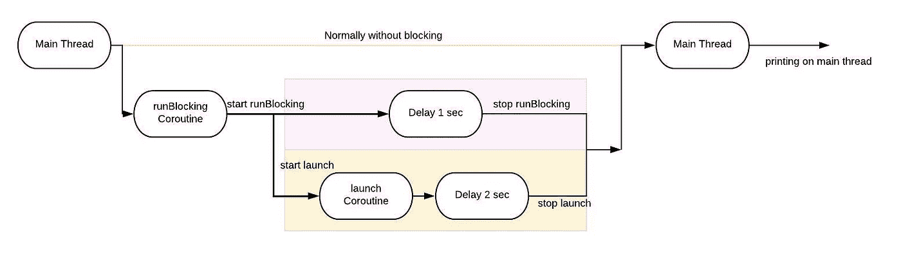

# Kotlin 协同程序——什么，为什么&如何？

> 原文：<https://blog.devgenius.io/kotlin-coroutines-what-why-how-99529c951a2e?source=collection_archive---------2----------------------->

> 一个人要有合作的套路！

术语 ***协程*** 现在是 Android 开发者或 Ktor 后端开发者日常生活的一部分。协同程序在异步编程领域引起了轰动。

如果你是一个 Android 开发者，那么你一定非常重视这样一个事实:任何长时间运行或 CPU 密集型任务都不应该在我们亲爱的主应用程序线程上执行。我们已经有很多方法来防止这种情况，协程现在也是其中之一。

在本文中，我们将对以下问题有一些基本的了解:

*   什么是协程&它们做什么？
*   我们为什么要使用它们？
*   我们应该如何使用它们？

> 如果你还没有选择它们，是时候开始了。

# 什么是协程&它们做什么？

任何挂起计算的实例都被称为协同例程，它也是 Android 中用来简化异步代码执行的并发设计模式。

> 挂起的计算指的是与代码的其余部分同时处理一个代码。

协程只是简单地获取一段代码，并同时执行它。

示例 1

运行上面的代码将导致

运行阻塞执行

你可以看到 *runBlocking* 是一个协程构建器，它为我们提供了一个协程作用域，在这个作用域中，我们可以同时执行一些代码和其余的代码。看吧！启动协程执行就是这么简单。

runBlocking builder 是非协同程序代码和协同程序内部代码之间的桥梁。它阻塞主线程，直到它的所有子线程完成它们的执行。这就是为什么即使协程延迟了一秒钟，您最终也能看到主线程日志。

让我们看另一个更详细的例子。

示例 2

运行上面的代码将导致

带有启动协程执行的运行阻塞

如果你仔细观察，我们现在已经添加了一个新的 ***launch*** 块，它也是一个协程构建器。 ***launch*** 协程生成器暂停其执行，并让父 ***runBlocking*** 协程继续执行。但是正如我们提到的***run blocking***coroutine 将阻塞它的调用线程，直到它的所有子线程都完成，这就是为什么我们在示例 1 和 2 中都看到了主线程日志。

打印主线程日志的总时间是 2 秒。因为 2 秒钟的启动程序块与运行阻塞程序块同时运行，因此 1 秒钟对它们来说是常见的，但不是连续的，并且 ***运行阻塞程序块*** 的执行在 ***启动*** 程序块执行之前停止。

看吧！在协程中启动和执行代码就是这么简单，这就是它的美妙之处。您可以尝试不同的场景来理解协程构建器的功能。

# 我们为什么要使用它们？

正如我们在上面看到的，什么是协程，它们是如何以一种基本的方式工作的。它们甚至类似于传统的线，但并不相同。它们可以在一个线程中暂停执行，并在另一个线程中继续执行(我们将在后续文章中看到这一功能)。它们被多次称为轻量级线程。

使用它们的一些主要好处如下:

**内存高效或轻量级**

我们可以在一个线程中运行许多协同程序，因为它支持挂起功能，不会阻塞运行它的线程。这反过来消耗更少的内存，因为线程的挂起更昂贵。

**结构化并发**

协程为结构化并发提供支持，即协程中的任何异常或取消都通过层次结构传播，以便能够正确处理。我们将在本系列的后续文章中看到这一点。所以，如果你没有马上得到它，也不要担心。

**内存泄露少**

随着并发性在层次结构中传播，泄漏的可能性就越小。

**同步编码**

启动和运行一个协程几乎就像编写一个同步代码，这使得代码非常干净、易读并且不容易出错。

**异步过程中更好的控制**

在协同例程中执行异步计算在取消或超时、协同例程范围、上下文切换、主安全和并发性方面提供了更好的控制。

**喷气背包支持**

许多 Jetpack 库包括提供完整协程支持的扩展。有些库还提供了自己的协程作用域，您可以将其用于结构化并发。

**测试支架**

协程内置了对单元测试支持。虽然设置需要一些额外的注意。

# 我们应该如何使用它们？

至此，我们对协程有了基本的了解。现在让我们来解决协程的方式。那么我们如何使用它们呢？

协程总是在名为 ***协程上下文的上下文中执行。*** CoroutineContext 是各种元素的集合，其中两个是 ***作业*** 和 ***调度员*** 。

## **工作**

***launch*** 协程构建器返回一个 ***Job*** 对象，帮助我们在*维护我们的协程*的生命周期。我们可以使用这个作业对象取消协程。父作业的取消会立即取消其所有子作业，而子作业的失败会立即取消其父作业，从而取消其所有子作业。

## 分配器

协程上下文包括一个协程调度程序，它告诉我们*协程使用哪个线程来执行*。如果在没有调度程序的情况下启动协程，那么它将在默认调度程序中运行。我们可以明确地提到协程上的调度程序。

协程的调度程序类型

***调度员。Main* :** 用于在 Android 主线程上运行协程。这包括与 UI 交互或更新实时数据。

***调度员。IO* :** 用于在主线程之外执行 I/O 或网络操作。例如，在磁盘上读/写、从 api 获取数据等。

***调度员。默认* :** 这个调度程序被优化为在主线程之外执行 CPU 密集型工作。示例用例包括对列表排序和解析 JSON。

***调度员。Unconfined* :** 这个调度程序在当前线程上下文中启动协程，直到被挂起。一旦它恢复，它就获取挂起函数所使用的线程的上下文。*这个调度器一般不应该在代码中使用。*

因此，我们应该始终小心我们在哪个上下文中运行我们的协程，并且我们可以有效地使用它们。

嗯！这足以让我们了解协程的基础知识。我们将在本系列的后续文章中进一步讨论更多细节。但基本上，这是我们所能做的。

目前就这些了！敬请期待！

在 medium(如果内容对您有帮助)或 [github](https://github.com/aqua30) 上关注我，并订阅电子邮件以同步了解更多关于 Android 的有趣话题。

直到下一次…

干杯！