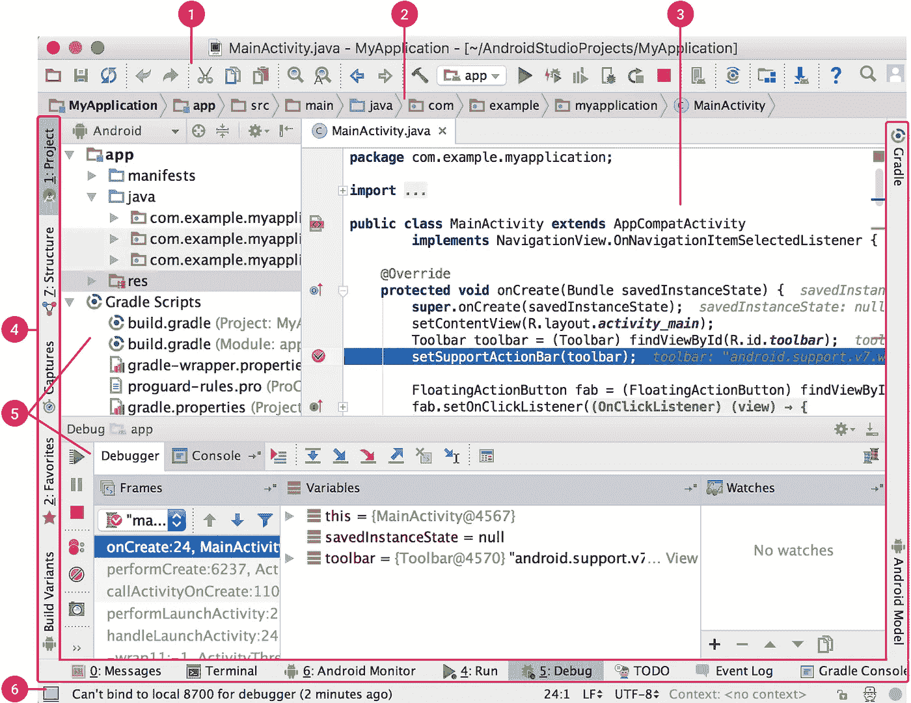
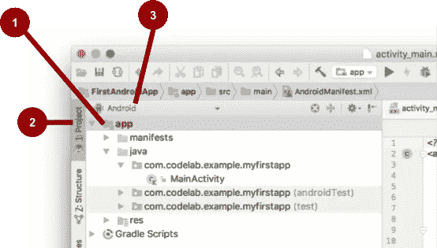
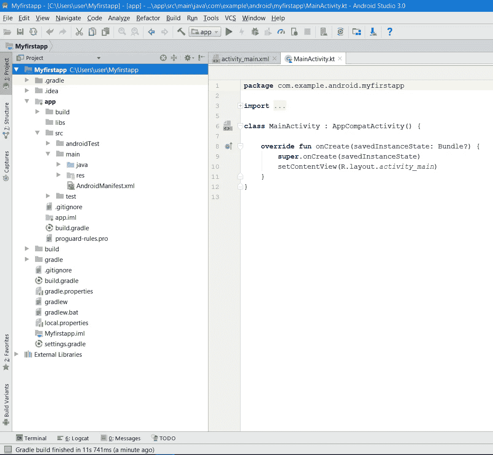
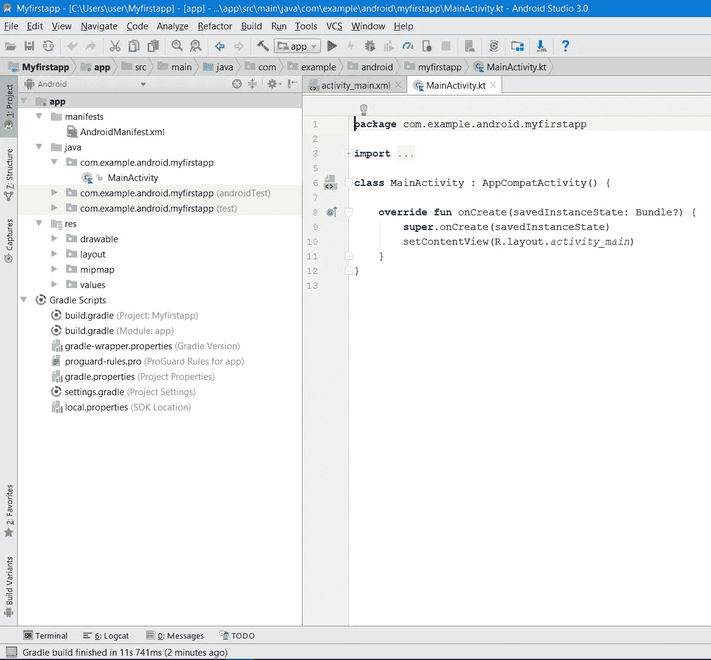
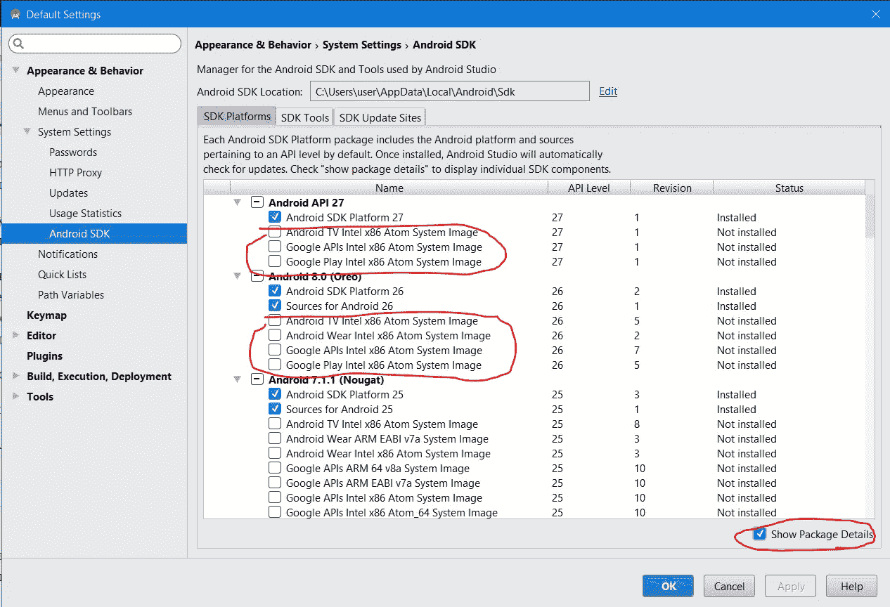

# 科特林。在 Android Studio 中创建项目

> 原文：<https://blog.devgenius.io/kotlin-creating-a-project-in-android-studio-e5ec9b9ddf68?source=collection_archive---------5----------------------->

**创建新项目**

1.打开 Android Studio

2.在欢迎使用 Android Studio 对话框中，选择启动一个新的 Android Studio 项目。

3.在新建项目对话框中，为您的应用程序命名，例如我的第一个应用程序。

4.您可以接受默认域名。

5.对于 Kotlin 语言支持，选中包括 Kotlin 支持复选框。

您可以将项目位置保留为默认值。通常，项目保存在用户文档中名为 AndroidStudioProjects 的文件夹中。如果用户名是用俄语字母指定的，这里可能会有问题，因为开发环境不接受文件路径中的西里尔字母。在这种情况下，您会看到一条警告。将项目保存到其他地方。

1.单击下一步。

2.在目标 Android 设备对话框中，选择平台类型手机和平板电脑以及支持的最低 Android API 17 或更高版本。

3.我们还不需要对旧版本的支持，因为它会影响开发工具的可用功能。单击下一步。

4.在添加激活对话框中，您需要选择预装应用程序窗口和 UI 组件的模板。选择空活动。单击下一步。

5.在“配置活动”对话框中，保持一切不变。单击完成。

完成这些步骤后，Android Studio:

*   在创建项目时指定的位置，为驱动器上的 Android Studio 项目创建一个文件夹。
*   接下来，构建项目(这可能需要几分钟)。Android Studio 使用 Gradle 作为构建系统。
*   有时，构建系统会生成消息和警告，例如，现在需要重新安装缺失的 SDK 组件。
*   打开显示当前项目的代码编辑器窗口。

Android Studio 窗口应该是这样的:

Android Studio 界面

**我们来看看 Android Studio 界面**

1.工具栏提供了对最常用命令的快速访问，如启动应用程序或打开 SDK 管理器。

2.导航栏帮助您浏览项目并打开文件进行编辑。它提供了一个更紧凑的结构视图，如项目窗口中所示。

3.编辑器窗口允许您创建和编辑代码。根据打开的文件类型，编辑器视图可能会有所变化。例如，当查看布局文件时，编辑器会显示布局编辑器。

4.工具按钮位于 IDE 窗口的周围，包含允许您展开或折叠单个工具窗口的按钮。

5.工具窗口提供对特定任务的访问，如项目管理、搜索、版本控制等。它们可以展开和折叠。下面你可以看到更多的细节。

6.状态栏显示项目和 IDE 本身的状态，以及各种警告或消息。

通过隐藏或移动工具栏和工具窗口，可以组织主窗口以提供更多的屏幕空间。快捷方式也可以用来访问大多数 IDE 功能。

您可以搜索源代码、数据库、命令、UI 元素等。随时按下 Shift 键两次或单击 Android Studio 窗口右上角的放大镜。例如，如果您试图查找忘记如何运行的特定 IDE 命令，这将非常有用。

项目结构窗口

Android Studio 项目结构窗口

**探索项目结构和布局**
您可以通过几种方式查看应用程序的文件层次结构。

1.显示文件树的项目结构窗口(1)。(见截图 2 中的 1)

2.项目按钮(2)隐藏和显示项目结构窗口。启用视图>工具按钮来查看此按钮。

3.当前项目> Android 视图选择。按 Android 下拉列表(3)查看其他可用的项目视图。

在“项目”>“项目视图”中，您将看到项目在驱动器上显示的完整文件夹结构。有很多文件和文件夹，对于初学者来说可能会感到困惑。主要要注意的是，项目是模块化结构，我们应用的主要模块是 app。

Android Studio 项目结构窗口作为项目>项目

如果您打开 app 文件夹，您将看到以下文件夹:

构建—这是系统在编译过程中创建的文件，最好不要更改那里的任何内容
libs—这是项目中包含的外部库的文件夹。
src——源代码和资源的文件夹。
src 中可访问的主文件夹是您将使用的主工作文件夹。main 中的 java 和 res 文件夹用于存放代码和资源；我们稍后将回顾它们

app module 文件夹中还有构建系统文件 build.gradle，我们稍后会看到。

如果切换到项目视图 Project > Android，只会看到项目结构简化的 app module 文件夹。这个视图更方便，因为这里只过滤我们将直接使用的文件。但是请记住，在这个视图中，项目的文件夹结构并不对应于存储在磁盘上的结构。例如，您将不会在磁盘上的项目文件夹中找到 manifests 文件夹。在这种模式下，src 和主文件夹不会显示在文件夹树中。

Android Studio 项目结构窗口作为项目> Android

在 Project > Android 视图中，您会在 app 文件夹中看到以下文件夹:manifests、java 和 res。

1.展开清单文件夹。该文件夹包含一个 AndroidManifest.xml 文件。该文件描述了 Android 应用程序的所有组件，并在应用程序启动时由 Android 运行时系统读取。
2。展开 java 文件夹。所有的 Kotlin 和 Java 代码文件都组织在这里。java 文件夹包含三个子文件夹:com.example.android.myfirstapp(或指定域名):该文件夹包含您的应用程序的 Kotlin 和 Java 源代码文件。我们大部分时间都会使用这个文件夹，因为它是主项目包。

这是存放仪器测试的文件夹。

com . example . Android . myfirstapp(test):存放单元测试的文件夹。

1.展开 res 文件夹。这个文件夹包含你的应用程序的所有资源，包括图像，屏幕布局文件，字符串资源，图标和图标，颜色和设计风格。它包括以下子文件夹:drawable:应用程序的所有图像都将保存在该文件夹中。layout:该文件夹包含应用程序激活屏幕的布局文件。目前，您的应用程序有一个布局文件 activity_main.xml.mipmap 的活动:该文件夹包含应用程序启动器图标，这些图标在应用程序安装后显示在 android 设备上。值:包含应用程序中使用的字符串和颜色等资源。

在项目结构窗口中还有一个名为 Gradle Scripts 的文件夹。展开它。在列表的开头有两个同名的文件 build.gradle。这些是 gradle 系统的构建文件，用于编译、构建和打包应用程序和库。文件名后的括号表示该文件是属于某个应用程序模块还是属于整个项目。项目级生成文件包含整个项目的设置，而模块级生成文件包含模块的设置。大多数情况下，我们将使用模块级的汇编文件。它包含基本部分，如:

android{…}包含开发工具的版本、支持的最低 API 版本、Google Play 应用的 id 和版本以及其他参数

dependencies{…}，它包含插入到项目中的库的列表。本地库(位于 libs 文件夹中)和远程存储的库都可以包括在内。

**运行安卓应用**

测试开发应用程序最明显的方法是在 Android 设备上安装并运行它。

要从 Android Studio 开发环境运行应用程序，我们可以使用两种方法:

*   连接到 PC 的 Android 智能手机或平板电脑
*   Android 模拟器

这两种方法各有利弊，选择哪一种由你自己决定。对于初学者来说，这两种方法都可以。

你可能已经知道什么是 android 智能手机，因为你对应用程序开发这个话题感兴趣。但是什么是 Android 模拟器呢？它在一台单独的虚拟机上运行 Android 系统。

有许多 Android 模拟器，如 BlueStacks，Droid4X，Nox APP Player，Genymotion 等。大部分都是为游戏设计的，不太适合测试应用，除了 Genymotion。

Android Studio 有自己的模拟器，可以运行具有不同特征的虚拟设备的图像，如 Nexus 和 Pixel 智能手机以及最常见类型的平板电脑。

创建虚拟 android 设备(模拟器)

Android Studio 有一个名为 Android Virtual Device(AVD)manager 的实用程序，用于创建虚拟设备(也称为仿真器),模拟特定类型的 Android 设备的配置。

第一步是创建描述虚拟设备的配置。

1.从 Android Studio 主菜单中，选择工具> Android > AVD 管理器，或点击工具栏中的 AVD 管理器图标点击工具栏中的 AVD 管理器图标

2.单击+创建虚拟设备按钮。(如果之前已经创建了虚拟设备，则窗口会显示所有现有设备，并且+Create Virtual Device 按钮位于底部。)选择硬件对话框显示预配置的硬件设备类型列表。

3.选择设备，如 Nexus 5，然后单击下一步。

4.在“系统映像”窗口的“推荐”选项卡上，选择所需的版本。

5.如果下载链接显示在版本旁边，这意味着它尚未安装，您需要下载它。如有必要，单击链接开始下载，并在下载完成后单击下一步。

6.在下一个对话框中，接受默认值并单击 Finish。

7.如果您的虚拟设备 AVD 管理器窗口仍然打开，请将其关闭。

**可能出现的问题**

如果您的计算机运行 Windows 操作系统，但配有 AMD 处理器，您很可能会在虚拟机的硬件选择窗口中看到此警告。关键是 x86 类型的虚拟设备映像不能在 Windows + AMD 捆绑包上工作。对了，这不是 Linux + AMD 捆绑的问题。英特尔处理器支持任何操作系统上的 x86 映像。对于 Windows + AMD，您可以使用 arm 类型的映像，但它们要慢得多。解决方案是使用一个真正的设备，比如连接到电脑的 android 智能手机或平板电脑。

另一个常见的问题是禁用 CPU 虚拟化。虚拟化可以在 bios 中打开，互联网上有很多关于如何操作的说明。

您还应该在 SDK 管理器的 SDK 工具选项卡上安装英特尔 x86 模拟器加速器，以获得更好的性能和速度。仅针对英特尔处理器。

如果系统映像选择窗口中没有要安装的活动映像，请在 SDK 管理器中下载所需 Android 版本的映像。打开 SDK Manager 窗口，在右下方的 SDK Platforms 选项卡上，选中 Show Package Details 框以显示所有平台组件(参见屏幕截图 5)。标记下载所需的系统映像文件。下载后，选定的图像将出现在 AVD 管理器窗口。

设置显示包详细信息标志以显示平台的所有组件

在模拟器上运行应用程序

1.  在 Android Studio 中，从主菜单中选择运行>运行应用程序，或者单击工具栏中的运行图标。

2.在“选择部署目标”窗口的“可用虚拟设备”下，选择新配置的虚拟设备，然后单击“确定”。

模拟器将作为物理设备启动和引导。根据计算机的速度，这可能需要一些时间。你可以查看 Android Studio 窗口最底部的小水平状态栏来了解进度。

一旦应用程序构建完成，模拟器准备就绪，Android Studio 会将应用程序安装到模拟器中并启动它。您将看到您的应用程序，如下图所示。

注意:建议您在会话开始时启动模拟器。在检查完应用程序之前，不要关闭模拟器，以免等待模拟器再次加载。此外，不要同时运行多个模拟器，以减少内存使用。

**在真正的安卓设备上运行应用**
你需要什么:

1.Android 设备，例如智能手机或平板电脑。

2.将 Android 设备连接到计算机的 USB 电缆。

**在您的设备上启动应用**

1.使用 USB 电缆将智能手机连接到电脑。如果您在 Windows 上开发，您可能需要为您的设备安装合适的 USB 驱动程序。有关安装驱动程序的帮助，请参阅 OEM USB 驱动程序。OEM USB 驱动程序。

在设备上启用 USB 调试。
在大多数运行 Android 3.2 或更高版本的设备上，你可以在设置>应用>开发中找到该选项。在 Android 4.0 和更新的版本中，这是开发者的设置>。

注意:在 Android 4.2 及更高版本上，开发者的菜单选项默认是隐藏的。若要使其可用，请前往“设置”>“关于电话”,然后轻按“内部版本号”七次。返回到上一个屏幕，找到面向开发人员的菜单项。

要从 Android Studio 启动应用程序:

1.打开一个项目文件，然后按工具栏上的运行应用程序。或者按下 Shift+F10 组合键。

2.将打开一个窗口来选择连接的真实设备或仿真器。选择您的设备，然后按 OK。

Android Studio 会在选定的设备上安装应用程序并启动它。

这个简单的应用程序在虚拟或物理 Android 设备的屏幕上显示“Hello World”字符串。

注:如果 Android 平台安装在未安装在 Android Studio 环境中的设备上，可能会显示一条消息，要求安装所需的平台。点击安装并继续，然后在安装完成时点击完成按钮。

**问题**
出现问题时，Android Studio 窗口底部会打开一个 Logcat 窗口，在这里你可以看到错误文本和问题的可能解决方案。如果你不明白它说什么，试着谷歌一下错误文本的一部分。很有可能你会在程序员论坛中找到问题的解决方案。

如果应用程序无法启动，请关闭 Android Studio 环境并重新启动。

如果 Android Studio 开发环境无法识别该设备，请尝试以下步骤。

1.断开设备与计算机的连接，然后重新连接。

2.重启 Android Studio。

如果计算机仍然找不到该设备或声明它“未经授权”:

1.拔下设备插头。

2.在设备上，打开“开发者选项”菜单

3.检查 USB 调试是否已启用。

4.将设备连接到计算机。

5.当设备上出现提示时，提供必要的权限。

您可能需要为该设备安装合适的 USB 驱动程序。请参见使用硬件设备文档。

所有关于这个主题的附加材料的链接都在 fandroid.info 课程的文本版本中。在网站上的课程评论中提问。

我们希望您成功了，并在您的设备上启动了该应用程序。在下一课中，我们将更详细地了解应用程序，并尝试更改它。谢谢大家的关注！