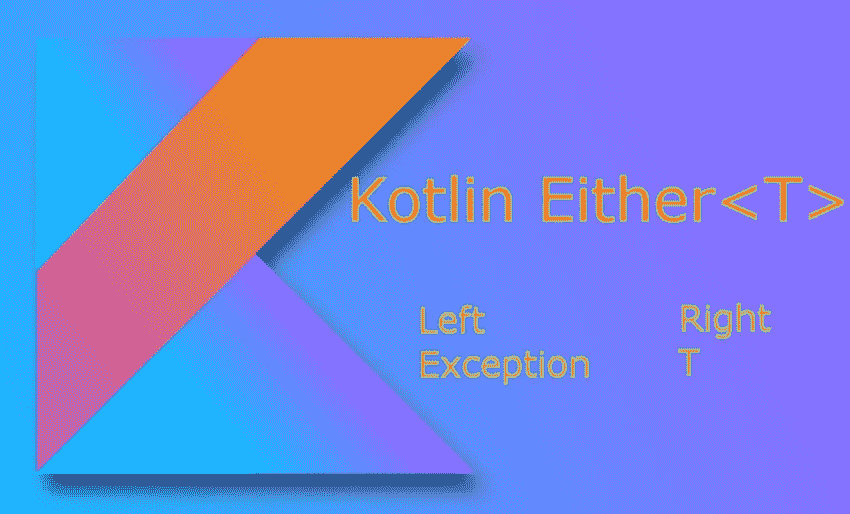

# 基于密封类的 Kotlin“要么”逻辑

> 原文：<https://blog.devgenius.io/kotlin-either-logic-based-on-sealed-class-97510c16882b?source=collection_archive---------0----------------------->

“要么”总比“不”好…



函数式编程带来了很多乐趣。我们有嵌套的链式方法，它们相互跟随，并将结果传递给下一个方法。

在通常情况下，我们可以返回结果<t>来获取我们所做操作的状态。**两种**方法都允许我们返回带有值或异常/错误的特定结果。</t>

当然，我们可以使用某种类型的库，比如 Arrow，其中任何一个逻辑都已经实现了。但更有趣的是手动创建它并了解所有细节。

我们可以在两个相似的变体中使用密封的类结构。

在继承的帮助下，它可以被定义为嵌套类:左边部分是错误，右边部分是结果。

```
sealed class Either<out T : Any> {

    data class Error(val message: String, val cause: Exception? = null) : Either<Nothing>() data class Success<out T : Any>(val value: T) : Either<T>()
    object Loading : Either<Nothing>()
}
```

或者创建独立的数据类，反正是相似的:

```
sealed class Either<out L, out R>
data class Left<out L>(val l: L) : Either<L, Nothing>()
data class Right<out R>(val r: R) : Either<Nothing, R>()
```

**I .我们的目标是获得方法的正确结果以及<T>T4 的一个对象中可能出现的异常**

```
fun main(args: Array<String>) {
    val result: Either<String, Int> = parseToInt("1001a")
    when (result) {
        is Left -> println("Can't read due to: ${result.lft}")
        is Right -> println("Result: ${result.rgt}")
    }
}
fun parseToInt(s: String): Either<String, Int> = try {
    Right(Integer.parseInt(s))
} catch (exception: Exception) {
    Left(exception.message ?: "")
}
sealed class Either<out L, out R>
data class Left<out L>(val lft: L) : Either<L, Nothing>()
data class Right<out R>(val rgt: R) : Either<Nothing, R>()
```

**二。我们也可以返回异常本身。**

Kotlin 与异常类型结合在一起，但是 Java 将异常分为 3 组:

1.  选中— IOException，SqlException…
2.  未选中 NullPointerException，NumberFormatException...
3.  错误—内存不足，堆栈溢出错误…

最好只在可能发生检查异常的情况下使用任一种方法。否则，检查 null 以获得显式响应。在这里，我们将在负解析的情况下获得 NumberFormatException。

```
fun main(args: Array<String>) {
    val result: Either<Exception, Int> = parseToInt("wrongInteger")

    val right: Any? = result.checkResult { it }
    println(right)
}
fun parseToInt(s: String): Either<Exception, Int> {
    return isResult { Integer.parseInt(s) }  
}sealed class Either<out L, out R>
data class Left<out L>(val l: L) : Either<L, Nothing>()
data class Right<out R>(val r: R) : Either<Nothing, R>()inline fun <L, R, T> Either<L, R>.checkResult(f: (R) -> T) =
    when (this) {
        is Left -> Exception("Incorrect input value: ${this.l}")
        is Right -> f(this.r)
    }inline fun <R> isResult(f: () -> R): Either<Exception, R> =
    try {
        Right(f())
    } catch (e: Exception) {
        Left(e)
    }
```

用任一逻辑模拟折叠方法扩展。Fold 获取一个初始值，并将集合的第一个元素作为参数。

```
fun main(args: Array<String>) {
    parseToInt("1001").fold(
        { exception -> println("Error due to $exception") },
        { result -> println("Result: $result") }
    )
}
fun parseToInt(s: String): Either<Exception, Int> {
    return isResult { Integer.parseInt(s) }  
}inline fun <L, R, T> Either<L, R>.fold(lft: (L) -> T, rgt: (R) -> T): T =
    when (this) {
        is Left -> lft(this.l)
        is Right -> rgt(this.r)
    }
```

**结论**。

使用任何一个的优点是获得元组，左和右部分作为 1 个结果参数。第一次看可能会感到困惑，但函数式方法使它变得有用且易于阅读。

**链接**

[](https://arrow-kt.io/) [## rrow

### 科特林标准库的功能伴侣

arrow-kt.io](https://arrow-kt.io/)  [## 箭试已死，科特林结果万岁

### 几个月前，Arrow Try 被否决了，我需要一个声明性错误的替代数据结构…

medium.com](https://medium.com/@jcamilorada/arrow-try-is-dead-long-live-kotlin-result-5b086892a71e)