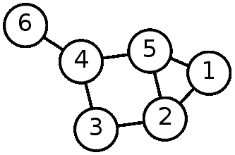
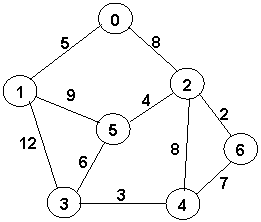
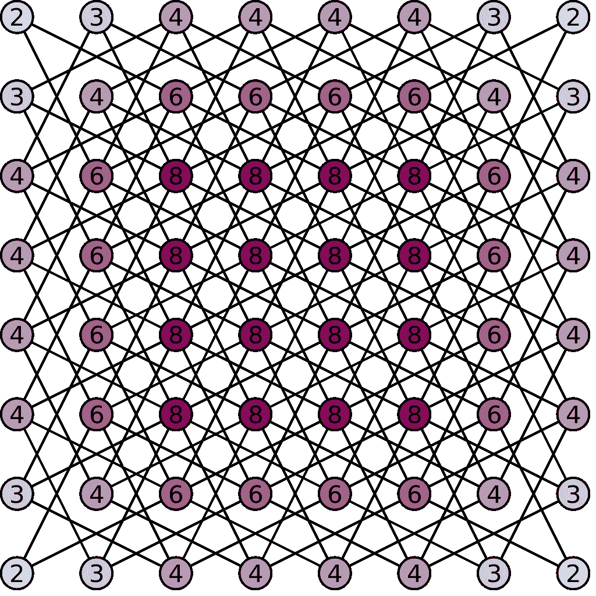
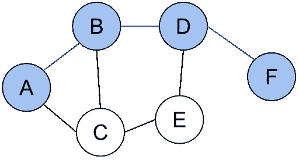

# 科特林。图表

> 原文：<https://blog.devgenius.io/kotlin-graphs-e1b54cf3a478?source=collection_archive---------5----------------------->

图是一种数学抽象，但在编程中却被广泛使用。图由一组所谓的顶点(通常表示为平面上的点)和连接这些顶点的边(也称为弧)组成。图中显示了一个图表示例。



最常见的是用图来描述各种方案，如连接计算机网络中的节点或城市和地图上的其他点。借助于图解决的一个典型问题是寻找从一点到另一点的最短路线。除了顶点和边的信息之外，一个图通常还包含辅助信息。例如，对于道路方案，它可以是对应于图的顶点的城市名称，或者对应于图的边的道路长度。示例:



类似于图的数据结构可以出现在各种最优解搜索问题中。例如，有一个寻找象棋马的最短轨迹的问题。这个问题可以用一个图来描述，这个图的顶点是棋盘上的格子，边连接着那些棋子可以移动的格子。这样的图表可以是这样的:



在编程语言中，可以用不同的方式来描述图形。在关于象棋马的路线的相同问题中，最好根本不存储关于图的顶点的信息，能够找到与特定单元相关联的边就足够了，即，马可以从该单元跳到的单元。然而，在其他问题中，关于图的顶点和边的信息是值得存储的，然后应该使用自己的类来实现这个目的。下面给出了这样一个类的实现示例。

```
class Graph {
    private data class Vertex(val name: String) {
        val neighbors = mutableSetOf<Vertex>()
    }

    private val vertices = mutableMapOf<String, Vertex>()

    private operator fun get(name: String) = vertices[name] ?: throw IllegalArgumentException()

    fun addVertex(name: String) {
        vertices[name] = Vertex(name)
    }

    private fun connect(first: Vertex, second: Vertex) {
        first.neighbors.add(second)
        second.neighbors.add(first)
    }

    fun connect(first: String, second: String) = connect(this[first], this[second])

    fun neighbors(name: String) = vertices[name]?.neighbors?.map { it.name } ?: listOf()
}
```

这里描述的图形是一个相当复杂的类。它包括 addVertex 函数和两个不同参数的 connect 函数，其中一个是私有的。为了访问与此相邻的顶点列表，该类具有函数 neighbors，该类还具有运算符函数 get(也是私有的)，存储关联数组(MutableMap)的属性(val)顶点(也是私有的)，以及具有属性 name 和 neighbors 的嵌套类顶点。让我们仔细看看 Graph 类的所有这些元素。

**班级成员**

一个类可以有任意数量的成员，分为两类:属性和函数。类属性被定义为 **val** (不可变)或 **var** (可修改)。它们通常被用来描述一个类的内部结构；例如，Graph 类使用 vertices 属性存储有关图形中顶点的信息，而 Vertex 类使用 neighbors 属性存储有关与给定顶点相邻(即由边连接)的顶点的信息。

类函数被定义为 **fun** ，用于对这个类的对象进行各种操作，在这个例子中，是一个图形。在这种情况下，连接函数用于将图的两个顶点与一条边连接起来，也就是说，向图中添加一条新边。addVertex 函数向图形添加一个新的顶点。

**能见度**

类成员可以有不同的可见性。最常见的两种能见度等级在科特林使用:**公共**和**私人**。若要更改可见性级别，必须在定义类成员之前指定 public 或 private 关键字。

开放类成员可以被所有人使用。在程序的任何部分，我们都可以编写 graph.connect(…)来给图添加新的边。封闭类成员只能由类本身使用；试图在类外部编写 graph.vertices 以引用 vertices 属性将导致编译时错误。

程序员发明了封闭类成员来划分程序不同部分的责任。以下原则适用:每个类对自己的内容负责。理想情况下，对开放类成员的任何操作都不应该导致错误，类对象的状态应该根据所执行的操作而改变。例如:

```
fun useGraph() {
    val g = Graph()
    g.addVertex("A")
    g.addVertex("B")
    g.addVertex("C")
    g.addVertex("D")
    g.connect("A", "C")
    g.connect("B", "D")
    g.connect("B", "C")
    println(g.neighbors("B"))
}
// we should get a graph
// A ----- C
//         |
//         |
// D ----- B
// println will print: ["C", "B"]
```

编写 useGraph 函数的程序员合理地期望图 g 有四个顶点和三条边，看起来像注释中显示的那样。他还预计，如果我们搜索与“B”相邻的顶点，我们将得到一个顶点“C”和“D”的列表。然而，关联数组顶点(它实际上存储了关于图形顶点的信息)是私有的，除了这个类的其他成员之外，任何人都不能更改它。

这里使用的原理被程序员称为封装。这种情况下的图形类似于一个胶囊，具有“addVertex”和“connect”按钮(按下它们会改变图形)和一个指示器邻居(调用相应的函数不会改变图形)。其他一切都在太空舱里面，从外面看不到；图中封闭的内容是它的私事。

**嵌套类**

经常发生的情况是，没有其他类，某个类就没有意义。这就是在我们的例子中发生的事情——没有图，顶点就没有意义。在这种情况下，对应于顶点的顶点类被定义在 Graph 类内部。由于本例中的类是私有的，所以它只能在 Graph 类中使用。如果顶点类是开放的，它可以在图形之外作为 Graph.Vertex 使用。

在这种情况下，一个顶点有一个“名称”属性，这是在其构造函数中指定的，还有一个“邻居”属性，它存储其他顶点的可变集(mutable set)。当一个顶点被创建时，它的邻居集合是空的，但是从图中调用连接函数来扩展它。

**设置并列出**

集合在许多方面与列表相似，但它们是不同的。像列表一样，集合包含一些相同类型的元素；与列表的区别在于集合不能包含相同的元素。当您试图将一个元素添加到一个已经存在的集合中时，该集合不会被更改。

对于一个集合，可以检查某个元素是否出现在集合中，或者使用 For 循环遍历集合中的所有元素，这两种方法对于列表都是可行的。一个集合有一个 size 属性和 isEmpty()，isNotEmpty()函数来计算它的大小。集合可以互相添加，列表也有所有这些操作。Kotlin 中的集合可以是常规集合<t>或可变集合<t>。</t></t>

集合只是一个没有相同元素的列表吗？不，不是的。集合不支持索引访问，也就是说，它没有 set[i]操作，无论是读取还是写入。但是集合比列表更快地确定它是否包含集合中的元素。要在一个列表上实现这个操作，你需要搜索所有的元素，而集合有一个更复杂的结构，这允许你更快地找到其中的元素。

在 Kotlin 中，集合是使用 setOf(…)和 mutableSetOf(…)函数创建的。

**系列**

集合是集合和列表的所谓超类型。集合结合了它们的共同属性和功能。除了集合的功能之外，列表还具有索引功能。除了集合的功能之外，集合不添加已经存在的元素。

集合<t>集合<t>存储相同类型 t 的元素。</t></t>

1.定素数(大小)，空，非空。

2.元素出现的确定和元素的枚举(在中)。

3.与另一系列或单个项目堆叠。

4.对于可变集合 MutableCollection <t>，也是—添加和删除元素。</t>

集合用于程序员不关心特定种类的集合的情况。特别是，我们已经熟悉的许多列表操作实际上是为集合定义的。

**关联数组(映射)**

关联数组(又名映射或字典)映射<k v="">类似于普通数组，或者更准确地说，类似于列表。不同之处在于，列表中的索引是从 0 到 list.size — 1 的整数，关联数组中的索引可以是任何值。使用的索引(键)的类型由 K map 参数决定，存储值的类型由 V 参数决定。对于数组顶点，键是字符串(顶点名称)，值是顶点本身。</k>

Graph 类只对顶点使用两种操作—创建和索引。要创建映射，请对常规映射<k v="">使用 mapOf(…)方法，或者对可变映射使用 mutableMapOf(…)方法。电话示例:</k>

```
val map = mapOf("John" to 87, "Mike" to 41, "Fred" to 24)
```

这个调用将创建一个 map 类型的 Map <string int="">，它的键是一个字符串，值是一个整数。通过键“约翰”,地图存储了数字 87 等等。键到值函数创建一个键和值对，映射本身是从对的枚举中创建的。</string>

映射的索引与数组的相同，但索引必须与映射键的类型相同。特别地，顶点的索引是一个字符串(感兴趣的顶点的名称)。在常规映射中，您只能通过键读取值，但是在可变映射中，您可以添加值。应该注意的是，映射中的键不能重复，如果您试图为一个已经存在的键添加一个新值，该键的旧值将被删除。

有趣的是，当使用一个不存在的键来访问一个地图时，它的行为是怎样的，例如，对于示例中的地图，使用 map["Tom"]。与列表相反，不会生成异常；但是，这个操作的结果是 **null** 。这就是所谓的**空**引用，我们在第六课已经看到了。在这种情况下，索引引用操作的结果类型是 Int？，意思是 Int 或者 **null** 。

**安全操作**

现在让我们仔细看看 Graph 类的 neighbors()函数:

```
fun neighbors(name: String) = vertices[name]?.neighbors?.map { it.name } ?: listOf()
```

我们来分解一下这个函数的定义。如上所述，结果顶点[名称]可能是一个 **null** 引用，这个表达式的类型是 vertex？顶点类型(不带？)有邻居的财产；然而，人们不能简单地称它为顶点[名称]。邻居，因为 null 既没有属性也没有方法。所以我们要用所谓的安全参考:顶点[名称]？这种处理的结果是从地图获得的顶点的邻居属性的值；如果名称键不在地图中，我们就用 **null** 代替顶点，安全处理的结果也是 **null** 。表达式类型顶点[名称]？。邻居是可变集<的顶点>？

之后，我们以同样的方式调用高阶函数图，将结果集中的每个顶点替换为其名称，并获得一个名称列表。既然地图也是用？。，如果从一开始就没有找到顶点，我们将得到空值，而不是名字列表。表达式顶点的类型[名称]？。邻居？。map { it . name }—List<String>？

最后，在表达式的最后，使用所谓的 Elvis 操作符。Elvis 操作符有两个参数，比如？:b，行为如下:

1.如果 a 不为空，Elvis 运算符的结果等于 a。

2.如果 a 为空，Elvis 运算符的结果为 b。

在邻居的例子中，在两种情况下我们都有一个类型 List <string>的结果，所以这个函数也有一个结果类型 List <string>。</string></string>

**操作员超载**

现在考虑这个定义:

```
private operator fun get(name: String) = vertices[name] ?: throw IllegalArgumentException()
```

定义中的 operator 关键字意味着这个函数覆盖(重载)了一个特定的**操作符**的操作。Kotlin 中的特定操作符链接到函数名。get 函数对应的是索引算子，即有一个图 g，我们可以用 g[name]按名称从它得到一个顶点。

在函数体中，我们访问顶点映射，检索顶点？然后我们再次使用 Elvis 操作符，它在右边生成一个异常，终止函数。这意味着当对应的键不在映射中时，这个函数抛出一个 IllegalArgumentException，而不是返回 **null** 。但是函数的结果变成了顶点(没有？).

以下片段使用了重载索引运算符:

```
fun connect(first: String, second: String) = connect(this[first], this[second])
```

这个函数调用另一个连接函数——使用类型为 Vertex 而不是 String 的参数。这个[first]用于将顶点名称首先转换为顶点本身。这里**这个**是表示目标图的关键字，即调用连接函数的图。这个[第一个]一起使用图表上的索引。

**在图上搜索**

图上的搜索算法可以有不同的目的。我们将使用确定顶点之间距离的例子来看它们。图中顶点 A 和 B 之间的距离定义为从 A 到 B 必须经过的最小边数。参见示例:



这里顶点 A 和 B 之间的距离是 1，A 和 E 之间的距离是 2，C 和 F 之间的距离是 3。

为了确定距离，我们需要依次考虑从顶点 A 开始的所有边链，找出在 B 结束的边链，并确定最短的边链。有两种方式来考虑这样的链:深度搜索和宽度搜索。

当深度搜索时，我们从每个顶点移动到它的一个邻居，形成越来越长的链。当我们碰到顶点 B 时，或者当我们碰到链中已经存在的一个顶点时，链就断开了，形成了一个环。在那之后，我们在这个链条上后退一步，开始尝试其他链条——以此类推。

搜索是一波一波进行的。首先，我们遍历顶点 A 的所有邻居，记住到每个邻居的距离(1)。然后，我们列举了顶点 A 的所有邻居，已经有 2 条边的距离。然后我们尝试距离为 3 的顶点，以此类推，直到我们到达顶点 b。

**深度搜索的实现**

深度优先搜索。

```
fun dfs(start: String, finish: String): Int = dfs(this[start], this[finish], setOf()) ?: -1 private fun dfs(start: Vertex, finish: Vertex, visited: Set<Vertex>): Int? =
            if (start == finish) 0
            else {
                val min = start.neighbors
                        .filter { it !in visited }
                        .mapNotNull { dfs(it, finish, visited + start) }
                        .min()
                if (min == null) null else min + 1
            }
```

深度搜索通常使用以下规则递归实现:

1.任何顶点到自身的距离都是 0。

2.设 N(A)是与 A 相邻的所有顶点，那么距离(A，B) = min(距离(N，B)) + 1，其中最小值是在 N(A)中包含的所有顶点 N 中选择的。

这些规则的简单实现可能如下所示:

```
private fun dfs(start: Vertex, finish: Vertex): Int? =
        if (start == finish) 0
        else {
            val min = start.neighbors.mapNotNull { dfs(it, finish) }.min()
            if (min == null) null else min + 1
        }
```

假设这个函数的结果是 **null** 如果顶点之间没有连接(比如起始顶点没有邻居)。高阶函数 mapNotNull 在所有邻居上调用 dfs，并过滤结果以移除所有等于 **null** 的值。在这种情况下调用 mapNotNull 等效于调用 map { dfs(it，finish) }。filterNotNull()。

在实践中应用这个函数会由于无限递归而导致 StackOverflowException 异常，因为现有的方案并不阻止我们无限地从起始节点到它的邻居，然后再返回。

这就是为什么已经访问过的节点集被引入到函数中(通过第三个参数，最初它是空的)。已经访问过的顶点使用 filter { it！在 visited }中，当递归调用该函数时，刚刚访问过的顶点被添加到集合中。这提供了搜索功能的有限性。

**广度优先搜索的实现**

BFS =广度优先搜索。

```
fun bfs(start: String, finish: String) = bfs(this[start], this[finish])

private fun bfs(start: Vertex, finish: Vertex): Int {
    val queue = ArrayDeque<Vertex>()
    queue.add(start)
    val visited = mutableMapOf(start to 0)
    while (queue.isNotEmpty()) {
        val next = queue.poll()
        val distance = visited[next]!!
        if (next == finish) return distance
        for (neighbor in next.neighbors) {
            if (neighbor in visited) continue
            visited.put(neighbor, distance + 1)
            queue.add(neighbor)
        }
    }
    return -1
}
```

在进行宽度搜索的过程中，我们使用顶点数组队列<vertex>。队列运行的原理类似于存储中的真实队列，调用 queue.add 函数会将 vertex-argument 添加到队列的末尾(将队列大小增加 1)，而调用 queue.poll 函数则相反，会从队列头中取出第一个顶点(将队列大小减少 1)。对于空队列，queue.poll 的结果将是空的。最初，只有起始顶点被写入队列。</vertex>

为了存储找到的到已经访问过的顶点的距离，函数使用关联数组，数组的键是顶点，值是到顶点的距离。最初我们知道从开始顶点到它的距离是 0。

然后，该函数从队列中顺序检索一个顶点及其与数组的距离。该循环遍历与给定顶点相邻的所有顶点。它检查顶点是否还没有到达，然后将其写入队列。到相邻顶点的距离被写成到原始顶点的距离+ 1。这个过程一直重复，直到我们得到所需的节点完成。

注意运算符 val distance = visited[next]！！！Here visited[next]通过索引访问一个关联数组，结果为 Int？(Int 或 **null** )。我们只想得到 Int。因为在函数中，将一个顶点放入队列并写入它的距离总是一个接一个地执行，所以我们确信在给定的索引下，数组中有一些值。所以我们可以应用！！运算符将类型从 Int？如果结果是数组中的给定索引处没有值，此时将出现 KotlinNullPointerException。