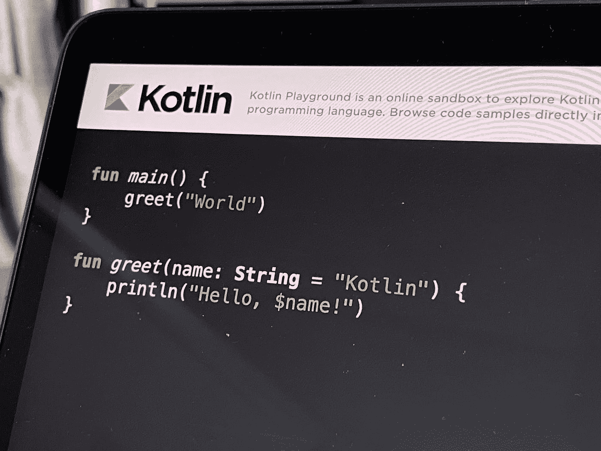

# Kotlin 神奇功能——你需要知道的一切

> 原文：<https://blog.devgenius.io/kotlin-magic-functions-everything-you-need-to-know-63e9957eea11?source=collection_archive---------0----------------------->

在本文中，我们将看看 Kotlin 中函数最常见的**【魔法】**用法。



照片由[路易·蔡](https://unsplash.com/@louis993546?utm_source=medium&utm_medium=referral)在 [Unsplash](https://unsplash.com?utm_source=medium&utm_medium=referral) 上拍摄

# 扩展功能

先说简单的:*无继承扩展类*。我们可以在不改变类`String`和所有使用它的包的情况下，通过添加新的方法或属性(字段)来扩展这个类。让我们有一个方法`deleteSpaces()`:

我们可以像使用类`String`的一部分一样使用这个方法。用户将会看到这样的内容:

编译后，这个方法看起来会是这样的(部分代码已经简化，以便于您理解其本质):

由此我们可以得出结论，在方法`deleteSpaces()`中，我们只能访问该类的公共字段和方法，因此封装不会被破坏。

以此类推，除了 Kotlin 中的扩展函数之外，还可以有扩展属性:

Kotlin 中函数和 lambdas 的大多数“神奇”用法，就像这个一样，无非是语法糖，但是多么方便啊！

# λ函数和匿名函数

在 Kotlin 中，匿名函数和 lambda 函数是没有名字的函数，但它们也可以作为对象使用。它们可以直接写在表达式中，绕过单独的声明。

lambda 表达式的语法是:

```
{ arguments -> returned_type
    function_body
}
```

声明匿名函数的语法与声明常规函数的语法完全相同，但是第一个函数没有名字。

我们稍后将讨论这些类型的函数之间的语义差异，但现在我们将考虑将 lambdas 与高阶函数一起使用的示例。

# 高阶函数

高阶函数是将另一个函数作为其参数之一的函数，包括 lambda 或匿名函数。使用这种函数的一个突出例子是回调。

假设我们有一个高阶函数`longWork()`:

它将一个函数作为参数`callback()`，但是只在函数`doSomething()`之后调用它。使用此功能:

这里我们调用函数`longWork()`并把一个 lambda 函数作为参数传递给它，它稍后会调用这个函数。如果 lambda 是函数的最后一个参数，Koltin 允许您将它放在括号外，如果 lambda 是唯一的参数，也可以完全删除括号。此外，在大多数情况下，如果不使用参数，可以删除返回类型并用`_`替换它们。以下是一个更简短的版本:

从表面上看，这并不像一个高阶函数，而是一个语言结构，例如，Java 中的`synchronized`。顺便说一下，`synchronized`在 Kotlin 中，它是作为一个高阶函数来构建的。

这对于创建所谓的 DSL(特定于领域的语言)——特定于领域的语言非常方便。Kotlin 最流行的 DSL**有 **Anko** *(直接在 Kotlin 中的 Android UI，同时保留了 XML 标记的便利)*、**Gradle kot Lin DSL***(kot Lin 上的 Gradle 脚本)*、**kotlinx.html***(与 Anko 类似)*。**

例如，考虑一个 Kotlin HTML 页面:

这将打印到标准输出:

这种 DSL 的主要优点是，与声明式 HTML 不同，Kotlin 具有可用于生成动态页面的变量。这比通过许多字符串的连接生成传统页面要漂亮和方便得多。实际上，其他方法也可以用来生成 HTML 标记，这只是 Kotlin 中 DSL 的一个例子。

使用高阶函数的另一个例子类似于 Java 中的 Streams API:

# 更复杂的 lambdas

让我们看一些示例代码:

使用语言标准库中更复杂的高阶函数，您可以将上面的代码变成以下代码:

正如你所看到的，方法`apply()`允许你不用写几次`builder.append()`，这要感谢下面的方法原型:

`public inline fun <T> T.apply(block: T.() -> Unit): T`

在这里，lambda 函数`block`是类型`T`的扩展方法，在这里是`StringBuilder`的扩展方法。lambda `block`中的`append()`是`this.append()`，其中`this`是类`StringBuilder`的实例。

方法`let()`以类似的方式工作，只接受稍微不同的 lambda:

`public inline fun <T, R> T.let(block: (T) -> R): R`

这里，对象引用不是作为一个质量`this`传递的，而是作为一个显式的方法参数，但是我们没有指定它。在这种情况下，编译器会自动将 lambda 函数的第一个参数命名为“it”。

# 关于未说出口的一点

首先，与 Java 不同，Kotlin 重载了操作符。例如，如果一个类有一个方法`plus()`，那么它可以被一个操作符`+`调用，而一个方法可以被一个操作符`[]`调用`get()`。

其次，Kotlin 中的函数可以显式标记为`inline`或`noinline`。这个修饰符告诉编译器是否内联函数来提高性能。但是这里有一个问题:不同的行为`return`在`inline`和`noinline`函数中。

在`inline`函数中，它`return`将从范围内最近的`noinline`函数中产生。b`noinline`——来自函数本身。命名解决方案解决了这个问题`return`。

为了使`return`从我们在上面例子中传递的 lambda 到`apply()`，你可以使用`return@apply`。

命名不仅可以是`return`，还可以是`break`、`continue`。您也可以创建自己的标签:

此外，还有一个函数修饰符`tailrec`告诉编译器，如果函数是以返回 if-then-else 函数格式编写的，就用循环替换函数中的递归。示例:

第三，如果一个方法需要一个对象作为参数，它必须用一个抽象方法从一个类/接口继承，那么一个 lambda 或一个匿名函数可以传递给这个函数，编译器本身将创建一个匿名类，用我们的 lambda 覆盖抽象方法。例如，Android 标准库有一个方法`public void setOnClickListener(View.OnClickListener l)`，其中`OnClickListener`是一个具有单个方法`onClick(View v)`的接口。

视图`setOnClickListener { doSomething() }`中传递的 lambda 将被编译成实现接口`OnClickListener`的匿名类，其中我们的 lambda 将变成方法`onClick(View v)`。

# 结果

这远不是 Kotlin 中所有的函数，只是最常用的。凭借其**、【魔法】、**功能，Kotlin 让编写代码变得更加容易，最重要的是，让阅读代码变得更加容易。易于编写和安全性是 Kotlin 和 Java 之间的两个最重要的区别，早在 **1995 年(！).**那个时候，代码的便捷和安全是做梦都想不到的。

# 阅读更多

*如果您觉得本文有帮助，请单击💚或者👏按钮或分享关于脸书的文章，这样你的朋友也可以从中受益。*