# 具有 Kotest 和 Gradle 版本目录的 Kotlin 多平台库

> 原文：<https://blog.devgenius.io/kotlin-multiplatform-library-with-kotest-and-gradle-version-catalog-23861a6f1bb1?source=collection_archive---------6----------------------->

## 增加默认 Kotlin 多平台项目的趣味🌶

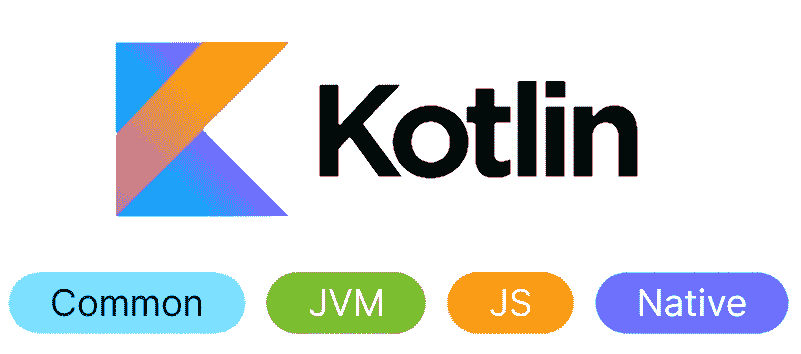

最近，我开始了一个兼职项目，在**科特林**建造一座图书馆。然后我想，为什么不用 **Kotlin 多平台**？

所以我开始研究这个问题，作为一个非常负责任的开发人员，我想把 **Kotest** 作为我的测试框架。

现在，你可能会奇怪:*“嘿，卢西恩，为什么要费力地替换默认的测试框架，* ***Kotlin 测试*** *，用****Kotest****？*🤔

嗯，这只是个人喜好，我更喜欢由 **Kotest** 提供的受 Scala 启发的[***FunSpec***](https://kotest.io/docs/framework/testing-styles.html#fun-spec)而不是由 **Kotlin Test 提供的默认的基于注释的方法🤷‍♂️**

事实证明，配置项目并不像预期的那样简单，我遇到了一些问题，所以让我用这篇文章为您节省一些时间。

## 我们将在本文中讨论的内容

我们将主要讨论三件事:

1.  设置与**分级版本目录**的依赖关系，以保持🧼的整洁
2.  添加 **Kotest** 作为默认测试框架
3.  编写一个简单的测试来确保一切正常

## 开始之前

🍎请注意，我使用的是基于英特尔芯片的 macOS。这就是我的原生平台。如果您也在使用 mac，**请确保安装了 XCode】**

# 创建默认项目

首先，让我们用 **IntelliJ** 创建默认项目

确保选择`Gradle Kotlin`，因为我们将使用它作为我们的构建工具。默认情况下，应该选中它。

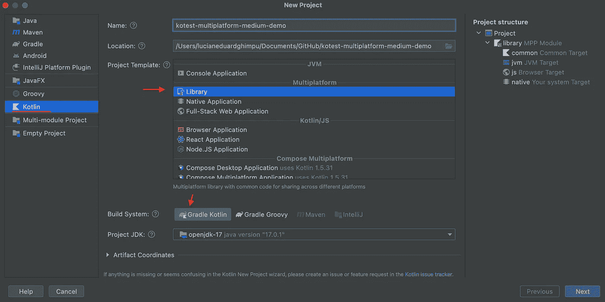

接下来，确保**取消选择"** *使用 kotlin . test "**作为我们的目标，以便使用 **Kotest！***

*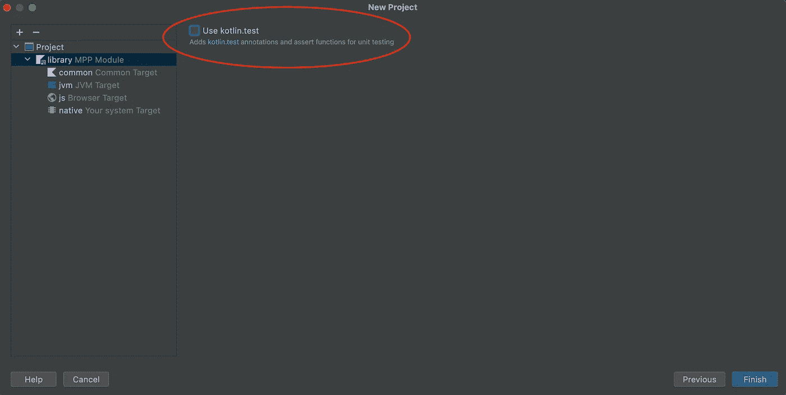*

*应该就是这样，最后，你的项目应该是这样的:*

*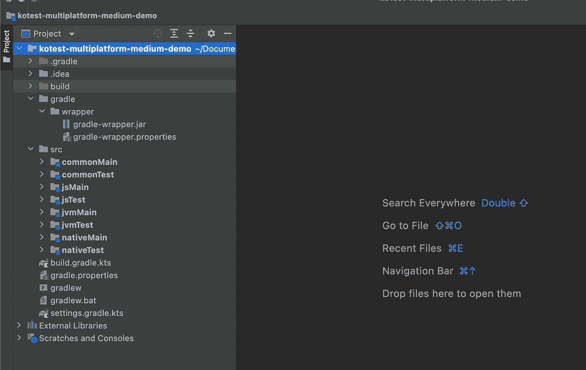*

# *使用分级版本目录管理依赖关系*

*您可能会，*“嘿，这是什么，我为什么要关心这个”，*可能我需要一篇单独的文章来讨论这个问题，但长话短说，这是一种集中的、改进的管理依赖关系的方法。看到它的好处的最好方法是开始使用它:*

## *启用 settings.gradle.kts 中的版本目录*

*这可以通过简单地在`settings.gradle.kts`中添加以下行来实现*

```
*enableFeaturePreview("VERSION_CATALOGS")*
```

## *创建我们的版本目录*

*我们将通过在`gradle`目录中创建一个`libs.versions.toml`来做到这一点:*

*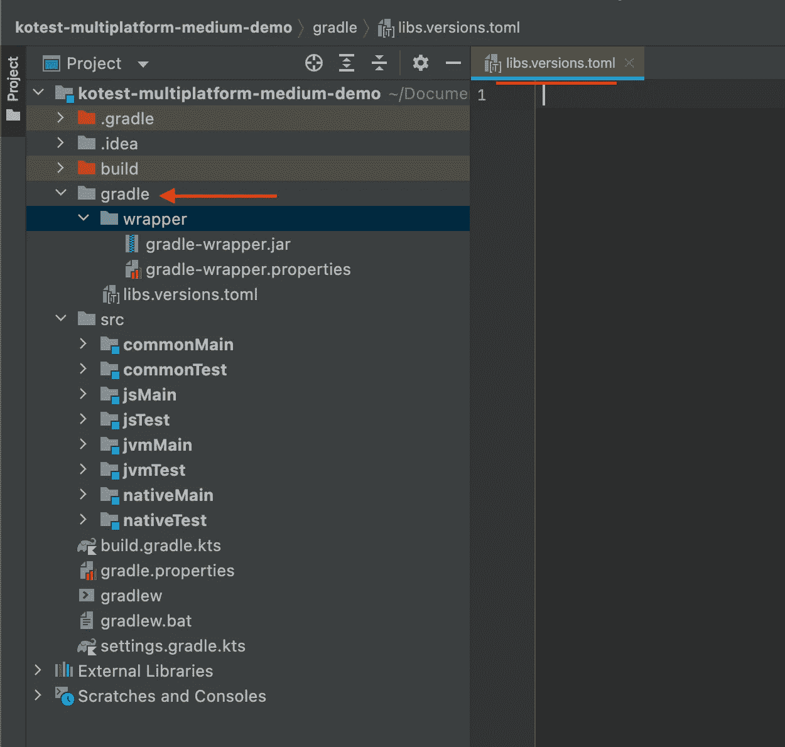*

*创建`.toml`文件后，IntelliJ 可能会提示您安装一个插件，在 IDE 中添加 **TOML** 语言支持，如果没有，您可以手动下载以下插件:*

*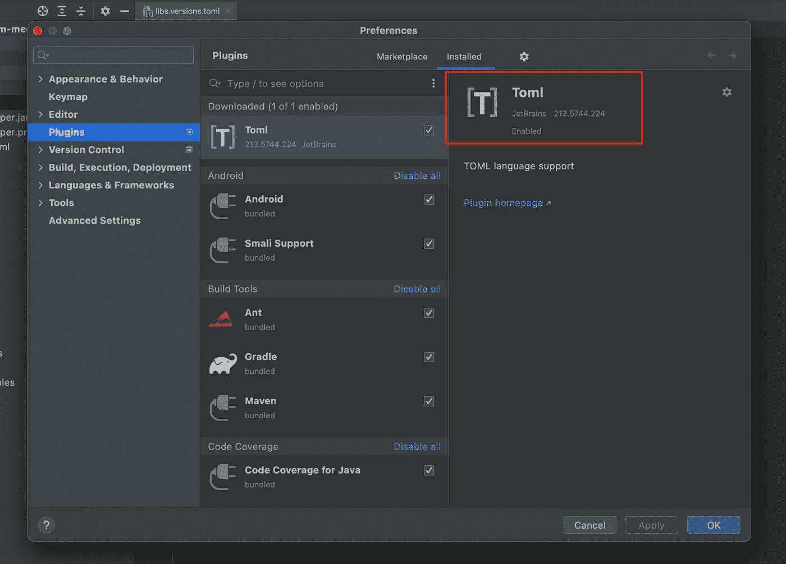*

## *在目录中添加依赖项*

*现在让我们添加依赖项，我们只需要声明 **Kotlin** 和 **Kotest:** 的依赖项*

*⚠️注意，要在 TOML 文件中使用**【插件】**，你可能还需要更新`gradle-wrapper.properties`中的 Gradle 分布:*

```
*distributionUrl=https\://services.gradle.org/distributions/gradle-7.3.2-all.zip*
```

*就这样，我们有了包含所有版本和依赖项的集中目录。接下来，我们将了解如何使用目录。*

# *使用 build.gradle.kts 中的目录*

*因此，让我们添加这些依赖项。*

## *首先是插件*

```
*@Suppress("DSL_SCOPE_VIOLATION")
plugins **{** alias(*libs*.*plugins*.*multiplatform*)
    alias(*libs*.*plugins*.*kotest*)
**}***
```

*一些注意事项:*

1.  *为了避免已知的误报，需要使用`@Supress("DSL_SCOPE_VIOLATION")`*
2.  *`libs.plugins.*`是 Gradle 基于我们的`.toml`文件生成的*类型安全访问器*的一部分，如果你找不到它们，试着做一个*干净的&构建。*如果问题仍然存在，也尝试通过 IntelliJ*使缓存&无效并重启**

## *接下来是特定于项目的依赖项*

*我们只需要为**common test**&**JVM test:**添加依赖项*

```
**sourceSets* **{** val commonMain by *getting* val commonTest by *getting* **{** dependencies **{** implementation(*libs*.*kotest*.*framework*.*engine*)
            implementation(*libs*.*kotest*.*framework*.*datatest*)
            implementation(*libs*.*kotest*.*assertions*.*core*)
        **}
    }** val jvmMain by *getting* val jvmTest by *getting* **{** dependencies **{** implementation(*libs*.*kotest*.*runner*.*junit5*.*jvm*)
        **}
    }** val jsMain by *getting* val jsTest by *getting* val nativeMain by *getting* val nativeTest by *getting* **}***
```

*另外，注意在定义`js`目标时，Kotest 只支持 **IR 编译器**:*

```
*js(IR) **{ // BOTH and LEGACY are not supported by KOTEST** browser **{** commonWebpackConfig **{** cssSupport.enabled = true
        **}
    }
}***
```

*最终的`build.gradle.kts`应该是这样的:*

*就是这样！不，让我们试着为一些非常基本的东西写一个样本测试，以确保一切工作正常，✍️*

# *编写样本测试*

## *要测试的代码*

*让我们在 **commonMain** 中定义一个简单的`expect`，它期望一个字符串作为返回类型:*

***普通***

*然后让我们定义每个平台中的`actual`实现:*

***jsMain***

*jvmMain*

***原生主***

*注意 **Kotest** 支持[多种测试方式](https://kotest.io/docs/framework/testing-styles.html)。*

*我将使用一个☝️*

***通用测试***

***jsTest***

***jvmTest***

***天生测试***

*我们已经完成了测试！*

# *运行测试*

*现在运行它们，这里我有一个坏消息。您会注意到，允许您直接从文件运行测试的常见绿色按钮目前不被 **Kotest 多平台支持。***

*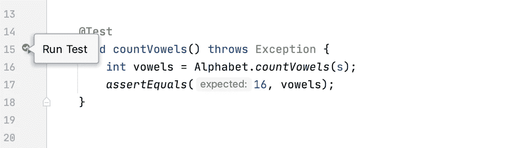*

*预期行为*

*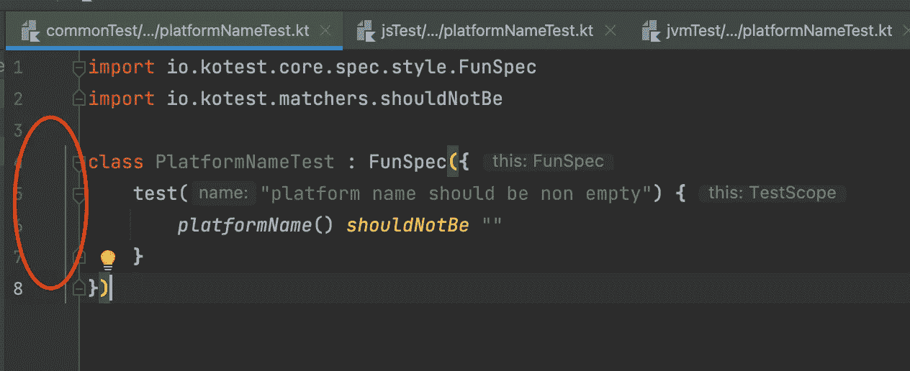*

*Kotest 的实际行为*

*那么，我们如何进行测试呢？*

*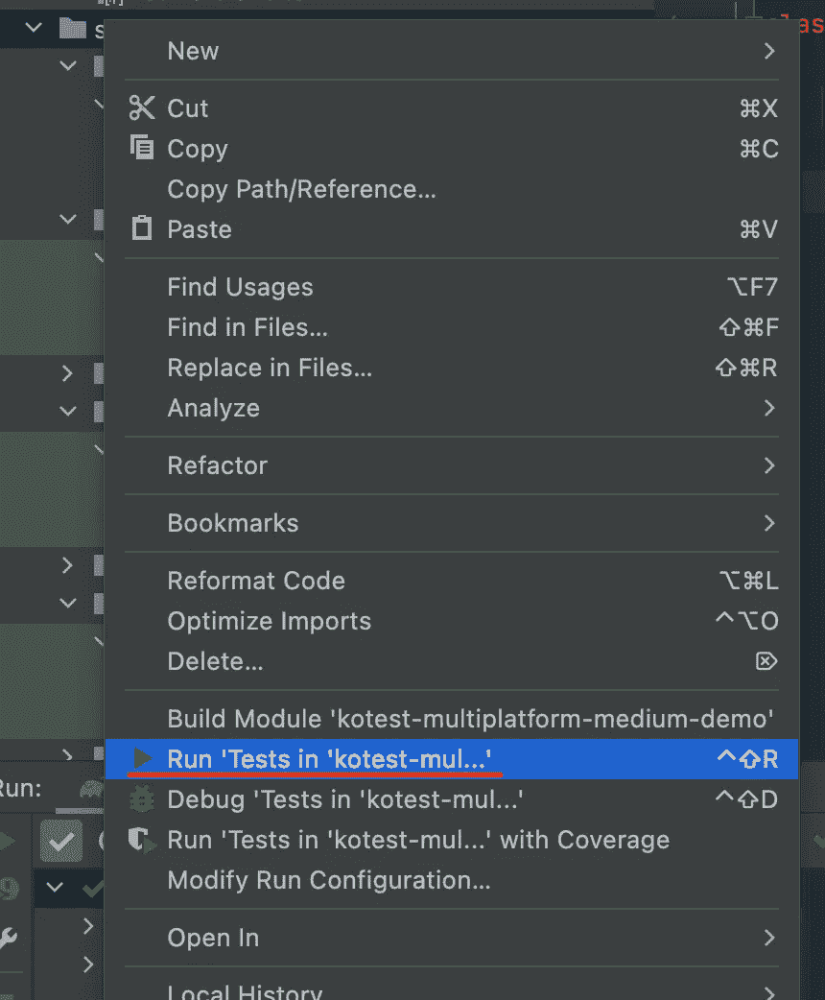*

*您可以正常运行它们，只需右键单击`src`目录。*

*但是这将只运行**通用**和 **JVM** 测试，正如你将从下面的测试结果中看到的👇*

***您可以通过右键单击特定于平台的测试目录*来运行特定于平台的测试*

*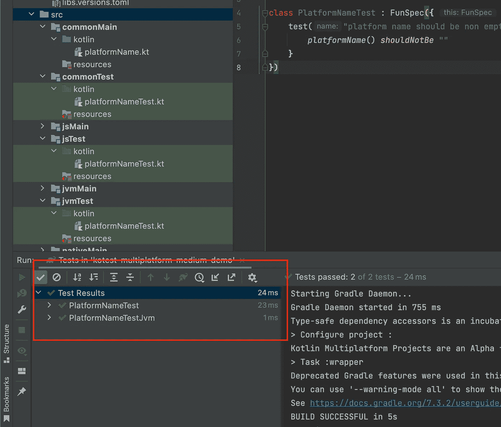*

*运行所有测试的最佳方式实际上就是在终端中运行这个 **Gradle** 命令:*

```
*./gradlew check*
```

## *检查生成的测试报告*

*我们还可以通过一些静态网页获得一个不错的可探索的 GUI，其中包含测试报告，但是首先，让我们添加一个新的失败测试来增加我们报告的趣味🌶*

*在**本地测试中:***

*测试失败的 nativeTest*

*如果您现在运行`./gradlew check`，您应该会得到一个错误和一个带有生成报告的链接，链接应该类似于*:*

```
*file:///Users/lucianeduardghimpu/Documents/GitHub/kotest-multiplatform-medium-demo/build/reports/tests/allTests/index.html*
```

***路径的第一部分将根据您的设置进行相应的更改。**

*如果我们去浏览生成的页面，我们会发现这个漂亮的交互式报告:*

*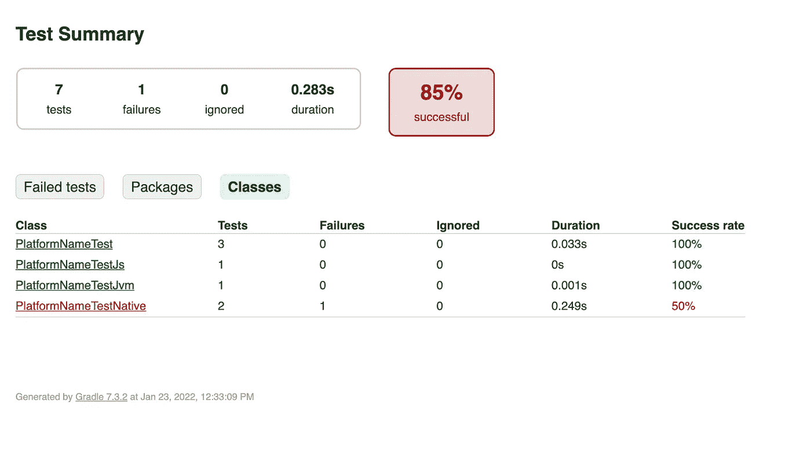*

*现在你有了它，一切都按预期工作，你现在准备添加一些真正的代码，并把 **Kotest** 投入测试。*

**如果你面临额外的问题，尝试或者* ***使&无效*** *或者删除****/build****目录中的所有内容。这帮助了我 2-3 次。**

# *结论*

*这看起来很酷，但是我们从来没有列出这个设置的好处，你为什么不坚持你得到的默认项目呢？*

## *⬆️优势*

*这种设置的主要优点如下:*

1.  *您的依赖项都通过**目录**整齐地组织起来*
2.  *在主 **build.gradle.kts** 中有类型安全的自动生成代码来处理依赖关系*
3.  *你得到了 **Kotest** 的灵活性，我发现运行测试*更加容易和快速(并且有趣*🎉 *)**
4.  *所有这些都是同时针对 **JVM** 、 **js** 和**原生**！*

## *⬇️的劣势*

1.  *与 **Kotlin 多平台**相关的一切都还很新，所以请期待一些奇怪的问题或错误*(正如我们在设置过程中看到的)**
2.  *将 Kotest 与多平台*一起使用时有一些限制(同样，其中一些我们已经在本文中看到过)*。有关更多信息，请查看其他资源👇*

## *额外资源*

1.  *[科特林多平台](https://kotlinlang.org/docs/multiplatform.html)*
2.  *[Kotest 设置&限制](https://kotest.io/docs/quickstart#test-framework)*
3.  *[Gradle 版本目录](https://docs.gradle.org/current/userguide/platforms.html)*
4.  *[GitHub 回购与项目👨‍💻](https://github.com/GhimpuLucianEduard/kotest-multiplatform-medium-demo)*