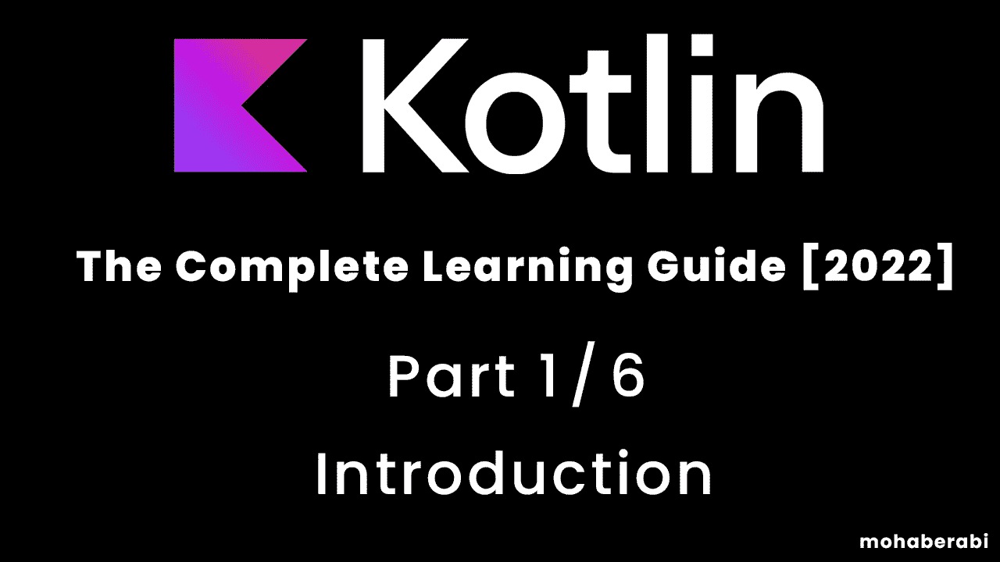

# 科特林编程语言完全学习指南[2022] 1/6 引言

> 原文：<https://blog.devgenius.io/kotlin-programming-langauge-the-complete-learning-guide-2022-1-6-introduction-e054a6c3ac61?source=collection_archive---------5----------------------->

学习 Kotlin 这种最强大和最有用的编程语言之一，并准备好开始开发 powerfull 原生移动应用程序和其他平台开发

# **目录**

> 什么是科特林和历史。
> 
> Kotlin 的用途是什么
> 
> 我们将在完整指南中介绍的内容。

# 科特林

> Kotlin 是一种通用、免费、开源、静态类型的编程语言，最初是为 JVM (Java 虚拟机)和 Android 设计的，结合了面向对象和函数式编程。

**静态类型编程语言是什么意思？**

> 首先，我们需要了解一些东西，所有的编程语言包括 kotlin 都有一种叫做数据类型的东西(你可以称之为保存特定类型值的容器)，每种数据类型都有自己的**特征**，它定义了数据元素的值的性质。比如(int，double，string，char …..等等)都有自己的类型、内存分配、特点和操作
> 
> 每种编程语言都可以处理这些类型，并检查每种类型是否被初始化或是否被赋予了自己类型的值
> 
> 例如:String **(数据类型包含英语中的句子)“MOHAB”，这是一个字符串**
> 
> int **(仅保存整数数值的数据类型)1，2 200，0..etc**
> 
> 所以编程语言必须检查 int 的值是否为 number，string 的值是否为 string，以避免错误**“类型检查”**
> 
> **在大多数编程语言中，类型检查可以通过两种方式完成**
> 
> 这两种类型是。**编译时**或**运行时**让我们定义这两个术语，然后我们了解两者中类型检查的区别
> 
> **编译时间** →代码被转换成机器代码以便机器能够理解的时间
> 
> **运行时间** →程序运行并完成编译的时间
> 
> 所以语言会在编译期**或运行期**检查类型
> 
> **编译时的类型检查称为静态类型检查**
> 
> **运行时的类型检查称为动态类型检查**

**静态类型编程语言**

在静态类型编程语言中，类型检查发生在编译时。在编译时，源代码被转换成机器语言。这意味着在编译源代码之前，必须知道与每个变量相关的类型。这有助于避免程序员可能犯的一些错误

一般示例:

**1—int x = " Mohab "；**

**2—String x = " Mohab "；**

在第一行，编译器会抛出一个错误类型的错误，因为我们声明它是一个 int，但是我们指定了一个 string

但是在第二行就没有问题了

因为静态类型检查发生在编译时，这也减少了错误检查的时间

# 动态类型编程语言

在动态类型语言中，类型检查发生在运行时或执行时。这意味着只有在程序执行时才根据类型检查变量。

一般示例:

1—var x = 24；

2—var m = " Mohab "；

现在在运行时，计算机会从变量的值中知道它们的类型，所以我们不需要声明类型

# 科特林的历史

Kotlin 起源于 2010 年 IntelliJ IDEA 背后的公司 JetBrains，自 2012 年以来一直开源。GitHub 上的 Kotlin 项目有超过 770 个贡献者；虽然团队的大部分成员在 JetBrains 工作，但 Kotlin 项目有近 100 名外部贡献者。JetBrains 在其许多产品中使用 Kotlin，包括其旗舰产品 IntelliJ IDEA。

# 为什么是科特林？

Kotlin 的发明源于首席开发人员 Dmitry Jemerov 寻找他在 Java 中找不到的特性。另一种运行在 Java 虚拟机(JVM)上的语言 Scala 接近了他想要的东西，但是编译时间太长了。

Jemerov 想要一种语言，它具有更现代编程语言的所有特性，可以在 JVM 上运行，并且可以像 Java 一样快地编译。所以他创造了自己的语言 Kotlin。

Kotlin 被设计为 Android 操作系统上 Java 的替代品。在发布 8 年后的 2019 年，谷歌终于同意了杰梅罗夫和大多数 Android 开发者的意见，并宣布 Kotlin 是 Android 应用开发的首选语言。

以下是开发人员更喜欢 Kotlin 而不是 Java 的一些原因:

Kotlin 很简洁，节省了用 Java 编写样板代码的时间。

只需一个脚本就可以将 Java 文件转换成 Kotlin 文件。

Kotlin 没有运行时开销。有时，向语言添加特性意味着它有更多的开销，这会降低它的性能。科特林就不是这样了。

科特林有一个很大的社区。如果你遇到困难，你可以很容易地在编码论坛和社交网络上找到其他开发者来帮助你。

Kotlin 简化了异步编程。用 Java 异步调用网络和数据库是笨拙而痛苦的。Kotlin 的协程使异步编程变得简单而高效。

科特林处理空值。如果你没有做好准备，Java 中的 null 可能会使程序崩溃。在 Kotlin 中，可以向可能为空的变量添加一个简单的操作符来防止这些崩溃。

Kotlin 可以在多个平台上运行。Kotlin 可以在 Java 运行的任何地方运行，因此您可以使用它来构建跨平台的应用程序。

换成科特林很容易。Kotlin 与 Java 完全兼容，因此您不必一次更改所有代码。您可以慢慢地迁移一个应用程序来使用 Kotlin。

# 科特林是做什么用的？

Kotlin 被设计为在 Java 虚拟机上运行，并且可以与 Java 并行运行。虽然 Kotlin 最初是作为一种专门用于 Android 开发的语言开始的，但由于其特性，它很快就在 Java 社区中传播开来，并被用于许多类型的应用程序。

# Android 开发

正如我们提到的，Kotlin 是 Android 开发的首选语言，因为它允许开发人员编写更简洁、更具表现力和更安全的代码。Android 开发的官方 IDE Android Studio 完全支持它，因此您可以获得与 Java 相同类型的代码完成和类型检查，以帮助您编写 Kotlin 代码。

由于大多数人现在通过手机访问互联网，因此拥有移动业务是大多数企业的一项要求。Android 占据了超过 70%的手机市场份额，所以即使 Kotlin 只用于 Android 开发，Kotlin 开发人员也会有很高的需求。尽管如此，它还可以有更多的用途。

# 后端 web 开发

很多后端 web 开发都是用 Java 完成的，使用 Spring 之类的框架。但是，Kotlin 进入了服务器端 web 开发，因为它对开发人员来说更容易使用。

这种语言的现代特征使得 Web 开发人员能够构建能够在商用硬件上快速扩展的应用。由于 Kotlin 与 Java 具有互操作性，您可以慢慢地将应用程序一次迁移一个文件来使用 Kotlin，而应用程序的其余部分仍然使用 Java。

Kotlin 也可以与 Spring 和其他框架一起工作，所以切换到 Kotlin 并不意味着您必须改变您习惯的一切。谷歌、亚马逊和许多其他公司已经在他们的一些服务器端代码中用 Kotlin 替换了 Java。

# 全栈 web 开发

使用 Kotlin 进行服务器端 web 开发是有意义的。毕竟 Java 从一开始就有人用。不过，您也可以使用 Kotlin/JS 将 Kotlin 用于前端开发。

Kotlin/JS 允许开发人员以类型安全的方式访问强大的浏览器和 web APIs。全栈开发者只需要了解 Kotlin。他们可以用与后端代码相同的语言编写前端代码，这些代码将被编译成 JavaScript 在浏览器中运行。

# 数据科学

数据科学家总是使用 Java 来处理数字、检测趋势和做出预测——所以 Kotlin 也应该在数据科学中找到一席之地。

数据科学家可以使用他们用于 Java 项目的所有标准 Java 库，但是用 Kotlin 编写他们自己的代码。Jupyter 和 Zeppelin 是许多数据科学家日常用于数据可视化和探索性研究的两个工具，它们也支持 Kotlin。

# 多平台移动开发

Kotlin Multi-platform Mobile 是一个用于创建跨平台移动应用程序的软件开发工具包。这意味着，从一个 Kotlin 代码库，你将能够编译应用程序，不仅可以在 Android 手机上运行，也可以在 iPhones 和 Apple Watch 上运行。这个项目目前还处于初级阶段，但前景看好。

# 我们将在本指南中涵盖哪些内容

> 1-数据类型和控制流
> 
> 2-函数
> 
> 3-可空性
> 
> Kotlin 中的 4-面向对象编程
> 
> 5-集合
> 
> Koltin 的高级基础

**这部分到此为止，等待下一部分**

**如果这篇文章真的对你有帮助请为我鼓掌**

**感谢您的阅读，等待您的评论和回复…**