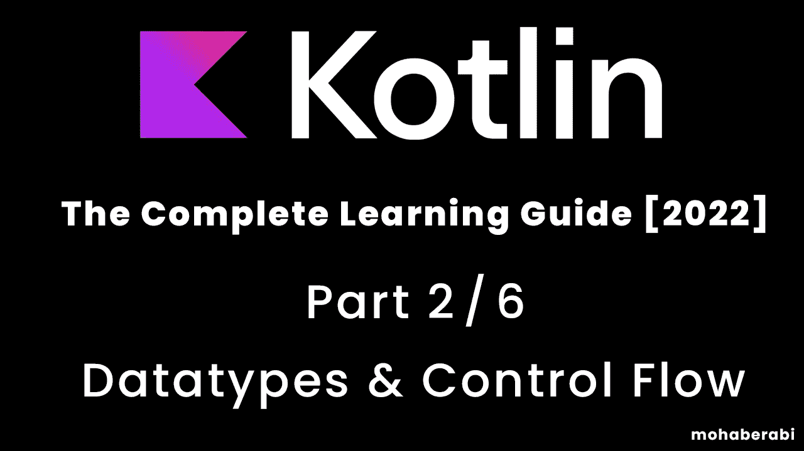

# Kotlin 编程语言完整学习指南[2022] 2/6 数据类型和控制流

> 原文：<https://blog.devgenius.io/kotlin-programming-langauge-the-complete-learning-guide-2022-2-6-datatypes-and-control-flow-42c36e085fe6?source=collection_archive---------9----------------------->



学习 Kotlin 这种最强大和最有用的编程语言之一，并准备好开始开发 powerfull 原生移动应用程序和其他平台开发

# 目录

> 变量和 val / var
> 
> 数字数据类型
> 
> 布尔、字符和字符串数据类型
> 
> 关于字符串的更多信息
> 
> 算术运算
> 
> 比较运算符
> 
> 赋值运算符
> 
> if 语句
> 
> 当压榨
> 
> While 循环
> 
> Do While 循环
> 
> 对于循环
> 
> 中断，继续

首先，像前一篇文章中声明的那样，我们将为 kotlin 编码

所以从在 **InitiliJ** 创建一个 kotlin 项目开始

让我们创建主函数的入口点

```
fun main (){}
```

**fun** - >代表函数，这是我们这里的主要函数，这就是我们在 kotlin 这里声明函数的方式

```
fun main (){
print("Hello World")}
```

它告诉 IDE 我们想要显示一些东西，基本上它也是一个函数，函数告诉处理器做一些我们需要做的事情

# 变量和 val / var

所以如果我们需要告诉 IDE 打印一些东西，我们需要这个东西，也叫做变量

```
fun main (){
var myName = "Mohab Erabi"
print(myName)
}
```

我们创建了一个名为 myName 的变量，并为它添加了一个值“Mohab Erqabi”；这就是所谓的变量并给它赋值，

什么才是真正的 **var？**

var 基本上就是你在下面看到的

```
fun main (){
var myName = "Mohab Erabi"
print(myName)
 myName = "Lionel Messi"
print(myName)
}
```

现在，如果你运行代码，它会打印出莫哈卜·埃拉比利内尔·梅西

这意味着 var 有一个值，然后该值被覆盖，并重新分配一个新的给它

所以 var 基本上意味着它接受我们所需要的值(可变的)

## **Val**

它与 var 相反，一旦你给一个 val 赋值，就不能像下面这样重新赋值

```
fun main (){
val myName = "Mohab Erabi"
print(myName)
 myName = "Lionel Messi"
print(myName)
}
```

您会注意到 IDE 说— -> val 值不能被重新分配(不可变)

# 首先让我们评论那些线，什么评论？

```
fun main (){
//val myName = "Mohab Erabi"
//print(myName)
// myName = "Lionel Messi"
//print(myName)
}
```

这意味着在你需要的那一行前面加上//，这意味着编译器永远看不到或读不到那些行，这有助于你记忆东西或输入笔记

# 数字的数据类型

```
fun main (){
var myAge = 24 
}
```

现在 myAge 的类型是 int，但是我们没有声明它是否是 int

别担心，只要你给变量赋值，kotlin 就会帮我们做这些工作，kotlin 知道它是什么类型

我们也可以像下面这样声明它的类型

```
fun main (){
var myAge : Int  = 24 
}
```

这也是一样的，koltin 还有另一种类型的数据类型

```
fun main (){
    var myAge : Int  = 999999999
    // these reserves a 8 bit inside of the memory
    var myByte : Byte  = 24
    // these reserves a 32  bit inside of the memory
    var myShort : Short   = 111
    // these reserves a 16  bit inside of the memory
    var myLong  : Long  = 1232139871238972137
    // these reserves a 64  bit inside of the memory

}
```

现在所有这些都只接受整数，但是小数呢

```
fun main (){
    var myBil : Float  =12.5
    // these reserves a 32 bit inside of the memory
    var myByte : Double  = 24.0112
    // these reserves a 64 bit inside of the memory

}
```

你会注意到在我的账单的第行有一个错误，但是为什么我们做了一个十进制的值，那是因为我们需要在 F 值上加一点东西

声明它是一个浮点数，以区分 double 和 float，如下所示

```
fun main (){
    var myBil : Float  =12.5F
    // these reserves a 32 bit inside of the memory
    var myByte : Double  = 24.0112
    // these reserves a 64 bit inside of the memory

}
```

# 关于数据类型的更多信息

**布尔**，全是逻辑值，只能有**真**或**假**

```
fun main (){
var isRich = false 
isRich= true 
}
```

> 实际上，只有当我使用布尔数据类型时，我才变得富有，我用一行代码就使自己变得富有😆

**Char** ，这是关于存储一个字符的，就像英语中的‘a’、‘b’、‘c’

```
fun main (){
var myFirstChar = 'M'
}
```

但是我们不能像下面这样，它只容纳一个字符，而且只容纳一个字符

```
fun main (){
var myFirstChar = 'Mohab'
}
```

或者不像这样，它不能是空的，你必须给它加上一个字符

```
fun main (){
var myFirstChar = ''
}
```

注意我们使用了' '，所以 kotlin 认为它只是一个字符而不是一个字符串，字符串可以是空的，我们现在将讨论

**字符串**，这是所有关于存储字符串，甚至字符，就像英语句子“计算机编程救了我的命一次”

```
var myString  = "Computer Programming Saved My Life Once"
```

> 对于你的 knwoledge，string 不是一个有限类型，因为它依赖于数组，实际上它是由数组构成的，因为它是一个字符数组
> 
> 字符序列，我们将在后面讨论数组
> 
> 但是因为它是一个数组或者序列，我们可以得到它的名字，最后一个或者任何一个字符

```
fun main (){
    var myString  = "Computer Programming Saved My Life Once"
    print("first char in isnisde of your string is " +myString[0])
}
```

**输出 _ >字符串 isnisde 中的第一个字符是 C
进程结束，退出代码为 0**

但是什么是 **0，**计算机处理 **0** 好像它是一个值，实际上它实际上是一个值，所以它从 **0** 开始计数，而不是像人类一样从 **1** 开始计数**，**我们将在后面讨论

让我们创建一个较短的字符串来讨论一些小事情

```
fun main (){
    var myString  = "Mohab"
}
```

“Mohab”有 5 个字符长，对吗？

因此，如果我们需要在计算机中打印“Mohab”中的最后一个字符，我们可以这样做，如下所示，所以最后一个字符在计算机逻辑中是 on [4]

```
fun main (){
    var myString  = "Mohab"
print(myString[4])
}
```

**输出→ b
过程结束，退出代码为 0**

这很好，但前提是我们知道字符串的长度，如果我们不知道呢？实际上我们知道最后一个字符是数组的长度-1，所以字符串在许多编程语言中，不仅 kotlin 有一个名为。length，它获取数组的长度

```
fun main (){
    var myString  = "Mohab"
print(myString.length-1)
}
```

**输出→ b
过程结束，退出代码为 0**

> 很简单，对吧..？

**关于字符串的另一个更重要的话题是字符串插值和字符串连接**

什么是串联，就是把东西粘在一起

```
fun main (){
var firstPartOfMyName = "Moh"
print (firstPartOfMyName+"ab")
}
```

> **输出→ Mohab
> 过程结束，退出代码为 0**
> 
> 看到上面印着我的名字，那叫什么串联
> 
> 但是在 android studio 中，你会注意到它有一个建议，叫做 convert concatentation to template，这是 langauges 所喜欢的，我们会在字符串和魔术发生之前添加$那个美元符号

```
fun main (){
var myName = "Mohab"
print ("Your name is $myName")
}
```

**输出→你的名字是 Mohab
过程结束，退出代码为 0**

# 算术运算

( + , — , * , / )

加、减、乘、除，所有我们以前在学校里见过的

```
fun main (){
var result = 12+10
print (result)
}
```

现在结果的值是 22，我们能做的也是

```
fun main (){
var result = 12+10
println (result)
result = result-2 
println (result)
}
```

> println()在新的一行中打印数据

**输出→22
20**

**过程结束，退出代码为 0**

第一个结果是 22，然后我们减去 2，所以现在是 20

```
fun main (){
var result = 12+10
println (result)
result = result-2 
println (result)
result = result/2
println (result)
}
```

**输出→22
20**

10

**过程结束，退出代码为 0**

> 第一个结果是 22，然后我们减去 2，所以现在是 20，然后除以 2，所以是 10

```
fun main (){
var result = 12+10
println (result)
result = result-2 
println (result)
result = result/2
println (result)
result = result*0
println (result)
}
```

**输出→22
20**

10

0

**过程结束，退出代码为 0**

> *第一个结果是 22，然后我们从中减去 2，所以它现在是 20，然后我们除以 2，所以它给我们 10，然后我们乘以 0，所以它给我们 0*

```
fun main (){
var result = 12+10
println (result)
result /=2
println (result)

}
```

这将打印出 **11，**所以这种类型的东西在前面的代码中是一样的

```
fun main (){
var result = 12+10
result=result/2
result /=2
}
```

两者是一样的

```
fun main (){
var result = 12+10
result /=2 // divides result by two and assigns it to result 
result +=2// adds 2 to  result and assigns it to result 
result -=2// subtracts 2 from  result and assigns it to result
result *=2// multiplies result by 2 and and assigns it to result
}
```

现在又多了一个我们可能不熟悉的操作符

**%模运算符**

这基本上意味着提醒，

如果我们把 10 / 2 除以 5，就会得到一个不带小数的整数，

**所以 10%2 = 0(无提醒)为 5 后无小数值**

```
fun main (){
var myMod = 10%5
print(myMod)
}
// output is 0 
```

另外，20 乘以 5 得出 4 是一个不带小数的整数

**所以 20%5 = 0(无提醒)为 4 后无小数值**

```
fun main (){
var myMod = 10%5
print(myMod)
}
// output is 0
```

```
fun main (){
var myMod = 15%2
print(myMod)
}
// output is 1
```

但是如果我们把 15 除以 2，得到的是一个小数点后有数字的十进制数，这意味着在小数点后有一个余数。

**所以 15%2 = 1(有提醒者)**

另一个例子

```
fun main (){
var a = 20
    var b =9
    var div = a/b
    println(div)
    var result = a%b
    println(result)
}
 //output 2
//       2
```

> 是的 **20%9 是 2** 因为它在结果整数之后有小数，但是 **20/9 不是 2** 但是 20/9 是如何给出 2 的，它给出一个小数，嗯，这是因为我们把它们作为一个整数使用，所以除整数只给出整数的值，kotlin 忽略小数如果我们想要它是双精度的，我们可以做什么

```
fun main (){
var a = 20
    var b =9.0
    var div = a/b
    println(div)
    var result = a%b
    println(result)
}
 //output 2.2222222222222223
//       2
```

当然，我们可以做这样的计算

```
fun main (){
val a = 20 
val b 15 
var result = a+b
result = a-b 
}
```

对于其余的操作也是如此，

> 我们也可以使用一些 kotlin 转换方法

```
fun main (){
var a = 20
    var b =9.0
    var div = a/b
println(div)
println(div.toInt())

} 
//output 
//2.2222222222222223
//2
```

toInt()是一个将任意数值转换成整数的函数，只忽略其十进制值

# 比较运算符

非常重要，常用于任何编程语言中，用于比较变量或对象等

> **==** 等于
> 
> **！=** 不相等
> 
> **<** 小于
> 
> **>** 大于
> 
> **< =** 小于或等于
> 
> **> =** 大于或等于

第一个例子

```
val isEqual =  10==5
print(isEqual)
// output false 
```

> 我们说 5 等于 3，这是不正确的

另一个例子

```
val isNotEqual = 10!=5
print(isNotEqual)
// output true
```

> 我们只是说 5 真的不等于 10 吗？是的，他们不平等

另一个例子

```
val isGreater = 10>5
print(isGreater)
// output true
```

> 我们只是说 10 真的大于 5 吗？是的，它更大

另一个

```
val isSmaller = 10<5
print(isGreater)
// output false
```

> 我们只是说 10 真的比 5 小吗？不，不是更小

再举一个例子

```
 print(10>=5)
//output true 
```

> 我们只是说 10 真的大于或等于 5 吗？是的，它大于但不等于，所以输出是真实的

# 赋值运算符

基本上我们之前对变量所做的都叫做赋值，也就是给变量赋值

```
val x = 5
```

这就是所谓的分配网络

```
fun main (){
var myNum = 24 
println(myNum) // 24 
myNym = myNum + 5 
println(myNum) // 29
 myNum += 5 
println(34) // 29
}
```

```
fun main (){
var myNum = 24 
 myNum += 5 

}
```

这意味着我们将 **5** 添加到 **myNum，**我们也可以在操作上实现这一点，而不仅仅是在+上

```
fun main (){
var myNum = 24 
 myNum *= 5 
myNum -= 5
myNum /= 5
}
```

递增和递减 **( + +，— )**

```
fun main (){
var number = 24 
number ++
print(number)
// output 25
}
```

增量 **( + + )** 这意味着我们将**加 1**

```
fun main (){
var number = 24 
number --
print(number)
// output 23
}
```

减量**(—)**这意味着我们将数字减去 **1**

> 请注意

```
fun main (){
var number = 24 
number ++ //this line number = 24
print(number) // number = 25 
}
```

> 旁边有注释的那一行表示这一行中的数字仍然是 24，但是在下一行中增加了 25，这种方法也适用于减量，我认为还是不清楚，让我们做一个更详细的测试

```
fun main (){
    var number = 24
println("My Number is ${number}")// ouptut here is 24 
 println("My Number is ${number++}")//iutput here is also 24 , memory has it 25 now 
    println("My Number is ${number}") // see the outpu here is 25 

}
```

> 但是我是如何递增的，这是真的，但是在你执行完这些行之后，内存保存了它，然后在下一行中，它会用内存保存的最后一个值打印出来，同样的情况也适用于递减，所以让我们再举一个例子

```
fun main (){
    var number = 24
println("My Number is ${number}") // 24 
 println("My Number is ${++number}")//25 
    println("My Number is ${number}")//25 

}
```

> 这是因为我们在内存中保存了新的值，然后我们执行了这个函数，就是这样，也适用于减量

# IF 语句

> 现在我们将大量使用比较运算符，让我们看看它们在 if 语句中是如何常见的

**什么是 If 语句？对于从未听说过**的人来说

它们是条件语句，告诉计算机如何处理某些信息。换句话说，他们让程序在运行时做“决定”

> **if ()** 这告诉计算机在 then 程序块中发生的逻辑操作
> 
> **然后{}** 如果 **if ()** 中的条件被验证为 ok 且 yes，那么**中的{}** 将被执行，也就是说现在 **{}** 中的无论什么都不会被执行

```
fun main (){
var myAge = 24
    var friendAge = 25
    if (myAge>friendAge){
        print("you are older than your friend ")
    }

}
```

> 当然，当你运行程序时，它运行得很好，但你没有注意到终端内的任何打印，**为什么？**
> 
> 问问自己是 **24 > 25** ？否，那么计算机将不会读取或执行 **{}** 中的任何内容

## **else {}**

> 如果条件不成立，我需要做些什么？
> 
> 下面是 **else {}** 规则，简单地说，当你的条件不成立时，你可以告诉计算机做一些事情**(或者如果你不愿意，你可以不写 else 代码)**

```
fun main (){
    var myAge = 24
    var friendAge = 25
    if (myAge>friendAge){
        print("you are older than your friend ")
    }else {
        println("Your friend is older than you ")
    }

} // output Your friend is older than you 
```

> 这是因为我们使用了 **else {}** 来告诉计算机在附加到带有 false 条件的 if 语句时做一些事情

## Else if()

如果我需要添加多个条件，该怎么办

```
fun main (){
    var myAge = 24
    var friendAge = 25
    if (myAge>friendAge){
        print("you are older than your friend ")
    }

    else if (myAge==friendAge){
        println("You Both are on same age ")

    }

    else {
        println("Your friend is older than you ")
    }

}// output Your friend is older than you
```

> 现在输出保持不变，这是因为变量的值不同，else if 仅在 if()为假时执行，else if 仅在 if()和 all else if()为假时执行

让我们看看另一个关于 else if 和嵌套的例子

```
fun main (){
    var myAge  = 100
    if (myAge >=25){
        println("you have been living for quarter century ")
    }else if (myAge>=50){
        println("you have been living for half century ")

    }else if (myAge>=75){
        println("you have been living for three quarters  century ")

    }else {
        println("you might have been dead or living")

    }

}// output is you have been living for quarter century
```

> 但是这里所有的条件都是真的，应该说 y **ou 已经活了一个世纪**，而且所有的行都准备好了，是的但是我们说编译器会运行程序来执行行，它会发现 **myAge = 100** ，然后下一行如果 **myAge > = 25，是的这是真的**
> 
> **println("你已经活了四分之一世纪")**
> 
> **忽略所有下一行，即使它们可以运行，就好像它们从来不存在一样**
> 
> **注意 if 语句适用于所有的数据类型，但是 if()是一个逻辑语句**

```
fun main (){
    var myName   = "Mohab"
if (myName == "Mohab"){

        println("You have a good name ")

    }else if (myName =="Mohab"){
        println(" I told you before you have a good name ")
    }

}// output You have a good name
```

# 当表达式

```
fun main (){
var myGpa = 1.5 
when (myGpa){
1->println("F")}
}
```

> 如果你来自以前的编程语言，它和 Switch 语句一样，如果你不关注 When expressions，因为它们非常强大，如果你搜索 Swich 语句也很好，When expressions 也是一个逻辑运算符，就像 if 语句一样

```
fun main() {
    var semester = 1
    when (semester) {
        1 -> println("Fall")
        2 -> println("Spring")
        else -> println("Summer")
    }
}//output Fall 
```

> 我们说当**(变量名)**(在我们的例子中是**学期**)等于一个特定值时做特定的事情，当这个值不等于值 **(esle)** 时也做默认的事情

我们也可以执行多行代码

```
fun main() {
    var semester = 1
    when (semester) {
        1 -> {
            println("Fall")
            println(" Have a Fresh Start and never miss a lecture ")
        }

        2 -> println("Spring")
        else -> println("Summer")
    }
}//output Fall
// Have a Fresh Start and never miss a lecture 
```

现在让我们看另一个例子，如果我们有多个条件

```
fun main() {
    var gpa = 2.4
    when (gpa) {
        in 2.0..2.4 -> println("Pass")
        in 2.5..2.8 -> println("Good")
        in 2.9..3.4 -> println("Very Good")
        in 3.5..4.0 -> println("Excellent")
    }
}//Pass
```

> 我们给出了当 gpa 在 2.0 到 2.4 之间时的条件

就像我们说使用 if 语句一样

```
if (gpa >= 2.4 && gpa <= 2.8) {
    println("Pass")
}
```

# While 循环

> 实际上，如果有一个叫做控制流的东西，意思是控制程序的流程，现在有一个叫做循环的东西，编程中的另一个控制流，而循环是

**循环**，它自己解释:你让程序进入一个循环做 n 次事情，然后出来执行其他行

## while(条件){

## 做我需要的任何事情；}

```
fun main (){
var x =1
while (x<=10){
println("$x")}
}
```

您会注意到终端的输出是

**1，1，1，1，1，1，1，1，1，1，1，**它打印 x 值的 **10 倍**，x 值为 1

这是我们设定的条件，只要 x 值小于或等于 10

打印 x 的值，以及

```
fun main() {
    var x = 0
    while (x < 10) {
        x++
        println("$x")
    }
}// output
//1
//2
//3
//4
//5
//6
//7
//8
//9
//10
```

这里我们得到了 x 0 的值，然后在循环内部，每次都加 1，然后输出它的值

> 注意:编译器在这里首先检查条件，然后执行我们需要的函数，只要它是真的就会执行

那么如果我们做出如下的东西会怎么样呢

```
fun main() {
    var x = 0
    while (x > 10) {
        x++
        println("$x")
    }
}//no output
```

这是因为 x 的值 0 不能大于 10，所以条件不成立，编译器不会执行{}里面的任何东西

## Do while 循环

> 我们举了一个 while 循环的例子，我们注意到如果条件不为真，它从不执行我们需要的，这意味着它首先检查条件
> 
> **while** 循环实际上是指 **while ()do {}，**所以条件先来， **do{}while ()** 循环是的反义词，意思是它将执行然后检查条件

```
fun main() {
    var x = 0
    do {
        println(" iam variable carrying value $x which is smaller than 10 , although i was exectued ")
    } while (x > 10)
}// otuput iam variable carrying value $x which is smaller than 10 , although i was exectued
```

> 这就是它的工作方式，它会做你想做的任何事情，不管条件是真还是假，然后它会检查条件，如果是真的，它会继续，如果不是，它会退出循环

# **用于循环**

一个 **for** 循环用于迭代一系列集合，我们将在以后讨论迭代和集合，所以不要担心，while 循环有点简单

```
fun main() {
    for (num in 1..10) {
        println(num)
    }
}//1
//2
//3
//4
//5
//6
//7
//8
//9
```

> 这里我们创建一个循环来打印从 1 到 10 的数字
> 
> for 循环有自己的局部变量，我们命名为 num
> 
> 所以循环开始时的 num 的值为 1，并且每次它都会增加 1，直到达到 10，然后退出循环

在其他一些编程语言中，比如 java，我们可以使用前面的例子，如下所示

```
public static void main(String []args){
for (int i = 1 ;i<=10 ; i++){
System.out.println(i);}
}
```

让我们回到科特林

> 我们也可以像下面这样使用 for 循环

```
fun main() {
    for (x in 1 until 10) {
        println(x)
    }
}//1
//2
//3
//4
//5
//6
//7
//8
//9
```

**10 在哪里？**，直到这里的关键字不同于..，意思是直到你 10 岁

另一个例子我们以前见过

```
fun main() {
    for (x in 10 downTo 1) {
        println(x)
    }
} //10
//9
//8
//7
//6
//5
//4
//3
//2
//1
```

> 它将 x 的值从 10 开始递减 1，直到 1

# 中断并继续

这两种方法在处理循环时都非常有用，它们允许我们在一定条件下跳出循环

```
fun main() {
    for (i in 1 until 10) {
        println(i)
    }
}
```

我们期望这里的数字从 1 到 19，对吗

但是，如果我需要在循环内部做一些事情，而当它发生时，我不想继续这个迭代，该怎么办呢

```
fun main() {
    for (i in 1 until 10) {
        println(i)
        if (i / 5 == 1) {
            break
        }
    }
}//1
//2
//3
//4
//5
```

> 我希望在这里，如果这个迭代中的数字**除以 5** 得到 1**1**，那么我希望**完成循环**，所以正如我们看到的，如果它发现数字**除以 5 得到 1** 即 **5** ，它将不会完成剩余数字的打印

让我们继续看**和**是什么意思

```
fun main() {
    for (i in 1 until 10) {
        if (i / 5 == 1) {
            continue
        }
        println(i)
    }
}//otuput
//1
//2
//3
//4
```

> **5 在哪里？5** 将不被打印，因为**继续**在这里是指当条件满足时。跳过它，不要在此时执行迭代

**这部分到此为止，等待下一部分**

**如果这篇文章真的对你有帮助，请为我鼓掌**

感谢您的阅读，等待您的评论和回复…