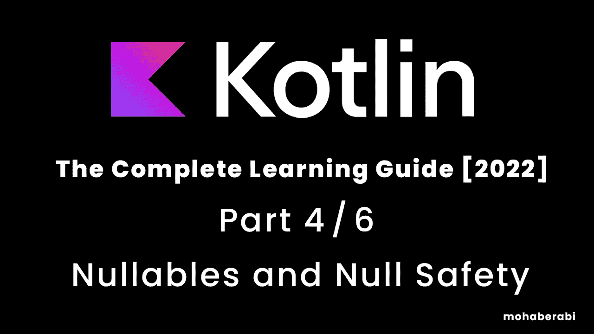

# Kotlin 编程语言完全学习指南[2022] 4/6 可空性和空安全

> 原文：<https://blog.devgenius.io/kotlin-programming-langauge-the-complete-learning-guide-2022-4-6-nullability-and-null-safety-f1a844a80000?source=collection_archive---------11----------------------->



学习 Kotlin 这种最强大和最有用的编程语言之一，并准备好开始开发 powerfull 原生移动应用程序和其他平台开发

# **空性和空安全部分**

**历史**

空指针是由[东尼·霍尔](https://en.wikipedia.org/wiki/Tony_Hoare)在 1965 年首先发明的，作为参考文献中 [ALGOL W](https://en.wikipedia.org/wiki/ALGOL_W) 语言的一部分，霍尔将他的发明描述为一个“十亿美元的错误”:

> 我称之为我的十亿美元错误。这是 1965 年零引用的发明。那时，我正在设计第一个面向对象语言(ALGOL W)的引用综合类型系统。我的目标是确保所有引用的使用都是绝对安全的，由编译器自动执行检查。但是我无法抗拒放入空引用的诱惑，仅仅是因为它太容易实现了。这导致了数不清的错误、漏洞和系统崩溃，在过去的四十年里，这可能造成了数十亿美元的痛苦和损失。

# 空

意味着这个对象或引用指向 nothing(非零)但 nothing，因为没有值附加到那个引用**(没有值)**

**注意:指针是保存计算机内存中变量地址值的东西**

```
fun main() {
    var myName: String = "Mohab"
}
```

字符串类型的变量的值为“Mohab”

所以这个值不为空，也不能为空，因为它有一个值，我们可以重新赋值

```
fun main() {
    var myName: String = "Mohab"
    myName="Messi"
}
```

但是我们不能像下面这样做

```
fun main() {
    var myName: String = "Mohab"
    myName = "Messi"
    myName = null
}
```

您将看到编译器告诉您，“null 不能是非 Null 类型字符串的值”

**如何使一个变量可空，并给其赋空值？**

简单的加上**？**在键入后，你是在告诉编译器这个变量可能是 null 并接受 null 被赋值

```
fun main() {
    var myName: String? = "Mohab"
    myName = "Messi"
    myName = null

}
```

你也可以用一个空值实例化一个变量，那么编译器也知道这个变量接受空值

另一个例子

```
fun main() {
    var myNumber: Int? = 24
    var double = myNumber.toDouble()

}
```

您会注意到编译器在 myNumber.toDouble()的第 3 行给出了一个错误

说着**“只有安全(？。)或非空断言(！！。)在 Int 类型的可空接收器上允许调用？”**

这条线是什么意思？

这意味着你的变量可以接受空值，如果你的变量没有值，这个操作就会出错，这就是 Kotlin 中所说的**空值安全**

那么我们该如何解决这个问题呢？

简单…使用 if 条件

```
fun main() {
    var myNumber: Int? = 24
    if (myNumber != null) {
        var double = myNumber.toDouble()
    }
}
```

现在你告诉编译器只有当变量有一个值(非空值)时才执行我需要的操作，所以错误现在被删除了

但是每次我声明一个空变量的时候，我会这样做吗？

当然不是，这是科特林，这是零安全……它有更短的路

通过添加一个？在您的空变量之后，如下所示

```
fun main() {
    var myNumber: Int? = 24
    var double = myNumber?.toDouble()
    print(double)

}//output 24.0
```

这告诉编译器，如果 **myNumber** 不等于 **null** ，则将 **myNumber** 增加到变量 **double** 的 double。否则**双**将携带一个**空值**

```
fun main() {
    var myNumber: Int? = 24
    myNumber = null
    var double = myNumber?.toDouble()
    print(double)

}//output null
```

您会注意到 double variabel 现在的值为 null，这是因为我们将值 **null** 赋给了 **myNumber**

# 猫王算子(？:)

在 koltin 的空安全中，是一个操作符给依赖于可空变量的变量赋值

```
fun main() {
    var myNumber: Int? = 24
    myNumber = null
    var double = myNumber ?: 50.0
    print(double)

}//output 50.0
```

我们说，如果我的数字不等于空值，就把它的双精度值加到双精度值上，否则(如果它等于空值)就给它的值赋值 50.0

```
fun main() {
    var myNumber: Int? = 24
    var double = myNumber?.toDouble() ?: 50.0
    print(double)

}//output 24.0
```

当 myNumber 不为空时，输出是 24.0

# Not Null 断言(！！)

它是一个运算符，表示在某些情况下可空变量不能也永远不会为空。

```
fun main() {
    var myNumber: Int? = 24
    var double = myNumber!!.toDouble()
    print(double)

}//output 24.0
```

所以我们可以向编译器保证这个变量不会为空，但是如果我们把它改为空呢？

```
fun main() {
    var myNumber: Int? = 24
    myNumber = null
    var double = myNumber!!.toDouble()
    print(double)

}
```

你会注意到编译器的警告“操作总是失败，因为操作数总是空的”

现在当我们运行它的时候会抛出 NullPointerException

> MainKt.main(Main.kt)处的线程“main”Java . lang . nullpointerexception
> 出现异常

**这部分就到此为止，等待下一部分**

如果这篇文章真的对你有帮助，请为我鼓掌

感谢您的阅读，等待您的评论和回复。