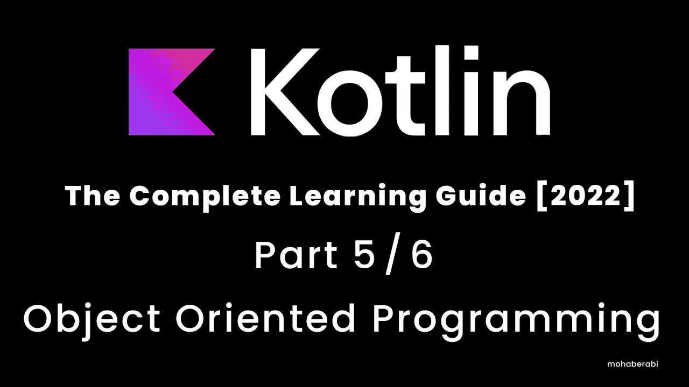

# Kotlin 编程语言完全学习指南[2022] 5/6 面向对象编程(OOP)

> 原文：<https://blog.devgenius.io/kotlin-programming-langauge-the-complete-learning-guide-2022-5-6-object-oriented-programming-ed87808963f3?source=collection_archive---------20----------------------->



学习 Kotlin 这种最强大和最有用的编程语言之一，并准备好开始开发 powerfull 原生移动应用程序和其他平台开发

# **目录**

> 面向对象的介绍
> 
> 类别和对象
> 
> 类和初始值设定项
> 
> 范围和阴影
> 
> 成员变量函数和构造函数
> 
> Lateinit 设置器和获取器
> 
> 数据类别
> 
> 遗产
> 
> 接口
> 
> 抽象类
> 
> 铸字

# 介绍

面向对象编程(OOP)是一种依赖于**类**和**对象**概念的编程方式。它用于将软件或程序构建成简单的、可重复使用的代码蓝图(通常称为**类**)，这些代码蓝图用于创建对象的单个实例。有许多面向对象的编程语言，包括 JavaScript、C++、Java、Python、dart 和 Kotlin

一个**类**是一个抽象的蓝图，用来创建更具体、更具体的对象。类通常代表广泛的类别，比如共享**属性的`Human`，**这个类定义了自己的属性或行为，比如**性别**

类也可以包含函数，称为**方法**，只对该类型的对象可用。这些函数是在类中定义的，它帮助类做我们想让它做的任何事情

# 面向对象的好处

*   OOP 将复杂的事物建模为可复制的简单结构
*   可重用的 OOP 对象可以跨程序使用
*   您可以在一个类中存储尽可能多的变量和数据

# 班级

就像我们说的它是对象的蓝图，更具体地说，让我们应用一些例子

例如人类→有它自己的属性和特征

**性别、身高、体重、姓名等**

那些我们称之为变量类成员的**人类**

在代码中，我们可以这样定义这些变量

```
val height : Double = 180.2
val weight : Double = 74.4
val name : String = "Mohab"
val isGender : Boolean =true 
```

那些变量是人类的属性，也是**人类**类**(也叫变量成员)**

**人类**也，**走路、吃饭、喝水、呼吸、工作、睡觉……等等**

```
fun sleep (){}
fun walk (){}
fun eat(){}
fun breathe(){}
fun work(){}
```

这些也可以是这个类**人类**的成员方法

现在我们需要将这些变量和方法的成员应用到一个类 **Human**

要声明的**类**我们使用关键字 ***类*** 然后我们给这个类起一个名字 **Human** 以大写字母开头然后我们关闭它 **{}**

```
class Human {
    val height : Double = 180.2
    val weight : Double = 74.4
    val name : String = "Mohab"
    val isGender : Boolean =true
    fun sleep (){
        println("Iam Sleeping ")}
    fun walk (){
        println("Iam Walking now ")}
    fun eat(){}
    fun breathe(){}
    fun work(){}
}
```

我们现在为一个类创建了一个非常非常简单的例子

现在让我们尝试访问并使用这个类

```
fun main() {
var h : Human = Human()
h.sleep()
} // output "Iam Sleeping
```

现在我们从类 Human 中创建了一个对象，命名为 h 并初始化它，在我们运行程序并执行方法后，我们现在可以创建任意多的对象，而不必一次又一次地编写或实现这些成员

```
fun main() {
var h : Human = Human()
h.sleep()
    val anotherHuman : Human = Human()
    anotherHuman.walk()
}//output Iam Walking now
```

现在好了，我们知道了如何创建一个对象并访问它的成员

但是如果我想让每个人都有自己的数据呢，是的，这很有意义，因为整个想法是制造可重用的代码，

# 构造器

从名字中我们可以看出它是一个构建某物(我的类)的东西

构造函数和类在一起，这是一个简单的函数，它可以初始化我的变量并给它们数据。

以 java 为例

```
public class Human {
public double height ;
public void Human(double height){
this.height = height ; 
}
}
```

> 注意:在编程语言中，构造函数也使用它的类名，但是在 kotlin 中，我们将看到如何创建构造函数，这也不是强制性的，但是

```
fun main() {
var human : Human = Human()
}

class Human constructor(name : String , height : Double ){

}
```

现在我们创建了一个类，并为它创建了构造函数，然后我们从它获取了一个对象，但是你会注意到编译器会报错，因为我们没有在构造函数中传递我们需要的数据

```
fun main() {
var human : Human = Human(name = "Mohab", height = 183.0)

}
```

现在，还有一个与 kotlin 类相关的东西叫做 init

一旦类被实例化就调用的方法

```
fun main() {
var human : Human = Human(name = "Mohab", height = 183.0)
}

class Human constructor(name : String , height : Double ){
init {
    println(" You Created an Object From Me Human Class")
}
}//You Created an Object From Me Human Class
```

现在，一旦你运行程序，你会注意到

**“你从我的人类类中创建了一个对象”，**那是因为我们在我们的类中调用了这个 init 方法中的 println()，一旦对象被创建，println 就会被执行

实际上，这个 init 方法与构造函数相关，你也可以称它为构造函数的主体，让我们看看我们如何只创建了类，却没有添加任何变量成员

如果你试图用人类。并且使用了点运算符，除了与 kotlin 语言相关的方法，你什么也找不到

但是如果你去 **init** 方法，并试图从那些你声明为参数的变量中调用某个变量，你会看到它接受它

```
class Human constructor(name : String , height : Double ){
init {
    println(" You Created an Object From Me Human Class and named $name")
}
}
```

```
fun main() {
var human : Human = Human(name = "Mohab", height = 183.0)
}// You Created an Object From Me Human Class and named Mohab
```

看，上面印着我们给的名字

> 注意:构造函数中的参数都是 Val(不能被重新赋值)，不仅在构造函数中，而且在任何传递参数的函数中，都不能给这个变量赋值，只能通过传递参数来赋值

```
fun understandScope (name : String ){
    name="Mohab"
}
```

您将注意到编译器的一个错误“Val 不能被重新分配”

你只能做的如下

```
fun main() {
    understandScope("Mohab")
}// accepted 
```

**蔽**

```
 fun main() {
        understandScope("Messi")
    }

fun understandScope (name : String ){
    var name : String = "Mohab"
    println(name)
}//ouput "Mohab"
```

现在我们给了参数一个值“**梅西**”，它现在应该打印“**梅西**”的值

但是输出是**“Mohab”**我们在函数体内声明的名称变量..对吧

这是因为它被称为**作用域**函数**只作用于**作用域**内的变量，如果它在函数体中的话。也可以；除了这个褐藻糖胶，在任何地方都找不到**

**使用遮蔽时的注意事项**

> 你的代码变得难以阅读，因为两个不同的东西有相同的名字，你或你团队中的任何人可能会感到困惑。
> 
> 您不能再在某个范围内访问原始变量。

# 类的成员变量和方法

```
class Human (name : String ="Mohab",lastName : String = "Erabi"){
var jobTitle : String ? = null 
init {
println("Created an instance from me with ${name} ${lastName}")
}
}
```

变量 jobTitle 在这里被称为类的成员，我们使它可空，因为如果我们有很多人存储在数据库的某个地方，如果他们中的一个或多个没有 jobtitle，我们的应用程序也应该工作

> 此外，类别可以有无限数量的成员

# 成员方法(函数)

```
fun main(args: Array<String>) {
var h = Human()
    h.jobTitle = "Programmer "
h.printJobTitle()
}
class Human (name : String ="Mohab",lastName : String = "Erabi"){
    var jobTitle : String ? = null

    init {
        println("Created an instance from me with ${name} ${lastName}")
    }
    fun printJobTitle (){
        println("You called me to tell people that your job is ${jobTitle}")
    }
}//output
//Created an instance from me with Mohab Erabi
//You called me to tell people that you job is Programmer 
```

```
(name : String ="Mohab",lastName : String = "Erabi"){}
```

这被称为类的主构造函数

> 注意**构造函数**也是这个类的成员

**我们还可以创建第二个构造函数**

```
class Human (name : String ="Mohab",lastName : String = "Erabi"){
    var jobTitle : String ? = null

constructor(name : String , lastName : String , jobTitle : String ):this (name , lastName ){
    this.jobTitle = jobTitle
}
}
```

this 关键字— > this 引用当前类，因为它指向一个类，所以我们说 **this.jobTitle = jobTitle** 将被传递给构造函数

**:** “那个列”表示我们为我们的类创建了一个二级构造函数，这个类已经有了一个主构造函数，还有一个变量需要初始化，所以我们也需要将这些参数传递给那个构造函数，这样我们就可以初始化人类类

```
fun main(args: Array<String>) {
var h = Human()
    h.jobTitle = "Programmer "
h.printJobTitle()
}

class Human (name : String ="Mohab",lastName : String = "Erabi"){
    var jobTitle : String ? = null

constructor(name : String , lastName : String , jobTitle : String ):this (name , lastName ){
    this.jobTitle = jobTitle
}
    init {
        println("Created an instance from me with ${name} ${lastName}")
    }
    fun printJobTitle (){
        println("You called me to tell people that your job is ${jobTitle}")
    }
}
```

那个 seconadry 构造器的真正好处是什么？

就像我们说的 jobTitle，并不是我们数据库中的所有用户都在添加他们的 jobTitle

因此，如果我们现在创建了一个新的人类类的实例，下面我将删除默认值

```
class Human (name : String ,lastName : String ,){

}
```

然后，我将添加 jobtilte 变量作为类成员，并创建一个辅助构造函数

```
class Human (name : String ,lastName : String ,){
var jobTitle : String ? = null
}
```

现在让我们创建一个对象

```
fun main(args: Array<String>) {
var mohab = Human()
}
```

您现在会注意到编译器抱怨缺少 name 和 lastname 的值，但是 jobTitle 呢？

是的，即使您在构造函数中需要它(“第二个”)

你可以随时添加它，只是这不是强制性的

```
fun main(args: Array<String>) {
var mohab = Human("Mohab","Erabi")
 var messi = Human ("Lionel" , "Messi", "Footballer")
}
```

看，我只在“梅西”对象中添加了它，但在“莫哈布”中没有

> 请注意，这有点像方法重载，创建两个同名但参数列表不同的方法，如下所示“这也和创建多重构造函数一样”

```
fun iHaveSameName (name : String ){}
fun iHaveSameName (){}
fun iHaveSameName (age : Int ){}
```

> “现在整个文件应该看起来像这样”

```
fun main(args: Array<String>) {
 var messi = Human ("Lionel" , "Messi", "Footballer")
}

class Human (name : String ,lastName : String ,){
var jobTitle : String ? = null
    constructor(name : String , lastName : String , jobTitle : String ):this (name , lastName ){
    this.jobTitle = jobTitle
        println(" called from the secondary constructor ${jobTitle}")
}
    init {
    println("Created an instance from me with ${name} ${lastName}")
}
fun printJobTitle (){
    println("You called me to tell people that your job is ${jobTitle}")
}
}
//Created an instance from me with Lionel Messi
// called from the secondary constructor Footballer
```

init 方法在第二构造函数体之前被调用

这需要记在心里

# Setters Getters 和 lateinit

```
class Human (){
var name : String 
}
```

当我们在类内部创建一个成员变量时，我们应该总是初始化它，就像我们在构造函数中看到的那样

编译器会抱怨说

**“属性必须初始化或者是抽象的”**

所以 lateinit 的功能来了“这个关键字只是告诉编译器等等，我稍后会初始化它”

```
class Human ( ){
lateinit var name : String
}
```

现在编译器从不抱怨

但是我们必须初始化这个 lateinit，否则我们会有一个错误，因为它不能为空

```
fun main(args: Array<String>) {

    var mohab = Human()
    mohab.name
}

class Human ( ){
lateinit var name : String
}
```

**线程“main”kot Lin 中出现异常。uniinitializedpropertyaccessexception:late init 属性名尚未初始化
在 Human.getName(Main.kt:9)
在 MainKt.main(Main.kt:4)**

这里我们有一个异常，所以我们必须总是初始化 lateinits

```
fun main(args: Array<String>) {

    var mohab = Human()
println(    mohab.name)
}

class Human ( ){
lateinit var name : String
init {
    name = "Mohab"
}
}// output 
//Mohab
```

现在我们来谈谈 getters 和 setters

```
fun main(args: Array<String>) {
    var mohab = Human()
println(    mohab.name)
    println(mohab.age)
}

class Human ( ){
lateinit var name : String

val  age  = 24
    get() {
     return  field/2
    }
init {
    name = "Mohab"
}
}// output 
//Mohab
// 12 
```

我们在这里做了什么，get 方法对前面的行变量做了一个动作，但只是一个动作

所以我们创建了一个值为 24 的年龄变量，我希望 getter 返回除以 2 的值，这样每当我打印这个变量时，我都会看到“12”

```
fun main(args: Array<String>) {
    var mohab = Human()
println(    mohab.name)
    println(mohab.age)
}

class Human ( ){
lateinit var name : String

val  age  = 24
    val myAge = 30 
    get() {
     return  field/2
    }
init {
    name = "Mohab"
}
}// output 
// mohab 
// 24 
```

这就是我们所说的，它只对前面的行变量应用一个动作，因为现在我得到了 age = 24，因为我在类内部声明了它

```
println(mohab.myAge) // output 15 
```

什么是字段关键字？字段指的是最后一个变量，下面代码看起来是编译器转换的

```
val myAge = 30 
get ()= field 
set (value){
field = value 
}
```

到“自动”下面的一个

```
val myAge = 30 
get (){
return filed/2}
```

这就是 setters。set →设置值，get →获取值

# 作曲者

```
var myAge = 24
```

# 吸气剂

```
println(myAge)
```

```
class Human ( ){

val  age  = 24
    set(value){}

}
```

我们把这个时代视为一个价值，所以它不是不可改变的

编译器应报错**“一个‘val’属性不能有 setter”**

```
class Human ( ){

var   age  = 24
    set(value){}

}
```

```
fun main(args: Array<String>) {
    var mohab = Human()
mohab.age = 23
print(mohab.age)
}

class Human ( ){

var   age  = 24
    set(value){
        field = value
    }

}// otuput 
//23
```

我们也可以在这个 setter 中做任何我们想做的事情

就像我们可以有自己的条件一样，我们可以让这个年龄永远不等于 0，或者永远不小于 0，因为没有人的年龄等于或小于 0

```
fun main(args: Array<String>) {
    var mohab = Human()
mohab.age = 0
print(mohab.age)
}

class Human ( ){

var   age  = 24
    set(value){
        if (value >0){
            field = value
        }else {
            throw IllegalArgumentException("No Human have age less than 0 or equal to ")
        }
    }

}
```

**线程“main”Java . lang . illegalargumentexception 出现异常:在 Human.setAge(Main.kt:17)
在 MainKt.main(Main.kt:5)** 没有年龄小于 0 或等于
的人

但是如果我不想让任何人在我的课之外改变我的变量值呢

```
fun main(args: Array<String>) {
 var mohab = Human()
mohab.age = 23
}

class Human ( ){

var   age  = 24
    private  set

}
```

编译器抱怨**不能赋值给“age”:setter 在“Human”中是私有的**

```
//mohab.age = 23
    print(mohab.age)
```

但是 getter 不是，所以我们可以得到值而不是改变它

# 数据类别

用于保存数据的特定类型的类不能是抽象的、密封的甚至是内部的，我们将很快讨论这些类型的类，但是现在记住它们

```
data class User()
```

数据类必须至少有一个参数才能声明

```
data class User(val email : String ,val password : String ){}
```

有时电子邮件和密码可以改变，这样我们就可以；不要将这些变量保留为 val，我们需要将它们改为 var，以便我们可以更改它们的值

```
fun main(args: Array<String>) {
val user = User("Mohab@yahoo.com","12345678")

    user.email = "Mohab@gmail.com"
}
data class User(var  email : String ,var password : String ){
}
```

数据类有许多有用的方法，复制，等于，转换字符串…

**托斯提林()**

将整个类对象打印为字符串

```
fun main(args: Array<String>) {
val user = User("Mohab@yahoo.com","12345678")

    user.email = "Mohab@gmail.com"

    println(user.toString())

}//User(email=Mohab@gmail.com, password=12345678)
```

**复制()**

克隆对象并将其复制到另一个相同类型的对象

```
fun main(args: Array<String>) {
val user = User("Mohab@yahoo.com","12345678")

    user.email = "Mohab@gmail.com"

    val copied = user.copy()
    print(copied.toString())

}
//User(email=Mohab@gmail.com, password=12345678)
//User(email=Mohab@gmail.com, password=12345678)
```

我们也可以重新赋值

```
fun main(args: Array<String>) {
val user = User("Mohab@yahoo.com","12345678")

    user.email = "Mohab@gmail.com"

    println(user.toString())
    val copied = user.copy("Messi","00000000")
    print(copied.toString())

}//User(email=Mohab@gmail.com, password=12345678)
//User(email=Messi, password=00000000)
```

**组件()**

打印 n 参数的值，就像我们在第一个参数列表中有“email ”,所以如果我们只需要打印它，我们将使用 **componnet1()** 等等

```
fun main(args: Array<String>) {
val user = User("Mohab@yahoo.com","12345678")

println(user.component1())
}//Mohab@yahoo.com
```

**解构**

将对象成员拼接到变量中

```
fun main(args: Array<String>) {
val user = User("Mohab@yahoo.com","12345678")

val (email , pass)  = user
    print(pass)
}
```

这和我们创造的一样

```
fun main(args: Array<String>) {
val user = User("Mohab@yahoo.com","12345678")
val email = user.email
val pass = user.password
}
```

# 遗产

OOP 中非常重要的一点，允许类从另一个类继承数据

> 继承了另一个类特性的类称为**子类**、**子类**或**派生类**
> 
> 另一个类继承自的类称为**超类**、**父类**或**基类**

```
class Device {}
class Computer : Device() {}
```

现在我们愿意创建一个类 **Device** 来继承另一个类 **Computer** ，这个语法允许我们这样做，但是我们遗漏了一些东西**“kot Lin 类”**都是 **final** 默认情况下不允许继承，所以我们需要在基类中添加关键字**“open”**来允许继承，同时添加调用构造函数()

```
open class Device {}
class Computer : Device() {}
class Phone: Device (){}
```

子类也可以是另一个类的父类

```
open class Device {}
class Computer : Device() {}
open class Phone: Device (){}

class SmartPhone : Phone(){}
```

现在让我们最小化并看看继承

```
open class Phone (){}
class SmartPhone :Phone(){}
```

```
open class Phone (val brand : String , val  model : String , val batteryLife : Double ){}

class SmartPhone :Phone(){}
```

现在你会注意到一个错误，所以我们也必须在基类中添加相同的参数

```
open class Phone (val brand : String , val  model : String , val batteryLife : Double ){}

class SmartPhone(brand : String , model : String, batteryLife : Double  ) :Phone(brand , model,batteryLife){}
```

子类也可能有它自己的特征和数据，例如智能手机有照相机

```
open class Phone (val brand : String , val  model : String , val batteryLife : Double ){}

class SmartPhone(brand : String , model : String, batteryLife : Double , cameras : Int  ) :Phone(brand , model,batteryLife){}
```

所以所有的手机都可以保存号码，是的，当然

```
open class Phone (val brand : String , val  model : String , val batteryLife : Double ){
    var contact = ""
    fun addToContacts (contact : String ){
        this.contact = contact
    }

}
```

我们也可以打开/关闭它们

```
open class Phone (val brand : String , val  model : String , val batteryLife : Double ){
    var contact = ""
    fun addToContact (contact : String ){
        this.contact = contact
    }
    var isOn = true
    fun switchOff (){
        this.isOn = !this.isOn
        if (isOn){
            print("Phone is now On")
        }else {
            print("Phone is now Off")

        }
    }

}
```

```
open class Phone (val brand : String , val  model : String , val batteryLife : Double ){
    var contact = ""
    fun addToContact (contact : String ){
        this.contact = contact
    }
    init {
        switchOff()
    }
    var isOn = true
    fun switchOff (){
        this.isOn = !this.isOn
        if (isOn){
            println("your ${brand}  is now On")
        }else {
            println(" your ${brand}  is now Off")

        }
    }

}
```

```
fun main(args: Array<String>) {
    var myPhone = Phone("Nokia ","3310",98.0)
    var iPhone = SmartPhone("Iphone","13",50.0,4)
}//output 
//your Nokia   is now On
//your Iphone  is now On
```

> 注意，任何类都是从“任何”类继承的，所以我们总是可以找到 hashcode，toString，equals …

我们也可以覆盖超类的成员

```
class SmartPhone(brand : String , model : String, batteryLife : Double , cameras : Int  ) :Phone(brand , model,batteryLife){
override var isOn = false}
```

你还会注意到一个错误“这是最终版本，我们需要打开它”

```
open var isOn = true
```

```
class SmartPhone(brand : String , model : String, batteryLife : Double , cameras : Int  ) :Phone(brand , model,batteryLife){
override var isOn = false
    override fun switchOff() {

        if (this.isOn){
            println("once you overriden this method it will not work like in the super class but i will tell you that your ${brand} is now ON")
        }else {
            println("once you overriden this method it will not work like in the super class but i will tell you that your ${brand} is now OFF")
        }
    }
}
//output 
//your Nokia   is now On
//once you overriden this method it will not work like in the super class but i will tell you that your Iphone is now OFF
```

一旦我们覆盖了这个方法，它的行为就不同了，而不是在超类和变量 isOn 中

# 接口

你可以认为它是一个类，但它不是，它也有自己的成员，可以有默认的实现，也可以没有，对于某些成员或所有成员，扩展接口的类必须覆盖没有实现的成员，也可以覆盖有实现的成员

```
interface Phone {
    val batteryLife : Double
    fun call ()
    fun SwitchOff ()
    fun addToContact (){
        println("Added to contacts")
    }
}
```

现在我们来看这个接口，它有一个 memebers，batterylife 变量没有值，编译器没有抱怨，call()，switchOff()也没有。主体编译器也没有抱怨…这就是我们所说的

```
interface Phone {
    val batteryLife : Double
    fun call ()
    fun SwitchOf ()
    fun addToContact (){
        println("Added to contacts")
    }
}
class SmartPhone ():Phone{}
```

编译器现在会抱怨**“类‘smart Phone’不是抽象的，并且不实现抽象成员公共抽象 val batteryLife:在 Phone 中双重定义”**

这意味着我们必须覆盖该接口的所有成员，但只覆盖那些没有实现的成员

所以点击类名旁边黄色灯

实现这些抽象方法，并将 bateerylife 添加到您的构造函数中

```
class SmartPhone (override val batteryLife: Double):Phone{
    override fun call() {
        TODO("Not yet implemented")
    }

    override fun SwitchOf() {
        TODO("Not yet implemented")
    }
}
```

就像我们看到它只覆盖了没有实现的方法和变量

但是 **addToContact()** 是具体的，有它的实现，所以实现是可选的

```
class SmartPhone (override val batteryLife: Double):Phone{
    override fun call() {
        TODO("Not yet implemented")
    }

    override fun SwitchOf() {
        TODO("Not yet implemented")
    }

    override fun addToContact() {
        super.addToContact()
    }
}
```

还记得我们谈到方法重载时，我们创建了多个同名但结构不同的方法吗

让我们尝试在这里应用它，我将在调用方法中添加一个参数，这样它的结构就不同了

```
class SmartPhone (override val batteryLife: Double):Phone{
    override fun call(contact : String ) {
        TODO("Not yet implemented")
    }

    override fun SwitchOf() {
        TODO("Not yet implemented")
    }

    override fun addToContact() {
        super.addToContact()
    }
}
```

编译器抛出了之前抛出的相同错误

**类“SmartPhone”不是抽象的，并且不实现抽象成员 public abstract fun call():在 Phone 中定义的单元**

所以现在需要再次实现这个方法 call()，并从我们的 concreted 方法中删除 override 关键字

```
class SmartPhone (override val batteryLife: Double):Phone{
     fun call(contact : String ) {
        TODO("Not yet implemented")
    }

    override fun call() {
        TODO("Not yet implemented")
    }

    override fun SwitchOf() {
        TODO("Not yet implemented")
    }

    override fun addToContact() {
        super.addToContact()
    }
}
```

看，现在工作正常

> 请注意，接口只是抽象的，不能被实例化，也不能从

# 抽象类

它有点类似于接口，但有一些变化，它也不能被初始化，甚至不能创建一个对象，但不同的是，它是一个方法，不能是抽象的，除非我们声明它是抽象的

```
abstract class Device (){
abstract    fun turnOff ()
}

class Phone ():Device (){
    override fun turnOff() {
        TODO("Not yet implemented")
    }
}
```

# 铸字

让我们先简单地讨论一下列表，因为我们可能知道它是一个数据集合

```
fun main() {
    val players: List<String> = listOf("Mohab","Messi","Neymar")
}
```

这里我们创建了一个字符串列表，它只能保存字符串类型的变量

但是我们也可以创建混合数据类型的列表

```
fun main() {
    val players: List<String> = listOf("Mohab","Messi","Neymar")
    val myList :List<Any>  =listOf ("Mohab",false , 20.09,20000,12,'m')
}
```

这和类型转换有什么关系呢，类型转换是将一个数据类型的变量转换成另一个数据类型的过程，

> 现在，如果我们不知道我们创建的列表中元素的类型，因为它包含任何元素，我们希望将它们转换为另一种数据类型，我们应该首先知道元素类型，就像下面使用的 for 循环“我们之前讨论过的”

```
fun main() {
    val players: List<String> = listOf("Mohab","Messi","Neymar")
    val myList :List<Any>  =listOf ("Mohab",false , 20.09,20000,12,'m')

for (i in myList){

    if (  i is Int ){
        println("iam $i of type Int ")
    }else if ( i is Boolean){
        println("iam $i of type boolean ")

    }else if (i is String ){
        println("iam $i of type string  ")

    }else if (i is Double ){
        println("iam $i of type double ")

    } else if (i is Char){
        println("iam $i of type char ")

    } else {
        println("iam $i and i do not know who actually iam  ")

    }
}

}// output 
//iam Mohab of type string  
//iam false of type boolean 
//iam 20.09 of type double 
//iam 20000 of type Int 
//iam 12 of type Int 
//iam m of type char 
```

我们也可以使用我们之前讨论过的 when 表达式，因为它比嵌套 if 要好

# 智能铸造

```
var unKnwon : Any ="mohab"
    if (unKnwon is String ){
        println("your object is a string of having a value of $unKnwon and it's converted to ${unKnwon.uppercase()} ")
    }else {
        println("It's not a string ")
    }
}// output 
//your object is a string of having a value of mohab and it's converted to //MOHAB 
```

看，我们不想只把一个字符串转换成大写，但是如果我们把它应用到一个不是字符串的对象上，可能会导致错误，所以我们首先检查它是否是一个字符串，然后把它转换成大写()

# 显式造型

> 为了说明这一点，让我们想象一个外部变量，我们想把它的值赋给应用程序中的一个变量，如下所示。

```
 var anyVariable : Any = "Mohab"
    var myVar : Int = anyVariable as Int
    myVar +=10
     println(myVar)
```

它导致了一个大错误**ot output———→线程“main”Java . lang . classcastexception 中的异常:类 java.lang.String 不能被强制转换为类 java.lang.Integer(Java . lang . string 和 Java . lang . integer 在 loader 'bootstrap')
在 MainKt.main(Main.kt:41)
在 MainKt.main(Main.kt)**

> 这是因为我们要求我们的变量被处理成一个 int，但实际上它是一个字符串，所以它抛出这个异常
> 
> **结论:这种铸造方法不安全**

**这部分到此为止，等待下一部分**

**如果这篇文章真的对你有帮助，请为我鼓掌**

**感谢阅读，等待您的评论和回复…**