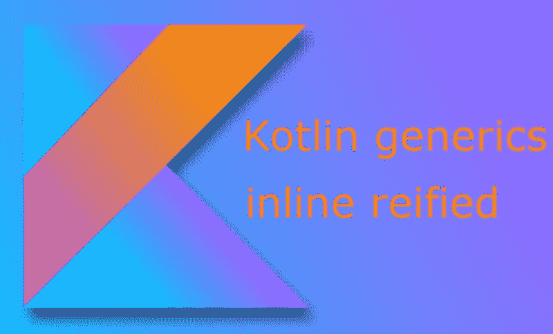

# 科特林具体化类型

> 原文：<https://blog.devgenius.io/kotlin-reified-types-ff353f83d479?source=collection_archive---------3----------------------->

我的一些科特林具体化的泛型思想。



**具体化**是一个过程，通过这个过程，一个关于应用程序的抽象概念被转化为一个显式的数据模型或其他用编程语言创建的对象。

让我们观察一个方法的想法，它接受 JSON 并将其转换成 object。我们需要传递该类，以便在运行时生成该类的字节码。

```
**fun** <T> createFromClass(jsonString: String): T {
    // Error. Cannot use 'T' as reified type parameter
    **return** Gson().fromJson(jsonString, T::**class**.*java*)
}
```

在泛型函数`createFromClass`内部，你不能访问类型 T，因为它只在编译时可用。Java 限制了哪些类型是**可具体化的** *—* ，如果它们在运行时可用的话。在编译过程中，Java 会删除类型参数，但只有 Kotlin 中具体化的类型参数仍可用于类型比较并获取类对象。因此传递类< T >的开销将在函数中避免。

Inline 关键字允许避免创建函数的实例。编译器在调用该函数的任何地方复制该函数的实际主体。内联函数仅仅是我们想象中的函数。

```
inline fun inlined(block: () -> Unit) {
    println("before")
    block()
    println("after")
}
fun main(args: Array<String>) {
    inlined {
       println("implement logic here")
    }
}
```

在 Java 字节码中是这样的:

```
public class MyClass {
    public static void main(String args[]) {
        System.out.println("before");
        System.out.println("implement logic here");
        System.out.println("after");
    }
}
```

将**具体化**用于实例 Of。这在 Java 中是不可能像这样检查类型的:

```
fun main(args: Array<String>) {
    checkType<String>("test idea")
}
inline fun <reified T> checkType(param: Any) {
    if (param is T) println("It is the type we are looking for.")
    if (param.javaClass == T::class.java) println("Class matched.")
}
```

具体化类型只能与内联函数结合使用。让我们看看具体化逻辑的最简单和最广泛的实现，借助 GSON 库将 JSON 反序列化为 object:

```
import com.google.gson.*
fun main(args: Array<String>) {    
    val jsonResponse = "{'name':'Alex', 'phone':'+372 xxxx'}"
    val profile = jsonResponse.convertToObject<MyProfile>()
    println("$profile.name")
}
data class MyProfile(val name: String, val phone: String)inline fun <reified T:Any> String.convertToObject(): T{
    val gson = Gson()
    return gson.fromJson(this,T::class.java)
}
```

或者在杰克逊图书馆的帮助下，它非常简单易懂:

```
import com.fasterxml.jackson.module.kotlin
fun main(args: Array<String>) {
    val json = "{'fish': 'herring'}"
    val result = json.toMyObject<MyType>()
    println(result)
}
data class MyType(val fish: String)inline fun <reified T: Any> String.toMyObject(): T {
    val mapper = jacksonObjectMapper()
    return mapper.readValue(this, T::class.java)
}
```

具体化是一个有用的修饰语。例如，在 stdlib 的 filterIsInstance 中使用它来过滤特定类型的元素。

使用具体化按类型筛选的示例。假设我们有类似的水果课。

```
fun main(args: Array<String>) {
    val fruits = listOf(Plum("tiger"), Cherry("leo"), Plum("wolf")) val result: List<Plum> = fruits.filterFruit<Plum>()
    println("$result")
    val resultType = fruits.filterIsInstance<Cherry>()
    println("check instance: $resultType")

    val isPlum = result.isInstanceOf<List<Plum>>()
    println("Is it a plum? $isPlum")
}
data class Plum(val name: String)
data class Cherry(val name: String)inline fun <reified T> List<Any>.filterFruit(): List<T> {
    return this.filter { it is T }.map { it as T }
}
inline fun <reified T> Any.isInstanceOf(): Boolean = this is T
```

让我们实现密封类，使设计更清晰，检查类型。

当子类型可以分配给超类型时，协方差提供关键字 **out** 。它激励我们使用这种类型并保持类型安全

带有成功和失败状态输出的设计:

```
import java.util.*
fun main(args: Array<String>) {
    var arr = arrayOf(0, 1, 2, 3, 4, 5)  //,"string value"
    var result = arr.average()    
    when(result) {
        is Success -> println("status: succeeded")
        is Failure -> println("status: " + result.cause?.message)
    }.exhaustive
}
inline fun <reified T> Array<T>.average() : Result<Float> {
    if (T::class.java == Integer::class.java){
        var sum = 0
        for (item in this){
            if (item is Int) sum += item
        }
        val result = (sum / this.size).toFloat()
        println("result: $result")
        return Success(result)
    } else {
        return Failure(IllegalArgumentException("$this does not conform to the number."))
    }
}
sealed class Result<out T: Any>
class Success<out T: Any>(val result: T) : Result<T>()
class Failure(val cause: Exception? = null) : Result<Nothing>()
val <T> T.exhaustive: T
    get() = this
```

**结论**
泛型在运行时并不那么有用，因为由于 JVM 字节码的限制，它们通常会在编译期间被删除(好在只有具体化的类型不会被删除)。具体化结合**内联**函数在运行时生成类的字节码。我们可以用它来得到结果的类型状态。

**有用链接**

[](https://kotlinlang.org/api/latest/jvm/stdlib/kotlin.collections/filter-is-instance.html) [## filterIsInstance - Kotlin 编程语言

### 返回一个列表，其中包含指定类型参数 r 的所有实例元素。

kotlinlang.org](https://kotlinlang.org/api/latest/jvm/stdlib/kotlin.collections/filter-is-instance.html)