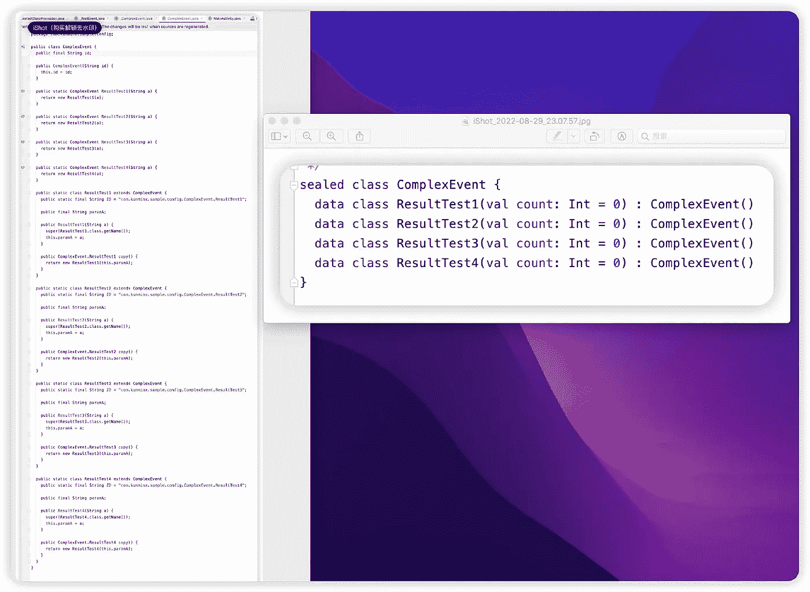

# Kotlin 密封类这么实用，Java 8 怎么用

> 原文：<https://blog.devgenius.io/kotlin-sealed-class-is-so-practical-how-to-use-it-in-java-8-218991cab2f3?source=collection_archive---------10----------------------->

为了避免分发过程中数据被恶意篡改，Kotlin 可以将 SealedClass 的参数设置为 val，

Java 17 以下版本没有引入 SealedClass，如果达到 Kotlin val 同样的效果，样板代码会瞬间爆炸很多，这意味着在解决数据一致性的同时，会产生更多的一致性问题，比如以后修改一个字段，忘记配置结构方法等等。

想了想，SealedClass4Java 应运而生，通过注释自动生成 SealedClass，像 Kotlin 一样使用 SealedClass。

献给喜欢 Kotlin 但又要维护老 Java 项目的朋友。

# [Github:SealedClass4Java](https://github.com/KunMinX/SealedClass4Java)

# 使用

1.创建一个接口，添加 SealedClass 注释，接口名以 _ 下划线开头，

2.编译生成一个目标类，比如 TestEvent，然后可以像 Kotlin 一样使用它:

# 高级用法

这个框架是在[MVI-调度员](https://github.com/KunMinX/MVI-Dispatcher)项目的优化过程中诞生的工具，目的是为了消除“消息分发场景的最终样板代码”，所以让我们以 MVI-调度员的使用场景为例:

> *注:“消息、事件、意图”，不同的场景，不同的名称，但本质上指的是同一个东西，即“可消费的一次性数据”。*

# A.纯消息分发场景

1.定义一个接口，比如 _Messages，在方法列表中定义一个不带参数的纯消息，定义完成后生成对应的 Messages 类。

2.发送消息。MVI 视图中的纯消息

3.MVI 模型中的转发消息

4.在 MVI 视图中回复消息

# B.带参数的意向分布方案

这种情况很常见。例如，页面从后台请求数据，通过意向传递参数，在后台处理结果，将结果注入意向，然后将其发送回页面。

因此，在这个场景中，intent 将携带“参数”和“结果”，在发送场景中只需要注入参数，在推回场景中只需要注入结果。

因此，使用方法是，

1.定义接口，向参数添加@Param 注释，

build 生成的静态方法，如 AddNote 方法，只提供“参数”列表，不提供结果列表，结果字段被赋予默认值，以满足意向发送场景的使用。

2.发送通知意向。AddNote(注意)MVI 视图中的意图，

3.在 MVI 模型中处理业务逻辑，注入结果并推回意图。

由于不能修改意图来保证“数据一致性”，在注入结果的场景下，可以通过 copy 方法复制一个新的意图，copy 方法的输入参数是“结果”列表，符合的意图推回场景用法。

4.回应 MVI 视图中的意图

# C.无参数的事件分布场景

即没有初始值参数，仅用于结果分布的情况。

这种场景和“带参数意图的分布场景”通常是重叠和互补的，所以它们在使用上实际上是相似的。

1.定义接口，方法没有用@Param 注释。在这种情况下，NoteIntent。GetNotes 静态方法提供了两种类型:无参数和有参数。我们通常不使用参数，即事件的结果在创建时被赋予一个默认值。

2.发送通知意向。MVI 视图中的 GetNotes()事件，

3.在 MVI 模型中处理业务逻辑，注入结果并推回意图。

由于不能修改意图来保证“数据一致性”，在注入结果的场景下，可以通过 copy 方法复制一个新的意图，copy 方法的输入参数是“结果”列表，符合的意图推回场景用法。

4.回应 MVI 事件-查看

[Github:SealedClass4Java](https://github.com/KunMinX/SealedClass4Java)