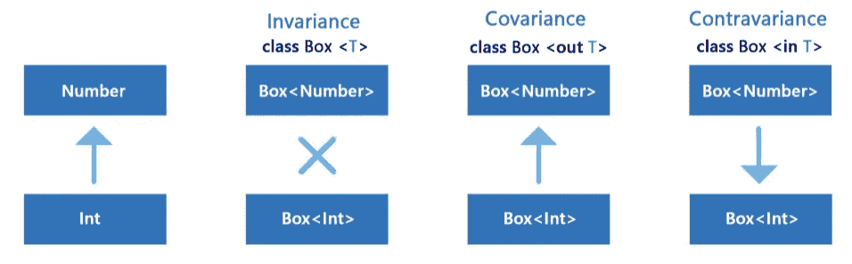

# 具有一般协方差的 Kotlin 密封类

> 原文：<https://blog.devgenius.io/kotlin-sealed-class-with-generic-covariance-7e33875e7002?source=collection_archive---------1----------------------->

协方差作为具有严格规则的契约，使得类类型是可预测的和安全的。

协方差方法让我们缩小某些方法的类型，例如: **Int** 类型是超类型 **Any** 的一部分。

**Kotlin 提供了“in”、“out”保留关键字，以增强我们使用协方差/逆变的工具。**

对于“in”泛型，我们可以将超类型的类分配给子类型的类。但是对于“out”泛型，我们可以将子类型的类分配给超类型的类。

如果我们的类使用泛型类型作为函数的输出，我们在协方差逻辑中使用'`out`'。我们将 type 作为参数传递给接口，以便在我们使用的功能方面做到严格和简洁。`Out`’表示 T 打算由这个类的方法产生。

其实，
1。当超类型可以被指定为子类型时，使用中的**。
2。当子类型可以分配给超级类型时，使用 **out** 。**

由卡帕头提供。马尔钦·莫斯卡拉的《学院》

举例来说，在现实世界中，我们需要展示一组可能性:一个关于成功、失败或进行状态的类。当然，首先我们可以用`enum`。但是**枚举**有其局限性:每个子类型只能是一个常量，并且没有状态。

**界面**

让我们从头开始调查。在最简单的情况下，我们可以使用常规方法— **接口**作为可用方法的契约。我们在自定义类中覆盖预定义的方法:

我们也可以用经典的**试试{}最后{}接住{}。它经常会把事情弄得一团糟:**

但是这样的代码很难阅读。我们过度填充了一堆代码，有时不太容易发现特定方法的某些异常。

科特林提供了自己的方法。

**是密封类。**

我们有不同类型的嵌套类，并保持状态。密封类允许我们表示层次结构。并且它防止继承，这个类是密封的，所以使用嵌套的子类。

抽象类上的密封类:

默认情况下，密封类是抽象的，因此我们可以定义父密封类的嵌套子类。

当然，我们可以使用简单的普通密封类，但是它太无聊了。更有意思的是玩泛型，把类型当参数传。

泛型层次结构允许我们更加灵活，因为大多数结果类层次结构看起来非常相似:相同的名称和属性。

当子类型可以分配给超类型时，协方差提供关键字 **out** 。它激励我们使用这种类型并保持类型安全。

我的完整示例如下所示:

当关键字时**的额外奖励。**

当表达式必须详尽时，添加必要的“加载”分支或 else 分支。它可以用于强制执行一个`when`语句是穷举的。

`val <T> T.exhaustive: T
get() = this`

这个扩展属性帮助我们不从编辑器和编译器那里得到一个错误:“*‘when’表达式必须是穷举的，添加必要的‘is Error’分支或者‘else’分支来代替*”

`when(val result = getResult()) {
is Result.Success -> println(“succeeded”)
is Result.Error -> println(result.cause?.message)
}.exhaustive`

通过楼梯深入代码的海洋…

**结论**

使用密封类来避免类型错误，并遵循预定义的方法。

顺便说一下，ASP.NET C #也有同样功能的`sealed` 关键字。有时在架构逻辑中，继承应该以这种方式被限制。不同语言中的 OOP 方法非常相似。