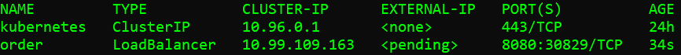
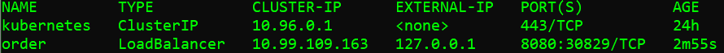
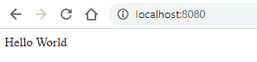

# Minikube Windows 集群中的 Kotlin SpringBoot 应用程序

> 原文：<https://blog.devgenius.io/kotlin-springboot-app-in-minikube-windows-cluster-c5269e3f88fb?source=collection_archive---------13----------------------->

在这个简单的教程中，我们将看到在 Minikube 中运行 SpringBoot Kotlin 应用程序的每个步骤。我花了 2 /3 个小时在本地运行一切，我希望我开始时有一个这样的作战计划。所以在这里，希望有所帮助。我将只关注 Windows 操作系统，但我认为 Linux 主机的过程应该非常相似。

*   1-先决条件
*   2- Kotlin 应用程序
*   三容器图像
*   4 支 k8 部署
*   5-结论


Marek Piwnicki 在 [Unsplash](https://unsplash.com?utm_source=medium&utm_medium=referral) 上的照片

注意:过几天我会继续这篇文章。我将展示如何在 Minikube 中运行、配置和使用 Kafka 集群。我还将提供从代理向 Kotlin 应用程序发送和接收消息所需的样板配置，反之亦然。

# 1-先决条件

> **码头工人**

下载并安装[安装程序。](https://desktop.docker.com/win/main/amd64/Docker%20Desktop%20Installer.exe)(注意:如果您的管理员帐户不同于您的用户帐户，您必须在安装后将用户添加到 docker-users 组中)

> **库贝克特尔**

```
$curl -LO “[https://dl.k8s.io/v1.23.0/bin/windows/amd64/kubectl.exe.sha256"](https://dl.k8s.io/v1.23.0/bin/windows/amd64/kubectl.exe.sha256%22)
```

将下载的可执行文件放在一个文件夹中。将该文件夹放到“%PATH%”环境变量中。(我一直用同一个目录“C:\script”。在那里，我有大量的批处理工具和脚本。这样，我就不必每次都为路径添加新的目录..这也适用于可执行文件的链接(？)).

> **Minikube**

如果没有 WGET，[安装 WGET](https://www.gnu.org/software/wget/) :

```
$ wget install minikube
```

在所有这些安装之后，你可能需要几次非常无聊的重启。之后，您应该可以运行:

```
$ minikube start
```

并成功地输出令人惊叹的消息。

# 2- Kotlin 应用程序

从[https://start.spring.io/](https://start.spring.io/)生成 SpringBoot Kotlin 应用程序。选择 Kotlin 和 Gradle 作为构建工具。此外，您应该添加 spring-boot-starter-web 依赖项。下载可执行文件并解压。

现在我们必须向代码中添加一个简单的控制器。这个端点会用“hello world”这种无聊的句子来回答。没什么创意，我知道，我知道。

```
import org.springframework.web.bind.annotation.GetMapping
import org.springframework.web.bind.annotation.RestController@RestController
class OrderController { @GetMapping(“/”)
  fun home(): String {
    return “Hello World”
  }}
```

在项目的根目录下运行下面的命令，生成 build/libs/ <artifact-name>。冲突</artifact-name>

```
*$ ./gradlew clean build*
```

如果一切顺利，你应该会发现它就在那里，和一个“plain.jar”工件在一起。这是作为独立服务器运行应用程序所需的没有依赖性的 jar。我们不需要那个罐子。将以下代码片段添加到“gradle.build.kts”文件中以将其移除:

```
tasks.getByName<Jar>(“jar”) {
   enabled = false
}
```

太好了。在新的“干净构建”之后，我们应该在 lib 目录中只有正确的 jar。

# 三容器图像

我们需要实际提供应用程序的 Dockerfile。(我认为，在特性中，docker 图像将被标准化，并在所选框架本身中提供。已经有一个自动的 [Dockerfile 生成器](https://github.com/cloud66-oss/starter)可以自动检测你需要的图片，并根据你的需要构建 docker 文件。好主意！).

在这种情况下，我使用 OpenJDK-17 作为基础映像。注意，这个映像的构建并不包括工件本身的构建，但是可以将这个阶段作为一个额外的前一步。

```
FROM openjdk:17-jdk-alpineARG JAR_FILE=build/libs/*.jarCOPY ${JAR_FILE} app.jarENTRYPOINT [“java”, “-jar”, “/app.jar”]
```

因为 Minikube 应用程序中需要这个映像，所以在实际构建映像之前，我们必须在 PowerShell 中运行它，具体命令如下:
***<<<****我建议从*[*https://aka.ms/pscore6*](https://aka.ms/pscore6)*—它带来了* ***性能改进和几个新特性> > >***

```
*$ minikube docker-env | Invoke-Expression*
```

*[Minikube docker-env](https://stackoverflow.com/questions/52310599/what-does-minikube-docker-env-mean) 指令返回一组变量。这些变量将帮助您的 docker CLI(您在其中编写 docker 命令)与 minikube 创建的 VM 中的 docker 守护进程连接！*

*现在我们实际上可以构建图像了(在同一个 shell 中！):*

```
*$ docker build — no-cache -t order-ms:0.0.1 .*
```

# *4 支 k8 部署*

*最后，我们可以开始考虑 Minikube 内部的实际部署。让我们使用刚刚创建的映像生成一个部署文件，将端口 8080 公开为容器端口:*

```
*$ kubectl create deployment order — image=order-ms:0.0.1 — replicas=2 -o yaml — dry-run=client — port=8080 > order.yaml*
```

*你会在 CWD 里面找到 **order.yaml** 文件。通过将 ImagePullPolicy 添加到 IfNotPresent 来编辑该文件:*

```
*...
spec:
   containers:
   - image: order-ms:0.0.5
     imagePullPolicy: IfNotPresent
     name: order-ms
     ports:
     - containerPort: 8080*
```

*这样，我们可以使用刚刚构建的本地映像。*

*好吧。此时，我们可以应用部署:*

```
*$ kubectl apply -f order.yaml*
```

***要真正触及 Kotlin 应用程序内的端点，它位于 Docker 容器内，位于 Kubernetes POD 内，位于 Minikube 应用程序集群内的 k8s 集群内…这有点棘手(你别说！？).但是我们没有失去信心。***

*首先，我们需要创建一个 Kubernetes 服务:*

```
*$ kubectl expose deployment order — type=LoadBalancer — port=8080 — dry-run=client -o yaml > load-bal.yaml$ kubectl apply -f load-bal.yaml*
```

*(是的，实际生成 YAML 文件总是更好，这样你就可以轻松地对它们进行版本化或编辑)*

*太好了。现在我们必须到达终点。但是怎么做呢？*

*如果我们跑:*

```
*$ kubectl get svc*
```

**

*因此，订单负载平衡器没有外部 IP，因为它仍处于<pending>状态。像这样，从外面是不可能到达那个终点的。</pending>*

*需要做的是打开一个额外的 shell 并运行:*

```
*$ minikube tunnel*
```

*这个命令为所有 k8s 名称空间中的所有负载平衡器服务打开一个隧道。再次运行以下命令:*

```
*$ kubectl get svc*
```

**

*这里是我们要到达的终点和港口。外部 IP +端口字符串的左边部分(127.0.0.1:8080)*

**

# *结论*

*我们已经看到了如何在运行 Minikube 的 Kubernetes 集群中配置运行基于 Kotlin 的 SpringBoot 应用程序所需的一切。在下一篇文章中:在 Minikube 中运行、配置和使用 Kafka 集群。使用 Kotlin 应用程序接收和消费卡夫卡信息。*

*感谢你的阅读，如果你想点击订阅！*

*但前提是你愿意。我是说真的。*