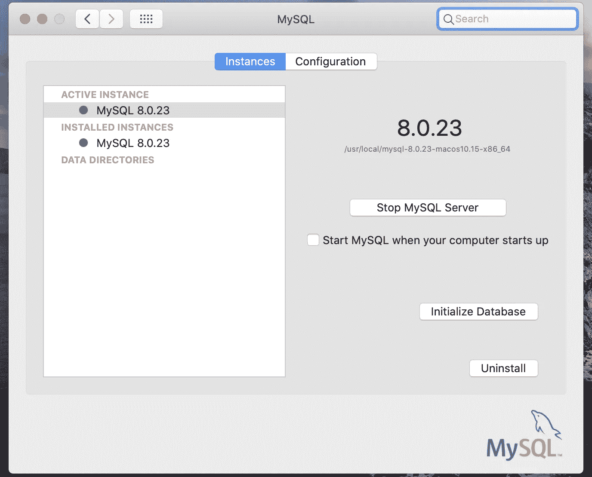
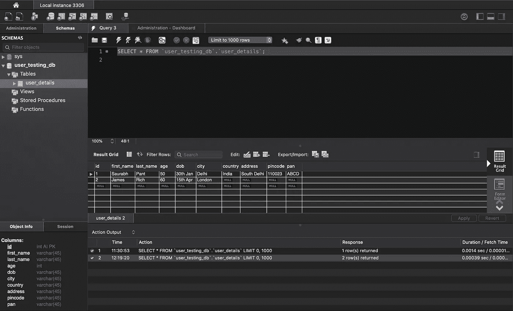
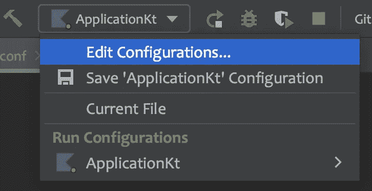

# 使用 Ktorm 集成 SQL 数据库

> 原文：<https://blog.devgenius.io/ktor-rest-apis-integrating-sql-database-using-ktorm-7adacdf41003?source=collection_archive---------2----------------------->

## 后端教程

## 数据库里有吗？


来源:BMC 软件

在我以前的文章中，展示了如何使用 Ktor 框架设置、创建和测试简单的静态 rest apis。本文是这三个系列文章的延伸，在这一篇中，我们将探索如何将数据库添加到我们的 API 中。我们将使用 SQL 数据库。

万一你想从头开始，请阅读以下内容，你不会失望的。

> [Ktor REST API—第 1 部分(项目设置)](https://proandroiddev.com/build-rest-apis-using-ktor-framework-i-dbbf36b332bb)
> [Ktor REST API—第 2 部分(创建路线)](https://proandroiddev.com/build-rest-apis-using-ktor-framework-ii-47948e89f1d6)
> [Ktor REST API—第 3 部分(测试路线)](https://proandroiddev.com/build-rest-apis-using-ktor-framework-iii-87e579a7258e)

# 数据库服务器设置

首先，我们需要一个本地数据库服务器启动并运行，以连接到 SQL 客户端应用程序。Sql 客户端应用程序将呈现我们的数据库，并让我们非常顺利地执行查询。按照以下步骤进行设置:

*   下载任何 SQL 客户端应用程序。我用的是 [MySqlWorkBench](https://dev.mysql.com/downloads/mysql/8.0.html)
*   安装应用程序
*   进入系统偏好设置启动服务器，你会在底部看到一个图标。点击它并启动服务器。



系统偏好设置-> MySql

工作台应用程序如下所示



就这样了。让我们进入下一步。

# 数据库设置

因为我们正在阅读，这意味着我们知道 Ktor 的基本结构和术语。所以直接建立我们的数据库将是第一步。

虽然 Ktor 提供了基本的 SQL 特性支持，但是我们会使用 ORM 框架**k ORM**。

> Ktorm 是一个直接基于纯 JDBC 的轻量级高效的 Kotlin 框架，并且是开源的。它提供了强类型和灵活的 SQL DSL 和方便的序列 API，以减少我们在数据库操作上的重复工作。当然，所有 SQL 语句都是自动生成的。

要添加 Ktorm，我们将在 build.gradle 文件中添加以下依赖项。

```
// ktorm
implementation 'org.ktorm:ktorm-core:3.5.0'
implementation 'org.ktorm:ktorm-support-mysql:3.5.0'
```

这就是我们需要添加为依赖项的全部内容。

现在我们需要连接到我们的数据库。使用 Ktorm 非常简单。

```
fun database() = Database.connect(
    dbUrl,
    user = dbUser,
    password = dbPwd
)
```

是啊！就是这样。

接下来，我们将在我们的 **application.conf** 文件中添加一些配置，如下所示:

```
db {
    config {
        db_url = ${?DB_URL}
        db_user = ${?DB_USER}
        db_pwd = ${?DB_PWD}
    }
}
```

为什么会这样？因为将数据库(或任何类型的)凭证保存在代码中是不安全的。因此，我们通过配置文件访问变量，这些配置变量的值来自系统环境变量。

## 环境变量设置

让我们在我们的环境中添加如下价值。

**步骤 1** :点击工具栏中的应用选项，然后进入编辑配置。



**第二步**:进入虚拟机选项，复制粘贴以下内容

**第三步**:现在创建一个对象 DBHelper.kt，如下所示

请注意，环境变量可以在应用程序上下文中访问。因此，我们为应用程序上下文创建了一个扩展函数 *configureDbVariables* ，现在我们可以提取环境变量值，如下所示

```
dbUrl = environment.config.propertyOrNull(*KEY_DB_URL*)?.getString() ?: ""
```

在应用程序的最开始，我们需要这些值，所以我们将从主模块本身调用这个函数。

```
fun Application.module() {
    *configureDbVariables*()
}
```

好吧！现在，我们访问和配置数据库的设置已经完成。

## 数据库管理器

现在，我们将为我们的数据库设置一个管理器层，这样我们的数据库就不会从该层暴露出来，将来如果我们想为它提供不同的实现，我们也可以轻松地做到这一点。

这将是我们的知识库将访问的一个接口。我们将在本文后面看到它的实现。

## 创建表

表是作为 Ktorm 中的对象创建的，k torm 扩展了**表<实体> (table_name)** 。但是因为我们在这里没有使用任何实体绑定，所以我们没有传递任何东西。

要创建一个列，我们只需用列名作为参数定义数据类型。例如， **int** 是 Ktorm 提供的 sql 类型，而“id”是列名。

```
val id = *int*("id").*primaryKey*()
```

类似地，对于字符串，我们使用 varchar 等其他数据类型，您可以在[这一](https://www.ktorm.org/en/schema-definition.html)页面上找到。

所以，现在我们的表被定义了。现在是数据库集成的重要部分，我们需要查询数据库中的 CRUD 操作。让我们看看如何在 Ktorm 中做到这一点。

## 查询数据库

正如我们上面讨论的，我们将在应用程序的最开始设置数据库对象。所以当我们在 api 端点访问它们时，数据库已经准备好了。

可以通过以下方式访问数据库对象

```
private val database = DBHelper.database()
```

## 添加对象

我们可以调用数据库对象上的函数，如下所示

```
override fun addUser(user: User): User {
    database.*insert*(UserTable) **{** set(**it**.first_name, user.first_name)
        set(**it**.last_name, user.last_name)
        set(**it**.dob, user.dob)
        set(**it**.age, user.age)
    **}** return user
}
```

它返回给我们一个为这个用户生成的 id。

## 删除对象

```
override fun delete(id: Int): Boolean {
    val affectedRow = database.*delete*(UserTable) **{ it**.id *eq* id **}** return affectedRow == 1
}
```

它返回受操作影响的行数。

## 获取所有对象

```
override fun getAllUsers(): List<User> {
    val dbUser = database.*from*(UserTable).*select*()
    return dbUser.rowSet.*asIterable*().*map* **{** row **->** User(
            row[UserTable.id] ?: -1,
            "${row[UserTable.first_name] ?: ""}",
            "${row[UserTable.last_name] ?: ""}",
            row[UserTable.age] ?: -1,
            row[UserTable.dob] ?: "",
            row[UserTable.city] ?: ""
        )
    **}** }
```

这里，我们调用 select()函数，它返回一个查询对象。这个查询对象包含所有返回的行。所以我们将它视为一个 iterable，并将每个 UserTable 对象映射到我们的域用户对象中。

## 按 Id 获取对象

```
override fun getById(id: Int): User? {
    val dbUser = database.*from*(UserTable).*select*().*where* **{** UserTable.id *eq* id **}** val row = dbUser.rowSet.*asIterable*().*firstOrNull*()
    return row?.*let* **{** User(
            **it**[UserTable.id] ?: -1,
            "${**it**[UserTable.first_name] ?: ""}",
            "${**it**[UserTable.last_name] ?: ""}",
            **it**[UserTable.age] ?: -1,
            **it**[UserTable.dob] ?: "",
            **it**[UserTable.city] ?: ""
        )
    **}**?: null
}
```

这个查询类似于 Get All Users，但是这里我们添加了一个 where 子句，并检查 iterable 的第一项。

还有 Bamn！我们已经使用 Ktorm 成功地将数据库与 Rest APIs 集成在一起。现在，我们可以使用不同的查询来查看所有的操作。我将在以后文章中写更多的高级部分。但是现在这是一个很好的开始。

[](https://github.com/aqua30/Apis-using-Ktor/tree/database-set-up) [## GitHub-aqua 30/Apis-在数据库设置时使用-Ktor

### 此时您不能执行该操作。您已使用另一个标签页或窗口登录。您已在另一个选项卡中注销，或者…

github.com](https://github.com/aqua30/Apis-using-Ktor/tree/database-set-up) 

# 目前就这些了！敬请期待！

通过 medium(如果内容对您有帮助)或 [GitHub](https://github.com/aqua30) 与我联系，并订阅电子邮件以同步了解更多关于 Android/IOS/Backend/Web 的有趣话题。

直到下一次…

干杯！