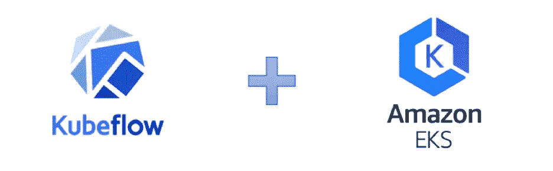
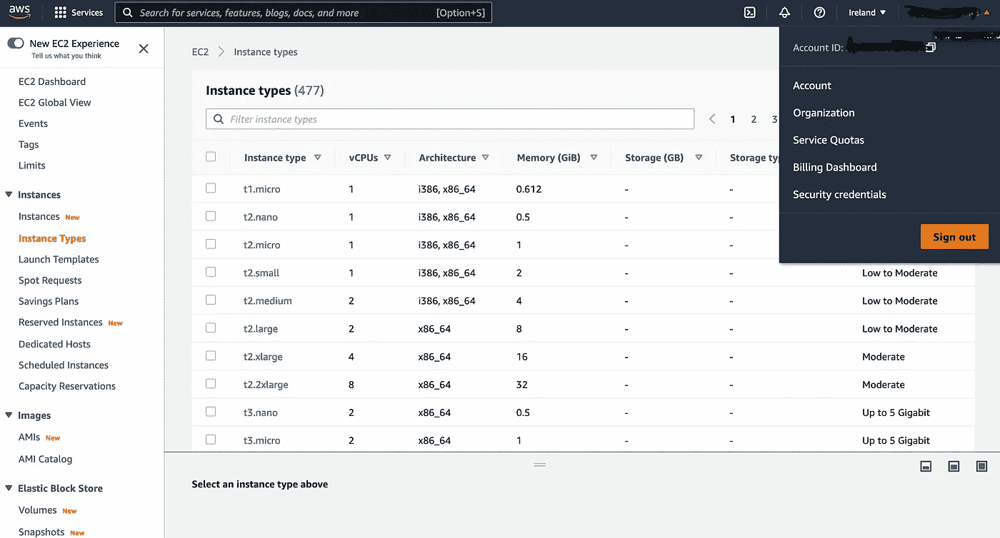
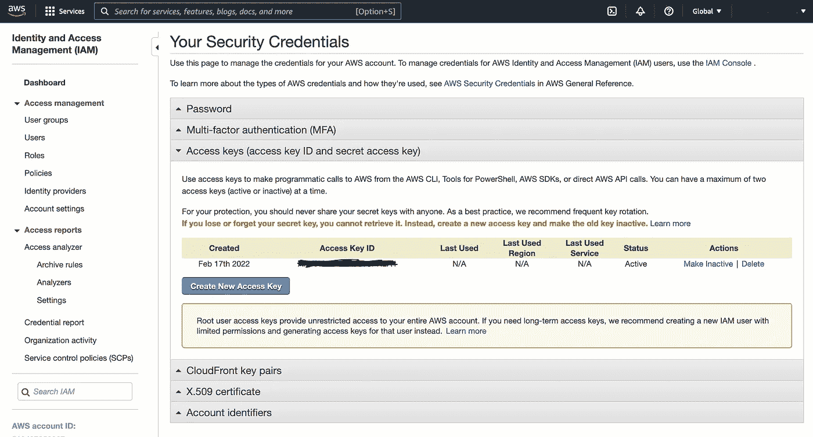
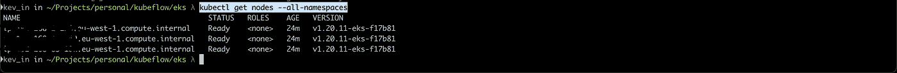
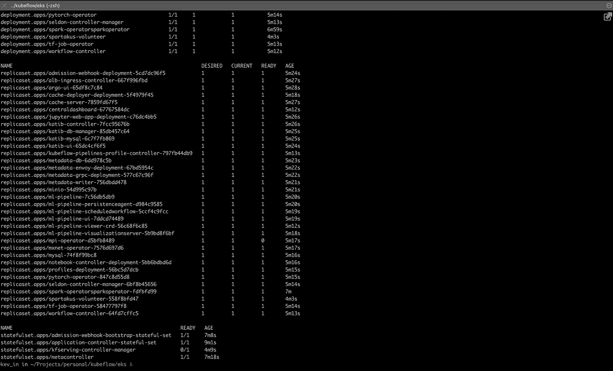
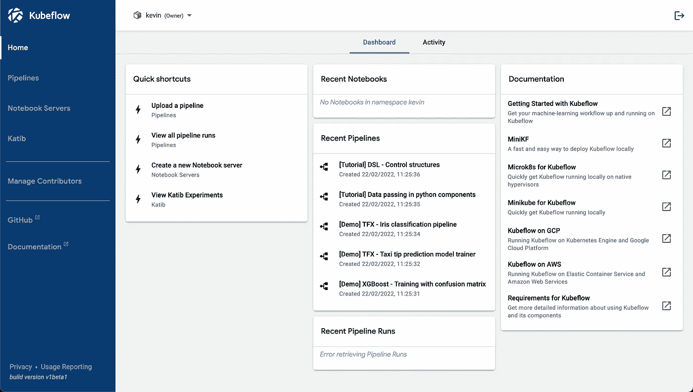

# Kubeflow 云部署(AWS)

> 原文：<https://blog.devgenius.io/kubeflow-cloud-deployment-aws-46f739ccbb32?source=collection_archive---------4----------------------->

## 如何在 AWS 上部署 Kubeflow？



图 1: Kubeflow +亚马逊 EKS

这是博客教程，将重点介绍在 AWS 上部署 Kubeflow。如果你想知道 Kubeflow 是什么以及如何在你的本地机器或本地服务器上部署它，你可以在这里阅读我之前的博客教程[。](https://medium.com/@gkkarobia/kubeflow-and-local-deployment-of-kubeflow-b0b14885947)

Kubeflow 是非常资源密集型的，在本地部署它可能意味着你没有足够的资源来运行你的端到端机器学习管道，但是，它肯定比部署在云中便宜得多。在云中设置 Kubeflow 的成本会很高，尤其是如果有些事情不太对劲，并且您需要重复部署几次。这篇博客教程应该能帮助你第一次就做对。

**先决条件**

为了在 AWS 上成功部署 Kubeflow，我们必须在本地机器上安装命令行工具，以便以代码形式部署基础设施(IAC)。

> ***免责声明*** *:我使用的是 Mac-OS，因此这篇博文中的命令是为该操作系统量身定制的。我将在每一节中链接其他平台的安装指南。*

**Kubectl 安装**

Kubectl 允许您对 Kubernetes 集群运行命令。我们使用它来部署应用程序、检查和管理集群资源(pods、命名空间等)以及查看集群和节点日志。如果你已经安装了 [minikube](https://minikube.sigs.k8s.io/docs/) 你可以跳过这一步，以避免包冲突，因为 minikube 是和 kubectl 捆绑在一起的。我们通过运行以下命令使用 brew 安装 kubectl。

```
$ brew install kubectl
```

对于 Windows 用户，你可以在这里找到 kubectl 安装指南和 Linux 用户[这里](https://kubernetes.io/docs/tasks/tools/install-kubectl-linux/)。

**AWS CLI 安装**

AWS 命令行界面(AWS CLI)是一个开源工具，使您能够直接在命令行 shell 中使用命令与 AWS 服务进行交互。您可以使用它来启动和配置实例，部署 Kubernetes 集群。它提供了一些命令，这些命令实现了与基于浏览器的 AWS 管理控制台从您的终端提供的功能等效的功能。要安装 AWS CLI，我们运行:

```
$ curl "https://awscli.amazonaws.com/AWSCLIV2.pkg" -o "AWSCLIV2.pkg"
$ sudo installer -pkg ./AWSCLIV2.pkg -target /
```

第一个 Curl 命令下载 AWSCLI version 2 包，并在当前目录下保存为一个名为 *AWSCLIV2.pkg* 的文件。第二个安装程序命令安装 AWS CLI，我们必须在命令中包含`sudo`来授予对根文件夹(/)的写权限。

对于 Linux 和 Windows 用户，您可以在这里找到 AWS CLI 安装指南。

**配置 AWS CLI**

为了让 AWS CLI 正常工作，我们必须为我们的帐户添加凭据。对于 AWS CLI 配置，我们将使用访问密钥 ID 和秘密访问密钥。我们登录到我们的 AWS 帐户(在浏览器上)，并单击登录页面右上角的帐户名称，我们会看到一个下拉菜单，如下所示:



图 2:帐户下拉菜单。

然后，我们单击安全凭证，得到一个类似于下图的页面。我们单击访问键下拉部分，得到:



图 3:创建新的访问键

我们单击蓝色的“创建新的访问密钥按钮”,并在出现的弹出窗口中单击下载生成的访问密钥。然后，我们运行下面的命令，并在出现提示时输入生成的访问密钥 ID 和秘密访问密钥。

```
$ aws configure
```

为了在运行 *aws configure 后确认凭证已经保存。*我们运行以下命令，应该会收到如下所示的类似输出。

```
$ ls ~/.aws
config    credentials
```

如果检查凭证文件的内容，应该会看到您创建的访问密钥 ID 和秘密访问密钥的值。

**eksctl 安装。**

eksctl 是一个简单的 CLI 工具，支持在 Amazon Elastic Kubernetes Service(EKS)上创建集群，这是 Amazon 针对 EC2 的新托管 Kubernetes 服务。为了安装 eksctl，我们运行下面的命令。

```
$ brew tap weaveworks/tap
$ brew install weaveworks/tap/eksctl
```

brew tap 命令允许 brew 访问另一个公式库(在线软件包浏览器)。为了确认安装，我们运行下面的命令

```
$ eksctl version
0.83.0
```

对于 Linux 和 Windows 用户，您可以在这里找到 eksctl 安装指南。

**AWS-iam-认证器安装。**

Aws-iam-authenticator 是一个使用 AWS IAM 凭证来验证 Kubernetes 集群的工具。这允许我们使用一组凭证(在上一节中创建的凭证)来配置和更新已创建的 Kubernetes 集群。为了安装 aws-iam-authenticator，我们运行:

```
$ brew install aws-iam-authenticator
```

为了测试 aws-iam-authenticator 是否工作，我们运行并应该得到:

```
$ aws-iam-authenticator version
{"Version":"0.5.3","Commit":"a0516fb9ace571024263424f1770e6d861e65d09"}
```

对于 Linux 和 Windows 用户，您可以在这里找到 aws-iam-authenticator 安装指南。

**使用 eksctl 创建 EKS 集群。**

为了让 Kubeflow 正常运行，我们需要在亚马逊 EKS 运行一个 kubernetes 集群。我们使用 eksctl 来创建我们的集群，我们可以使用其他工具 EKS 控制台或通过 AWS CloudFormation、Terraform 或 AWS Cloud Development Kit (CDK)来创建集群。使用 eksctl 既快速又简单，省去了我们更改本地 *kubectl 上下文的麻烦。*

> **注意:**如果您已经使用其他工具创建了一个 EKS 集群，那么您必须改变 kubectl 的上下文。你可以在找到这样做的指南

我们首先声明一些环境变量:

```
export AWS_CLUSTER_NAME**=**kubeflow
export AWS_REGION**=**eu-west-1
export K8S_VERSION**=**1.20
export EC2_INSTANCE_TYPE**=**m5.large 
```

我们指定集群的名称，这可以是您想要的任何值。AWS_REGION 变量应该设置为您在 AWS 上工作的区域。我们使用 K8s (Kubernetes)版本 1.20 来避免与 Kubeflow 版本 1.2 清单的兼容性问题。对于 EC2_INSTANCE_TYPE 变量，我们使用 m5.large，但是您可以根据您的端到端 ml 管道的需要使用任何 EC2 实例类型。

下一步是创建一个用于 eksctl 的集群配置文件。我们将使用 *cat* 命令直接从终端执行此操作，这使得访问我们之前定义的变量变得更加容易。我们在终端中运行下面的代码片段。

```
$ cat << EOF > cluster.yaml
---
apiVersion: eksctl.io/v1alpha5
kind: ClusterConfig

metadata:
  name: ${AWS_CLUSTER_NAME}
  version: "${K8S_VERSION}"
  region: ${AWS_REGION}

managedNodeGroups:
- name: kubeflow-mng
  desiredCapacity: 3
  instanceType: ${EC2_INSTANCE_TYPE}
EOF
```

上面应该会在您当前的工作目录中创建一个名为 cluster.yaml 的文件。

最后，我们创建集群，我们运行下面的命令来做到这一点。此命令可能需要几分钟才能完成。

```
eksctl create cluster -f cluster.yaml
```

为了确认集群已创建，我们运行以下命令

```
kubectl get nodes --all-namespaces
```

您应该有类似于以下内容的内容:



图 4:来自 EKS 集群的节点

**kfctl 安装**

> **注意** : `kfctl`目前仅适用于 Linux 和 Mac-OS 用户。如果使用 Windows，可以在 Windows 子系统 for Linux (WSL)上安装`kfctl`。

kfctl 是部署和管理 Kubeflow 的控制平面，我们必须在安装 Kubeflow 之前先设置它。首先，我们将定义环境变量:

```
$ PLATFORM=$(uname)
$ export PLATFORM
$ mkdir -p ~/Kubeflow/bin
$ export KUBEFLOW_TAG=1.2.0
$ KUBEFLOW_BASE="https://api.github.com/repos/kubeflow/kfctl/releases"
$ KFCTL_URL=**$(**curl -s ${KUBEFLOW_BASE} | grep http | grep "${KUBEFLOW_TAG}" |grep -i "${PLATFORM}" |cut -d : -f 2,3 | tr -d '\" ' **)**
```

上面的命令块创建了 PLATFORM、KUBEFLOW_TAG、KUBEFLOW_BASE 和 KFCTL_URL 变量，它们分别表示我们运行命令的当前平台(Linux 或 Darwin)、我们想要的 KFCTL 版本、所有 kfctl 版本的 URL 以及我们指定的 kfctl 版本的 URL。我们还创建了~/Kubeflow/bin 目录来存储 kfctl 二进制文件。

```
$ wget "${KFCTL_URL}"
$ KFCTL_FILE=${KFCTL_URL##*/}
$ tar -xvf "${KFCTL_FILE}"
$ mv ./kfctl ~/Kubeflow/bin
```

我们使用 wget 工具下载 kfctl 压缩的 tar 文件，通过分割在前面的命令块中定义的 URL 字符串获得下载的 tar 文件的名称，并将其保存到 KFCTL_FILE 变量中，然后使用 tar 命令提取它。然后，我们将 tar 文件(kfctl 程序)的内容移动到我们之前创建的目录中。

我们将 kfctl 目录(~/Kubeflow/bin)添加到 PATH 变量中，以便在当前终端 shell 中使用 kfctl。

```
$ export PATH=$PATH:~/Kubeflow/bin
```

> ***注意:*** *这将允许 kfctl 仅在当前的终端 shell 中使用，一旦您关闭终端，您将不得不再次运行该命令。要永久添加它，您必须将命令添加到~/。zshrc 或者~/。bashrc 取决于您使用的 shell。*

为了验证 kfctl 是否已安装，我们运行下面的命令。您应该会收到与下面相同的版本:

```
$ kfctl version
kfctl_v1.2.0-0-gbc038f9
```

**Kubeflow 安装**

Docker 和 Kubernetes 使用 yaml 文件进行配置，因此 Kubeflow 也使用 yaml 文件或在此上下文中被称为*清单也就不足为奇了。*清单文件定义了要在该集群中部署的所有 kubeflow 服务(组件)。云服务通常有针对其平台定制的不同清单。我们将从 kubeflow/manifest repo 获取 aws 清单，并为其设置一个环境变量。

```
$ export CONFIG_URI**=**"https://raw.githubusercontent.com/kubeflow/manifests/v1.2-branch/kfdef/kfctl_aws.v1.2.0.yaml"
```

> **注意:**你可以在这里找到其他云服务的清单[。要使用](https://github.com/kubeflow/manifests/tree/v1.2-branch/kfdef) [AWS Congito](https://aws.amazon.com/cognito/) 启用多用户认证，您可以使用上面的链接清单报告中的`kfctl_aws_cognito.v1.2.0.yaml`。

最后，我们为集群创建一个部署目录，切换到该目录并下载清单文件。

```
$ mkdir ${AWS_CLUSTER_NAME} && cd ${AWS_CLUSTER_NAME}
wget -O kfctl_aws.yaml $CONFIG_URI
```

**库伯流配置**

下载的清单文件具有分配给某些参数的默认值，例如用户名被设置为`admin@kubeflow.org`，密码为`12341234`。为了保护我们的 Kubeflow 部署，我们必须更改这个配置。我们在 *VScode 中编辑*KFC TL _ AWS . YAML*(*随意使用你想要的任何编辑器)。

> **注意:**用户名应该是电子邮件地址格式(someone @ somewhere.something ),因为这是您在访问 Kubeflow UI 时要登录的。

从 v1.0.1 开始，Kubeflow 支持对服务帐户使用 IAM 角色。这允许将细粒度的 AWS 策略配置绑定到 Kubernetes 集群中的特定服务帐户，而不是将所需的策略附加到节点实例角色。在默认配置中，`kfctl`将创建或重用集群的 IAM OIDC 身份提供者，创建所需的 IAM 角色，并配置将角色与 Kubernetes 服务帐户绑定的信任关系。我们只需要用我们的 AWS 区域更新清单文件中的下面部分，在我们的例子中应该是这样的。

```
region: eu-west-1
enablePodIamPolicy: true
```

为了初始化 Kubeflow 集群，我们运行:

```
$ kfctl apply -V -f kfctl_aws.yaml
```

在所有资源都准备好之后，也就是说，上面的命令已经运行完成。我们运行下面的命令，让所有组件在 Kubeflow 名称空间中运行。

```
kubectl -n kubeflow get all
```

运行上面的命令后，您应该列出了所有 Kubeflow 资源，并将其划分到不同的 kubernetes 类别中，如 pods、services、daemonsets、deployments 等。



图 5:来自 Kubeflow 名称空间的所有资源

**访问 Kubeflow 用户界面**

由于 Kubeflow 运行在 AWS 上，我们必须获取 Kubeflow 服务的端点主机名，我们通过运行以下命令来获取它:

```
$ kubectl get ingress -n istio-system
```

您应该在地址部分得到类似于`123-istiosystem-istio-2af2-4567.us-west-2.elb.amazonaws.com`的内容。复制粘贴到你的浏览器中，你就可以开始了。

> ***注意:*** *如果上面的命令在地址部分没有显示任何内容。我们使用命令***ku bectl port-forward SVC/istio-Ingres gateway-n istio-system 7777:80***进行简单的端口转发，并在浏览器中输入*[*http://localhost:7777/*](http://localhost:7777/)*，您应该可以开始了。*

页面加载后，会提示您输入电子邮件地址和密码(它们应该与您之前输入的值相匹配)，之后您应该会看到一个类似于以下内容的页面:



图 6: Kubeflow UI。

**结论**

在这篇博客教程(kubeflow 系列的第二篇)中，我们学习了如何在 AWS 上设置 Kubeflow。这给了我们更多计算能力的优势，并且更接近于我们在部署环境中所拥有的。在下一篇博客教程中，我们将着眼于创建一个端到端的机器学习管道。下次再见！