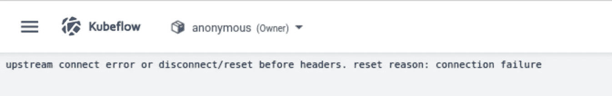

# Kubeflow 部署在 Azure 上(AKS)，正确的方式

> 原文：<https://blog.devgenius.io/kubeflow-deployment-on-azure-aks-the-proper-way-9a35d0f36f75?source=collection_archive---------6----------------------->


Kubeflow 正在成为构建和部署机器学习管道的标准。许多公司正在将他们的注意力转移到这一点上，因为这使得团队更容易在 Kubernetes 上部署 ML 工作流。然而，截至目前，2022 年(嗯差不多！)当我遵循官方指示时，我在 kubeflow 中发现了一个不起作用的管道特性。我做了大量的研究和实验，才有了我想要分享的完整工作流程。

本教程并不介绍 Kubeflow/kubernetes，而是重点介绍如何在 AKS 上正确部署 Kubeflow 并使管道处于工作状态。

# 先决条件:

本教程假设如下:

1.  **kubeflow** 、 **kubernetes** 等基础知识。
2.  已经安装了以下几个包: [**kubectl**](https://kubernetes.io/docs/tasks/tools/#install-kubectl-on-linux) **，** [**Azure 命令行(Az)**](https://docs.microsoft.com/en-us/cli/azure/install-azure-cli?view=azure-cli-latest) 。

# 部署步骤:

# 1.Azure 登录

在 linux/mac 中打开终端，输入以下命令登录 Azure。请确保您使用了正确的套餐。

```
az login
az account set --subscription id_of_my_subscription
```

# 2.创建资源组

```
az group create -n kubeflowdep -l westeurope
```

# 3.创建专门定义的集群

```
az aks create -g kubeflowdep -n KubeCluster -s Standard_D4s_v3 -c 2 -l westeurope --generate-ssh-keys
```

# 4.库伯流装置

运行以下命令来设置和部署 Kubeflow。

1.  创建用户凭据。您只需要运行这个命令一次。

`az aks get-credentials -n KubeCluster -g kubeflowdep`

2.从 [Kubeflow 发布页面](https://github.com/kubeflow/kfctl/releases/tag/v1.2.0)下载 kfctl v1.2.0 版本。

3.打开焦油球包装:

`tar -xvf kfctl_v1.2.0_<platform>.tar.gz`

# 5.库伯流部署

运行以下命令来设置和部署 Kubeflow。下面的代码包含一个可选命令，用于将二进制 kfctl 添加到您的路径中。如果没有将二进制文件添加到您的路径中，那么每次运行 kfctl 二进制文件时，您都必须使用它的完整路径。

```
# The following command is optional. It adds the kfctl binary to your path.
# If you don't add kfctl to your path, you must use the full path
# each time you run kfctl.
# Use only alphanumeric characters or - in the directory name.
export PATH=$PATH:"<path-to-kfctl>"

# Set KF_NAME to the name of your Kubeflow deployment. You also use this
# value as directory name when creating your configuration directory.
# For example, your deployment name can be 'my-kubeflow' or 'kf-test'.
export KF_NAME=<your choice of name for the Kubeflow deployment>

# Set the path to the base directory where you want to store one or more 
# Kubeflow deployments. For example, /opt/.
# Then set the Kubeflow application directory for this deployment.
export BASE_DIR=<path to a base directory>
export KF_DIR=${BASE_DIR}/${KF_NAME}

# Set the configuration file to use when deploying Kubeflow.
# The following configuration installs Istio by default. Comment out 
# the Istio components in the config file to skip Istio installation. 
# See https://github.com/kubeflow/kubeflow/pull/3663
export CONFIG_URI="https://raw.githubusercontent.com/kubeflow/manifests/v1.2-branch/kfdef/kfctl_k8s_istio.v1.2.0.yaml"

mkdir -p ${KF_DIR}
cd ${KF_DIR}
kfctl apply -V -f ${CONFIG_URI}
```

1.  运行以下命令，检查资源是否已经正确部署在名称空间`kubeflow`中:

`kubectl get all -n kubeflow`

2.打开 Kubeflow 仪表板。默认安装不会创建外部端点，但您可以使用端口转发来访问您的群集。运行以下命令:

`kubectl port-forward svc/istio-ingressgateway -n istio-system 8080:80`

3.接下来，在浏览器中打开`http://localhost:8080`。

以上所有步骤都直接取自官方文档，只做了微小的修改。现在，当您在浏览器中看到 Kubeflow 仪表板并转到 pipelines 时，您会遇到一个错误，如下图所示。



这意味着 kubeflow 的管道部署不当。原因是 istio-pod 没有被注入到 kubeflow 中的 pod。

# 6.解决方法:

最简单的解决方法是禁用 **tls.mode** ，这可以通过修改 **ml-pipeline** 和 **ml-pipeline-ui** 的目标规则来实现。我们可以通过编辑 **ml-pipeline** 和 **ml-pipeline-ui** 并将 **tls.mode** 从 **ISTIO_MUTUAL** 更改为 **DISABLE** 来完成**和**的操作。要编辑文件，请运行以下命令。

`kubectl edit destinationrule -n kubeflow ml-pipeline`

`kubectl edit destinationrule -n kubeflow ml-pipeline-ui`

*   如果您再次运行端口转发命令

`kubectl port-forward svc/istio-ingressgateway -n istio-system 8080:80`

*   访问`[http://localhost:8080](http://localhost:8080)`，你可以看到管道在 kubeflow UI 中工作。

第二种解决方法是显式启用 istio-injection。我们可以通过在应用部署之前修改部署步骤中的 yaml 文件来实现这一点。去链接`[https://raw.githubusercontent.com/kubeflow/manifests/v1.2-branch/kfdef/kfctl_k8s_istio.v1.2.0.yaml](https://raw.githubusercontent.com/kubeflow/manifests/v1.2-branch/kfdef/kfctl_k8s_istio.v1.2.0.yaml)`下载这个文件。通过明确提及下面定义的标签来修改该文件:

**注意:您只需要添加标签，而不需要从您正在更新的 yaml 文件中删除任何资源。**

修改后，您需要再次重新部署所有资源:

```
kfctl apply -V -f path/to/file/kfctl_k8s_istio.v1.2.0.yaml
```

以上两种解决方案都解决了 kubeflow 管道问题，但是当您尝试运行其中一个示例管道时，它会进入挂起状态。它不会在仪表板中显示任何错误日志，但是您可以通过以下方式查看 kubernetes 名称空间的日志:

```
kubectl get events -n kubeflow --sort-by='.metadata.creationTimestamp'
```

如果查看日志，您会遇到以下错误:

```
Unable to mount volumes for pod "pod-name" timeout expired waiting for volumes to attach or mount for pod
```

该错误显示 pod 无法装入卷。默认情况下，kubernetes 集群的运行时容器是 docker。由于 Kubeflow pipelines 构建在 Argo 之上，docker 的工作流执行器在 Argo 中[被弃用](https://argoproj.github.io/argo-workflows/workflow-executors/)，这导致了 Kubeflow 新版本中的问题不断增加。

为了补救这种情况，我们可以将工作流执行器从 docker 切换到其他执行器。有很多选项可供选择，但我选择了**进程名称空间共享(pns)** ，因为它是可伸缩的、经过充分测试的、安全的。每个选项都有优点和缺点，但是基于比较，pns 似乎是一个可行的选项。这里可以看到对比:[https://argoproj . github . io/Argo-workflows/workflow-executors/](https://argoproj.github.io/argo-workflows/workflow-executors/)。要从 docker 切换到 pns 或任何其他工作流执行器，您必须通过输入以下命令来编辑`workflow-controller-configmap`:

```
kubectl edit configmap workflow-controller-configmap -n kubeflow 
```

并将`containerRuntimeExecutor:`从**对接**改为 **pns** 。应用此更改后，您可以再次运行以下命令:

```
kubectl port-forward svc/istio-ingressgateway -n istio-system 8080:80 
```

如果您现在在浏览器中打开`http://localhost:8080`,您可以尝试运行其中一个示例管道，它应该会像预期的那样工作。这是它的部署。我希望这篇文章能帮助某人将 kubeflow 部署到 AKS。

# 参考资料:

 [## 安装 Kubeflow

### 部署 Kubeflow 的说明本指南描述了如何使用 kfctl 二进制文件在 Azure 上部署 Kubeflow。你…

www.kubeflow.org](https://www.kubeflow.org/docs/distributions/azure/deploy/install-kubeflow/) [](https://github.com/kubeflow/pipelines/issues/3407) [## 管道箱失败安装问题# 3407 kube flow/管道

### 我尝试了 https://github . com/kube flow/examples/tree/master/pipelines/simple-notebook-pipeline 中的例子来测试…

github.com](https://github.com/kubeflow/pipelines/issues/3407) [](https://github.com/kubeflow/kubeflow/issues/5277) [## 管道上游连接错误或在集管之前断开/重置。重置原因:连接…

### 此时您不能执行该操作。您已使用另一个标签页或窗口登录。您已在另一个选项卡中注销，或者…

github.com](https://github.com/kubeflow/kubeflow/issues/5277)