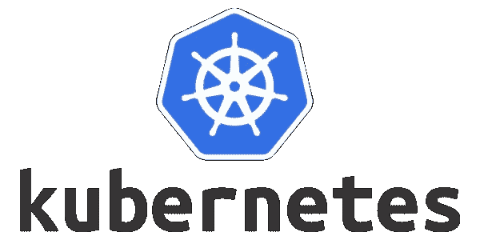
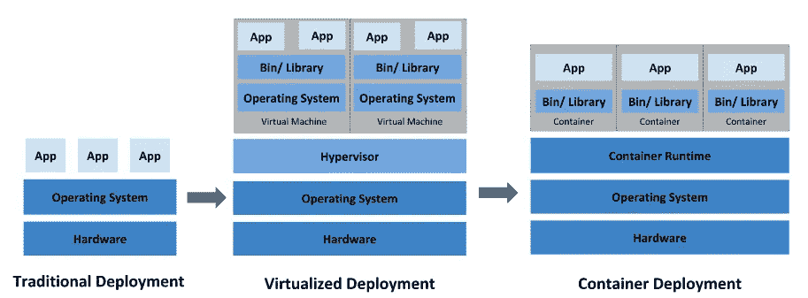
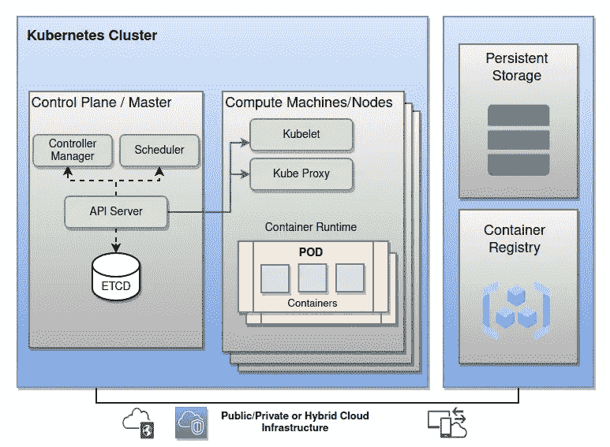

# kubernetes——弹性运行分布式系统的框架

> 原文：<https://blog.devgenius.io/kubernetes-a-framework-to-run-distributed-systems-resiliently-5f9d77442709?source=collection_archive---------4----------------------->

ubernetes 是一个开源系统，可以在任何地方部署、扩展和管理容器化的应用程序。现代软件越来越多地以容器的形式运行，有时被称为微服务。一个完整的应用程序可能包含许多容器，所有容器都需要以特定的方式协同工作。

Kubernetes 自动执行容器管理的操作任务，并包括内置命令，用于部署应用程序、对应用程序进行更改、缩放应用程序以适应不断变化的需求、监控应用程序等，使管理应用程序变得更加容易。

# 为什么你需要 Kubernetes 和它能做什么

让我们通过时光倒流来看看 Kubernetes 为什么这么有用。

来源:https://kubernetes.io/docs/concepts/overview/

在上面的图片中，我们可以看到组织如何在物理服务器上运行应用程序。后来的虚拟化允许更好地利用物理服务器中的资源，并允许更好的可扩展性，因为可以轻松地添加或更新应用程序，降低硬件成本，等等。在容器部署中，容器类似于虚拟机，但是它们具有宽松的隔离属性，以便在应用程序之间共享操作系统(OS)。

**容器是捆绑和运行应用程序的好方法**。在生产环境中，您需要管理运行应用程序的容器，并确保没有停机。例如，如果一个容器关闭，另一个容器需要启动。如果这种行为由一个系统来处理不是更容易吗？

Kubernetes 为您提供了一个灵活运行分布式系统的框架。它负责应用程序的伸缩和故障转移，提供部署模式等等。

Kubernetes 为您提供:

*   服务发现和负载平衡
*   存储编排
*   自动化推出和回滚
*   自动装箱
*   自愈
*   机密和配置管理

# **Kubernetes 建筑构件**

当您部署 Kubernetes 时，您会得到一个集群。

Kubernetes 集群由一组工作机组成，称为 compute machines/ [nodes](https://kubernetes.io/docs/concepts/architecture/nodes/) ，它们运行容器化的应用程序。这些节点托管作为应用程序工作负载组件的[pod](https://kubernetes.io/docs/concepts/workloads/pods/)。

[控制平面](https://kubernetes.io/docs/reference/glossary/?all=true#term-control-plane)管理集群中的工作节点和 pod。

**控制平面组件—**

**API 服务器**—API 服务器是 Kubernetes 控制平面的**前端。**

**调度器—** 它负责根据自动化工作流和用户定义的条件在特定节点上调度 pod。

**控制器管理器—** 控制器管理器负责在集群或 pod 级别处理各种自动化活动的几个控制器，包括复制控制器、命名空间控制器、服务帐户控制器、部署、statefulset 和 daemonset。

**ETCD—** 一致且高度可用的键值存储，用作 Kubernetes 对**所有集群数据**的后备**存储。**

**节点组件在每个节点上运行**，维护运行的 pod 并提供 Kubernetes 运行时环境。

**kubelet —** 在集群中的每个[节点](https://kubernetes.io/docs/concepts/architecture/nodes/)上运行的代理。它确保[容器](https://kubernetes.io/docs/concepts/containers/)在[箱](https://kubernetes.io/docs/concepts/workloads/pods/)中运行。

**kube-Proxy —** 维护节点上的网络规则。这些网络规则允许从集群内部或外部的网络会话与您的 pod 进行网络通信。

**容器运行时—** 容器运行时是负责运行容器的软件。

# Kubernetes 有什么好处？

*   容器编排节省
*   提高微服务架构的开发运维效率
*   在多云环境中部署工作负载
*   更高的可移植性，更少的供应商锁定机会
*   部署自动化和可扩展性
*   云环境中的应用稳定性和可用性
*   Kubernetes 的开源优势

# 你如何使用 Kubernetes

不同的供应商提供基于 Kubernetes 的平台(托管 Kubernetes 平台)或部署 Kubernetes 的[基础设施即服务](https://en.wikipedia.org/wiki/Infrastructure_as_a_service) (IaaS)。

*   [阿里云](https://en.wikipedia.org/wiki/Alibaba_Cloud) ACK(面向 Kubernetes 的阿里云容器服务)
*   [**亚马逊**](https://en.wikipedia.org/wiki/Amazon_(company)) **EKS(弹性 Kubernetes 服务)**
*   [DigitalOcean](https://en.wikipedia.org/wiki/DigitalOcean) 托管 Kubernetes 服务
*   [谷歌](https://en.wikipedia.org/wiki/Google) GKE(谷歌 Kubernetes 引擎)
*   [IBM](https://en.wikipedia.org/wiki/IBM) 云 Kubernetes 服务
*   [**微软**](https://en.wikipedia.org/wiki/Microsoft)**AKS(Azure Kubernetes Services)**
*   米兰提斯 K0s
*   [用于 Kubernetes 的 Oracle](https://en.wikipedia.org/wiki/Oracle_Cloud) 容器引擎
*   [**红帽**](https://en.wikipedia.org/wiki/Red_Hat) **Openshift**
*   [SUSE](https://en.wikipedia.org/wiki/SUSE) 牧场主，库伯内特(RKE)发动机牧场主
*   VMware Tanzu

来源:

 [## 生产级容器编排

### Kubernetes，也称为 K8s，是一个开源系统，用于自动部署、扩展和管理…

kubernetes.io](https://kubernetes.io/)  [## Kubernetes -维基百科

### Kubernetes(通常风格化为 K8s)是一个用于自动化软件的开源容器编排系统…

en.wikipedia.org](https://en.wikipedia.org/wiki/Kubernetes)