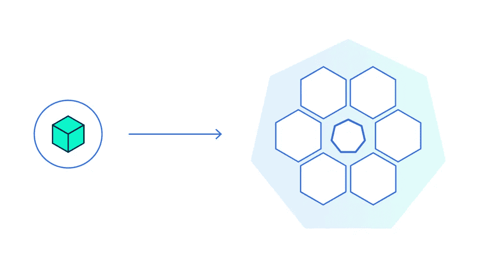
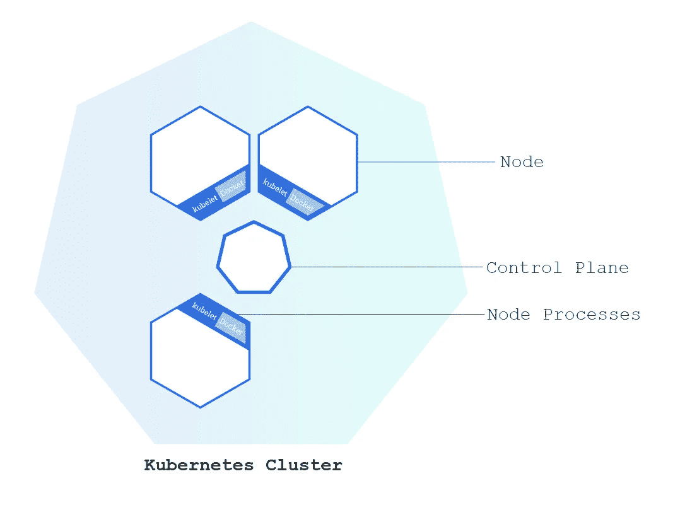
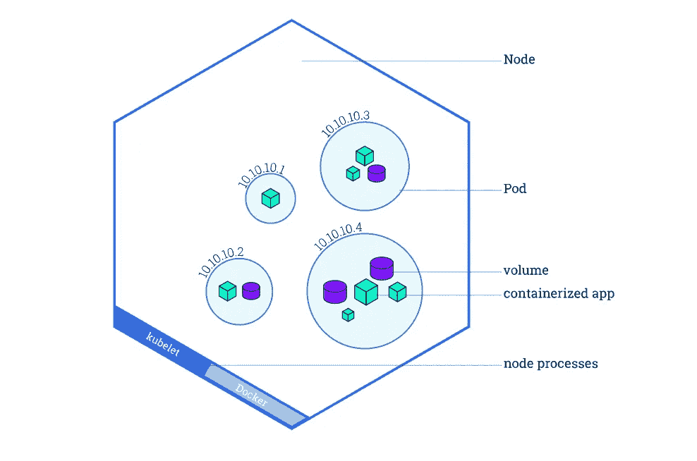
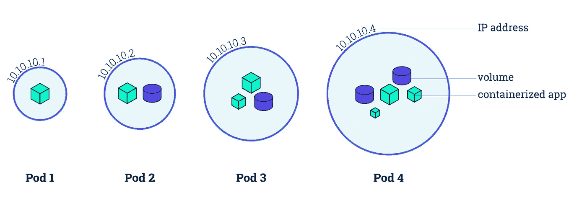

# Kubernetes —概述

> 原文：<https://blog.devgenius.io/kubernetes-an-overview-6b800672a893?source=collection_archive---------16----------------------->

图片来自 [Kubernetes](https://kubernetes.io/docs/tutorials/kubernetes-basics/public/images/module_02.svg?v=1469803628347) 教程

了解 K8s 将使你从许多其他软件工程师中脱颖而出，因为现在对了解 K8s 的人有很多需求。让我们简单讨论一下 ***基本概念*** 和 ***架构特性*** 是什么让 Kubernetes 成为任何开发者的好工具！

## Kubernetes 试图解决的问题是什么？

要理解 Kubernetes 提供的解决方案，我们必须首先想象它试图解决的问题。考虑一个用硬编码字符串响应请求的基本 Spring Boot 应用程序。我们可能有一个 8GB 内存和四个 CPU 的虚拟机。我们希望在那里部署我们的应用程序容器。

*显然*，我们肯定会有大量的人访问我们的应用程序，因此我们需要扩展。将需要另一个具有相同设置和应用程序的节点。

假设我们想要部署一个新版本的应用程序。在我们销毁第一个版本之前，我们需要建立一个新的节点。*那么，等一下……*你开始看到我们将要面对的问题了吗？如果我们只有三个容器，我们将需要 12 个内核和 24GB 的 RAM，这不是一个聪明的开发人员会同意的。这就是 Kubernetes 的切入点。

## Kubernetes 为我们提供了什么解决方案？

Kubernetes，简称 K8s，是一个允许我们 ***管理*** *容器化应用*和*服务*的平台。它使我们能够一天多次部署新版本的应用程序，频率随您的意愿而定，根据需求进行扩展和缩减，提供零停机部署、回滚等等。听起来是不是很酷？

我们先来看看 K8s 的基本模块，简单讨论一下它们的重要性。

## 什么是集群？

一个 ***集群*** 是一个节点的集合，每个节点可以是一个虚拟计算机(VM)或者一个物理系统，托管在 *AWS* 、 *Azure* 、 *GCP* ，甚至*内部*上。

简而言之，Kubernetes 只是协调一群连接在一起的计算机作为一个单元工作。由于 K8s 中的抽象，您可以将容器化的应用程序部署到一个集群中，而无需将它们专门绑定到单独的机器上。

为了使这种新的部署策略可用，应用程序必须以一种与特定主机分离的方式打包:它们必须被容器化，这就是为什么需要 ***Docker*** 的原因。

## Kubernetes 集群架构

K8s 集群由两种类型的资源组成:协调集群的 ***控制平面*** 和运行应用程序的 ***节点*** 。

图片来自 [Kubernetes](https://d33wubrfki0l68.cloudfront.net/283cc20bb49089cb2ca54d51b4ac27720c1a7902/34424/docs/tutorials/kubernetes-basics/public/images/module_01_cluster.svg) 教程

根据官方***Kubernetes***[***docs***](https://kubernetes.io/docs/tutorials/kubernetes-basics/_print/#pg-7df66040311338d6098ebeab43ba9afb),***控制平面*** 负责协调您集群中的所有操作，包括应用调度、维护应用的预期状态、扩展应用以及推出新的更新。它管理用于托管正在运行的应用程序的集群和节点。所有的决定都是在这里做出的。

集群中通常有多个工作节点和一个主节点，因此如果一个节点出现故障，etcd 成员和控制平面实例不会丢失，冗余性也不会受到影响。

在 Kubernetes 上部署应用程序时，您通知控制平面启动应用程序容器。控制平面安排容器在集群的节点上运行。节点使用控制平面公开的 Kubernetes API 与控制平面进行通信。最终用户也可以通过 Kubernetes API 直接与集群通信。

## 控制平面

主节点中的控制平面由通过 API 服务器相互通信的几个组件组成。：

*   **API 服务器**—K8s 控制平面的前端。所有的通信，无论是外部的还是内部的，都要通过 API 服务器。它在端口 443 上公开 RESTful API，为了让您与 API 对话，需要执行身份验证和授权检查。
*   **集群存储** —存储整个集群的配置和状态。
*   **调度器** —监视新的工作负载/单元，并根据几个调度因素(健康、有足够的资源、端口可用性和其他重要标准)将它们分配到一个节点。
*   **控制器管理器** —管理控制循环的守护程序。它基本上是控制器(节点控制器、副本集、端点、名称空间、服务帐户等)的控制器，这些控制器监视 API 服务器的变化。
*   **云控制器** **管理者—** 负责与底层云提供商(AWS、Azure 或 GCP)就负载平衡器、存储或实例进行交互。

## 节点

节点是一个虚拟机或物理计算机，在 Kubernetes 集群中充当工作机。所有繁重的工作，比如执行应用程序，都发生在 worker 节点上。

图片来自 [Kubernetes](https://d33wubrfki0l68.cloudfront.net/5cb72d407cbe2755e581b6de757e0d81760d5b86/a9df9/docs/tutorials/kubernetes-basics/public/images/module_03_nodes.svg) 教程

工作节点为我们的应用程序提供了一个运行环境。它有 3 个主要组件:

*   **Kubelet** —在 Kubernetes 节点上应用、创建、更新和销毁容器，管理节点，并帮助它与控制平面通信的技术；从 API 服务器接收 Pod 定义；与容器运行时交互以运行与 Pod 相关联的容器；向主节点报告节点和 Pod 状态。
*   **容器运行时**——负责从容器注册表中提取图像，启动或停止容器，因此，它基本上抽象了 Kubernetes 的容器管理。
*   **Kube 代理** —通过 DaemonSets 在每个节点上运行的代理。它负责本地集群网络，为每个节点提供自己唯一的 IP 地址，并将网络流量路由到负载平衡服务。

## 库伯内特斯的豆荚

现在为了全面理解 K8s 工作模型，我们应该简单讨论一下***pods***—Kubernetes 最小的基本执行单元。简单来说，就是一个 K8s 抽象，表示一组一个或多个 *app 容器*(比如 Docker)，以及一些*共享资源*(共享存储(卷)、联网(唯一集群 IP 地址)等。)对于这些容器。

Pod 始终在一个节点上运行。一个节点可以有多个 pod，K8s 控制平面自动处理集群中节点之间的 pod 调度，同时考虑每个节点上的可用资源。

当我们在 K8s 上应用一个部署时，这个部署将创建包含容器的 pod(与直接创建容器相反)。每个 Pod 都被绑定到它被调度的节点，并且一直保持在那里，直到终止或删除。

图片来自 [Kubernetes](https://d33wubrfki0l68.cloudfront.net/fe03f68d8ede9815184852ca2a4fd30325e5d15a/98064/docs/tutorials/kubernetes-basics/public/images/module_03_pods.svg) 教程

Pod 中的容器共享一个 IP 地址和端口空间，并在同一节点上的共享上下文中运行。我们的容器将通过使用本地主机相互通信。该 pod 有其 IP 地址，这意味着如果另一个 pod 希望与其通信，它将使用该地址。

就是这样！我们已经讨论了理解 Kubernetes 及其使命所需的所有基本概念。

如果您想尝试更实用的东西，并了解如何在本地 Kubernetes 集群中部署 Docker 映像，您可以看看我的另一篇文章*。*

*祝编码愉快，敬请关注我未来的博客！*