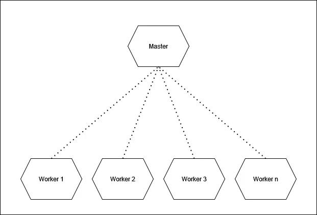

# Kubernetes 基础知识

> 原文：<https://blog.devgenius.io/kubernetes-basics-d5be0c659885?source=collection_archive---------9----------------------->

现在很难想象没有 Kubernetes 的生活，无数大大小小的公司都在使用 Kubernetes。这是对一个充满抽象层的世界的介绍。这篇文章介绍了 Kubernetes 的世界。除了架构和托管的可能性，我们还看了一些基本的对象和一个案例研究。

# 要求

为了能够理解本文的内容，您应该已经对 Docker、云计算和与 YAML 合作等主题有所了解。如果不是这样，也不要慌！尽管如此，仍将详细解释所提到的主题。

如今，诸如简单网站或更复杂的(web)应用程序等服务的用户期望持续可用性。一段时间以来，已经出现了从裸机服务器到云中虚拟机的明显转变。但这还不是全部。公司对虚拟化特别感兴趣。有了它，服务器只需点击几下就可以启动，甚至完全自动化——这取决于需要多少计算能力。为每个应用程序运行单独的服务器在许多方面都是不利的。建立这样一个服务器需要很多额外的任务(配置、备份&恢复、安全等等)。这也是新型虚拟化令人感兴趣的原因之一——比如 [Docker](https://www.docker.com/) 。
这允许(保持基础)几个应用程序在同一台机器上运行，但仍然是完全自主的。我们的程序是在所谓的容器中运行的。这是一种小型虚拟机(Linux ),只有预先定义好的程序才能在其中运行。从外面看，容器看起来总是一样的。但是，其内容可以修改(例如安装软件)。
Docker 还提供了在一种“联盟”中连接几个服务器(运行容器)的可能性——称为 [Docker Swarm](https://docs.docker.com/engine/swarm/) 。这使我们能够连接到 [Kubernetes](https://kubernetes.io/de/) 。

# 根

Kubernetes(简称 k8s)由 Google 开发，于 2014 年作为开源项目移交给[云原生计算基金会(CNCF)](https://www.cncf.io/) 。从那以后，它的受欢迎程度一直在迅速增长。许多公司，无论大小，都在使用它来协调他们的计划/服务/工作负载。由于上述原因，Kubernetes 社区相当大。许多文件、演讲、博客等等都可以在网上找到。

# 有状态和无状态的区别

就数据处理而言，应用程序原则上可以分为两类。这个区别非常重要。Kubernetes 现在支持有状态和无状态应用程序。然而，它实际上是由谷歌设计的，旨在将 API 或微服务等无状态应用的操作提升到一个全新的水平。

**有状态
一个典型的有状态应用程序的例子是数据库。即使重启后，所有先前存储的数据也必须可用。这不是关于备份和恢复，而是关于数据的持久性/持久性/状态性。**

**无状态** 典型的无状态应用程序的一个例子是 API。它不存储任何数据，如用户输入。例如，当 API 提供用户登录时，它接收所有输入，如用户名和密码。然后检查输入的数据是否与数据库中的数据匹配。如果是这种情况，则用户已登录。否则，通常会发出一条错误消息。
因此，API 负责处理用户输入。它通常被称为应用程序逻辑(业务逻辑)，位于表示层和数据存储层之间，即用户界面和数据库之间。因为它不存储任何以后会再次需要的数据，所以被称为瞬态/无状态。

# 集群架构

基本上，Kubernetes 不仅仅由不同的软件组件组成。我们将几台服务器组合成一个网络，称之为“集群”。



Kubernetes 建筑(简化)

我们的集群基本上由不同的服务器(以下称为“节点”)组成。我们区分两种类型的节点。这两种类型在后台运行不同的程序，这些程序是使用 Kubernetes 所必需的。

**主节点** 主节点是控制中心。这是集群中积累的所有信息汇集的地方。例如，这包括工作节点的健康状态以及当前正在执行哪些工作负载/应用程序。

作为用户，我们使用一个名为 [kubectl](https://kubernetes.io/docs/reference/kubectl/) 的工具，通过它我们可以从集群中查询各种信息或者提供新的工作负载。作为用户，我们使用 kubectl 直接与负责我们集群的主机通信。基本上，这些都是 API 查询。如果主服务器不再可访问，集群(或其中的应用程序)将继续运行，但不能请求信息或执行操作。因此，我们将无法采取行动。

**Worker** 我们的工作负载运行在 Worker 节点上。即 Docker 容器中的程序(有些提供者也支持 Windows 容器)。此外，许多 Kubernetes deamons 正在运行。这些占用很少的资源，并不断告诉主人发生了什么。因此，当我们提供新的工作负载时，主服务器会通知各个工作人员。他们执行任务/工作步骤，然后让主人知道我们的程序是否正在运行或是否发生了错误。

顺便说一下:为了确保托管 Kubernetes 服务的主节点的永久可用性(参见托管)，许多提供者使用 Kubernetes。这就是库伯内特斯的库伯内特斯。[这里的](https://blog.ovhcloud.com/kubinception-using-kubernetes-to-run-kubernetes/)是来自实践的例子。

# 主办；主持

因为 Kubernetes 是一个开源项目，所以可以手动设置集群。这将需要至少两台服务器。一个充当主人，另一个充当工人。然而，这种方法带来了几个问题。因此，强烈建议让托管提供商来建立和运行您自己的集群。虽然 Kubernetes 是由 Google 开发的，但所有知名的云提供商现在都提供托管集群/托管 Kubernetes 服务。例子有:[蔚蓝](https://azure.microsoft.com/de-de/products/kubernetes-service/)、 [AWS](https://aws.amazon.com/de/eks/) 、 [GCP](https://cloud.google.com/kubernetes-engine/docs/?hl=de) 、[数字海洋](https://www.digitalocean.com/products/kubernetes)、 [OVH](https://www.ovhcloud.com/de/) 。

当然，价格因供应商而异。但是，客户只需为他们希望包含在集群中的工作节点付费。如果他们后来决定在云中使用 Kubernetes 的所有优势(如负载平衡器和持久卷)，这将带来更多的成本。这是与 Docker Swarm 的核心区别之一。在这里，组成 Docker 群的所有机器都必须被操作(配置、备份和恢复、安全等)。此外，还存在操作群管理器节点的成本。

# 维护集群状态

Kubernetes 保持集群状态。当我们调配工作负载并在集群中创建资源时，Kubernetes 确保这种描述(例如 2 个 web 服务器、1 个 NodeJS 应用程序、1 个数据库)始终运行并可用。如果应用程序出现问题，比如崩溃，它会自动重启。不需要进一步的干预。由于这个原因，Kubernetes 的使用在开始时需要一个陡峭的学习曲线。然而，随着我们继续运营，我们的许多工作都被拿走了。正如简介中提到的，集群的用户不必担心维护单个基础设施组件(在托管 Kubernetes 服务的情况下)。这由主机提供商负责。

# 目标描述

Kubernetes 建立在抽象层之上。因此，必须创建对象(如服务、pods 或机密)来确保应用程序可以在集群中运行。YAML(另一种标记语言/ YAML 不是标记语言)被用来描述这些抽象层次或对象。要在 Kubernetes 中创建一个对象，必须描述它的规范，包括进一步的信息，比如对象的期望名称。然后，描述作为 JSON 传输到主服务器。但是，使用工具 kubectl 更容易。这允许我们使用 YAML(比 JSON 更容易阅读)来描述对象，然后使用 kubectl 将它们传输给主对象。这样就可以利用 YAML 的优势，因为到 JSON 的转换是由 kubectl 自动执行的。在下一章“抽象层次”中，介绍了一些 Kubernetes 对象，包括它们的 YAML 规范。

# 抽象层次

当我们谈到 Kubernetes 时，我们应该记住术语抽象层次或对象。我们不再对单个服务器本身感兴趣。只需要考虑一些物理特性，如 CPU 内核的数量和 RAM 的大小。因此，在我们开始和租用集群之前，我们应该找出我们想要运行的应用程序。根据我们的需求，可以订购一定数量和类型的工作节点。Kubernetes 将抽象层放在实际的基础设施之上。这为我们节省了大量的精力，同时也减少了我们对它的依赖。

**吊舱** 吊舱是 Kubernetes 中最小的可展开物体。最后，k8s 负责编排 Docker 容器。一个 pod 可以包含几个这样的容器，我们的应用程序在其中运行。在 pod 中运行的所有容器都可以访问 pod 可以访问的资源(例如:用于存储文件的卷)。但是，建议每个容器或每个应用程序使用一个 Pod。pod 中的容器总是在集群中的同一个工作节点上运行，并且可以通过 localhost 相互联系。此外，每个 pod 都会收到自己的 IP 地址和 DNS 名称，通过这些名称可以在群集内访问它。Kubernetes 可以随时终止 Pods，并在另一个 worker 节点上重新启动。

**YAML 的 Pod 定义:**

```
apiVersion: v1
kind: Pod
metadata:
  name: webserver
  labels:
    app: webserver
spec:
  containers:
  - name: nginx-container
    image: nginx
    ports:
    - containerPort: 80
```

**服务**
为了让外部(集群内部或外部)可以访问 pods 中运行的应用程序，我们需要一个服务。这种服务固有地在分配给它的单元之间提供负载平衡。由于 pod 可以随时重启，因此必须确保之后可以到达它们(pod 的 IP 地址可以更改)。一个服务也对此负责。因此，这是一个抽象层次，描述了一组 pod 以及从外部访问它们的方式。服务通过选择器(服务定义中的第 6–7 行)找到向其转发传入请求的 pod。在示例 YAML 中，请求被转发到端口 80 上带有标签 app: my-webserver 的 pod。

**YAML 的服务定义:**

```
apiVersion: v1
kind: Service
metadata:
  name: webservice
spec:
  selector:
    app: webserver
  ports:
    - protocol: TCP
      port: 80
      targetPort: 80
```

**入口** 为了让 Kubernetes 集群中运行的应用程序可以从集群外部访问，需要一个入口。这个对象可以被视为一种更专业的服务类型。除了负载平衡，它还提供 SSL 终端(即 HTTPS)和基于名称的虚拟路由。与“普通”web 服务器类似，可以将多个域分配给一个入口。根据请求来自哪个域，它可以将请求转发给集群中适当的服务。例如，对 example.com 的请求可以被转发到传递静态网页的 pod。另一方面，对 api.example.com 的请求被转发到包含 API 应用程序的 pod(比如 NodeJS)。然而，应该注意，入口对象仅仅是一个规则集。另外还需要它背后的实际软件(通常是 Nginx、HA proxy 或 Traefik)。这个主题将在后面的文章中讨论。

**YAML 的入口定义:**

```
apiVersion: extensions/v1beta1
kind: Ingress
metadata:
  name: my-ingress
spec:
  tls:
  - hosts:
    - example.com
    - api.example.com
  rules:
  - host: example.com
    http:
      paths:
      - path: /
        backend:
          serviceName: example-webseite
          servicePort: 80
  - host: api.example.com
    http:
      paths:
      - path: /
        backend:
          serviceName: example-api
          servicePort: 8000
```

**持久卷(Claim)** 如果一个有状态的应用程序要在 Kubernetes 集群中运行，它的数据必须被存储。无论运行应用程序的工作节点是否崩溃，或者应用程序本身是否重启，其数据都必须持久存储。如果我们从云提供商那里租赁一个 K8s 集群，持久卷(PV)就是一个外部驱动器。所以它独立于我们的集群。持久卷声明(PVC)是(向托管我们的集群的提供商)请求为我们提供持久卷。除了其他事情之外，我们指定它应该有多大(例如以千兆字节为单位)以及我们想要使用什么类型(通常在 HDD 和 SSD 之间选择)。提供者提供持久卷后，持久卷被装入/连接到 pod。
例如，MySQL/MariaDB 等数据库将其持久数据(其中包含的数据库和表以及用户及其访问数据)存储在/var/lib/mysql 目录中。因此，持久卷就安装在这个路径上。这导致数据库的所有持久数据都直接存储在 PV 上，即存储在外部，而不是存储在数据库容器中。如果数据库 pod 重新启动，Kubernetes 会自动将持久卷重新连接到数据库 pod，并放在相同的路径下。如果 Kubernetes 在另一个 worker 节点上启动数据库 pod，PV 将自动连接到该机器，然后可用于 pod。

**YAML 的持续量索赔定义:**

```
apiVersion: v1
kind: PersistentVolumeClaim
metadata:
  name: my-pvc
spec:
  accessModes:
    - ReadWriteOnce
  resources:
    requests:
      storage: 5Gi
  storageClassName: ssd
```

**秘密** 为了存储密码或 API 令牌等机密信息，我们需要秘密。更安全的做法是，不要将此类信息直接存储在应用程序的代码中或持久卷上，而是使用一个秘密。同时，我们更加灵活，因为我们可以准确地指定允许哪些 pod 访问秘密。此外，我们可以不在 YAML 文件/Kubernetes 清单中以纯文本形式存储这些敏感的访问数据。secret 中包含的数据是 base64 编码的，存储在主节点上(通常是加密的，具体取决于提供者)。秘密可以通过附加到 pod 的卷或通过环境变量使其内容可用。

**YAML 的秘密定义:**

```
apiVersion: v1
kind: Secret
metadata:
  name: my-secret
type: Opaque
stringData:
  DB_USER: "Username"
  DB_PASSWORT: "Passwort"
  API_KEY: "apiKey"
```

**配置图** 配置图可用于存储非机密信息，如应用程序的设置参数。它们是秘密的对等物。因此，配置参数与应用无关。如果我们更改一些设置，我们不必编辑应用程序的代码，而只需编辑配置图的内容。

**YAML 的配置图定义:**

```
apiVersion: v1
kind: ConfigMap
metadata:
  name: my-configmap
data:
  URL: "https://example.com"
  LOGGING_LEVEL: "development"
  CHECK_UPDATE: "yes"
```

如同在 Linux 服务器上一样，Kubernetes 中有一种方法可以定期执行某些任务。这类任务的一个例子是备份。如果我们希望定期备份数据库(例如，每天凌晨 2 点)，我们可以使用 CronJob。这基本上包括关于它应该何时执行以及 pod 配置的信息。最后，CronJob 在我们设置的时间启动一个 pod。当它成功完成任务时，它会自动终止。“busybox”这个形象可以作为一个 pod。它由一个非常轻量级的 Linux 发行版组成。如果有必要，我们会告诉 CronJob 它应该附加到哪个(持久)卷以及哪个路径下。当作业开始时，Pod 装载卷，执行我们定义的命令，当作业完成时释放它，然后退出。当然，也可以根据需要将备份直接复制到外部存储。

**cron job-YAML 的定义:**

```
apiVersion: batch/v1beta1
kind: CronJob
metadata:
  name: my-cronjob
spec:
  schedule: "0 2 * * *"
  jobTemplate:
    spec:
      template:
        spec:
          containers:
          - name: db-backup
            image: busybox
            args:
            - /bin/sh
            - -c
            - <backupcommands>
          restartPolicy: OnFailure
```

**副本集** 为了能够保证在任何时候都有固定数量的 pod 可用，需要一个副本集。顾名思义，这些始终是同一类型的吊舱。例如，如果我们因为预期的访问者高峰而想要扩展，我们可以增加我们的 web 服务器 pod 的副本。Kubernetes 将根据我们指定的数量自动启动更多的 web 服务器 pod 实例。副本集可以通过部署来管理(请参见“部署”一节)。因此，没有必要手动创建副本集—这可以通过部署来完成。如果我们有一个由提供商运营的集群，我们可以根据需求完全自动地扩展工作节点的数量和应用程序副本的数量。当然，前提条件是提供者支持这一功能。

**YAML 的复制集定义:**

```
apiVersion: apps/v1
kind: ReplicaSet
metadata:
  name: frontend
  labels:
    app: webserver
    tier: frontend
spec:
  replicas: 3
  selector:
    matchLabels:
      tier: frontend
  template:
    metadata:
      labels:
        tier: frontend
    spec:
      containers:
      - name: nginx
        image: nginx
```

**部署** 在部署的帮助下，我们可以管理 pod 和副本集。这里我们描述一种在任何情况下都应该保持的状态。例如，如果我们想要运行一个 web 服务器，我们不会将它描述为一个单独的 pod。相反，我们使用部署。例如，如果我们希望有更多的访问者访问我们的网站，这就允许我们随意增加 web 服务器的副本数量。当高峰再次结束时，我们通过减少部署的 YAML 定义中的*副本:3* (见 YAML)的数量来再次减少 web 服务器的数量。如果错误魔鬼爬进来，我们可以跳回到部署的早期状态。因此，总而言之，部署是集中管理多个 Kubernetes 对象(如 pod 和 ReplicaSets)的一种方式。如果我们将部署传递给集群，那么其中描述的资源(就像一个 pod)将会自动创建。如果我们删除它，所有关联的资源也会自动删除。
除了部署的名称之外，我们指定应该存在多少个副本(这里是运行 web 服务器 Nginx 的 pod)。使用选择器: *matchLabels: app: nginx* 我们确保部署知道它负责哪个 pod。在这种情况下，它只负责标签为 *app: nginx* 的 pod。属于我们部署的 pod 的实际定义在项目*模板下:*。这里有三个带有容器 Nginx 的 pod。

**YAML 的部署定义:**

```
apiVersion: apps/v1
kind: Deployment
metadata:
  name: my-deployment
  labels:
    app: nginx
spec:
  replicas: 3
  selector:
    matchLabels:
      app: nginx
  template:
    metadata:
      labels:
        app: nginx
    spec:
      containers:
      - name: nginx
        image: nginx
        ports:
        - containerPort: 80
```

# 总结词

Kubernetes 是运行“容器化”应用程序的绝佳方式。通过许多抽象层，程序从运行它们的实际基础设施中分离出来。与此同时，该项目已经成为容器编排事实上的标准。多亏了 YAML，K8s 清单创建得很快，即使过了很长时间也很容易理解。有经验丰富的提供商作为合作伙伴，创建和操作 Kubernetes 集群是很容易的。